# Solutions et électrolytes

::: {.objectives data-latex=""}

- Définir les termes solution, soluté et solvant.
- Identifier si un mélange donné est une solution.
- Définir les conditions d'une solution saturée, insaturée et sursaturée.
- Identifier et décrire les facteurs qui influencent la solubilité d'une substance.
- Définir les notions de solubilité et de saturation, et de quoi elles dépendent.
- Prédire si une molécule est soluble et si elle forme une solution électrolyte.
- Donner l'équation de dissociation d'un sel.
- Définir la concentration, la molarité et le titre.
- Convertir une molarité en titre et vice-versa.
- Expliquer comment préparer une solution par dissolution ou par dilution.

:::

## Définitions

### Les solutions

::: {.tcolorbox data-latex=""}

**Solution**  
Une solution est un mélange homogène composé d'un solvant et d'un ou plusieurs solutés.

:::

- **Le soluté**: composé le moins abondant d'une solution.
- **Le solvant**: composé le plus abondant d'une solution.

On dit que le soluté est **dissous** dans le solvant. La solution est translucide et laisse donc passer la lumière.

Par exemple, lorsque l'on mélange une cuillère de sucre dans un verre d'eau, les cristaux de sucre disparaissent parce qu'ils se **dissolvent** dans l'eau. Le sucre est le soluté et l'eau est le solvant. Une solution liquide dans laquelle le solvant est l'eau est appelée **solution aqueuse**.

Le soluté n'est pas forcément solide et le solvant n'est pas forcément liquide.

\newpage

|  soluté | solvant | exemple                                 | état de la solution |
| :-----: | :-----: | --------------------------------------- | :-----------------: |
|   gaz   |   gaz   | air (oxygène et azote)                  |         gaz         |
| liquide |   gaz   | vapeur d'eau dans l'air                 |         gaz         |
|  solide |   gaz   | neige carbonique dans l'air             |         gaz         |
|   gaz   | liquide | boisson gazeuse (gaz carbonique et eau) |       liquide       |
| liquide | liquide | antigel (glycérol et eau)               |       liquide       |
|  solide | liquide | eau de mer (sels et eau)                |       liquide       |
|   gaz   |  solide | hydrogène dans le palladium             |        solide       |
| liquide |  solide | mercure dans l'or                       |        solide       |
|  solide |  solide | laiton (zinc et cuivre)                 |        solide       |

Table: Types de solution selon les différents états de la matière. {#tbl-types-solution-etats-matiere}



### La dissolution

::: {.tcolorbox data-latex=""}

**Dissolution**  
La dissolution est le processus par lequel un soluté forme une solution dans un solvant.

:::

Lorsqu'un soluté est capable de se dissoudre dans un solvant, on dit qu'il est **soluble**. Lors de la dissolution, les ions ou les molécules de soluté se répartissent uniformément dans toute la solution et ne décantent pas avec le temps.

Au contraire, lorsqu'un composé ne se dissout pas dans un solvant, on dit qu'il est **insoluble**. Les constituants d'un composé insoluble restent associés les uns aux autres et gardent leur état solide.

#### Dissolution moléculaire

Un grain de sucre (saccharose, C~12~H~22~O~11~) est un petit cristal formé de molécules dont toutes les liaisons internes sont des **liaisons covalentes**.

Lorsque ce cristal est placé dans l'eau, des **ponts hydrogène** se forment entre l'eau et les molécules de C~12~H~22~O~11~ ce qui affaibli les liaisons intermoléculaires et les molécules se détachent du cristal pour former la solution. Les liaisons moléculaires ne sont pas rompues et chaque molécule reste entière.

#### Dissolution ionique

Un grain de sel de cuisine (chlorure de sodium, NaCl) est un petit cristal formé de ions Na^+^ et Cl^-^ liés par des **liaisons ioniques**.
Lorsque ce cristal est placé dans l'eau, les liaisons ioniques sont rompues et les ions se retrouvent isolés dans la solution. Chaque ion est entouré de molécules d'eau. On dit qu'il est **hydraté**.

::: {#fig-ionique-moleculaire layout-ncol=2}
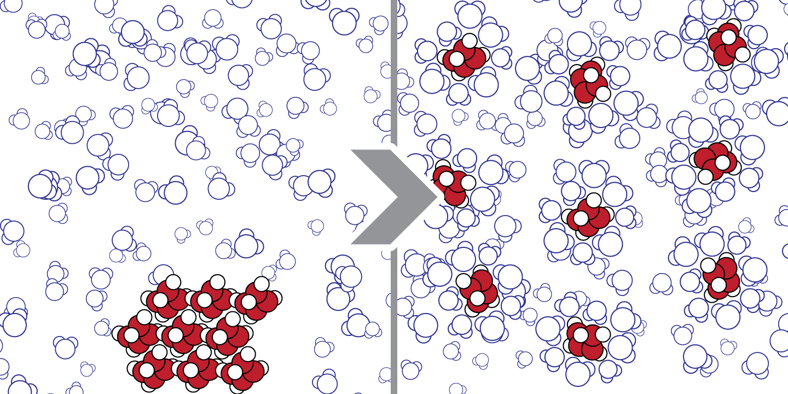

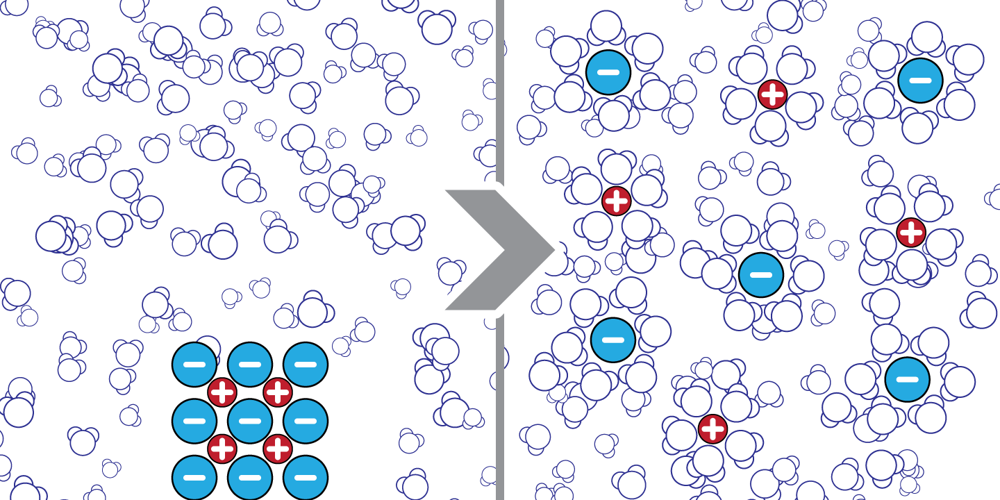

Dissolution de composés moléculaire et ionique
:::

#### Les facteurs influençant la dissolution

- la quantité de soluté par rapport à la quantité de solvant,
- la nature du soluté (qui se ressemble se dissout),
- la nature du solvant (qui se ressemble se dissout),
- la température.



### La solubilité et la saturation

A une température donnée, il existe une limite à la quantité de soluté qui peut se dissoudre dans une quantité de solvant. Cette limite est appelée **solubilité**. Une fois cette limite atteinte, la solution est appelée **solution saturée**, en dessous de cette limite, c'est une **solution non saturée**.

::: {.tcolorbox data-latex=""}

**La solubilité**  
La solubilité d'un composé est la quantité maximale de soluté qui peut être dissous dans un solvant à une température donnée.

:::

- **Question** : Quelle est la solubilité de $\ce{NaCl}$ ?
- **Réponse** : La solubilité de $\ce{NaCl}$ est de 36 g pour 100 mL à 25°C.

Cela veut dire que l'on peut dissoudre **au maximum** 36 grammes de NaCl dans 100 mL d'eau à 25°C. Une fois cette limite atteinte, si l'on ajoute du NaCl à la solution, il ne se dissoudra pas. La solution est **saturée**.

Sous certaines conditions, la limite de solubilité peut être dépassée et plus de soluté peut être dissous. Une telle solution sera appelée **solution sursaturée**. Les solutions sursaturées ne sont pas stables. L'ajout d'un **germe cristallin**, un petit cristal de soluté, entraînera la cristallisation de l'excès de soluté.

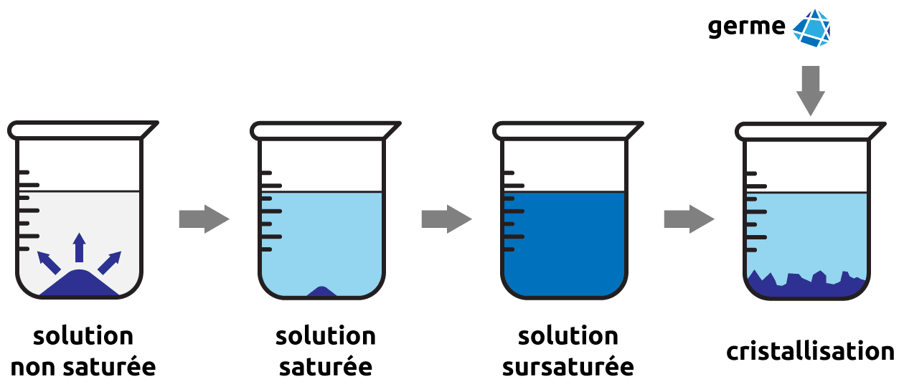{#fig-solubilite-saturation width="67%"}



### La cristallisation

::: {.tcolorbox data-latex=""}

**Cristallisation**  
La cristallisation est le processus par lequel un soluté forme un solide cristallin à partir d'une solution.

:::

**La cristallisation est le phénomène inverse de la dissolution.** Le soluté se sépare de la solution et redevient solide. Les particules de soluté occupent des emplacements définis et de manière périodique sur une grande portion de l'espace. Ils forment des **cristaux**.

**Si la cristallisation a lieu lentement :**  
La croissance des cristaux est régulière. Les cristaux sont de grande taille et de pureté élevée.

**Si la cristallisation a lieu rapidement :**  
La croissance des cristaux est irrégulière. Les cristaux sont de petite taille. Ils forment une poudre finement divisée que l'on appelle **précipité**. **La précipitation** est souvent le résultat d'une réaction chimique et se produit instantanément.

La **recristallisation** est une méthode de séparation utilisée en chimie. En dissolvant un mélange dans un solvant approprié, on peut récupérer le soluté désiré en le faisant cristalliser lentement. Le composé formera des cristaux purs, laissant les impuretés indésirables en solution.

## Dissociation ionique

Lorsqu'un composé ionique est plongé dans l'eau, les molécules d'eau, polaires, orientent leurs pôles négatifs vers les cations, et leurs pôles positifs vers les anions. La dissociation ionique est également appelée dissociation électrolytique.

L'eau diminue drastiquement l'attraction entre anions et cations. Les molécules d’eau qui entourent les ions écartent ces derniers les uns des autres. Le cristal s'effondre et les ions, indépendants les uns des autres, sont dispersés dans la solution.

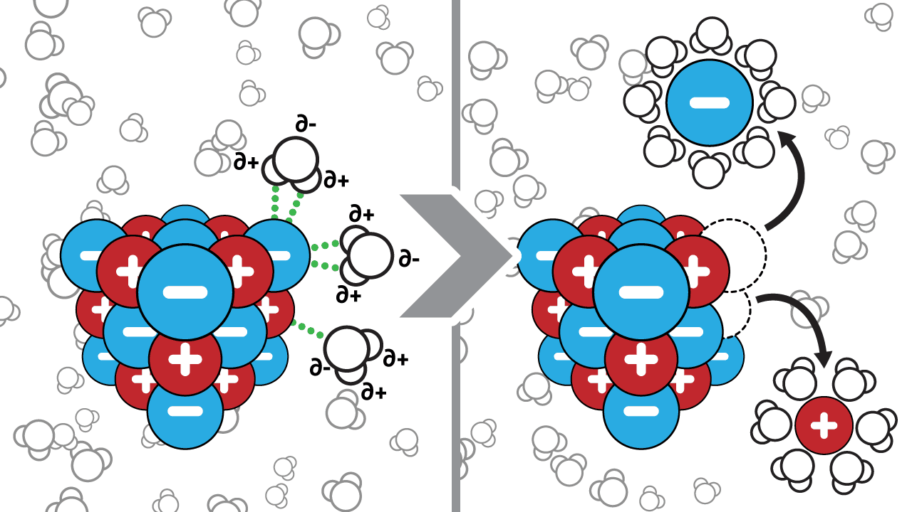{#fig-dissociation width="50%"}

**Une solution est électriquement neutre : le nombre de charges positives est égal au nombre de charges négatives.**  

\newpage

### Équations de dissociation

Par convention, la dissociation dans l'eau d'un composé ionique $C_nA_m$ s'écrit :

$$ \ce{C_{n}A_{m} ->C[H2O] n C^{m+} + m A^{n-}} $$

Par exemple:
$$ \begin{split}
  & \ce{NaCl ->C[H2O] Na^{+} + Cl^{-} } \\
  & \ce{K2CO3 ->C[H2O] 2 K^{+} + CO3^{2-} }
  \end{split}
  \qquad
  \begin{split}
  \ce{Al2(SO4)3 ->C[H2O] 2 Al^{3+} + 3 SO_{4}^{2-} } \\
  \ce{AgCl ->C[H2O] AgCl v } \\
  {\scriptsize \text{(AgCl n'est pas soluble dans l'eau)}}
  \end{split} $$

- On écrit la formule brute du soluté.
- On dessine une flèche avec, au dessus, la formule brute du solvant. La flèche va dans le sens de la dissociation.
- On écrit la formule brute des ions libérés **avec leur quantité**.

Pour déterminer si un composé est soluble ou non, on se réfère à une table de solubilité. Cette table nous indique la solubilité de certains composés pour une température. Pour un composé non soluble, on ajoutera une flèche vers le bas à côté du composé dans l'équation de dissociation.



A noter:

-  Les **acides** sont solubles dans l'eau et se dissocient (au moins partiellement).
-  La solubilité des **sels** et des **hydroxydes** est indiquée par la table de solubilité.
-  Les **oxydes** ne sont pas solubles dans l'eau mais réagissent avec elle.

\newpage

### Électrolyte

Expérimentalement, on remarque qu'une solution d'eau pure ne conduit que très peu le courant électrique. Si l'on dissout du chlorure de sodium (NaCl) dans l'eau, la solution devient conductrice alors que si l'on dissout du sucre (saccharose), la conductivité de l'eau ne change pas.

::: {#fig-conduction-solutions layout-ncol=3}
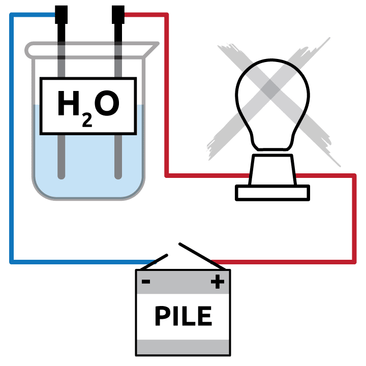

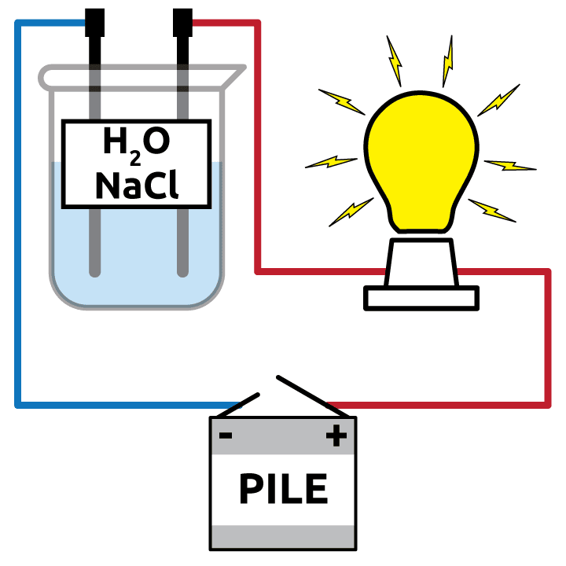

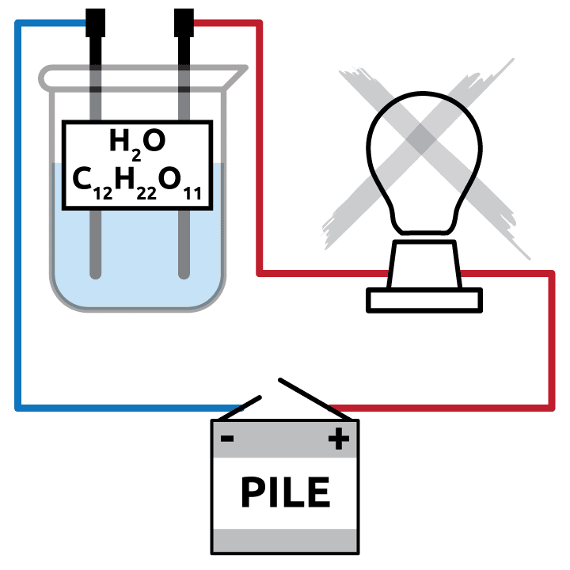

Conduction électrique des solutions (eau pure, solution de NaCl, solution de saccharose)
:::

-  L'eau n'est pas conductrice. La conductivité de l'eau provient des substances dissoutes dans l'eau, pas de l'eau elle-même.
-  Les substances qui se dissolvent dans l'eau ne rendent pas toutes la solution conductrice.

::: {.tcolorbox data-latex=""}

**Électrolyte**  
Un électrolyte est une substance qui se dissocie en ions en solution et forme une solution conductrice d'électricité.

:::

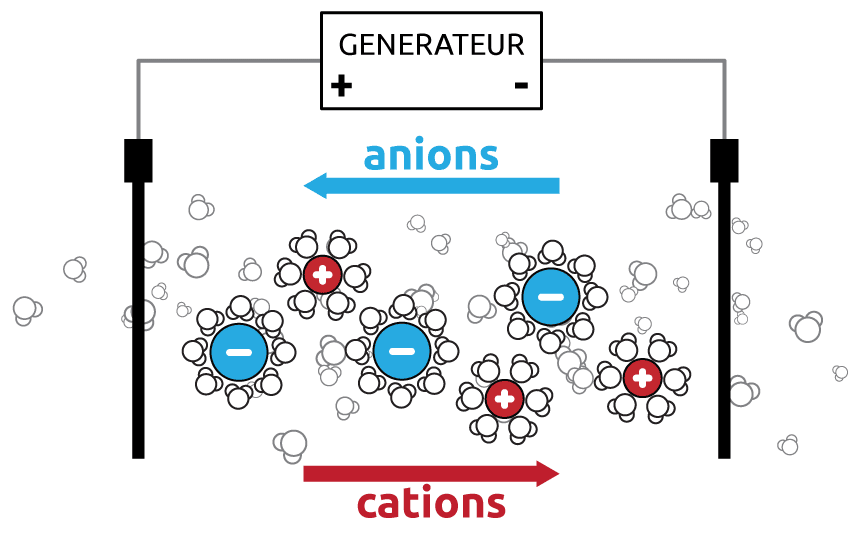{#fig-electrolyte-2b width="50%"}

Lorsque l'on impose une tension aux bornes d'une solution ionique, les ions se mettent en mouvement. Parce que les ions portent une charge électrique d'une électrode à l'autre, on obtient un courant électrique appelé **courant ionique**. La solution ionique devient alors conductrice. Un tel composé est appelé **électrolyte**.

A l'inverse, une solution sucrée ne conduit pas l'électricité car le saccharose reste sous la forme de molécule neutre et ne se dissocie pas. Le saccharose n'est donc pas un électrolyte.

Le courant électrique dans la solution est dû au déplacement des cations dans un sens et au déplacement des anions dans le sens contraire. C'est un déplacement de charges et non un déplacement d'électrons seuls.

\newpage



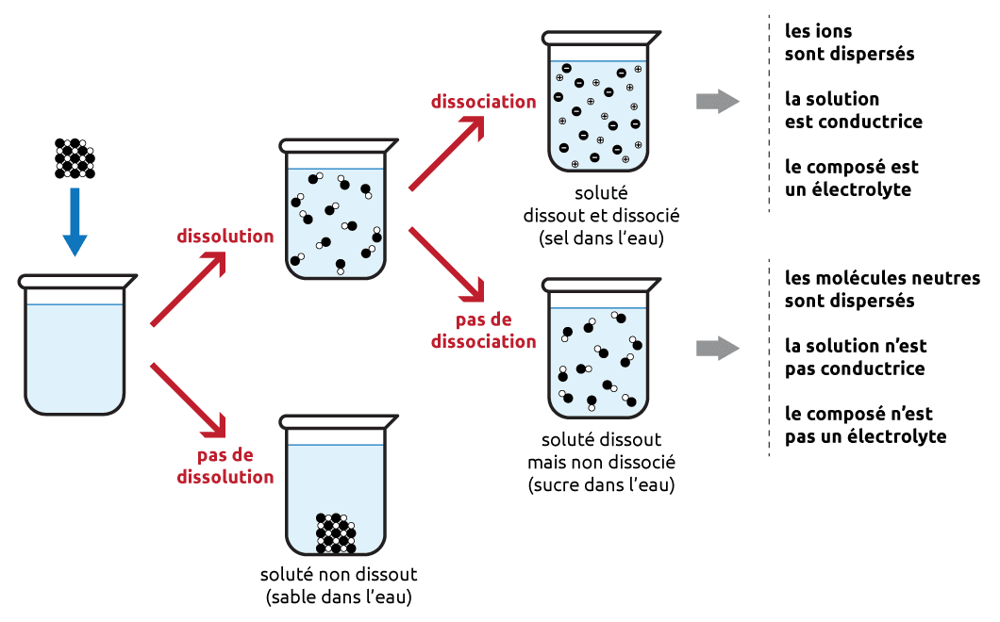{#fig-dissociation-resume width="100%"}

## La concentration

En chimie, la plupart des réactions ont lieu en solution. Il est donc important de connaître les quantités de réactifs (solutés) que l'on fait réagir. Pour connaître ces quantités, le chimiste utilise la **concentration**.

::: {.tcolorbox data-latex=""}

**Concentration**  
La concentration d’une solution est le rapport entre la quantité de soluté et la quantité totale d’une solution.

:::

La composition d'une solution est toujours donnée par une **grandeur intensive**, c'est-à-dire qu'elle ne dépend ni du volume, ni de la masse, ni de la quantité de matière de l’échantillon.

La concentration d'une solution peut être définie de différentes manières (concentration molaire, concentration massique, fraction molaire, pourcentage massique, pourcentages volumiques, ...). Nous en décrirons deux, la **molarité** et le **titre**.

### La molarité (concentration molaire)

La concentration molaire (ou molarité) d’un soluté est le nombre de moles de soluté par unité de volume de solution.

$$
\begin{split}
  C = \frac{n}{V}
\end{split}
\qquad
\begin{split}
  n &\text{ : Nombre de moles de soluté en mol} \\
  V &\text{ : Volume de solution en l} \\
  C &\text{ : Concentration du soluté en mol/l ou M}
\end{split}
$$

En chimie, la concentration molaire d'une espèce A est notée entre deux barres verticales, **|A|**. Par exemple, une concentration en acide sulfurique (H~2~SO~4~) de 0.5 mol/l sera notée:

$$ |H_2SO_4| = 0.5\ M \text{ ou } \text{ mol/l} $$



\newpage

### Le titre (concentration massique)

La concentration massique (ou titre) d’un soluté est la masse de soluté par unité de volume de solution.

$$
\begin{split}
  T = \frac{m}{V}
\end{split}
\qquad
\begin{split}
  m &\text{ : Masse de soluté en g} \\
  V &\text{ : Volume de solution en l} \\
  T &\text{ : Titre du soluté en g/l}
\end{split}
$$

Puisque $n = \frac{m}{M}$, alors

$$
\begin{split}
  T = C \cdot M
\end{split}
\qquad
\begin{split}
  T &\text{ : Titre du soluté en g/l} \\
  C &\text{ : Concentration de la solution en mol/l} \\
  M &\text{ : Masse molaire du soluté g/mol}
\end{split}
$$

### Préparation des solutions

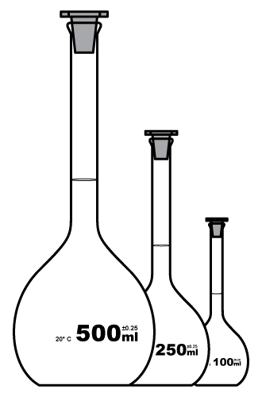{#fig-fiole width="20%"}

Beaucoup des réactifs utilisés en chimie sont sous forme de solution. Ces solutions doivent être achetées ou préparées. Pour de nombreuses applications, la concentration de la solution et sa méthode de préparation doivent être aussi précises que possible.

Les béchers ou erlenmeyers gradués ne sont pas utilisés pour la préparation de solutions précises. Les indications de volume sur ces instruments sont plus décoratives que quantitatives. On utilisera une **fiole jaugée** (ou ballon jaugé) pour préparer une solution.

Une fiole jaugée est un ballon en verre à fond plat avec un col étroit. Le col présente une ligne de calibration unique indiquant un volume précis pour une température donnée.

Les ballons jaugés sont fabriqués dans des tailles différentes pouvant contenir différents volumes (25 ml, 50 ml, 100 ml, ...).

Pour préparer une solution en laboratoire, généralement, le volume et la concentration de la solution sont donnés.

\newpage

#### Préparation par dissolution

On peut préparer une solution par **dissolution**, c'est-à-dire en dissolvant le soluté dans le solvant. Les étapes sont les suivantes:

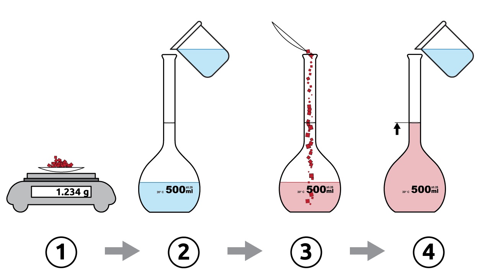{#fig-preparation-1 width="50%"}

- Peser le soluté.
- Remplir la fiole jaugée à moitié avec de l'eau distillée.
- Transférer le soluté dans la fiole et dissoudre.
- Compléter jusqu'au trait de jauge avec de l'eau distillée.

#### Préparation par dilution

Les solutions utilisées en laboratoire sont souvent achetées ou préparées sous forme de solutions concentrées (appelées **solutions stock**). A partir de ces solutions, on peut obtenir des solutions de concentrations plus faibles en ajoutant du solvant. Ce procédé est appelé **dilution**.

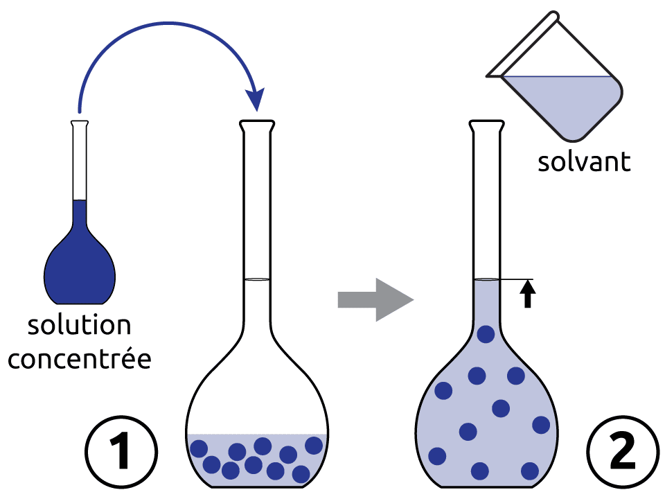{#fig-preparation-2 width="33%"}

Lors d'une dilution, **le volume de solution augmente mais la quantité de soluté reste la même**. On peut généraliser le calcul lors de la dissolution d'une solution par la relation suivante :

$$
\begin{split}
C_i \cdot V_i = C_f \cdot V_f
\end{split}
\qquad
\begin{split}
  & \text{avec} \\
  C_i & \text{: concentration initiale} \\
  V_i & \text{: volume initial} \\
  C_f & \text{: concentration finale} \\
  V_f & \text{: volume final}
\end{split}
$$

\newpage



## Résumé

- Une solution est un mélange homogène d'un solvant et d'un ou plusieurs solutés. Une solution aqueuse a l'eau pour solvant.
- La dissolution peut être moléculaire ou ionique.
- La solubilité est la quantité maximale de soluté qui se dissout dans un solvant à une température donnée. Elle dépend de la nature du soluté et du solvant et de la température.
- Une solution est non saturée, saturée ou sursaturée. La cristallisation est l'inverse de la dissolution.
- Un électrolyte est une substance qui se dissocie en ions en solution et rend la solution conductrice. Les composés ioniques solubles et les acides sont des électrolytes ; les molécules qui ne se dissocient pas ne le sont pas.
- L'équation de dissociation d'un composé ionique soluble s'écrit $\ce{C_nA_m ->C[H2O] n\,C^{m+} + m\,A^{n-}}$ ; un composé insoluble est noté avec une flèche vers le bas.
- La molarité : $C = \dfrac{n}{V}$ en mol/l (ou M), notée $|A|$. Le titre : $T = \dfrac{m}{V}$ en g/l. On passe de l'un à l'autre par $T = C \cdot M$.
- On prépare une solution par dissolution ou par dilution d'une solution stock.

## Exercices supplémentaires



\newpage





\newpage





\newpage





\newpage





\newpage

```{r, echo=FALSE}
if (knitr::is_latex_output()) {
  knitr::asis_output('\\section{Solutions des exercices} \\shipoutAnswer')
}
```
