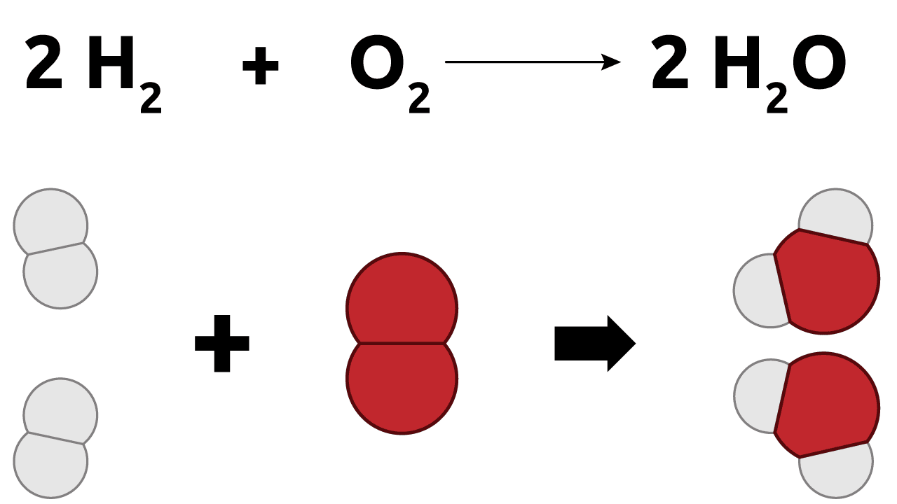
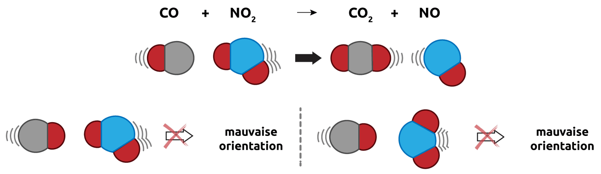
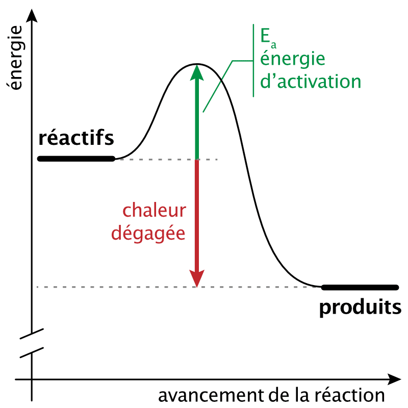
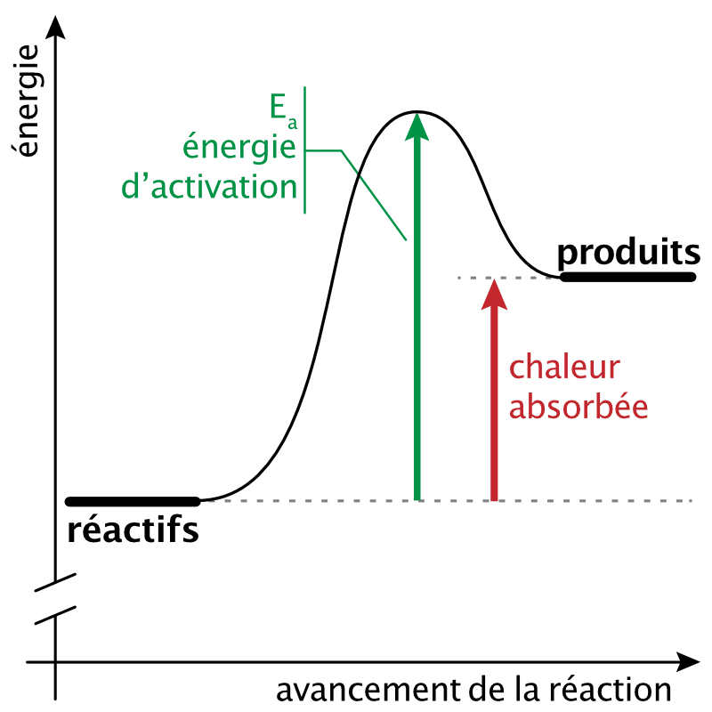
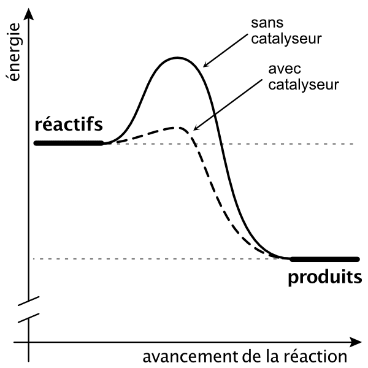

# Réactions chimiques

::: {.objectives data-latex=""}

- Expliquer la symbolique des réactions chimiques.
- Expliquer la loi de conservation de la masse.
- Équilibrer une réaction chimique.
- Définir les termes utilisés par la chimie thermodynamique.

:::

## Réactions et transformations chimiques

::: {.tcolorbox data-latex=""}

**Réaction chimique**  
Une réaction chimique est le réarrangement des atomes d'une ou plusieurs substances pour former des substances différentes.

:::

Dans toute réaction chimique, les substances d'origine sont appelées **les réactifs** et les substances résultantes sont appelés **les produits**. Au cours d'une réaction, des liaisons sont rompues dans les réactifs et de nouvelles liaisons sont formées dans les produits.

$$ \text{Réactifs} \longrightarrow \text{Produits} $$

{#fig-reactions-1 width="45%"}
Pour savoir si une réaction chimique a eu lieu il faut qu'une ou plusieurs substances aient subi un changement de composition. La preuve d'un changement ne peut être fournie que par une analyse chimique des produits. Cependant, certains changements physiques observables permettent généralement d'indiquer si une réaction chimique a eu lieu.

\newpage

Exemples de changements physiques:

::: {.multicols data-latex="{2}"}

- dégagement de chaleur
- formation d'un précipité
- absorption de chaleur
- changement de couleur
- dégagement gazeux
- émission de lumière

:::

Mais la mise en évidence d'une réaction chimique n'est pas toujours facile et certaines réactions sont parfois difficiles à mettre en évidence.

## La théorie des collisions

Pour qu'une réaction chimique ait lieu:

- Les réactifs doivent **entrer en collision**.
- Les réactifs doivent entrer en collision **selon une orientation correcte**.
- Les réactifs doivent entrer en collision **avec une énergie suffisante**.

La collision entre les réactifs (atomes, ions ou molécules) fournit l'énergie nécessaire pour briser des liaisons et pour en former des nouvelles.

{#fig-collision width="80%"}

**Plus la probabilité de collision est grande, plus la vitesse de réaction est élevée.**  

Certaines réactions sont rapides alors que d'autres sont lentes. Différents facteurs peuvent influencer la vitesse d'une réaction:

- **La complexité des réactifs**: plus les molécules de réactifs sont grandes et complexes et plus la réaction sera lente.
- **La surface de contact**: plus grande est la surface de contact entre les réactifs, plus la réaction sera rapide.
- **La concentration des réactifs**: plus le nombre de molécules de réactif est grand, plus la réaction sera rapide.
- **La température**: plus la température est élevée, plus les molécules de réactifs vont vite et ont des chances d'entrer en collision.
- **Les catalyseurs**: Les catalyseurs sont des substances qui augmentent la vitesse d'une réaction sans que leur composition ne change au cours de la réaction.

\newpage

## Conservation de la masse

Au XVIIIe siècle, Antoine Laurent Lavoisier (1743-1794), a établi un principe important basé sur ses expériences. Il affirme que la masse totale des produits de la réaction est égale à la masse totale des réactifs. Cette déclaration est connue comme **le principe de conservation de la masse**.

**Rien ne se perd, rien ne se crée, tout se transforme.**  

Il y a une égale quantité de matière avant et après une réaction, aucun atome n'apparaît et aucun atome ne disparaît. On a toujours les mêmes atomes mais combinés de façon différente.



## Équations chimiques

Dans une équation chimique, on utilise une flèche pour indiquer qu'une réaction a lieu. Les **réactifs** sont inscrits à **gauche** de la flèche et les **produits** sont inscrits à **droite** de la flèche.

Par exemple, l'équation de réaction de combustion du méthane est la suivante:

$$ \ce{CH4} {}_{(g)} + 2 \ce{O2} {}_{(g)} \ce{->} \ce{CO2} {}_{(g)} + 2 \ce{H2O} {}_{(g)} $$

|                 |         |           |                    |     |
| :-------------: | :-----: | :-------: | :----------------: | :-: |
|   **composés**  | méthane | dioxygène | dioxyde de carbone | eau |
| **proportions** |    1    |     2     |          1         |  2  |
|     **état**    |   gaz   |    gaz    |         gaz        | gaz |

Les chiffres 2 devant le dioxygène et l'eau sont appelés **nombres stoechiométriques**. Ils nous indiquent les rapports molaires des composés participant à la réaction. **On n'indique généralement pas le nombre stoechiométrique quand il est égal à 1.**

L'état dans lequel se trouvent les réactifs et les produits peut être indiqué entre parenthèses en indice de la formule brute du composé.

- solide : (s)
- liquide : (l)
- gaz : (g)
- solution aqueuse : (aq)

\newpage



## Écrire une équation chimique

La phrase, "Le méthane réagit avec le dioxygène pour former du dioxyde de carbone et de l'eau.", peut être schématisée par l'équation simplifiée:

$$ \text{méthane } + \text{ dioxygène } \longrightarrow \text{ dioxyde de carbone } + \text{ eau} $$

En remplaçant le nom des composés par leur formule brute, on obtient:

$$ \ce{CH4 + O2 -> CO2 + H2O} $$

|           | réactifs | produits |
| --------- | :------: | :------: |
| carbone   |  1 atome |  1 atome |
| hydrogène | 4 atomes | 2 atomes |
| oxygène   | 2 atomes | 3 atomes |

Cette équation ne respecte pas le principe de conservation de la masse. Tous les atomes présents dans les réactifs ne sont pas présent dans les produits. Pour que le principe de conservation de la masse soit respecté, il faut **équilibrer l'équation**.

On équilibre la réaction, en ajoutant des molécules de réactifs ou de produits afin de satisfaire le principe de conservation de la masse. En ajoutant une molécule de dioxygène et une molécule d'eau, le principe de conservation de la masse est respecté.

Nous pouvons maintenant ajouter les nombres stoechiométriques pour écrire l'équation équilibrée:

$$ \ce{CH4 + \underline{2} O2 -> CO2 + \underline{2} H2O} $$

|           | réactifs | produits |
| --------- | :------: | :------: |
| carbone   |  1 atome |  1 atome |
| hydrogène | 4 atomes | 4 atomes |
| oxygène   | 4 atomes | 4 atomes |

Quand on équilibre une réaction:

- On ne peut pas changer les indices, cela correspondrait à changer les composés.
- **La seule chose que l'on peut changer pour équilibrer une équation ce sont les nombres stoechiométriques**.
- Les nombres stoechiométriques doivent toujours être les plus petits possible.

### Les nombres stoechiométriques

Dans une équation chimique, les nombres stoechiométriques indiquent la quantité de chaque réactif consommé et la quantité de chaque produit formé. Ces nombres peuvent représenter des molécules ou un grand nombre de molécules (des moles).

|      $CH_{4\ (g)}$        |      +      |     2 $O_{2\ (g)}$       | $\rightarrow$  |     $CO_{2\ (g)}$       |  +  |     2 $H_2O_{\ (g)}$     |
| :-----------------------: | :---------: | :----------------------: | :------------: | :---------------------: | :-: | :----------------------: |
|         1 molécule        | réagit avec |        2 molécules       |   pour former  |        1 molécule       |  et |        2 molécules       |
|   1 dizaine de molécules  | réagit avec |  2 dizaines de molécules |   pour former  |  1 dizaine de molécules |  et |  2 dizaines de molécules |
|  **1 mole** de molécules  | réagit avec | **2 moles** de molécules |   pour former  | **1 mole** de molécules |  et | **2 moles** de molécules |

Les nombres stoechiométriques sont également appelés **coefficients stoechiométriques**.



\newpage

## Définitions thermodynamiques

La **thermodynamique** est l'étude de la chaleur et de ses transformations. La **thermochimie** est la partie de la thermodynamique qui étudie les échanges d'énergie qui ont lieu pendant les réactions chimiques.

La thermochimie explique entre autre:

- pourquoi certaines réactions ont lieu spontanément et d'autres pas,
- pourquoi une réactions a lieu dans un sens, dans l'autre ou dans les deux sens,
- pourquoi une réaction dégage ou absorbe de la chaleur.

### Réaction spontanée

Une réaction spontanée se produit d'elle-même. Une fois amorcée, aucune action extérieur n'est nécessaire pour que la réaction se produise.

$$ \begin{split}
  \ce{ 4 Fe + 3O2 -> 2Fe2O3 } \\
  \text{(formation de la rouille)}
  \end{split} $$

Le fer rouille de lui-même à l'air libre.

### Réaction non spontanée

Une réaction non spontanée n'a pas lieu sans une action extérieure continue.

$$ \begin{split}
  \ce{ 2Fe2O3 -> 4 Fe + 3O2 } \\
  \text{(extraction du fer du minerai de fer)}
  \end{split} $$

Cette réaction est possible, mais elle n'est pas spontanée. Elle nécessite un apport d'énergie constant.

**Une réaction spontanée dans un sens n'est généralement pas spontanée dans l'autre sens.**  

### Réaction réversible

Une réaction réversible peut avoir lieu dans les deux sens. On utilise une double flèche pour indiquer une réaction réversible.

$$ \begin{split}
  \ce{ CaCO3_{(s)} <=> CaO_{(s)} + CO2_{(g)} } \\
	\longrightarrow \text{ réaction directe} \\
	\longleftarrow \text{ réaction inverse}
	\end{split} $$

Un **équilibre** se crée entre la réaction directe et la réaction inverse.

### Réaction irréversible

Une réaction irréversible ne peut s'effectuer que dans un sens.

$$ \ce{ NaOH + HCl -> NaCl + H2O } $$

Une fois que les réactifs sont transformés en produits, il est impossible de retourner en arrière et d’obtenir à nouveau les substances de départ.

### Réaction exothermique

Une réaction exothermique est une réaction qui **libère** de la chaleur.

{#fig-chaleur-1 width="33%"}

### Réaction endothermique

Une réaction endothermique est une réaction qui **absorbe** de la chaleur.

{#fig-chaleur-2 width="33%"}

**L'énergie d'activation** ($E_a$) est l’énergie minimale qu’il faut fournir pour qu’une réaction se produise.

\newpage

### Les catalyseurs

{#fig-catalyseur width="33%"}

Un catalyseur permet de modifier la vitesse d'une réaction sans faire partie des réactifs ou des produits. Le catalyseur ne participe pas à la réaction; on le retrouve intact à la fin de celle-ci.

Le rôle du catalyseur est d'abaisser l'énergie d'activation nécessaire à la réaction, ce qui permet à davantage de particules d'entrer en collision efficace et ainsi de réagir.

Il existe des substances qui ont un effet inverse à celui des catalyseurs; elles diminuent la vitesse de réaction. Ces substances agissent en augmentant l'énergie d'activation de la réaction. Ces substances qui permettent de ralentir certains processus sont appelées des **inhibiteurs**.



\newpage

## Résumé

- Une réaction chimique réarrange les atomes des réactifs pour former des produits : des liaisons sont rompues et de nouvelles se forment. Certains signes indiquent qu'une réaction a eu lieu.
- Selon la théorie des collisions, une réaction nécessite que les réactifs se rencontrent avec une orientation correcte et une énergie suffisante. La vitesse dépend de la température, de la concentration, de la surface de contact, de la complexité des réactifs et de la présence de catalyseurs.
- Une équation chimique s'écrit réactifs $\rightarrow$ produits ; les coefficients (nombres) stoechiométriques donnent les proportions molaires, et l'état physique se note en indice : (s), (l), (g), (aq).
- Loi de conservation de la masse : la masse totale des produits égale celle des réactifs. Chaque élément conserve son nombre d'atomes : il faut donc équilibrer l'équation en ajustant uniquement les coefficients stoechiométriques (jamais les indices), les plus petits possibles.
- Une réaction est spontanée ou non ; réversible ou irréversible ; exothermique ou endothermique.
- L'énergie d'activation ($E_a$) est l'énergie minimale à fournir ; un catalyseur l'abaisse (accélère la réaction), un inhibiteur l'augmente (la ralentit).

## Exercices supplémentaires





\newpage





\newpage





\newpage


