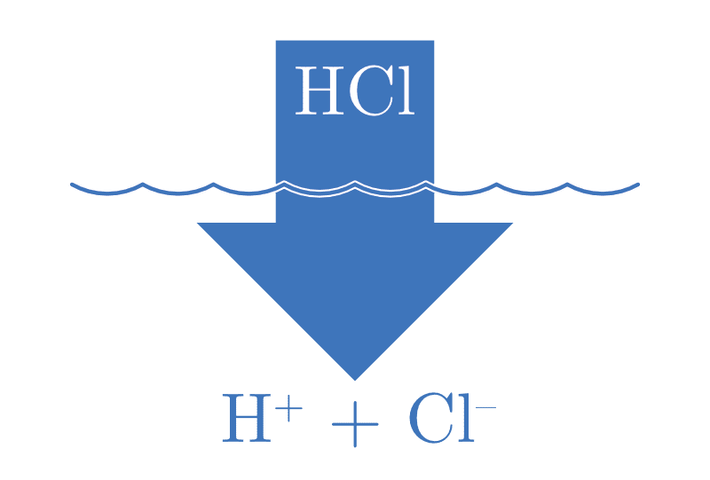
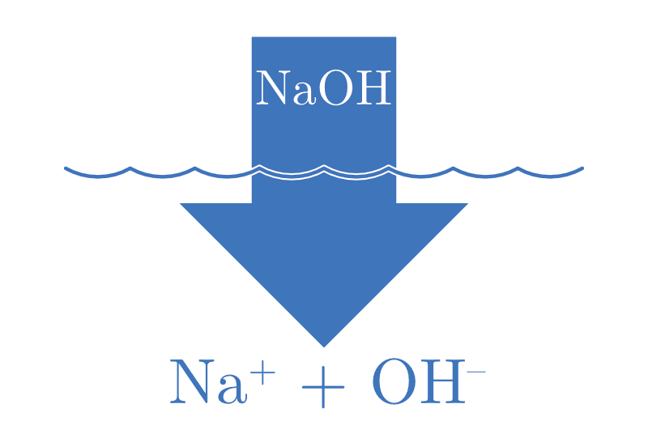
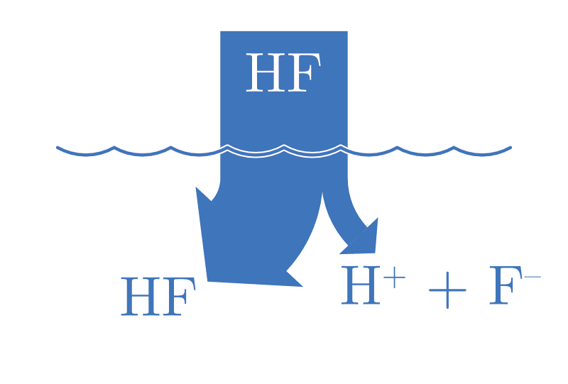
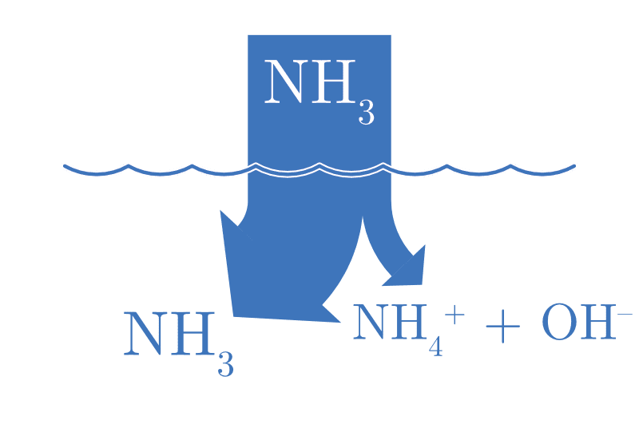
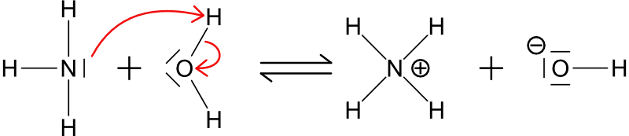

# Les acides et les bases

::: {.objectives data-latex=""}

- Définir les termes acide et base selon Arrhénius, Brønsted-Lowry et Lewis.
- Définir le concept d'acides, bases et leurs conjugués.
- Expliquer la notion de forces des acides et des bases en termes de dissociation.
- Définir la constante d'acidité Ka et de basicité Kb.
- Expliquer la notion d'autoprotolyse de l'eau et la relation entre |H3O+| et |OH-|.

:::

Autour de nous, des substances présentent des propriétés acides ou basiques. Le citron, le vinaigre, le jus d'agrumes sont acides, tandis que le savon, le bicarbonate de soude, et de nombreux produits de nettoyage sont basiques. Ces propriétés, qui affectent la façon dont une substance interagit avec d'autres, sont déterminées par la présence des ions $\ce{H}^{+}$ et $\ce{OH}^{-}$ dans une solution aqueuse.

Dans ce chapitre, nous allons explorer les concepts d'acides et de bases, leurs définitions selon différentes théories, ainsi que la force de ces substances en solution.

## Définitions

| Définition selon |              ACIDE               |               BASE                |
| :--------------- | :------------------------------: | :-------------------------------: |
| Arrhénius        | libère des ions H^+^ en solution | libère des ions OH^-^ en solution |
| Brønsted-Lowry   |         donneur de H^+^          |         accepteur de H^+^         |
| Lewis            |   accepteur d'une paire libre    |     donneur d'une paire libre     |

Table: Définitions des acides et des bases. {#tbl-acides-bases-definitions}

\newpage

|       Arrhénius        |         Brønsted-Lowry         |                    Lewis                    |
| :----------------------------: | :----------------------------: | :----------------------------: |
|  $\ce{HA -> H+ + A-}$  | $\ce{HCl + NH3 -> NH4+ + Cl-}$ | $\ce{BF3 +}$\|$\ce{NH3 -> BF3\bond{<-}NH3}$ |
|         acide          |                                |                                             |
| $\ce{BOH -> OH- + B+}$ |       $\ce{HCl}$ : acide       |             $\ce{BF3}$ : acide              |
|          base          |       $\ce{NH3}$ : base        |              $\ce{NH3}$ : base              |

Table: Exemples d'acides et de bases correspondant à chaque définition. {#tbl-acides-bases-examples}



## Couples acide-base

Un couple acide-base désigne deux espèces chimiques liées par un simple transfert de proton ($\ce{H}^{+}$). Ces espèces, l'**acide et sa base conjuguée**, diffèrent uniquement par la présence ou l'absence de ce proton.

Lors de la réaction entre l'acide chlorhydrique et l'ammoniac :

$$
\ce{HCl_{(aq)} + NH3_{(aq)} <=> NH4^{+}_{(aq)} + Cl^{-}_{(aq)}}
$$

- $\ce{HCl}$ agit comme un **acide** en donnant un proton à $\ce{NH3}$,
- $\ce{NH3}$ agit comme une une **base** en acceptant un proton de $\ce{HCl}$.
- $\ce{HCl}$ est l'**acide** et $\ce{Cl}^{-}$ est sa **base conjuguée**.
- $\ce{NH3}$ est la **base** et $\ce{NH4}^{+}$ est son **acide conjugué**.


\newpage



## Les ampholytes

Un **ampholyte**, ou une **espèce amphotère**, est une molécule ou un ion capable de réagir à la fois comme un acide et comme une base (donner ou accepter un proton), selon les conditions du milieu réactionnel. L'eau est l'exemple le plus courant et le plus accessible pour illustrer ce concept.

En présence d'un acide plus fort, l'eau agit comme une base, acceptant un proton pour former l'ion hydronium ($\ce{H3O}^{+}$). 

$$
\ce{H2O_{(l)} + HCl_{(aq)} <=> H3O^{+}_{(aq)} + Cl^{-}_{(aq)}}
$$

Inversement, en présence d'une base plus forte, l'eau agit comme un acide, cédant un proton pour former l'ion hydroxyde ($\ce{OH}^{-}$).

$$
\ce{H2O_{(l)} + NH3_{(aq)} <=> OH^{-}_{(aq)} + NH4^{+}_{(aq)}}
$$





\newpage

## Forces des acides et des bases

- Un acide ou une base sera **fort(e)** s'il s'ionise (se dissocie) **complètement**.
- Un acide ou une base sera **faible** s'il ne s'ionise (se dissocie) que **partiellement**.

## Acides et bases fort(e)s

|                          ACIDE FORT                           |                          BASE FORTE                          |
| :-----------------------------------------------------------: | :----------------------------------------------------------: |
| $\ce{HA_{(aq)} + H2O_{(l)} -> H3O^{+}_{(aq)} + A^{-}_{(aq)}}$ | $\ce{B_{(aq)} + H2O_{(l)} -> BH^{+}_{(aq)} + OH^{-}_{(aq)}}$ |
|           {width=40%}           |          {width=40%}           |
|                   \|H~3~O^+^\| = \|HA\|                       |                       \|OH^-^\| = \|B\|                      |

## Acides et bases faibles

|                          ACIDE FAIBLE                          |                          BASE FAIBLE                          |
| :------------------------------------------------------------: | :-----------------------------------------------------------: |
| $\ce{HA_{(aq)} + H2O_{(l)} <=> H3O^{+}_{(aq)} + A^{-}_{(aq)}}$ | $\ce{B_{(aq)} + H2O_{(l)} <=> BH^{+}_{(aq)} + OH^{-}_{(aq)}}$ |
|          {width=40%}           |          {width=40%}           |
|                  \|H~3~O^+^\| $\lll$ \|HA\|                    |                  \|OH^-^\| $\lll$ \|B\|                       |

**Plus un acide est fort, plus sa base conjuguée sera faible** et vice versa.

Dans le cas d'un acide fort, complètement dissocié, sa base conjuguée est dite **inerte**, elle ne modifiera pas le pH.

\newpage

De nombreuses bases faibles contiennent un atome d'azote puisque la paire libre peut agir comme un accepteur de proton.

{#fig-acides-bases-3 width="50%"}

| Nom           |              Amine |       Forme protonnée |        Exemple de sel |
| :------------ | -----------------: | --------------------: | --------------------: |
| ammoniac      |         $\ce{NH3}$ |          $\ce{NH4^+}$ |          $\ce{NH4Cl}$ |
| méthylamine   |      $\ce{CH3NH2}$ |       $\ce{CH3NH3^+}$ |       $\ce{CH3NH3Cl}$ |
| éthylamine    |   $\ce{CH3CH2NH2}$ |    $\ce{CH3CH2NH3^+}$ |    $\ce{CH3CH2NH3Cl}$ |
| phénylamine   |     $\ce{C6H5NH2}$ |      $\ce{C6H5NH3^+}$ |      $\ce{C6H5NH3Cl}$ |
| diméthylamine |    $\ce{(CH3)2NH}$ |    $\ce{(CH3)2NH2^+}$ |    $\ce{(CH3)2NH2Cl}$ |
| diéthylamine  | $\ce{(CH3CH2)2NH}$ | $\ce{(CH3CH2)2NH2^+}$ | $\ce{(CH3CH2)2NH2Cl}$ |

Table: Exemples de bases azotées faibles. {#tbl-acides-bases-amines}

## Constante d'acidité K~a~ et constante de basicité K~b~

Considérons l'équation générique d'ionisation d'un acide faible :

$$
\ce{HA_{(aq)} + H2O_{(l)} <=> H3O^{+}_{(aq)} + A^{-}_{(aq)}}
$$

La constante d'équilibre de cette réaction s'exprime par la relation suivante :

$$
K_a = \frac{|\ce{H3O}^{+}| \cdot |\ce{A}^{-}|}{|\ce{HA}|} =  \frac{|\ce{H}^{+}| \cdot |\ce{A}^{-}|}{|\ce{HA}|}
$$

Dans le cas des acides faibles, cette constante est appelée **constante d'acidité (K~a~)** et donne une valeur à la force de ces acides.

Plus la constante est **petite**, plus l'équilibre est déplacé vers la **gauche** et plus l'acide est **faible**.

\newpage

Considérons l'équation générique d'ionisation d'une **base faible** :

$$
\ce{B_{(aq)} + H2O_{(l)} <=> BH^{+}_{(aq)} + OH^{-}_{(aq)}}
$$

La constante d'équilibre de cette réaction s'exprime par la relation suivante :

$$
K_b = \frac{|\ce{BH}^{+}| \cdot |\ce{OH}^{-}|}{|\ce{B}|}
$$

Cette constante est appelée **constante de basicité (K~b~)** et donne une valeur à la force des bases faibles.

Plus la constante est **petite**, plus l'équilibre est déplacé vers la **gauche** et plus la base est **faible**.

Les valeurs numériques des constantes d'acidité (K~a~) et de basicité (K~b~) pour de nombreux acides et bases courants sont généralement compilées et présentées dans des tables de données de référence.



\newpage

<!---->




<!---->

## Autoprotolyse de l'eau

L'eau est une molécule amphotère, elle peut jouer à la fois le rôle d'acide et de base. Dans de l'eau pure, deux molécules d'eau peuvent réagir entre-elles, l'une agissant comme un acide et l'autre comme une base :

$$
\ce{H2O_{(l)} + H2O_{(l)} <=> H3O+_{(aq)} + OH^{-}_{(aq)}}
$$

Cette réaction est appelée **autoprotolyse**. C'est réaction est réversible, on peut en exprimer la constante d'équilibre K~e~, appelée **produit ionique de l'eau** :

$$
K_e = |\ce{H3O}^{+}| \cdot |\ce{OH}^{-}| = 10^{-14} \quad \text{(valeur à 25°C)}
$$

Cette relation relie les concentrations des ions H~3~O^+^ et OH^-^ dans toutes les solutions aqueuses. Elle permet également de calculer la concentration des ions H~3~O^+^ dans une solution basique, car :

$$
|\ce{H3O}^{+}| = \frac{10^{-14}}{|\ce{OH}^{-}|}
$$

\newpage

En résumé :

|                           |       |
| :---------- | :----------: |
| Dans de l'eau pure        |   \|$\ce{H3O}^{+}$\| = \|$\ce{OH}^{-}$\| = $10^{-7} M$ |
| Dans une solution acide   |   \|$\ce{H3O}^{+}$\| > \|$\ce{OH}^{-}$\|            |
| Dans une solution basique |   \|$\ce{H3O}^{+}$\| < \|$\ce{OH}^{-}$\|            |



\newpage





\newpage

## Résumé

- Trois définitions des acides et des bases. Selon Arrhénius : un acide libère des ions $\ce{H}^{+}$, une base des ions $\ce{OH}^{-}$ en solution. Selon Brønsted-Lowry : un acide est un donneur de proton, une base un accepteur de proton. Selon Lewis : un acide est un accepteur de paire libre, une base un donneur de paire libre.
- Un couple acide-base est formé d'un acide et de sa base conjuguée, qui ne diffèrent que d'un proton $\ce{H}^{+}$. Une espèce amphotère (ampholyte), comme l'eau, peut se comporter en acide ou en base selon le milieu.
- Un acide (ou une base) est fort s'il se dissocie complètement, faible s'il ne se dissocie que partiellement. Plus un acide est fort, plus sa base conjuguée est faible ; la base conjuguée d'un acide fort est inerte.
- La force d'un acide faible se mesure par la constante d'acidité $K_a$, celle d'une base faible par la constante de basicité $K_b$. Plus la constante est petite, plus l'acide (ou la base) est faible.
- L'eau subit une autoprotolyse : $\ce{2 H2O <=> H3O+ + OH-}$, de constante $K_e = |\ce{H3O}^{+}| \cdot |\ce{OH}^{-}| = 10^{-14}$ à 25°C. Dans l'eau pure $|\ce{H3O}^{+}| = |\ce{OH}^{-}| = 10^{-7}$ M.

## Exercices supplémentaires





\newpage



