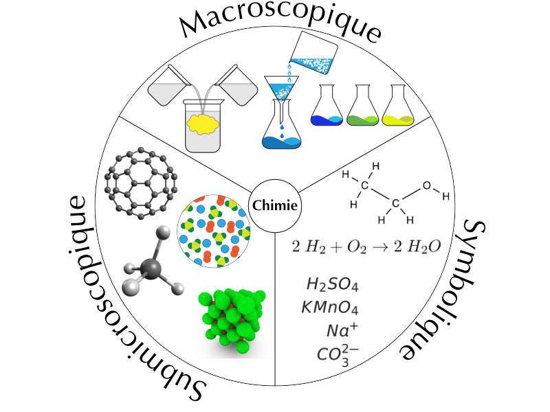
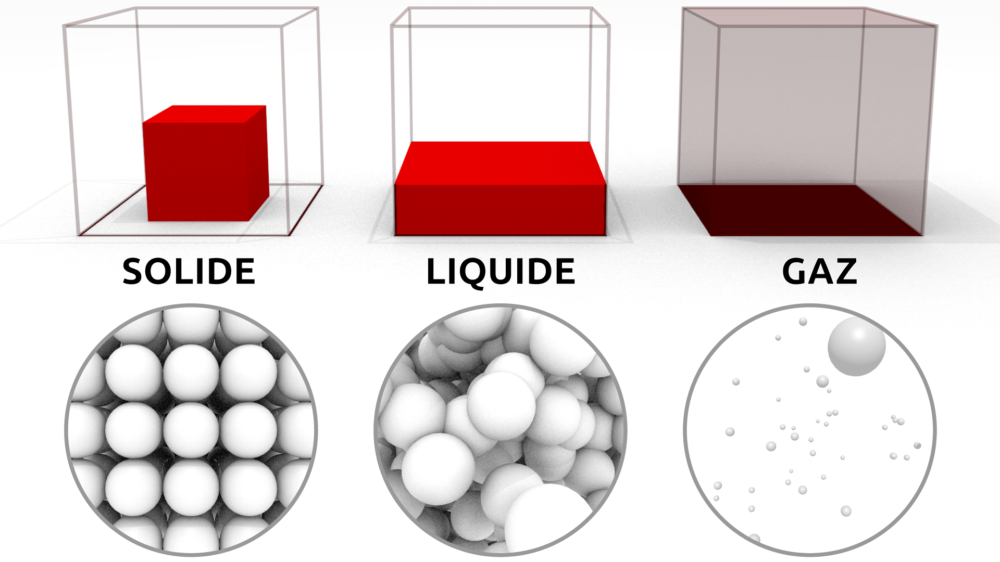
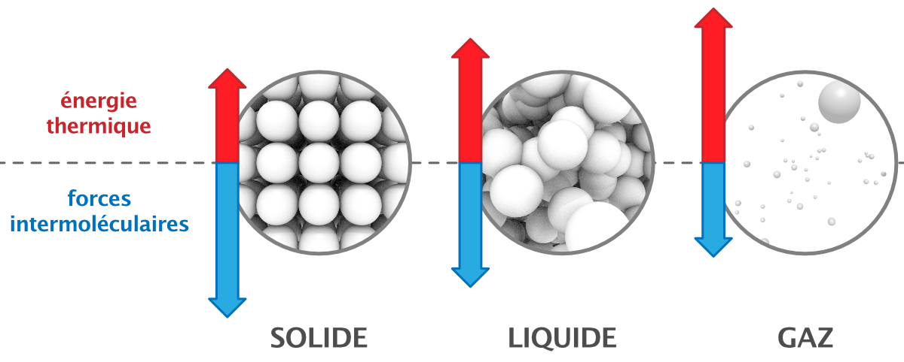
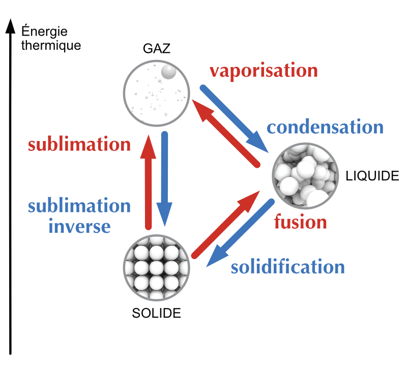
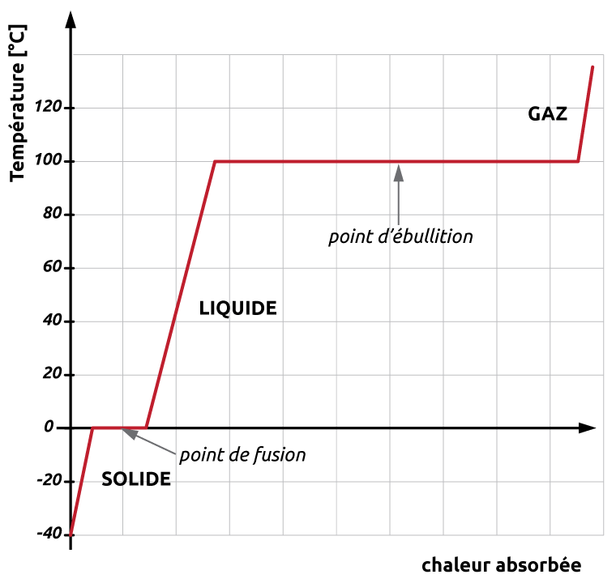

# Les états de la matière

::: {.objectives data-latex=""}

- Distinguer les trois états de la matière.
- Décrire les propriétés macroscopiques et submicroscopiques de chaque état.
- Identifier et décrire chaque changement d'état.
- Connaître les facteurs qui influencent les points d'ébullition et de fusion.
- Interpréter une courbe de changements d’états.

:::

## Les représentations en chimie

Nous allons considérer la matière de trois points de vue différents :

- **point de vue macroscopique**  
	Le domaine de la matière que l'on peut voir, sentir ou toucher.
- **point de vue submicroscopique**  
	Le domaine de la matière que l'on ne peut pas voir (atomes, molecules, etc.).
- **point de vue symbolique**  
	Le domaine qu'on utilise pour représenter "mathématiquement" la matière (équations, symboles, formules, etc.).

::: {.center-blocks}

{width=50%}

:::

Les propriétés macroscopiques sont régies par ce qu'il se passe au niveau submicroscopique.

## Solide, liquide et gaz

La matière se trouve généralement sous trois formes physiques appelées états: solide, liquide et gaz.

|             | **point de vue macroscopique**                                                  | **point de vue submicroscopique**                                                                    |
| :---------: | :------------------------------------------------------------------------------ | :--------------------------------------------------------------------------------------------------- |
|  **solide** | Les solides ont un volume défini et une forme définie.                          | Les particules sont peu mobiles et très proches.                                                     |
| **liquide** | Les liquides ont un volume défini mais ils adoptent la forme de leur contenant. | Les particules sont proches et se déplacent lentement aléatoirement.                                 |
|   **gaz**   | Les gaz occupent tout le volume et la forme de leur contenant.                  | Les particules sont séparées par de grandes distances et se déplacent très rapidement aléatoirement. |

::: {.center-blocks}

{width=50%}

:::

## Mouvement thermique et forces intermoléculaires

La théorie cinétique de la matière nous indique que les particules qui composent la matière sont constamment en mouvement. Ce mouvement chaotique de particules est appelé **mouvement thermique**.

L'**énergie thermique** est l'énergie résultante du mouvement de ces particules. Elle est directement proportionnelle à la température de la substance. Cela signifie que plus la température augmente, plus les particules se déplacent rapidement et plus l'énergie qu'elles possèdent est élevée.

Il existe des forces d'attraction qui rassemblent les particules qui constituent la matière. Ces forces sont appelées les **forces intermoléculaires**. Ces forces sont d'origine électrostatique, elles sont dues à l'attraction entre des espèces chargées électriquement (positives et négatives).

- L'énergie thermique a tendance **à séparer** les particules qui forment la matière.
- Les forces intermoléculaires ont tendance **à maintenir ensemble** les particules qui forment la matière.

Les trois états de la matière sont le résultat de l'**équilibre** entre les **forces intermoléculaires** et l'**énergie thermique**.

::: {.center-blocks}

{width=67%}

:::

Lorsque les forces intermoléculaires sont fortes et l'énergie thermique faible, la substance aura tendance à se trouver à l'état solide. Lorsque les forces intermoléculaires sont faibles et l'énergie thermique forte, la substance aura tendance à se trouver à l'état gazeux. L'état liquide résulte d'une équivalence entre forces intermoléculaires et énergie thermique.

## Les changements d'état

En général, chaque état de la matière, solide, liquide ou gaz, peut se transformer en l'un des deux autres états. Ces transformations sont appelées **changements d'état**. Par exemple, l'eau peut subir deux changement d'état : elle fond à 0° C et bout à 100° C. Toutes les substances sont susceptibles de subir un changement d'état. Le fer fond à 1535° C et bout 2750° C.

On peut modifier l'état d'une substance en lui fournissant ou lui retirant de l'énergie thermique:

**Lorsque la température augmente**  
- L'énergie thermique augmente.
- Les particules se déplacent plus rapidement et se libèrent des forces d'attraction.

**Lorsque la température diminue**  
- L'énergie thermique diminue.
- Les particules se déplacent moins rapidement et les forces d'attraction les rassemblent.

**Les changements d'état sont des transformations physiques.** Lors d'un changement d'état une substance change la façon dont ses atomes ou molécules sont organisées sans changer les particules elles-mêmes.

- Le **point de fusion** est la température à laquelle une substance passe de l'état solide à l'état liquide.
- Le **point d'ébullition** est la température à laquelle une substance passe de l'état liquide à l'état gazeux.

::: {.center-blocks}

{width=50%}

:::

L'**évaporation** est la transformation d'un liquide en vapeur sans ébullition. Il peut y avoir vaporisation sans ébullition de la matière.

\newpage

```{r, child=c('exe/etats-matiere-10.Rmd')}
```

\newpage

```{r, child=c('exe/etats-matiere-20.Rmd')}
```

```{r, child=c('exe/etats-matiere-30.Rmd')}
```

<!-- \input{_exo/_tex/2-etats-matiere-3.tex} -->

## Les courbes de changement d'état

::: {.center-blocks}

{width=50%}

:::

Imaginons que l'on chauffe un bloc de glace en partant d'une température de -40° C. On place un thermomètre dans notre expérimentation et on note la température.

- En chauffant, on apporte de l'énergie thermique au système. La glace se réchauffe et sa température augmente.
- Une fois que la glace atteint 0° C, **la température cesse d'augmenter** et la glace commence à fondre pour former de l'eau liquide.
- En continuant de chauffer, plus de glace se transforme en eau, mais la température reste la même.
- Une fois que la glace a complètement fondu, la chaleur apportée chauffe l'eau liquide.  
	La température recommence à augmenter.
- Une fois que l'eau liquide atteint 100° C, **la température cesse d'augmenter** et l'eau commence à vaporiser pour former de la vapeur d'eau.
- En continuant de chauffer, plus d'eau liquide se transforme en vapeur d'eau, mais la température reste la même.
- Une fois que l'eau s'est complètement vaporisée, la chaleur apportée chauffe la vapeur d'eau.  
	La température recommence à augmenter.

Un changement de température et un changement d'état ne se produisent pas en même temps. Quand une substance absorbe ou libère de l'énergie, soit c'est la température qui change, soit c'est son état. En d'autres termes, **la température d'une substance ne change pas au cours d'un changement d'état.**

En effectuant la même expérience, mais en partant de vapeur d'eau chaude et en diminuant la température, la courbe serait inversée et aurait la même allure.

## Les diagrammes de phases

Nous avons vu qu’il est possible de liquéfier un gaz à pression ambiante en le refroidissant. Pourtant, cela ne suffit pas toujours. Par exemple, on sait qu’à pression atmosphérique, le dioxyde de carbone CO~2~ passe directement de la phase gazeuse à la phase solide (sublimation inverse). Ainsi, pour obtenir du CO~2~ liquide, il est nécessaire d’augmenter la pression.

Ce genre d’informations est résumé sur un **diagramme de phases** qui donne les conditions (pression et température) d’existence des différentes phases d’une substance donnée.

::: {.center-blocks}


:::

<!--
\caption{Exemples de diagrammes de phases\\(les échelles ne sont pas régulières).}
\input{_exo/_tex/2-etats-matiere-phases-1.tex}
-->
