# Molécules et liaisons chimiques

::: {.objectives data-latex=""}

-  Expliquer le concept de liaison chimique.
-  Identifier les différents types de liaisons chimiques.
-  Expliquer le concept d'électronégativité.
-  Reconnaître les ions que contient une molécule dans sa formule brute.
-  Dessiner la formule développée d'une molécule avec ses covalences et électrovalences.
-  Calculer la masse molaire d'une molécule à partir des masses atomiques des atomes qui la composent.
-  Calculer le nombre de moles/molécules que contient une masse donnée d'un composé.

:::

En observant le monde autour de nous, on découvre qu'il est composé principalement de corps purs composés et de mélanges de corps purs composés: la roche, les sols, le pétrole, les arbres et le corps humain sont tous des mélanges complexes de composés chimiques liant différents types d'atomes ensemble. **Seuls les gaz rares se trouvent dans la nature sous forme d'atomes isolés.**

## Les molécules

De nombreuses substances existent sous la forme de deux ou plusieurs atomes reliés entre eux de manière si forte qu'ils se comportent comme une seule particule. Ces combinaisons de plusieurs atomes sont appelées molécules. De manière similaire à un atome, une molécule est la plus petite partie d'une substance qui possède les propriétés physiques et chimiques de cette substance. Cependant, une molécule est composée de plus d'un atome.

::: {.tcolorbox data-latex=""}

**Molécule**  
Une molécule est un groupe d'au moins deux atomes liés par une/des liaison(s) chimique(s).

:::

Les chimistes utilisent des formules chimiques pour exprimer la composition des espèces chimiques à l'aide de symboles.

\newpage

### La formule brute

Les molécules sont composées d'atomes. On les représente par une formule, en indiquant les symboles des atomes qui les composent et leur nombre. Cette formule est appelée **formule brute**. La formule brute donne le nombre d'atomes des différents éléments qui forment un composé, exprimés avec les plus petits nombres entiers possibles.

- $NaCl$ : 1 atome de sodium et 1 atome de chlore  
- $O_2$ : 2 atomes d'oxygène  
- $H_2O$ : 2 atomes d'hydrogène et 1 atome d'oxygène

Lorsqu'un atome n'est présent qu'une seule fois dans la molécule, on n'indique pas l'indice 1. La formule brute de l'eau s'écrira donc H~2~O et non H~2~O~1~, et on écrira CO~2~ et non C~1~O~2~.

## La masse molaire moléculaire

::: {.tcolorbox data-latex=""}

**Masse molaire moléculaire**  
La masse molaire d'un composé est la masse en grammes d'une mole de molécules de ce composé.

:::

Une molécule de $CH_4$ contient 1 atome de carbone et 4 atomes d'hydrogène.

Donc, une mole de molécules de $CH_4$ contient 1 mole d'atomes de carbone et 4 moles d'atomes d'hydrogène.

La masse d'une mole de méthane peut être trouvée en additionnant les masses molaires atomiques du carbone et de l'hydrogène présents dans la molécule:

$$ \begin{split}
  \text{Masse de 1 mol de carbone} &= 12.01 \text{ g} \\
  \text{Masse de 4 mol d'hydrogène} &= 4.032 \text{ g} \quad (4 \cdot 1.008 \text{ g}) \\
  \hline
  \text{Masse de 1 mol de $CH_4$} &= 16.04 \text{ g}
  \end{split} $$



### La formule développée

La formule brute ne permet pas d'indiquer comment les atomes sont reliés entre eux par des liaisons chimiques ou comment ils sont disposés dans l'espace. Comprendre comment les atomes d'une molécule sont disposés et comment ils sont liés entre eux permet d'expliquer les caractéristiques physiques et chimique d'un composé.

**La formule développée** identifie l'emplacement des atomes ainsi que leurs liaisons au sein d'une molécule. On utilise la représentation de Lewis pour dessiner les atomes des différents éléments qui sont reliés par des lignes qui représentent les liaisons chimiques.

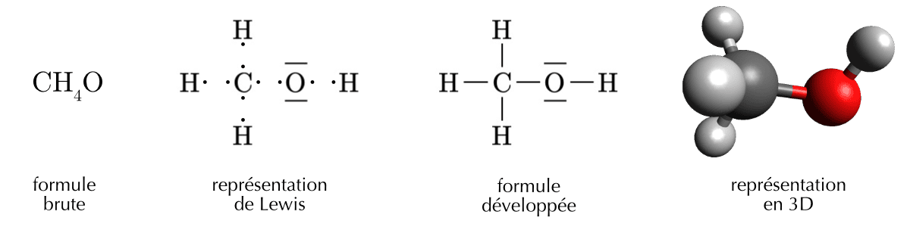{#fig-methanol-formulas width="100%"}

## Les liaisons chimiques

Pourquoi les atomes se lient entre eux ? Deux atomes liés ensemble forment un système physique dont l'énergie potentielle est plus basse que celle de deux atomes non liés. La nature cherche à minimiser l'énergie d'un système, les atomes ont donc tendance à former des liaisons. **Les atomes se trouvent dans un état plus stables quand ils participent à une liaison que quand ils sont isolés.**

**Les forces** qui maintiennent les atomes ensemble dans une molécule sont appelées **liaisons chimiques** (ou liaisons intramoléculaires).

On divise les liaisons chimiques en trois familles différentes:

-  la **liaison ionique**
-  la **liaison covalente**
-  la **liaison métallique**



\newpage

### L'électronégativité

::: {.tcolorbox data-latex=""}

**Électronégativité**  
L'électronégativité est la capacité d'un atome à attirer les électrons de liaison.

:::

Plus l'électronégativité d'un élément est élevée, plus il aura tendance à attirer à lui les électrons dans une liaison. **L'électronégativité de chaque élément est indiquée dans votre tableau périodique des éléments.**

Les liaisons sont rarement purement ioniques ou purement covalentes, dans la plupart des substances les liaisons formées se situent quelque part entre la liaison ionique et la liaison covalente.

En se basant sur la différence d'électronégativité ($\Delta$E) entre deux atomes on peut connaître le type de liaison que vont former ces deux atomes.

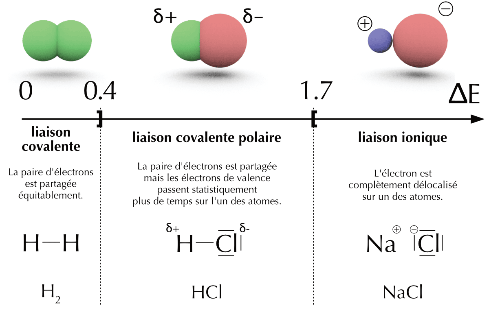{#fig-deltaE width="85%"}

**L'électronégativité de chaque élément est indiquée dans votre tableau périodique des éléments.**



### La liaison ionique | métal - non-métal

::: {.tcolorbox data-latex=""}

**Liaison ionique**  
Une liaison ionique résulte du **transfert** d'un ou plusieurs électrons d'un atome à un autre.

:::

La liaison ionique est le résultat du transfert d'un ou plusieurs électrons depuis un métal vers un non-métal afin de satisfaire **la règle de l'octet**. Essayons de former une molécule avec du sodium et du chlore.

- Le sodium a tendance à perdre un électron de valence pour former le cation $Na^{+}$
- Le chlore a tendance à gagner un électron de valence pour former l'anion $Cl^{-}$

Le sodium et le chlore ont tous les deux un intérêt à former une liaison. L'atome de sodium va perdre un électron qui sera récupéré par l'atome de chlore. Ils compléteront tous les deux leur couche de valence avec huit électrons.

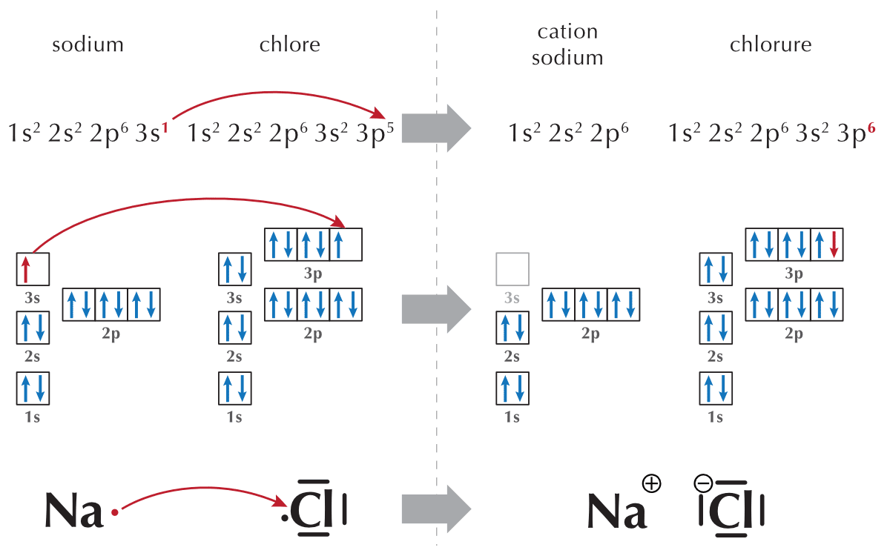{#fig-NaCl-diagram width="60%"}

Deux atomes de sodium réagiront de la même manière avec deux atomes de chlore formant deux molécules de chlorure de sodium. Trois atomes de sodium réagiront avec trois atomes de chlore formant trois molécules de chlorure de sodium, et ainsi de suite... Si l'on fait réagir une mole d'atomes de sodium avec une mole d'atomes de chlore, nous obtiendront une mole de molécules de chlorure de sodium.

Un échantillon de chlorure de sodium ($NaCl$) est constitué d'un très grand nombre de cations $Na^+$ et d'anions $Cl^-$. Ces ions forment un réseau tridimensionnel, appelé **réseau ionique**. L'ensemble est **électriquement neutre** car le nombre de cations $Na^+$ est égal au nombre d'anions $Cl^-$. Pour un cation $Na^+$, on aura un anion $Cl^-$, on écrira donc la **formule brute** $NaCl$.

\newpage

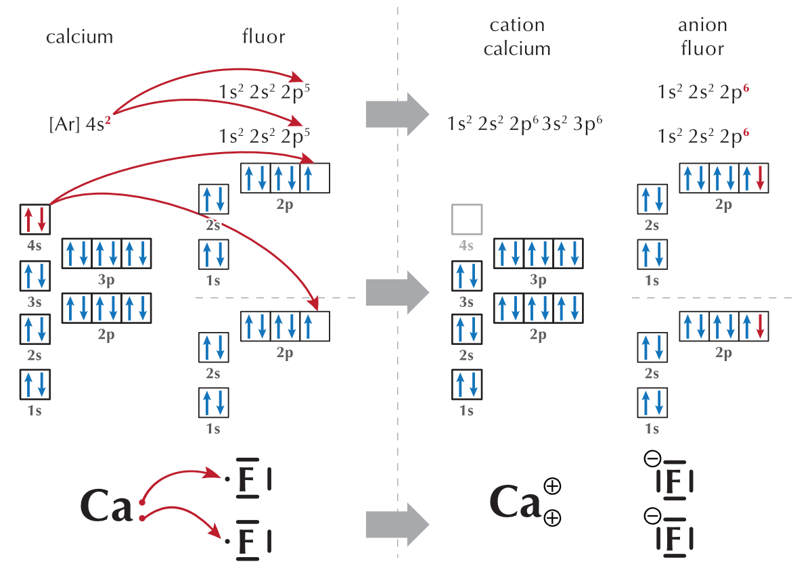{#fig-CaF2-diagram width="60%"}

Le nombre relatif de cations et d'anions n'est pas toujours le même. Prenons par exemple le fluorure de calcium, $CaF_2$. Il y a deux fois plus d'anions $F^-$ que de cations $Ca^{2+}$, on écrira donc la formule brute $CaF_2$.

::: {#fig-NaClCaF2 layout-ncol=2}
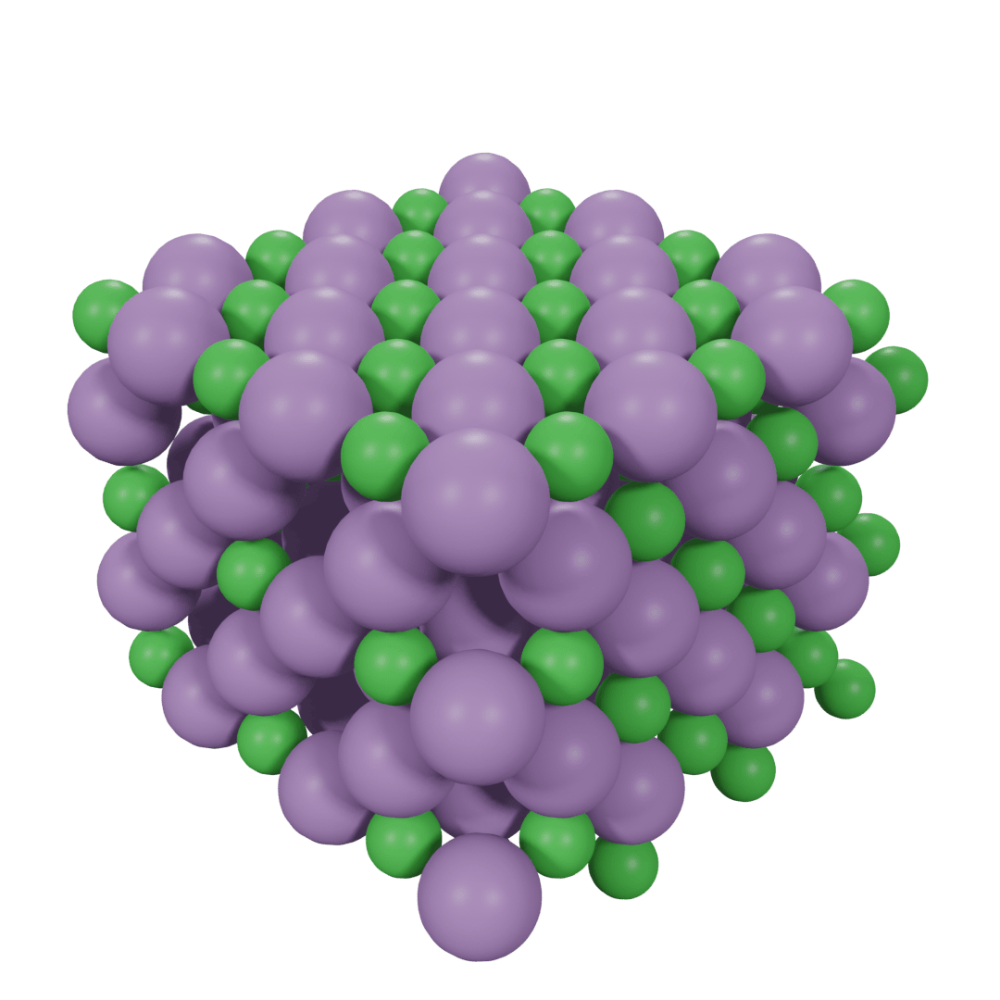

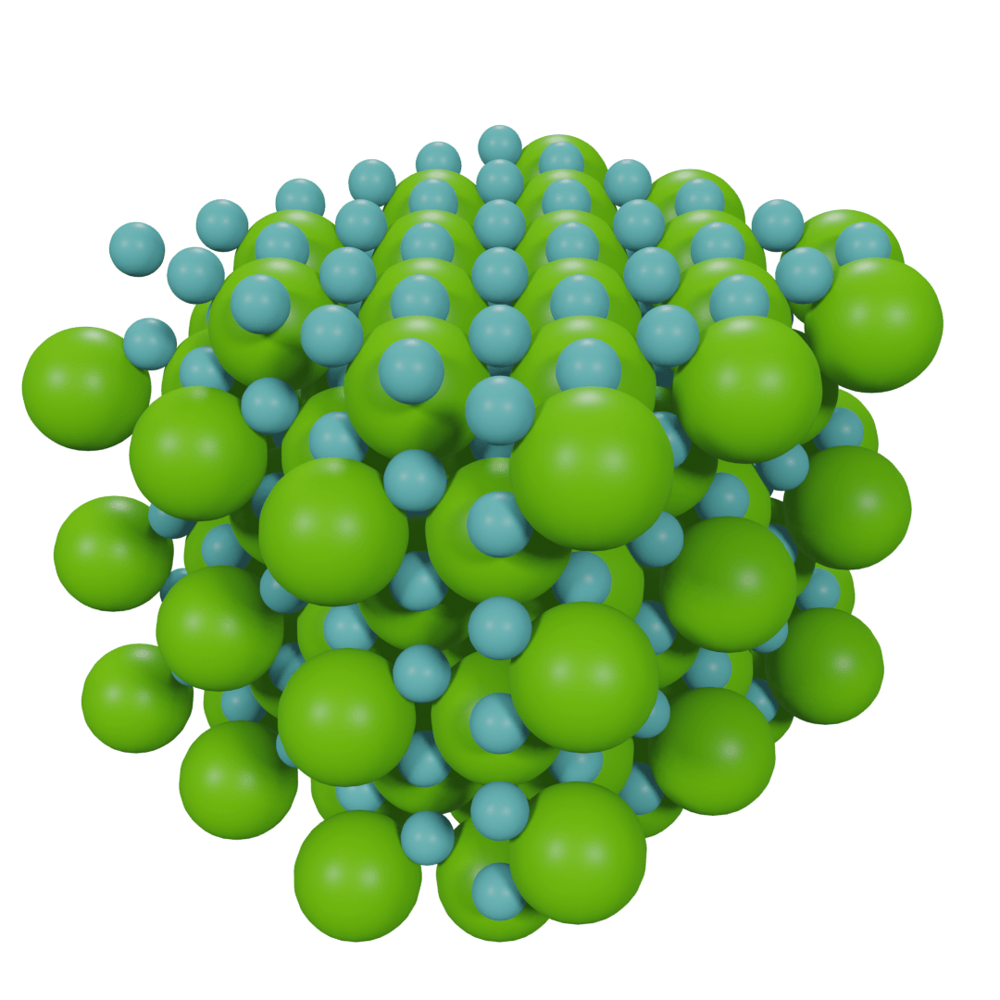

Réseaux ioniques formés par $NaCl$ et $CaF_2$.
:::



\newpage

#### Dessiner les liaisons ioniques des composés binaires

- On dessine la structure de Lewis des atomes en plaçant l'élément le plus électronégatif à droite.
- On dessine autant de cations et d'anions nécessaires à apparier tous les électrons célibataires de chaque élément.
- On transfère les électrons des cations aux anions.
- On dessine les paires nouvellement créées et on ajoute les charges négatives ou positives.

|                      $NaCl$                     |                     $MgBr_2$                     |                     $AlF_3$                     |
| :---------------------------------------------: | :----------------------------------------------: | :---------------------------------------------: |
| 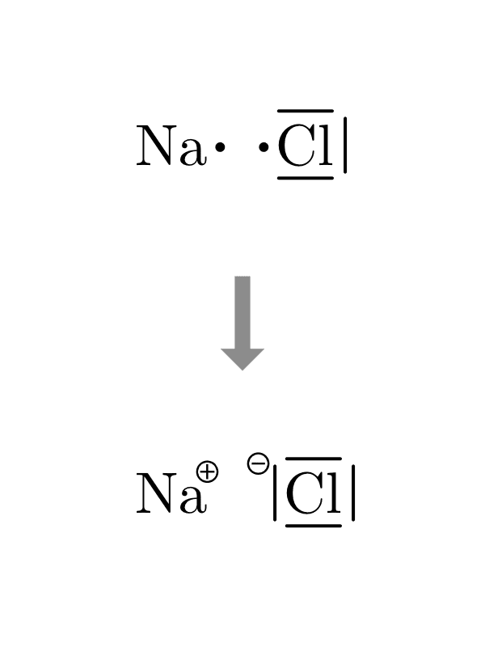{width=9em} | 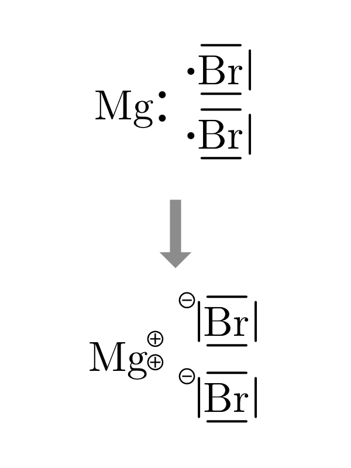{width=9em} | 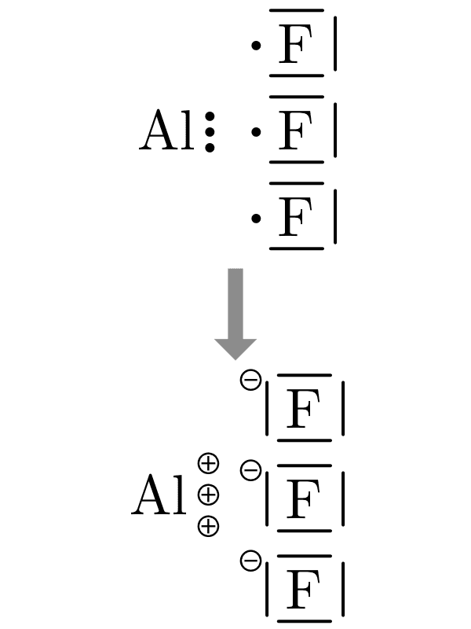{width=9em} |



\newpage

### La liaison covalente | non-métal - non-métal

::: {.tcolorbox data-latex=""}

**Liaison covalente**  
Une liaison covalente résulte du **partage** d'une ou plusieurs paires d'électrons entre deux atomes.

:::

Considérons deux atomes d'hydrogène qui s'approchent l'un de l'autre. Tous les deux ont un seul électron, et chacun a besoin d'un électron supplémentaire pour avoir la même configuration électronique que l'hélium.

Dans cette situation, les électrons de liaison sont **partagés**. C'est une **liaison covalente** qui maintient les atomes ensemble.

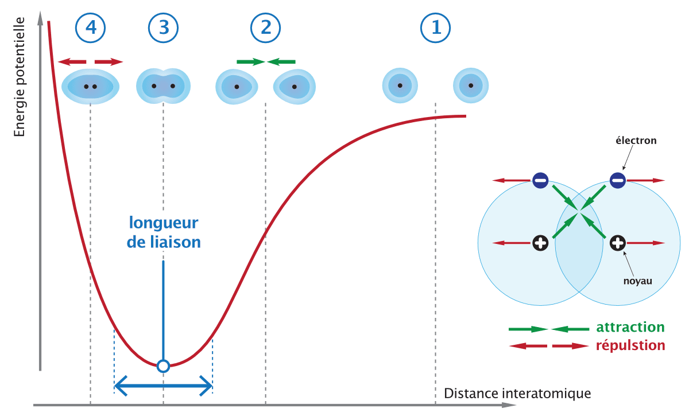{#fig-H2-bond width="50%"}

- Au point 1, les atomes sont éloignés. La distance est trop grande pour que les forces d'attraction et de répulsion puissent agir.
- Au point 2, la distance entre les atomes est suffisante pour que chaque noyau commence à attirer l'électron de l'autre atome. Ces attractions augmentent quand la distance diminue et abaissent l'énergie du système.
- Au point 3 (minimum d'énergie potentielle), l'attraction maximum est atteinte par rapport à la répulsion et le système atteint son minimum d'énergie.
- Au point 4, s'il était atteint, les atomes seraient trop proches et les répulsions pousseraient les noyaux vers le point 3.

**Une liaison covalente résulte de l'équilibre entre l'attraction de particules de charges opposées et la répulsion de particules de même charge.**  

$$ H \cdot \quad + \quad \cdot H \quad \longrightarrow \quad H-H $$

La formation d'une liaison covalente se traduit par une plus grande densité électronique entre les deux noyaux. Les deux atomes d'hydrogène remplissent leur couche de valence avec les électrons qu'ils se prêtent mutuellement.

Dans de nombreuses molécules, pour atteindre un octet complet, les atomes vont partager plus d'une paire d'électrons célibataires. Une liaison covalente peut être **simple**, **double** ou **triple**, selon le nombre de paires d'électrons partagés.

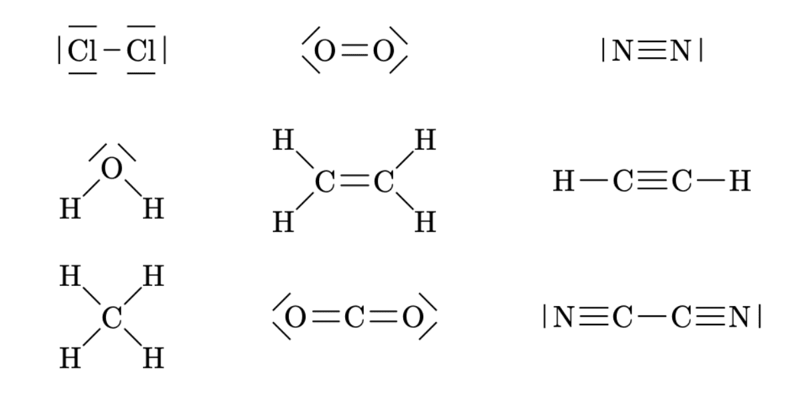{#fig-liaisons-multiples width="67%"}
\newpage

#### Dessiner les liaisons covalentes des composés binaires

- On dessine la structure de Lewis des atomes en plaçant l'élément le plus électronégatif à droite.
- On dessine autant d'atomes nécessaires à apparier tous les électrons célibataires de chaque élément.
- On dessine les liaisons nouvellement créées et on ajoute les charges partielles s'il y a lieu.
- Plusieurs liaisons covalentes doubles ou triples peuvent être nécessaires.
- On peut utiliser les paires libres pour former des liaisons par covalence de coordination.
- On dessine les liaisons nouvellement créées et on ajoute les charges partielles s'il y a lieu.

|                     $H_2O$                     |                     $NH_3$                     |                     $CH_4$                     |
| :--------------------------------------------: | :--------------------------------------------: | :--------------------------------------------: |
| 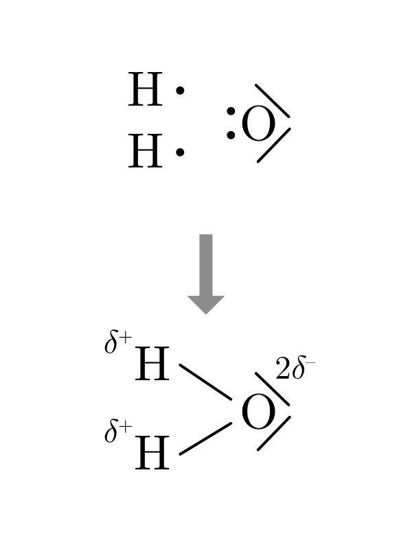{width=9em} | 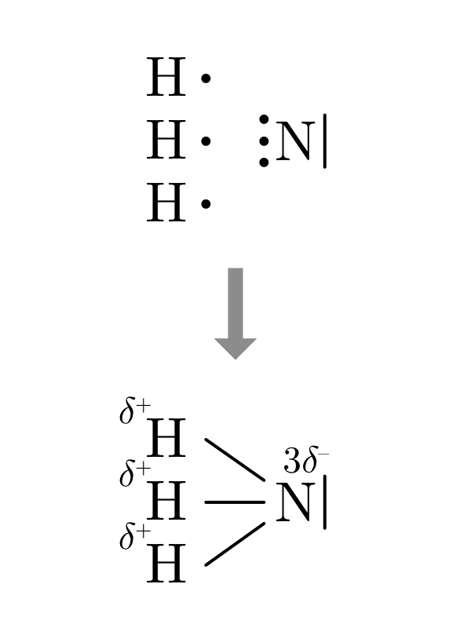{width=9em} | 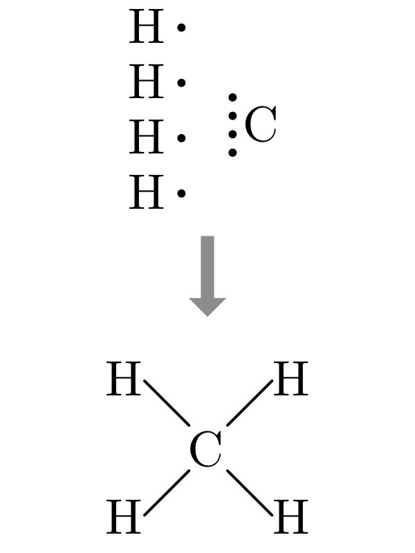{width=9em} |



### La covalence de coordination

::: {.tcolorbox data-latex=""}

**Covalence de coordination**  

Une covalence de coordination est une liaison covalente où deux électrons partagés proviennent du même atome.

:::

La **covalence de coordination** est un cas particulier de la liaison covalente. Dans le cas de la liaison covalente simple, chaque atome fournit un électron. Dans le cas, de la covalence de coordination, un des deux atomes fournit les deux électrons.

$$ \underset{\text{covalence normale}}{A \cdot \quad + \quad \cdot B \quad \longrightarrow \quad A - B} $$

$$ \underset{\text{covalence de coordination}}{A | \quad + \quad B \quad \longrightarrow \quad A \rightarrow | B} $$

Par exemple, l'acide hypochloreux est constitué de liaisons covalentes normales. Les trois autres acides utilisent les doublets de l'atome de chlore pour former des covalences de coordinations.

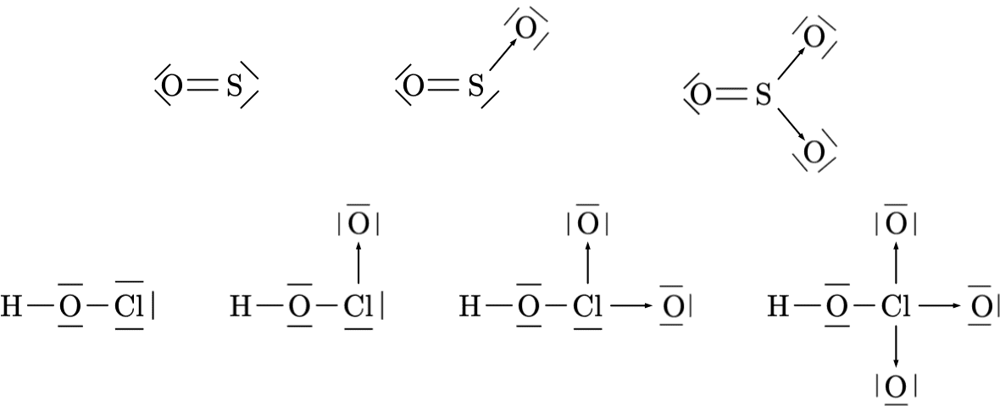{#fig-covalences-coordination width="85%"}

On dessinera les covalence de coordination en déplaçant le doublet sur l'atome qui le reçoit et en remplaçant le trait de liaison par une flèche.

### Les ions polyatomiques

Les ions $Na^+$, $Mg^{2+}$ ou $Cl^–$ sont **monoatomique**, ce qui signifie qu'ils sont constitué d'un seul atome ionisé. Il existe des ions **polyatomiques**, tels que $NH_4^+$ ou $SO_4^{2–}$. Ils se composent d'atomes liés par des covalences mais ils portent une charge positive ou négative.

|             ion hydroxyle            |              ion nitrite              |              ion carbonate             |              ion ammonium             |
| :----------------------------------: | :-----------------------------------: | :------------------------------------: | :-----------------------------------: |
|                $OH^–$                |                $NO_2^–$                |               $CO_3^{2–}$               |                $NH_4^+$                |
| 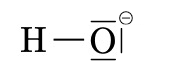{width=6em} | 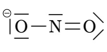{width=6em} | 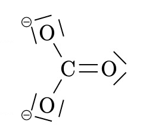{width=6em} | 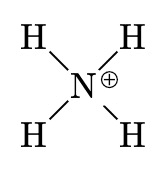{width=5em} |

Quand un ion polyatomique est présent plusieurs fois dans une molécule, on l'indique dans la formule brute par des parenthèses et un indice comme dans les exemples : $Ca(OH)_2$, $Ba(NO_3)_2$, $Ca(HCO_3)_2$.




::: {.Jeu data-latex=""}

**Jeu en ligne** — Entraînez-vous à trouver la charge des ions sur [isotope.ch/charges](https://isotope.ch/charges).

:::

### Dessiner les composés ternaires

- De gauche à droite, dessiner le modèle de Lewis de chacun des éléments présents dans la molécule.
    - Dessiner d'abord les éléments de la colonne I, II ou III.
    - Dessiner ensuite autant d'oxygène qu'il y a d'électrons libres dans la première colonne.
    - Dessiner ensuite les éléments autre que l'oxygène.
    - Dessiner ensuite les oxygènes restants.
- Dessiner les covalences ou électrovalences selon les différences d'électronégativité.



\newpage

### La liaison métallique | métal - métal

::: {.tcolorbox data-latex=""}

**Liaison métallique**  
Liaison chimique dans laquelle les électrons mobiles sont partagés entre plusieurs noyaux.

:::

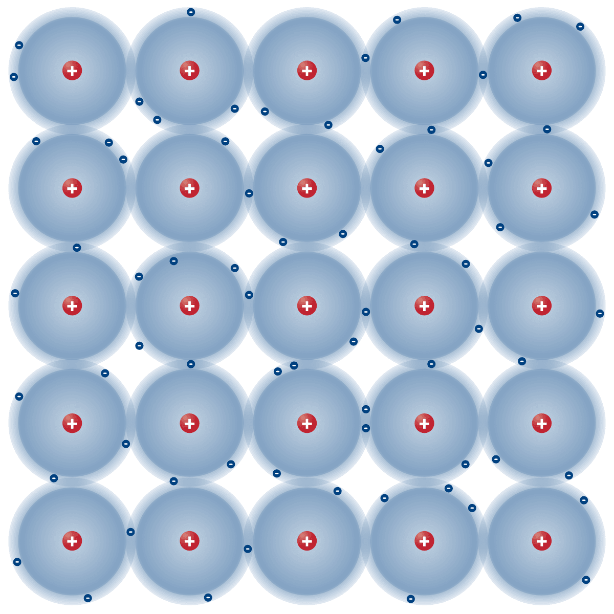{#fig-metallic-bonding width="40%"}

Les métaux ne réagissent pas vraiment avec d'autres métaux pour former des composés. Les métaux se combinent pour former des **alliages**, c'est-à-dire un **mélange homogène** d'un métal dans un autre.

Le modèle de la **liaison métallique** propose que tous les atomes du métal partagent leurs électrons de valence pour former un "océan" d'électrons. Les électrons externes sont libres de se déplacer dans tout l'échantillon. Les noyaux sont positionnés dans cet océan de manière ordonnée à des endroits précis. La forme de l'échantillon est maintenue par l'attraction électrostatique entre les cations métalliques (charge positive) et les électrons de valence mobiles (charge négative).

La capacité qu'ont les électrons de valence de se déplacer dans tout l'échantillon donne au métal ses propriétés physiques.

-  Les solides métalliques sont de bons **conducteurs de l'électricité et de la chaleur**.
-  Ils sont **malléables** (Ils peuvent être martelé en feuilles très minces).
-  Ils sont **ductiles** (Ils peuvent être étirés en fils très fins).

### Les alliages

Un alliage est un mélange homogène entre un métal de base et un ou plusieurs autres éléments, qui peuvent être des métaux ou non-métaux. L'alliage de métaux est l'un des principaux moyens de modifier les propriétés des éléments métalliques purs. Par exemple, l'or pur est trop mou pour être utilisé en orfèvrerie, mais les alliages d'or sont plus adaptés.

\newpage

| métal  | composition                                          | alliages         |
|:------:|:-----------------------------------------------------|:-----------------|
|  fer   | fer + carbone (moins de 2% en masse de carbone)      | fonte            |
|        | fer + carbone (2% à 7% en masse de carbone)          | acier            |
|        | fer + carbone + nickel + chrome                      | acier inoxydable |
| cuivre | cuivre + étain                                       | bronze           |
|        | cuivre + zinc                                        | laiton           |
|   or   | or + argent + cuivre                                 | or jaune         |
|        | or + nickel + recouvert d'une fine couche de rhodium | or blanc         |

Table: Exemples d'alliages communs. {#tbl-exemples-alliages-communs}

## Résumé

- Une liaison chimique est la force qui maintient les atomes ensemble dans une molécule ; les atomes se lient car l'énergie du système lié est plus basse que celle des atomes isolés. Seuls les gaz rares restent isolés.
- On distingue trois familles de liaisons : ionique, covalente et métallique.
- L'électronégativité mesure la capacité d'un atome à attirer les électrons de liaison. La différence d'électronégativité $\Delta E$ entre deux atomes détermine le type de liaison.
- La formule brute indique le nombre d'atomes de chaque élément ; dans un composé ionique, elle traduit la neutralité électrique. Un ion polyatomique est un groupe d'atomes liés portant une charge globale.
- La formule développée montre comment les atomes sont liés — liaisons simples, doubles, triples ou covalence de coordination — en respectant la règle de l'octet.
- La masse molaire moléculaire (g/mol) est la somme des masses molaires atomiques de tous les atomes de la formule.
- On relie la masse et la quantité de matière par $n = \dfrac{m}{M}$, et le nombre de molécules (ou de motifs) par $N = n \cdot N_A$.

\newpage

## Exercices supplémentaires







\newpage







\newpage





\newpage







\newpage





\newpage





\newpage





\newpage





```{r, echo=FALSE}
if (knitr::is_latex_output()) {
  knitr::asis_output('\\section{Solutions des exercices} \\shipoutAnswer')
}
```
