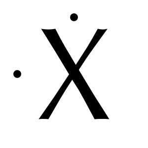
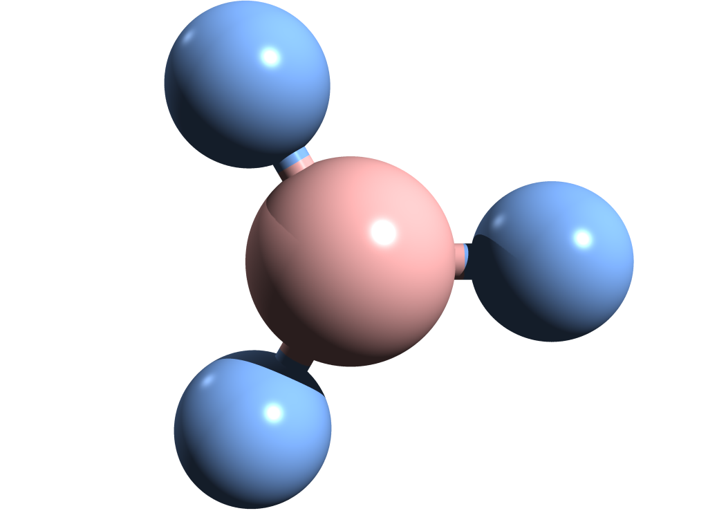
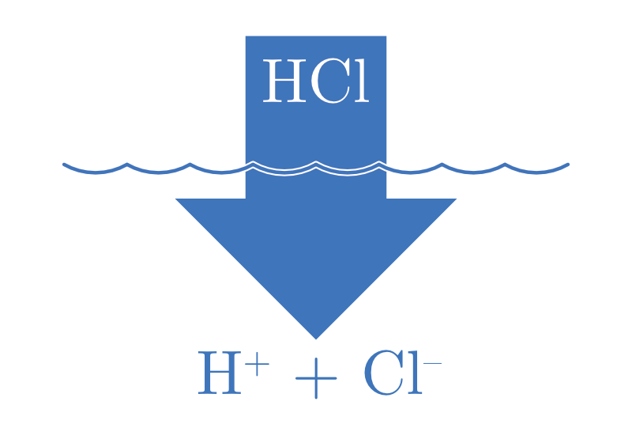
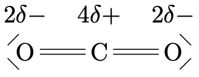
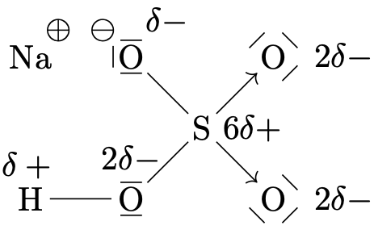
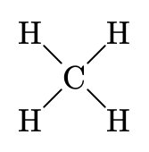
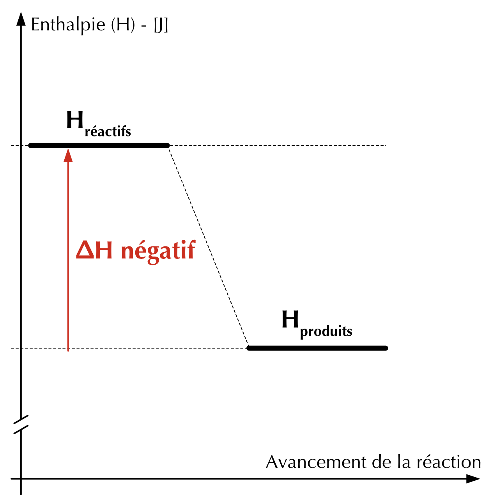

# Préambule {-}

**Cours de chimie Générale** édité par les enseignants du gymnase de Nyon la Côte.

Ce manuel fournit aux étudiants (OS et DF) les connaissances de base nécessaires en chimie pour l'obtention du certificat de maturité gymnasiale. Il sert de support de cours pour l'accompagnement des leçons et des travaux pratiques proposés en classe.

Le document est en cours de rédaction et des ajouts ou modifications peuvent avoir lieu en cours d'année scolaire. Chaque révision visera à améliorer la qualité et la précision du contenu et à souligner sa pertinence pour les étudiants.

Le contenu est disponible en ligne au format HTML à l'url [www.chimiegenerale.ch](www.chimiegenerale.ch), adresse à laquelle il est également possible de télécharger le contenu au format PDF ou EPUB (format standardisé pour les livres numériques). Le document est édité en utilisant la technologie [bookdown](https://bookdown.org/) qui permet de rédiger des livres HTML, PDF, ePub en utilisant la syntaxe R Markdown.

Ce projet est ouvert aux contributions et aux suggestions. Si vous souhaitez participer à son amélioration, le code source est disponible sur la plateforme GitHub à l'adresse [https://github.com/mrizzello/chimie-generale](https://github.com/mrizzello/chimie-generale). Nous serions heureux de faire évoluer ce document vers un projet participatif de plus grande ampleur. Vous pouvez créer une _Pull Request_ ou une _Issue_ sur GitHub et nous l'examinerons dès que possible.

\vspace{\stretch{1}}


Cet ouvrage est placé sous licence Creative Commons [CC BY-SA 4.0](https://creativecommons.org/licenses/by-sa/4.0/deed.fr).

En tant que ressource éducative libre, vous pouvez modifier ou distribuer ce document selon les conditions énoncées par la licence Creative Commons. Développé à l'origine dans le cadre du cours de chimie générale pour l'obtention du certificat de maturité gymnasiale du gymnase de Nyon - la Côte.

<!--chapter:end:index.Rmd-->

# Introduction

::: {.tcolorbox data-latex=""}

**Chimie**  
La chimie est la science qui étudie la composition, les propriétés et les transformations de la matière.

:::

Comme celle énoncée ci-dessus, les définitions de la chimie incluent généralement les termes: matière, composition, propriété et transformation.

**La matière est tout ce qui a une masse et qui occupe l'espace.** Tous les objets que nous voyons autour de nous sont constitués de matière. Les gaz qui constituent l'atmosphère, même si ils sont invisibles, sont de la matière. Ils occupent l'espace et ils ont une masse.

Le terme **composition** se réfère aux composants d'un échantillon de matière. L'air que nous respirons est un mélange composé d'environ $3/4$ d'azote et $1/4$ d'oxygène et la formule chimique de l'eau H~2~O nous indique qu'elle est composée d'hydrogène et d'oxygène.

Les **propriétés** sont des caractéristiques qui nous permettent de distinguer un échantillon de matière d'un autre échantillon. Un morceau de fer fondra à 1538 °C, alors qu'un glaçon fondra à 0 °C.

## Propriétés et transformations

Pour étudier la matière, nous allons nous intéresser à deux types de **propriétés** et aux deux types de **transformations** que la matière peut subir.

### Propriétés physiques

Les propriétés physiques sont des caractéristiques qui ne changent pas la composition de la matière (la couleur, la densité, le point de fusion, le point d'ébullition, la dureté, etc.).

### Propriétés chimiques

Les propriétés chimiques sont des caractéristiques qui changent la composition de la matière. Elles décrivent la façon dont une substance peut se transformer pour former d'autres substances (l'inflammabilité, la corrosivité, la réactivité avec des acides, etc.).

### Transformations physiques

Lors d'une **transformation physique**, la matière change son apparence physique, mais pas sa composition. On retrouve la même substance avant et après la transformation. L'évaporation de l'eau est une transformation physique. Lorsque l'eau s'évapore, elle passe de l'état liquide à l'état gazeux, mais elle est toujours constituée de molécules d'eau.

$$ \underset{\text{évaporation}}{\text{eau à l'état liquide} \ \longrightarrow \ \text{eau à l'état gazeux}} $$

### Transformations chimiques

Lors d'une **transformation chimique**, la matière est transformée en une autre substance dont la composition est différente. La composition de la matière est différente avant et après la transformation. La combustion du papier est une transformation chimique. Le papier et l'oxygène de l'air réagissent ensemble pour former du dioxyde de carbone et de l'eau.

$$ \underset{\text{combustion}}{\text{papier}\ +\ \text{oxygène} \ \longrightarrow \ \text{dioxyde de carbone} + \text{eau}} $$

Les transformations chimiques sont ce que nous appellerons plus tard des **réactions chimiques**.

```{r, child=c('exe/introduction-10.Rmd')}
```

## Système de mesure

La chimie est une science qui se base sur des résultats expérimentaux ou des théories qui ont pour point de départ l’observation. La plupart de ces observations sont faites de manières **quantitatives** : ce sont des mesures.

Un système de mesure universel, le Système International (SI) a été adopté en 1960 par la Conférence Générale des Poids et Mesures. Le SI comporte sept unités de base.

Table: (\#tab:tab-SIunits) Unités de base du Système International.

| Unité SI          | Symbole | Grandeur                                   |
| ----------------- | :-----: | ------------------------------------------ |
| le **mètre**      | m       | unité de longueur                          |
| la **seconde**    | s       | unité de temps                             |
| le **kilogramme** | kg      | unité de masse                             |
| l'**ampère**      | A       | unité d’intensité des courants électriques |
| le **kelvin**     | K       | unité de température                       |
| la **candela**    | cd      | unité d’intensité lumineuse                |
| la **mole**       | mol     | unité de quantité de matière               |

## Les puissances de 10

Dans le domaine des sciences expérimentales, il est très commode d’exprimer une valeur numérique, souvent très grande ou très petite sous forme d’un produit de deux facteurs: un nombre compris entre 1 et 10 et une puissance de 10. Cette notation est appelée **notation scientifique**.

Rappel :

$$ \begin{split}
	1 &= 10^0\\
	10 &= 10^1\\
	100 &= 10^2\\
	1000 &= 10^3\\
	10000 &= 10^4
\end{split}
\qquad
\begin{split}
	\\
	0.1 &= 10^{-1}\\
	0.01 &= 10^{-2}\\
	0.001 &= 10^{-3}\\
	0.0001 &= 10^{-4}
\end{split} $$

Exemples de notation scientifique :

$$ \begin{split}
	4564 &= 4.564\cdot10^3\\
	212575000000 &= 2.12575\cdot10^{11}\\
	0.000007567 &= 7.567\cdot10^{-6}\\
	0.00000000000000785 &= 7.85\cdot10^{-15}\\
\end{split} $$

Deux relations importantes à retenir :

$$ \begin{split}
	10^a \cdot 10^b = 10^{(a+b)}
\end{split}
\qquad
\begin{split}
	\frac{10^a}{10^b} = 10^{(a-b)}
\end{split} $$

```{r, child=c('exe/introduction-20.Rmd')}
```

## Multiples des unités

Table: (\#tab:tab-SImultiples) Multiples et sous-multiples décimaux des unités du système international (SI).

|   Facteur  | Préfixe SI | Symbole SI |  Facteur  | Préfixe SI | Symbole SI |
| :--------: | :--------: | :--------: | :-------: | :--------: | :--------: |
|  $10^{-1}$ |    déci    |      d     |    $10$   |    déca    |     da     |
|  $10^{-2}$ |    centi   |      c     |  $10^{2}$ |    hecto   |      h     |
|  $10^{-3}$ |    milli   |      m     |  $10^{3}$ |    kilo    |      k     |
|  $10^{-6}$ |    micro   |    $\mu$   |  $10^{6}$ |    mega    |      M     |
|  $10^{-9}$ |    nano    |      n     |  $10^{9}$ |    giga    |      G     |
| $10^{-12}$ |    pico    |      p     | $10^{12}$ |    téra    |      T     |
| $10^{-15}$ |    femto   |      f     | $10^{15}$ |    péta    |      P     |
| $10^{-18}$ |    atto    |      a     | $10^{18}$ |     exa    |      E     |

\newpage

```{r, child=c('exe/introduction-30.Rmd')}
```

## Exercices supplémentaires

```{r, child=c('exe/introduction-40.Rmd')}
```

```{r, child=c('exe/introduction-50.Rmd')}
```

```{r, child=c('exe/introduction-60.Rmd')}
```

\newpage

```{r, echo=FALSE}
if (knitr::is_latex_output()) {
  knitr::asis_output('\\section{Solutions des exercices} \\shipoutAnswer')
}
```

<!--chapter:end:chapitres/10-introduction.Rmd-->

# Les états de la matière

::: {.objectives data-latex=""}

- Distinguer les trois états de la matière.
- Décrire les propriétés macroscopiques et submicroscopiques de chaque état.
- Identifier et décrire chaque changement d'état.
- Connaître les facteurs qui influencent les points d'ébullition et de fusion.
- Interpréter une courbe de changements d’états.

:::

## Les représentations en chimie

Nous allons considérer la matière de trois points de vue différents :

- **point de vue macroscopique**
	Le domaine de la matière que l'on peut voir, sentir ou toucher.
- **point de vue submicroscopique**
	Le domaine de la matière que l'on ne peut pas voir (atomes, molecules, etc.).
- **point de vue symbolique**
	Le domaine qu'on utilise pour représenter "mathématiquement" la matière (équations, symboles, formules, etc.).

```{r Johnstone,echo=FALSE,out.width="50%",fig.show="hold",fig.align="center",fig.cap="Les trois niveaux de représentation de la chimie"}
knitr::include_graphics(c("images/Johnstone.png"))
```

Les propriétés macroscopiques sont régies par ce qu'il se passe au niveau submicroscopique.

## Solide, liquide et gaz

La matière se trouve généralement sous trois formes physiques appelées états: solide, liquide et gaz.

|             | **point de vue macroscopique**                                                  | **point de vue submicroscopique**                                                                    |
| :---------: | :------------------------------------------------------------------------------ | :--------------------------------------------------------------------------------------------------- |
|  **solide** | Les solides ont un volume défini et une forme définie.                          | Les particules sont peu mobiles et très proches.                                                     |
| **liquide** | Les liquides ont un volume défini mais ils adoptent la forme de leur contenant. | Les particules sont proches et se déplacent lentement aléatoirement.                                 |
|   **gaz**   | Les gaz occupent tout le volume et la forme de leur contenant.                  | Les particules sont séparées par de grandes distances et se déplacent très rapidement aléatoirement. |

```{r solide-liquide-gaz,echo=FALSE,out.width="50%",fig.show="hold",fig.align="center",fig.cap="Les différents états de la matière du point de vue macroscopique et submicroscopique"}
knitr::include_graphics(c("images/solide-liquide-gaz.png"))
```

## Mouvement thermique et forces intermoléculaires

La théorie cinétique de la matière nous indique que les particules qui composent la matière sont constamment en mouvement. Ce mouvement chaotique de particules est appelé **mouvement thermique**.

L'**énergie thermique** est l'énergie résultante du mouvement de ces particules. Elle est directement proportionnelle à la température de la substance. Cela signifie que plus la température augmente, plus les particules se déplacent rapidement et plus l'énergie qu'elles possèdent est élevée.

Il existe des forces d'attraction qui rassemblent les particules qui constituent la matière. Ces forces sont appelées les **forces intermoléculaires**. Ces forces sont d'origine électrostatique, elles sont dues à l'attraction entre des espèces chargées électriquement (positives et négatives).

- L'énergie thermique a tendance **à séparer** les particules qui forment la matière.
- Les forces intermoléculaires ont tendance **à maintenir ensemble** les particules qui forment la matière.

Les trois états de la matière sont le résultat de l'**équilibre** entre les **forces intermoléculaires** et l'**énergie thermique**.

```{r mvt-thermique,echo=FALSE,out.width="67%",fig.show="hold",fig.align="center",fig.cap="Équilibre entre forces intermoléculaires et énergie thermique"}
knitr::include_graphics(c("images/mvt-thermique.png"))
```

Lorsque les forces intermoléculaires sont fortes et l'énergie thermique faible, la substance aura tendance à se trouver à l'état solide. Lorsque les forces intermoléculaires sont faibles et l'énergie thermique forte, la substance aura tendance à se trouver à l'état gazeux. L'état liquide résulte d'une équivalence entre forces intermoléculaires et énergie thermique.

## Les changements d'état

En général, chaque état de la matière, solide, liquide ou gaz, peut se transformer en l'un des deux autres états. Ces transformations sont appelées **changements d'état**. Par exemple, l'eau peut subir deux changement d'état : elle fond à 0° C et bout à 100° C. Toutes les substances sont susceptibles de subir un changement d'état. Le fer fond à 1535° C et bout 2750° C.

On peut modifier l'état d'une substance en lui fournissant ou lui retirant de l'énergie thermique:

**Lorsque la température augmente**

- L'énergie thermique augmente.
- Les particules se déplacent plus rapidement et se libèrent des forces d'attraction.

**Lorsque la température diminue**

- L'énergie thermique diminue.
- Les particules se déplacent moins rapidement et les forces d'attraction les rassemblent.

**Les changements d'état sont des transformations physiques.** Lors d'un changement d'état une substance change la façon dont ses atomes ou molécules sont organisées sans changer les particules elles-mêmes.

- Le **point de fusion** est la température à laquelle une substance passe de l'état solide à l'état liquide.
- Le **point d'ébullition** est la température à laquelle une substance passe de l'état liquide à l'état gazeux.

L'**évaporation** est la transformation d'un liquide en vapeur sans ébullition. Il peut y avoir vaporisation sans ébullition de la matière.

\newpage

```{r chgt-etats,echo=FALSE,out.width="45%",fig.show="hold",fig.align="center",fig.cap="Les noms des changements d'état"}
knitr::include_graphics(c("images/chgt-etats.png"))
```

```{r, child=c('exe/etats-matiere-10.Rmd')}
```

```{r, child=c('exe/etats-matiere-20.Rmd')}
```

## Les courbes de changement d'état

```{r courbe-chgt-etat,echo=FALSE,out.width="40%",fig.show="hold",fig.align="center",fig.cap="Courbe de chauffage de l'eau"}
knitr::include_graphics(c("images/courbe-chgt-etat.png"))
```

Imaginons que l'on chauffe un bloc de glace en partant d'une température de -40° C. On place un thermomètre dans notre expérimentation et on note la température.

- En chauffant, on apporte de l'énergie thermique au système. La glace se réchauffe et sa température augmente.
- Une fois que la glace atteint 0° C, **la température cesse d'augmenter** et la glace commence à fondre pour former de l'eau liquide.
- En continuant de chauffer, plus de glace se transforme en eau, mais la température reste la même.
- Une fois que la glace a complètement fondu, la chaleur apportée chauffe l'eau liquide.
	La température recommence à augmenter.
- Une fois que l'eau liquide atteint 100° C, **la température cesse d'augmenter** et l'eau commence à vaporiser pour former de la vapeur d'eau.
- En continuant de chauffer, plus d'eau liquide se transforme en vapeur d'eau, mais la température reste la même.
- Une fois que l'eau s'est complètement vaporisée, la chaleur apportée chauffe la vapeur d'eau.
	La température recommence à augmenter.

Un changement de température et un changement d'état ne se produisent pas en même temps. Quand une substance absorbe ou libère de l'énergie, soit c'est la température qui change, soit c'est son état. En d'autres termes, **la température d'une substance ne change pas au cours d'un changement d'état.**

En effectuant la même expérience, mais en partant de vapeur d'eau chaude et en diminuant la température, la courbe serait inversée et aurait la même allure.

## Les diagrammes de phases

Nous avons vu qu’il est possible de liquéfier un gaz à pression ambiante en le refroidissant. Pourtant, cela ne suffit pas toujours. Par exemple, on sait qu’à pression atmosphérique, le dioxyde de carbone CO~2~ passe directement de la phase gazeuse à la phase solide (sublimation inverse). Ainsi, pour obtenir du CO~2~ liquide, il est nécessaire d’augmenter la pression.

Ce genre d’informations est résumé sur un **diagramme de phases** qui donne les conditions (pression et température) d’existence des différentes phases d’une substance donnée.

```{r diagramme-phases-eau-CO2,echo=FALSE,out.width="100%",fig.show="hold",fig.align="center",fig.cap="Diagramme de phases de l'eau et du CO~2~ (Les échelles ne sont pas régulières)"}
knitr::include_graphics(c("images/diagramme-phases-eau-CO2.png"))
```

```{r, child=c('exe/etats-matiere-30.Rmd')}
```

\newpage

## L'état liquide

Au niveau submicroscopique, les particules qui forment les liquides suivent des mouvements aléatoires constants. Elles peuvent être ordonnées sur de courtes portions, mais cela ne dure pas très longtemps.

```{r tension-surface,echo=FALSE,out.width="33%",fig.show="hold",fig.align="center",fig.cap="Tension superficielle"}
knitr::include_graphics(c("images/tension-surface.png"))
```

Les forces intermoléculaires ont des effets différents sur une particule à la surface que sur une particule dans le corps du liquide.

- Une particule à l'intérieur du liquide est attirée par d'autres particules dans toutes les directions.
- Une particule en surface n'est attirée dans le corps du liquide que par les côtés et en dessous, mais pas au-dessus.

Cette attraction inégale fait que le liquide a un volume propre et ne se disperse pas. Ce phénomène est appelé **tension superficielle**.

La **viscosité** est la résistance à l'écoulement d'un liquide. Elle dépend des forces intermoléculaires et de la température. Les liquides ayant des forces intermoléculaires fortes ont tendance à avoir une viscosité élevée.

La **capillarité** est la tendance qu'a un liquide à monter le long d'un tube étroit. Elle est causée par la compétition entre les forces intermoléculaires dans le liquide et les forces d'attraction entre le liquide et la paroi du tube.

```{r capillarity,echo=FALSE,out.width="67%",fig.show="hold",fig.align="center",fig.cap="La capillarité"}
knitr::include_graphics(c("images/capillarity.png"))
```

\newpage

## L'état solide

Au niveau submicroscopique, les solides peuvent être de deux types - amorphe ou cristallin.

```{r amorphous,echo=FALSE,out.width="45%",fig.show="hold",fig.align="center",fig.cap="Solide amorphe (Verre) - Solide cristallin (Quartz)"}
knitr::include_graphics(c("images/amorphous.png"))
```

### Les solides amorphes

Les particules formant les solides amorphes ne sont pas ordonnées sur de grandes portions de l'espace. Leur structure est irrégulière et ressemble plus à la structure d'un liquide qui serait figé.

Les solides amorphes n'ont pas un point de fusion distinct. Ils deviennent simplement plus souple lorsque la température augmente. Le verre, le caoutchouc ou le beurre sont des exemples de solides amorphes.

### Les solides cristallins

Les particules formant les solides cristallins sont assemblées les unes par rapport aux autres de façon régulière sur de vastes portions de l'espace. Cette structure tridimensionnelle est appelée **réseau cristallin**.

Une **maille** est un volume de cristal, qui, lorsqu'il est répété dans les trois dimensions de l'espace, permet d'obtenir le cristal tout entier.

```{r metaux,echo=FALSE,out.width="67%",fig.show="hold",fig.align="center",fig.cap="3 mailles de réseaux cristallins classiques (CFC: cubique à face centrées, CC: cubique centré, HC: hexagonal compact)"}
knitr::include_graphics(c("images/metaux.png"))
```

### Allotropes

L'**allotropie** est la propriété qu'ont certains corps à former des cristaux de différentes formes, appelés **allotropes** de cette substance. Par exemple, le diamant, le graphite et les fullerènes sont des formes allotropiques du carbone: formés du même élément mais dont la structure cristalline est différente.

```{r allotropes,echo=FALSE,out.width="45%",fig.show="hold",fig.align="center",fig.cap="Trois formes allotropiques du carbone (graphite, diamant, fullerène)"}
knitr::include_graphics(c("images/allotropes.png"))
```

## Exercices supplémentaires

```{r, child=c('exe/etats-matiere-40.Rmd')}
```

```{r, child=c('exe/etats-matiere-50.Rmd')}
```

```{r, child=c('exe/etats-matiere-60.Rmd')}
```

\newpage

```{r, child=c('exe/etats-matiere-70.Rmd')}
```

\newpage

```{r, echo=FALSE}
if (knitr::is_latex_output()) {
  knitr::asis_output('\\section{Solutions des exercices} \\shipoutAnswer')
}
```

<!--chapter:end:chapitres/20-etats-de-la-matiere.Rmd-->

# Mélanges et corps purs

::: {.objectives data-latex=""}

- Identifier les corps simples et composés.
- Identifier les mélanges homogènes et hétérogènes.
- Savoir choisir la méthode de séparation adaptée à un mélange.

:::

La première question que se pose un chimiste à propos d'un échantillon de matière inconnu est de savoir s'il s'agit d'une substance pure ou d'un mélange. Chaque échantillon de matière est l'un ou l'autre.

Lorsque nous parlons d'une substance pure, nous parlons de quelque chose qui ne contient qu'un seul type de matière. Il peut s'agir d'un seul élément ou d'un seul composé, mais chaque échantillon de cette substance que vous examinez doit contenir exactement la "même chose" et avoir les mêmes propriétés. Si nous prenons deux ou plusieurs substances pures et que nous les mélangeons, nous parlerons naturellement d'un mélange.

Selon la nature des particules qui la compose, la matière peut être classée en trois types : les **corps purs simples**, les **corps purs composés** et les **mélanges**.

## Corps pur simple

::: {.tcolorbox data-latex=""}

**Corps pur simple**  
Un corps pur simple est constitué d'atomes d'un seul élément.

:::

Un corps pur simple est le type le plus simple de composition de la matière. Il s'agit d'un **assemblage d'atomes d'un seul élément** avec des propriétés physiques et chimiques uniques.

Chaque élément a un nom comme le silicium, l'oxygène ou le cuivre. Un morceau de silicium ne contient que des atomes de silicium et un morceau de cuivre ne contient que des atomes de cuivre. Les **propriétés macroscopiques** d'un morceau de silicium, comme la couleur ou la densité, sont différentes de celles d'un morceau de cuivre, car les **propriétés submicroscopiques** des atomes de silicium sont différentes de celles des atomes de cuivre.

## Corps pur composé

::: {.tcolorbox data-latex=""}

**Corps pur composé**  
Un corps pur composé est constitué de deux ou plusieurs éléments différents qui sont liés ensemble chimiquement.

:::

Les particules qui forment un corps pur composé sont des atomes qui sont liés ensemble suite à une réaction chimique. Ces atomes ne sont pas simplement mélangés ensemble.

Par exemple, l'eau (H~2~O) est un corps pur composé constitué de deux éléments, l'hydrogène et l'oxygène. Ces éléments sont combinés d'une manière très spécifique, deux atomes d'hydrogène pour un atome d'oxygène (d'où H~2~O). Plusieurs composés contiennent de l'hydrogène et de l'oxygène, mais un seul a ce rapport spécifique de 2 pour 1, c'est l'eau.

Un corps pur composé a des propriétés physiques et chimiques différentes de celles des éléments qui le composent.

```{r corps-purs-corps-composes,echo=FALSE,out.width="67%",fig.show="hold",fig.align="center",fig.cap="Corps purs et corps composés"}
knitr::include_graphics(c("images/corps-purs-corps-composes.png"))
```

## Les mélanges

::: {.tcolorbox data-latex=""}

**Mélange**  
Ensemble résultant de l'union de substances différentes sans transformation chimique

:::

Un mélange est constitué de deux ou plusieurs substances (corps pur simples ou composés) qui sont physiquement mêlées, mais non liées chimiquement.

Les mélanges peuvent être **homogène** ou **hétérogène**. Ces deux termes sont introduits pour qualifier ce qui peut être différencié à l'oeil.

### Les mélanges hétérogènes

::: {.tcolorbox data-latex=""}

**Mélange hétérogène**  
Un mélange est hétérogène si on peut distinguer ses différents constituants à l'oeil nu.

:::

La composition des mélanges hétérogènes varie d'un endroit à l'autre de la matière. Par exemple, si l'on met du sucre dans un bocal, que l'on ajoute du sable et que l'on agite le bocal, le mélange n'aura pas la même composition quelque soit l'endroit du bocal.

### Les mélanges homogènes

::: {.tcolorbox data-latex=""}

**Mélange homogène**  
Un mélange est homogène si on ne peut pas distinguer ses différents constituants à l'oeil nu.

:::

Les mélanges homogènes ont une composition uniforme. Chaque partie d'un mélange a la même composition que n'importe quelle autre partie du même mélange. Si l'on dissout du sucre dans l'eau en mélangeant bien, le mélange sera le même, quelque soit l'endroit que l'on goûtera.

- L'air est un mélange homogène composé de plusieurs gaz, principalement l'azote et l'oxygène.
- L'eau de mer est un mélange homogène composé principalement d'eau et de chlorure de sodium (sel).
- L'essence est un mélange homogène composé d'une dizaine de substances.

```{r schema-matiere,echo=FALSE,out.width="67%",fig.show="hold",fig.align="center",fig.cap="Résumé de la classification de la matière"}
knitr::include_graphics(c("images/schema-matiere.png"))
```

```{r, child=c('exe/melanges-corps-purs-10.Rmd')}
```

```{r, child=c('exe/melanges-corps-purs-20.Rmd')}
```

### Les dispersions

Les dispersions sont des mélanges homogènes dans lequel les particules en suspension sont si petites que le mélange semble parfaitement homogène à l'oeil nu. Cependant, à l'aide d'instruments d'observation, on pourra distinguer les différentes substances qui constituent les dispersions.

Les mélanges homogènes pourront à leur tour être classés en solutions, en colloïdes ou en suspensions, en fonction de la taille de leurs particules. Chaque particule peut être une macromolécule unique ou un agrégat de nombreux atomes, ions ou molécules.

- **Les solutions** (0.1 à 2 [nm])
  La dissolution d'une substance dans une autre forme une solution. Un mélange homogène dans lequel les particules sont individuellement réparties de manière uniforme dans la substance dispersante.
- **Les colloïdes** (2 à 500 [nm])
  La substance dispersée est répartie dans la substance dispersante. Les particules sont plus grandes que des molécules simples mais trop petites pour se déposer.
- **Les suspensions** (500 à 1000 [nm])
  Les particules sont d'abord en suspension mais se déposent progressivement par décantation.

Une phase représente chaque partie homogène dont est constitué une dispersion. Dans une dispersion une phase peut être dispersante et l'autre dispersée. Les dispersions sont communément classées selon l'état physique des substances dispersée et dispersante.

| phase dispersée | phase dispersante | suspensions et colloïdes                 |
| :-------------: | :---------------: | ---------------------------------------- |
|       gaz       |        gaz        | mélange toujours homogène (solution)     |
|     liquide     |        gaz        | brouillard, laque pour cheveux           |
|     solide      |        gaz        | fumée, nuage, poussière                  |
|       gaz       |      liquide      | crème fouettée, soda, mousse à raser     |
|     liquide     |      liquide      | lait, mayonnaise, crème solaire          |
|     solide      |      liquide      | peinture, sang, boue                     |
|       gaz       |      solide       | polystyrène, pierre ponce                |
|     liquide     |      solide       | agar-agar, gelatine                      |
|     solide      |      solide       | roches naturelles, plâtre, ciment, béton |

\newpage

## Méthodes de séparation

Les constituants d’un mélange ont des **propriétés physiques** différentes. On peut exploiter ces différences pour séparer les différents constituants.

Les techniques décrites ne dépendent que des propriétés physiques des constituants. Il n'y a pas de transformation chimiques qui se produit.

### L'attraction magnétique

```{r attraction-magnetique,echo=FALSE,out.width="38%",fig.show="hold",fig.align="center",fig.cap="Séparation par attraction magnétique"}
knitr::include_graphics(c("images/attraction-magnetique.png"))
```

L'**attraction magnétique**, ou **aimantation**, utilise les différences de **propriétés magnétiques**. Elle permet de séparer un mélange de substances magnétiques et non-magnétiques.

Un mélange de limaille de fer et de poudre de soufre peut être séparé en utilisant un aimant. Cette technique est utilisée dans les déchetteries pour séparer les matériaux magnétiques des matériaux non-magnétiques.

### La filtration

```{r filtration,echo=FALSE,out.width="28%",fig.show="hold",fig.align="center",fig.cap="Filtration par gravité"}
knitr::include_graphics(c("images/filtration.png"))
```

La filtration est basée sur la **différence de taille des particules**. Elle est souvent utilisée pour séparer un solide d'un liquide. Le liquide s'écoule à travers les petits trous dans le filtre alors que le solide est retenu.

Dans la filtration sous vide, on diminue la pression au-dessous du filtre ce qui accélère l'écoulement du liquide.

\newpage

### La vaporisation

```{r evaporation,echo=FALSE,out.width="25%",fig.show="hold",fig.align="center",fig.cap="Vaporisation"}
knitr::include_graphics(c("images/evaporation.png"))
```

La vaporisation est basée sur les **différences de points d'ébullition**. Cette technique est utilisée pour séparer des solides dissous dans un solvant.

Lorsque le mélange contenant les matières solides dissoutes est chauffé, le solvant (liquide) vaporise progressivement et le soluté (solide) solidifie dans le récipient.

Le terme **évaporation** est utilisé lorsque l'eau est le liquide qui vaporise.

### La dissolution sélective

\vspace{\stretch{1}}

```{r dissolution-selective,echo=FALSE,out.width="85%",fig.show="hold",fig.align="center",fig.cap="Dissolution sélective"}
knitr::include_graphics(c("images/dissolution-selective.png"))
```

\vspace{\stretch{1}}

La dissolution sélective est basée sur les **différences de solubilité**.

Cette technique permet de séparer deux solides en ajoutant un solvant dans lequel un seul solide se dissout. Ensuite, il faut filtrer le mélange et vaporiser le solvant afin de récupérer les deux solides.

\newpage

### La sublimation

```{r sublimation,echo=FALSE,out.width="28%",fig.show="hold",fig.align="center",fig.cap="Sublimation"}
knitr::include_graphics(c("images/sublimation.png"))
```

La sublimation est une technique de séparation dans laquelle une substance dans un mélange est directement transformée à l'état gazeux sans passer par l'état liquide. Par chauffage, la matière solide sublime et se solidifie à nouveau lorsque les vapeurs entrent en contact avec une surface froide.

Certains composés solides, tels que l'iode, le camphre, le naphtalène, l'acétanilide, l'acide benzoïque, peuvent être purifiés par sublimation à pression normale. D'autres composés, comme par exemple la caféine, devront être sublimés par chauffage sous pression réduite.

### La distillation

```{r distillation,echo=FALSE,out.width="40%",fig.show="hold",fig.align="center",fig.cap="Distillation simple"}
knitr::include_graphics(c("images/distillation.png"))
```

La distillation est la principale méthode de séparation des mélanges constitués de liquides. Elle est basée sur la **différence des températures d’ébullition** des constituants du mélange.

La solution est chauffée de sorte que le liquide ayant le point d'ébullition le plus bas se transforme en vapeur. La vapeur s'élève alors, et se dirige vers le condenseur, où elle est refroidie. La vapeur condense alors en un liquide appelé distillat.

### La chromatographie

```{r chromatographie,echo=FALSE,out.width="67%",fig.show="hold",fig.align="center",fig.cap="Chromatographie sur colonne"}
knitr::include_graphics(c("images/chromatographie.png"))
```

La chromatographie est basée sur le fait que les composants d'un mélange ont plus ou moins tendance à être retenus sur une surface solide.

Cette méthode se compose d'une partie statique (phase stationnaire) et d'une partie mobile (phase mobile). La phase mobile se déplace à travers la phase stationnaire. On injecte le mélange à séparer dans la phase mobile afin qu'il se déplace avec cette dernière dans la phase stationnaire. Les constituants du mélange ayant des affinités différentes avec les deux phases vont se déplacer plus ou moins vite et ainsi être séparés.

### L'extraction

```{r extraction,echo=FALSE,out.width="45%",fig.show="hold",fig.align="center",fig.cap="Extraction"}
knitr::include_graphics(c("images/extraction.png"))
```

L'extraction est basée sur les **différences de solubilités**.

On utilise généralement deux solvants ayant une polarité différente, comme l'eau et un solvant organique. Les différentes substances vont migrer dans le solvant dans lequel elles ont la plus grande solubilité.

\newpage

### La sédimentation et la décantation

```{r sedimentation,echo=FALSE,out.width="33%",fig.show="hold",fig.align="center",fig.cap="Sédimentation"}
knitr::include_graphics(c("images/sedimentation.png"))
```

La **sédimentation** est un processus dans lequel on laisse couler des particules lourdes insolubles dans un liquide par gravitation. Le liquide clair obtenu est ensuite transféré dans un autre récipient, sans déranger les particules sédimentées. Ce transfert s'appelle la **décantation**.

La sédimentation et la décantation peuvent également être utilisées pour séparer un mélange de liquides lorsqu'ils ne sont pas miscibles.

La **centrifugation** utilise la force centrifuge pour accélérer la sédimentation. Les composants plus denses migrent loin de l'axe de la centrifugeuse, tandis que les composants moins denses du mélange migrent vers l'axe.

\newpage

```{r, child=c('exe/melanges-corps-purs-30.Rmd')}
```

### Résumé des méthodes de séparation

| mélange à séparer |   méthode de séparation   | Propriété utilisée                      |
| :---------------: | :-----------------------: | :-------------------------------------- |
|   solide/solide   |   attraction magnétique   | un composant est magnétique             |
|   solide/solide   |   dissolution sélective   | un composant est soluble                |
|   solide/solide   |        sublimation        | un composant sublime                    |
|   solide/solide   |      chromatographie      | affinité avec la phase stationnaire     |
|   solide/solide   |        extraction         | solubilité dans un des solvants         |
|                   |                           |                                         |
|  solide/liquide   |        filtration         | taille des particules                   |
|  solide/liquide   |       vaporisation        | température d'ébullition / volatilité   |
|  solide/liquide   | sédimentation/décantation | masse volumique / taille des particules |
|                   |                           |                                         |
|  liquide/liquide  |       distillation        | température d'ébullition                |
|  liquide/liquide  |      chromatographie      | affinité avec la phase stationnaire     |
|  liquide/liquide  |        extraction         | solubilité dans un des solvants         |

\newpage

## Exercices supplémentaires

```{r, child=c('exe/melanges-corps-purs-40.Rmd')}
```

```{r, child=c('exe/melanges-corps-purs-50.Rmd')}
```

\newpage

```{r, echo=FALSE}
if (knitr::is_latex_output()) {
  knitr::asis_output('\\section{Solutions des exercices} \\shipoutAnswer')
}
```

<!--chapter:end:chapitres/30-melanges-corps-purs.Rmd-->

# Historique

::: {.objectives data-latex=""}

- Décrire le processus par lequel les éléments chimiques ont été créés.
- Décrire les expériences clés et les principales hypothèses qui ont conduit à la découverte du modèle atomique.

:::

Selon le modèle du **Big Bang**, l'Univers est né il y a environ 14 milliards d'années lors d'une explosion cataclysmique. Cette explosion marque le début de l'espace, du temps, de la matière et de l'expansion de l'Univers. Quelques milliardièmes de seconde après le Big Bang, l'univers était constitué d'une sorte de soupe primordiale extrêmement chaude et dense des particules les plus fondamentales. L'univers se refroidit sous la barre des 1013 degrés et ces particules fondamentales commencent à s'assembler pour former protons et neutrons. Entre une et trois secondes après le Big Bang apparaît l'époque de la nucléosynthèse primordiale qui va durer environ 3 minutes. C’est à ce moment que se produit la formation de noyaux atomiques à partir des protons et neutrons qui étaient jusque-là libres.

## Les origines de la matière

Le processus par lequel des éléments chimiques sont créés est appelé **nucléosynthèse**. On distingue plusieurs types de nucléosynthèses:

- **la nucléosynthèse primordiale**  
  Le Big Bang a créé toute la matière et l'énergie de l'Univers. L'hydrogène et l'hélium sont créés dans les instants qui suivent le Big Bang.

- **la nucléosynthèse stellaire**  
  De petites étoiles fusionnent l'hydrogène en hélium, puis fusionnent l'hélium en carbone et en azote. Dans le coeur de plus grandes étoiles les éléments plus lourds sont formés comme le calcium, l'oxygène, le silicium, le soufre ou le fer.

- **la nucléosynthèse explosive**  
  L'explosion de supernovas crée et disperse un grand nombre d'éléments plus lourds que le fer. Lors de ces explosions la matière est dispersée dans l'univers.

- **la nucléosynthèse interstellaire**  
  La matière créée lors du Big Bang ou dans les étoiles est bombardée en permanence par les rayons cosmiques. Ce bombardement mène à des réactions de fission nucléaire qui créent à nouveau des éléments plus légers comme le lithium, le bore et ou béryllium.

\newpage

```{r timeline-cosmos,echo=FALSE,out.width="80%",fig.show="hold",fig.align="center",fig.cap="Chronologie du cosmos"}
knitr::include_graphics(c("images/timeline-cosmos.png"))
```

## Le modèle atomique

Autour du 5 siècle avant JC, le philosophe grec **Démocrite** est le premier à décrire le concept d'**atome** (atomos signifie indivisible en grec). Pour Démocrite, l'atome est éternel, constant, invisible et indivisible. Il est la plus petite unité et le bloc de construction de toute matière.

Les philosophes **Platon** et **Aristote** s'opposèrent fortement à l'idée de Démocrite, affirmant que la matière avait une structure continue que l'on pouvait diviser à l'infini. Il faudra attendre près de 2000 ans pour que la science puisse prouver que Démocrite avait raison!

Au début du 19e siècle, **John Dalton** (1766-1844) développe ce qui est maintenant considéré comme le fondement de la théorie atomique moderne. Dalton base sa théorie sur 5 hypothèses:

- La matière est faite de très petites particules appelées **atomes** qui ne peuvent pas être subdivisés ou détruits.
- Tous les atomes d'un même élément sont identiques.
- Les atomes d'éléments différents ont des masses différentes.
- Les atomes peuvent se combiner entre eux pour former des composés.
- Une réaction chimique est une modification de l'arrangement d'un groupe d'atomes.

En 1897, le physicien britannique **Joseph John Thomson** (1856-1940) découvre l'**électron**, une très petite particule chargée négativement. L'expérience menée par Thomson l'a conduit à la conclusion que l'électron est une particule constituante de l'atome. Comme les atomes sont électriquement neutres, de la matière chargée positivement doit exister. Thomson propose un nouveau modèle de l'atome. Il est constitué d'une masse de matière de charge positive avec des électrons de charge négative coincés dedans. Ce modèle est appelé le modèle pain de raisin (plum pudding).

```{r exp-thomson,echo=FALSE,out.width="40%",fig.show="hold",fig.align="center",fig.cap="Schéma du tube cathodique de Thomson"}
knitr::include_graphics(c("images/exp-thomson.png"))
```

En 1911, le physicien britannique **Ernest Rutherford** (1871-1937) fait une découverte importante. Il bombarde une feuille d'or extrêmement fine avec des particules alpha. Les particules alpha sont des particules radioactives chargées positivement.

```{r exp-rutherford,echo=FALSE,out.width="40%",fig.show="hold",fig.align="center",fig.cap="Bombardement de la feuille d'or"}
knitr::include_graphics(c("images/exp-rutherford.png"))
```

Selon le modèle de Thomson, toutes les particules alpha devaient passer à travers la feuille d'or sans entrave. La plupart des particules ont effectivement passé à travers la feuille, mais  certaines rebondissaient comme si elles avaient frappé un objet massif positif. Rutherford conclu que la charge positive et la plupart de la masse de l'atome sont concentrées dans un très petit volume: le **noyau**. Rutherford a proposé un nouveau modèle de l'atome appelé modèle planétaire, avec un noyau au centre et des électrons gravitant autour du noyau comme les planètes autour du soleil.

```{r exp-thomson-rutherford,echo=FALSE,out.width="40%",fig.show="hold",fig.align="center",fig.cap="Comparaison des modèles de Thomson et de Rutherford"}
knitr::include_graphics(c("images/exp-thomson-rutherford.png"))
```

En 1913, le physicien danois **Niels Henrik David Bohr** (1885-1962), propose un nouveau modèle de l'atome. Selon ce modèle, les électrons peuvent se déplacer sur des orbites à une distance spécifique du noyau, car l'énergie qu'ils possèdent n'est pas continue mais quantifiée.

En 1932, le physicien **James Chadwick** (1891-1974) découvre la troisième particule subatomique, le **neutron**. Un neutron a une masse très proche de celle du proton mais il n’a pas de charge électrique.

Deux même charges se repoussent mutuellement. Donc, si tous les protons dans le noyau se repoussent, pourquoi le noyau n'éclate-t-il pas tout simplement? **C'est la force nucléaire**. La force nucléaire est une force qui s'exerce entre protons et neutrons. Les neutrons stabilisent le noyau car ils ajoutent de l’attraction nucléaire sans provoquer de répulsion électrique.

```{r modeles-atomiques-cloud,echo=FALSE,out.width="25%",fig.show="hold",fig.align="center",fig.cap="Le modèle standard"}
knitr::include_graphics(c("images/modeles-atomiques-cloud.png"))
```

Le modèle du nuage électronique a été développé en 1925 par **Erwin Schrödinger** (1887-1961) et **Werner Heisenberg** (1901-1976). Le **nuage électronique** représente la probabilité de trouver un électron dans une région de l'espace autour du noyau. Le nuage est plus dense aux endroits où la probabilité de trouver un électron est plus élevée.

La notion de probabilité a été introduite car on ne peut pas connaître simultanément la position et la vitesse d'un électron.

On peut faire une analogie entre le nuage électronique et l'hélice d'un avion. Quand le moteur de l'avion est arrêté, on peut voir les pales de l'hélice. Quand le moteur est allumé, les pales de l'hélices se déplacent si rapidement qu'on ne voit qu'une trace circulaire. Vous savez que les pales se trouvent quelque part dans la trace, mais à un instant donné, vous ne pouvez pas connaître précisément la position d'une pale.

Développé au début des années 1970, le **modèle standard** est le modèle actuellement accepté. Il a permis d'expliquer avec succès presque tous les résultats expérimentaux et de prédire avec précision une grande variété de phénomènes.

```{r modeles-atomiques-evol-3,echo=FALSE,out.width="85%",fig.show="hold",fig.align="center",fig.cap="Évolution du modèle atomique"}
knitr::include_graphics(c("images/modeles-atomiques-evol-3.png"))
```

Chaque modèle a ses mérites mais un modèle est, au mieux, une solution temporaire. Les modèles sont des sujets de recherche et changent avec le temps. Parfois, les anciens modèles sont mis de côté, mais ils conservent leur pouvoir explicatif et restent utiles.

Dans le cadre de ce cours, nous utiliseront le modèle de Bohr. Ce modèle nous permettra de décrire les différents sujets et phénomènes auxquels nous seront confrontés.

\newpage

## Échelle des tailles

La taille d'un atome est difficile à mesurer car les atomes n'ont pas une limite extérieure bien définie. Cependant, on sait que leur taille est d'environ 0.1 [nm] jusqu'à 0.215 [nm] pour les plus gros. Les longueurs d'onde de la lumière visible à l'oeil humain se situent entre 400 [nm] à 700 [nm], ce qui est trop grand pour pouvoir voir les atomes avec un procédé utilisant la lumière visible.

```{r ordre-grandeur-ex,echo=FALSE,out.width="100%",fig.show="hold",fig.align="center",fig.cap="Tailles relatives approximatives en mètres"}
knitr::include_graphics(c("images/ordre-grandeur-ex.png"))
```

Voir les atomes nécessite une variété d'instruments de pointe qui utilisent différents types de particules ou de rayonnements. Les rayons X, les neutrons et les électrons fournissent des informations complémentaires. Ces techniques permettent de se représenter de manière indirecte ce à quoi peut ressembler un atome.

<!--chapter:end:chapitres/40-historique.Rmd-->

# L'atome

::: {.objectives data-latex=""}

- Décrire la structure de l'atome en termes de protons, de neutrons et d'électrons.
- Décrire les charges électriques et les masses relatives des protons, des neutrons et des électrons.
- Utiliser les symboles chimiques ainsi que le numéro atomique et le nombre de masse pour exprimer la composition subatomique des isotopes.
- Définir l'unité de masse atomique. Décrire et calculer le défaut de masse.
- Convertir un nombre en moles et vice versa en utilisant le nombre d'Avogadro.
- Calculer la masse atomique d'un élément, en uma ou en g/mol, à partir des masses de ses isotopes et de leurs abondances naturelles. 

:::

::: {.tcolorbox data-latex=""}

**Atome**  
Un atome est la plus petite particule d'un élément qui conserve encore les propriétés de cet élément.

:::

L'atome est formé d'un nuage d'électrons gravitant autour d'un petit noyau extrêmement dense. Le noyau atomique contient les protons qui sont chargés positivement et les neutrons qui ne sont pas chargés. Les électrons, qui sont chargés négativement, se déplacent autour du noyau sur des trajectoires complexes, qui forment le nuage électronique.

**Un atome est principalement constitué de vide**. Plus de 99\% de la masse de l'atome se trouve dans le noyau.

Imaginons que l'on agrandisse un atome à la taille d'un stade. Le noyau se trouverait sur le rond central du terrain et il aurait la taille d'une tête d'épingle. Les électrons seraient alors à la place des spectateurs et chacun aurait la taille d'un grain de poussière !

```{r ordre-grandeur-atome,echo=FALSE,out.width="33%",fig.show="hold",fig.align="center",fig.cap="Taille et structure de l'atome"}
knitr::include_graphics(c("images/ordre-grandeur-atome.png"))
```

## Particules subatomiques

La matière est formée d'atomes et les atomes sont formés de particules subatomiques, les **protons**, les **neutrons** et les **électrons**.

Les mêmes particules subatomiques constituent tous les atomes. La seule chose qui varie d'un élément à l'autre est le nombre des particules subatomiques.

Table: (#tab:particules-subatomiques) Les particules subatomiques.

| particule | symbole |   charge [Coulomb]   | charge relative |       masse [kg]      |   masse relative  |
| --------- | :-----: | :------------------: | :-------------: | :-------------------: | :---------------: |
| proton    | $p^{+}$ |  $+1.6\cdot10^{-19}$ |        +1       |  $1.672\cdot10^{-27}$ |         1         |
| neutron   |  $n^{}$ |           0          |        0        |  $1.674\cdot10^{-27}$ |     $\approx$ 1   |
| électron  | $e^{-}$ |  $-1.6\cdot10^{-19}$ |        -1       |  $9.109\cdot10^{-31}$ |  $\frac{1}{1836}$ |

Le proton porte une unité de charge positive, l'électron porte une unité de charge négative, et le neutron n'est pas chargé, il est électriquement neutre.

Un électron est 1836 fois plus léger qu'un proton, mais son influence est très grande car il porte une charge électrique équivalente à celle d'un proton.

**L'atome est électriquement neutre.** Comment un atome peut-il être neutre si il contient des protons chargés positivement et des électrons chargés négativement? La réponse est qu'**il y a un nombre égal de protons et d'électrons** de sorte que les charges positives et négatives s'annulent.

```{r, child=c('exe/atome-10.Rmd')}
```

```{r, child=c('exe/atome-20.Rmd')}
```

\newpage

## Les éléments

::: {.tcolorbox data-latex=""}

**Élément**  
Un élément regroupe tous les atomes qui ont le même nombre de protons.

:::

On connaît actuellement 118 éléments différents. Ils sont classés dans le tableau périodique des éléments. Ce sont les briques de base de tous les **corps purs simples** et les **corps purs composés**.

Quelle est la différence entre deux atomes de deux éléments différents? Leur nombre de protons.

- Tous les atomes contenant **un proton** dans leur noyau sont des atomes d'**hydrogène**.
- Tous les atomes contenant **deux protons** dans leur noyau sont des atomes d'**hélium**.
- Tous les atomes contenant **trois protons** dans leur noyau sont des atomes de **lithium**.
-  ...

### Les symboles et les noms

Dans le but de simplifier l'écriture, on représente les éléments chimiques par des symboles qui sont une lettre majuscule correspondant à l'initiale du nom de l'élément. Dans de nombreux cas, l'initiale seule ne suffit pas. On utilise alors une seconde lettre minuscule.

| symbole | nom       | origine                        |
| :-----: | --------- | ------------------------------ |
|    H    | hydrogène | qui forme de l'eau             |
|    He   | hélium    | de Hélios, dieu grec du soleil |
|    Li   | lithium   | de Lithos, pierre en grec      |
|    Be   | béryllium | de béryl, un minerai           |
|    B    | bore      | de borax, un minerai           |
|    C    | carbone   | de Carbonis, charbon en grec   |
|    N    | azote     | qui n'entretient pas la vie    |
|    O    | oxygène   | qui forme des acides           |
|    F    | fluor     | de fluere, s'écouler en latin  |
|    Ne   | néon      | de Neos, nouveau en grec       |

Lorsque l'on représente un atome d'un élément chimique, il est souvent pratique également d'indiquer son numéro atomique **Z**. On écrit ce nombre en index en bas et à gauche du symbole.

$$ _{1}H \quad _{17}Cl \quad _{82}Pb $$

\newpage

## Les isotopes

::: {.tcolorbox data-latex=""}

**Isotopes**  
Atomes qui ont le même nombre de protons mais un nombre différent de neutrons.

:::

Les noyaux de tous les atomes contiennent des protons et des neutrons. Les neutrons qui accompagnent les protons d'un noyau rendent celui-ci plus ou moins lourd sans changer la charge de l'ensemble de l'atome. Le rôle des neutrons est d'assurer la stabilité du noyau atomique.

**Tous les atomes d'un même élément ont le même nombre de protons mais leur nombre de neutrons peut varier**. En effet, pour un même élément, il existe des atomes qui possèdent un nombre variable de neutrons.

Il existe des tables qui indiquent la liste des isotopes naturels stables et radioactifs pour chaque élément.

```{r isotopes-table,echo=FALSE,out.width="80%",fig.show="hold",fig.align="center",fig.cap="Table des isotopes simplifiée"}
knitr::include_graphics(c("images/isotopes-table.png"))
```

```{r, child=c('exe/atome-30.Rmd')}
```

Dans la notation chimique, pour désigner un isotope, on indiquera le nombre de masse A de l'atome en exposant en haut et à gauche du symbol.

$$ \begin{split}
  _{Z}^{A}X
  \end{split}
  \qquad
  \begin{split}
  & \text{X : symbole de l'élément} \\
	& \text{A : nombre de masse de l'atome $\rightarrow$ protons + neutrons} \\
	& \text{Z : numéro atomique de l'élément $\rightarrow$ protons}
  \end{split} $$

$_{6}^{12}C$ et $_{6}^{13}C$ sont deux isotopes de l'élément carbone.On les nomme carbone 12 et carbone 13.

$_{92}^{234}U$, $_{92}^{235}U$ et $_{92}^{238}U$ sont les isotopes naturels de l'élément uranium.

```{r, child=c('exe/atome-40.Rmd')}
```

## L'unité de masse atomique

Les masses du protons et du neutrons sont d'environ $1.672\cdot10^{-27}$ [kg] et la masse de l'électron est 1836 fois plus petite. Parce qu'il est peu pratique de travailler avec ces très petites masses exprimées en notation scientifique, les chimistes ont développé leur propre système de mesure de la  masse d'un atome.

L'**unité de masse atomique (uma)** est une unité de mesure standard, utilisée pour mesurer la masse des atomes. Par convention, un atome de carbone 12, qui contient six protons et six neutrons a une masse de 12 [uma] exactement. Une unité de masse atomique est définie comme $\frac{1}{12}$ de la masse cet atome.

$$ 1 [uma] \simeq 1,660 \cdot 10^{-27} [kg] $$

```{r, child=c('exe/atome-50.Rmd')}
```

### Le défaut de masse

On sait que des charges électriques semblables se repoussent entre-elles. Comment se fait-il que le noyau de l'atome, composé entre autres de protons chargé positivement, n'éclate-t-il pas sous l'effet des forces des répulsions électriques ? Ce sont les neutrons qui maintiennent la cohésion du noyau en exerçant une force d'attraction qui permet de lier fortement les nucléons (protons et neutrons) entre eux. Cette force est appelée **force nucléaire forte** et assure la stabilité du noyau atomique.

En mesurant la masse d'un noyau stable et en calculant la masse des nucléons qui forment ce noyau, on remarque que ces masses sont différentes. **La masse du noyau est plus petite que la somme des masses des nucléons**. C'est ce qu'on appelle **le défaut de masse**. Cette différence de masse est transformée en énergie de cohésion pour maintenir les nucléons ensemble. Maintenir un noyau stable n'est donc pas "gratuit".

Le défaut de masse est défini de la manière suivante :

$$
\Delta m = m_{\text{nucléons}} - m_{\text{noyau}}
$$

avec :

- $\Delta m$ : défaut de masse en [uma]  
- $m_{\text{nucléons}}$ : somme des masses des nucléons ($m_p + m_n$) en [uma]  
- $m_{\text{noyau}}$ : masse mesurée du noyau en [uma]

\clearpage

Depuis le début du 20^e^ siècle, nous savons que, sous certaines conditions, une masse $m$ peut se transformer en énergie $E$, et vice versa. C'est le célèbre $E = m \cdot c^2$ d'Albert Einstein.

$$
E = m \cdot c^2 \qquad \text{ou} \qquad \Delta E = \Delta m \cdot c^2 \qquad \text{donc} \qquad \Delta m = \frac{\Delta E}{c^2}
$$

avec :

- $\Delta E$ : Énergie de cohésion en [J]  
- $\Delta m$ : défaut de masse en [kg]  
- $c$ : vitesse de la lumière en [m/s] ($299\ 792\ 458$ [m/s] $\approx 3 \cdot 10^8$ [m/s] )

```{r, child=c('exe/atome-55.Rmd')}
```

\clearpage

## La masse atomique

::: {.tcolorbox data-latex=""}

**Masse atomique**  
La masse atomique d’un élément est la moyenne des masses de ses isotopes pondérée par leur abondance relative.

:::

La plupart des éléments sont présents dans la nature sous forme d'un mélange d'isotopes. On appelle **abondance isotopique** le pourcentage de chacun des isotopes présents dans l'élément considéré.

On peut déterminer la masse atomique d'un élément, en additionnant les masses de ses isotopes multipliées par leurs abondances relatives.

```{r, child=c('exe/atome-60.Rmd')}
```

\clearpage

## La mole et le nombre d'Avogadro

Même les plus petits échantillons que nous traitons dans un laboratoire contiennent de gigantesques quantités d'atomes. Ne pouvant pas prendre les atomes, ou molécules, un par un avec des pincettes, les chimistes ont donc mis au point un système d'unité de comptage.

Dans la vie quotidienne, nous sommes familiers avec des unités de comptage comme la dizaine, la douzaine, la vingtaine, etc. En chimie, l'unité de comptage est la **mole**.

::: {.tcolorbox data-latex=""}

**La mole**  
Une mole contient exactement $6.02214076\cdot10^{23}$ entités élémentaires.

:::

Des techniques telles que la spectrométrie de masse, qui permettent de compter très précisément les atomes, ont été utilisées pour déterminer ce nombre. Ce nombre, noté $N_A$, est appelé **nombre d'Avogadro** et dans le cadre de ce cours nous allons arrondir ce nombre à $6.022\:\cdot\:10^{23}$.

Table: (#tab:unites-de-comptage) Unités de comptage.

|   unité   | nombre d'entités             | exemple                        |
| :-------: | :--------------------------: | :----------------------------- |
|   paire   | 2 entités                    | une paire de chaussures        |
|  dizaine  | 10 entités                   | une dizaine de pommes          |
|  douzaine | 12 entités                   | une douzaine d'oranges         |
| vingtaine | 20 entités                   | une vingtaine de personnes     |
|    mole   | $6.022\cdot10^{23}$ entités  | une mole d'atomes de potassium |

Une mole d'atomes, une mole de molécules, ou une mole de quoi que ce soit contiennent toutes $6.022\cdot10^{23}$ objets.

```{r, child=c('exe/atome-70.Rmd')}
```

```{r, child=c('exe/atome-80.Rmd')}
```

\clearpage

```{r, child=c('exe/atome-90.Rmd')}
```

## La masse molaire atomique

```{r uma-masse-molaire,echo=FALSE,out.width="67%",fig.show="hold",fig.align="center",fig.cap="Relation entre unité de masse atomique et masse molaire."}
knitr::include_graphics(c("images/uma-masse-molaire.png"))
```

::: {.tcolorbox data-latex=""}

**Masse molaire atomique**  
La masse molaire atomique d'un élément est la masse en grammes d'une mole d'atomes de l'élément.

:::

La définition de la masse molaire nous permet d'exprimer la relation suivante:

$$ \begin{split}
  \text{M} = \frac{\text{m}}{\text{n}}
\end{split}
\qquad
\begin{split}
	&\text{m : masse de substance en [g]}\\
	&\text{n : quantité de matière en [mol]}\\
	&\text{M : masse molaire en [g/mol]}
\end{split} $$

$$ M = \frac{m}{n} \qquad \text{ ou } \qquad n = \frac{m}{M} \qquad \text{ ou } \qquad m = n \cdot M $$

```{r, child=c('exe/atome-100.Rmd')}
```

\clearpage

## Exercices supplémentaires

```{r, child=c('exe/atome-110.Rmd')}
```

```{r, child=c('exe/atome-120.Rmd')}
```

```{r, child=c('exe/atome-130.Rmd')}
```

```{r, child=c('exe/atome-140.Rmd')}
```

```{r, child=c('exe/atome-150.Rmd')}
```

\newpage

```{r, child=c('exe/atome-160.Rmd')}
```

```{r, child=c('exe/atome-170.Rmd')}
```

```{r, child=c('exe/atome-180.Rmd')}
```

\newpage

```{r, child=c('exe/atome-190.Rmd')}
```

```{r, child=c('exe/atome-200.Rmd')}
```

\newpage

```{r, echo=FALSE}
if (knitr::is_latex_output()) {
  knitr::asis_output('\\section{Solutions des exercices} \\shipoutAnswer')
}
```

<!--chapter:end:chapitres/50-atome.Rmd-->

# Le tableau périodique

::: {.objectives data-latex=""}

- Décrire comment les éléments sont organisés dans le tableau périodique donnant lieu à des périodes et des groupes.
- Décrire les caractéristiques ondulatoires de la lumière (fréquence, la longueur d'onde et énergie) et les régions générales du spectre électromagnétique.
- Décrire comment la matière interagit avec les rayonnements électromagnétiques et mène aux spectres d'absorption et d'émission.
- Repérer les éléments sur le tableau périodique et les classer en métaux, non-métaux ou métalloïdes.
- Décrire la répartition des électrons en couches, sous-couches et orbitales autour du noyau atomique.
- Prédire la structure électronique d’un élément grâce au tableau périodique.
- Identifier les électrons de valence d'un atome et leurs correspondance avec les différents groupes du tableau périodique.
- Représenter la structure de Lewis d'un atome donné.
- Définir les termes ions, cations et anions.
- Utiliser la régle de l'octet pour prédire l’ion stable que formera un élément du bloc principal.

:::

A la fin du 18ème siècle, Lavoisier a compilé une liste des 23 éléments connus à l'époque. En 1870, on en connaissait 65, et 88 en 1925. Aujourd'hui, on en dénombre 118.

Les chimistes ont regroupé les éléments de sorte à ce qu'ils n'aient pas à mémoriser individuellement les propriétés de chaque élément. Dans leurs tentatives de classification, plusieurs chercheurs ont remarqué des récurrences, ou périodes, dans leur classification.

## La classification périodique

En 1871, le chimiste russe **Dmitri Mendeleev** (1836-1907) a présenté le premier **tableau périodique**. Il a classé les éléments par masse atomique croissante et il a ensuite organisé les éléments avec des propriétés chimiques similaires dans la même colonne.

Plus tard, le tableau périodique moderne a été introduit. Il classe les éléments par numéro atomique et non par masse atomique, mais le principe est le même que le classement de Mendeleev.

\clearpage

Chaque case du tableau représente un élément différent et contient au moins trois informations:

- le symbole de l'élément
- le numéro atomique de l'élément
- la masse atomique de l'élément

```{r tpe-case,echo=FALSE,out.width="67%",fig.show="hold",fig.align="center",fig.cap="Une case du tableau périodique"}
knitr::include_graphics(c("images/tpe-case.png"))
```

Le tableau périodique contient souvent des informations supplémentaires sur les éléments, il peut contenir des couleurs différentes ou il peut être écrit dans différentes langues, mais la structure de base du tableau reste la même.

### Métaux, non-métaux, métalloïdes

Si aujourd'hui, 86 métaux sont présents dans le tableau de Mendeleïev, seuls sept d'entre eux étaient connus et isolés jusqu’au Moyen Age :

| élément | découverte     |
| :------ | :------------- |
| or      | 6000 av. J.-C. |
| cuivre  | 4000 av. J.-C. |
| argent  | 3500 av. J.-C. |
| plomb   | 3500 av. J.-C. |
| étain   | 3000 av. J.-C. |
| fer     | 1500 av. J.-C. |
| mercure | 750 av. J.-C.  |

Les **métaux** sont solides à température et pression ambiante, à l'exception du mercure qui est liquide. Ils ont une apparence brillante et sont de bons conducteurs de la chaleur et de l'électricité. Ils sont malléables et ductiles.

Les éléments B, Si, Ge, As, Sb, Te, Po et At sont appelés **métalloïdes**. Les métalloïdes ont les propriétés des métaux et des non-métaux. Leurs propriétés électriques inhabituelles sont employée dans l'industrie des semi-conducteurs et en fabrication informatique.

Le reste des éléments, à droite des métalloïdes, sont appelés **non-métaux**. Les non-métaux ont des propriétés qui sont souvent opposées à celles des métaux. Certains sont des gaz, ils sont de mauvais conducteurs de la chaleur et de l'électricité, ils ne sont ni malléables, ni ductiles.

```{r tpe-empty,echo=FALSE,out.width="45%",fig.show="hold",fig.align="center",fig.cap="Le vocabulaire du tableau périodique"}
knitr::include_graphics(c("images/tpe-empty.png"))
```

### Les périodes

Les **lignes** du tableau périodique sont appelées **périodes** et chacune est désignée par un nombre de 1 à 7 (première période, deuxième période, etc.). Le nom de tableau périodique provient du fait que les propriétés reviennent périodiquement à chaque fois qu’on change de ligne.

Le tableau périodique regroupe les éléments par période, mais les propriétés chimiques des éléments d'une même période sont différentes. Le classement par période représente l'arrangement des électrons au sein des éléments.

### Les familles

Les **colonnes** du tableau périodique sont appelées **familles**. Le tableau périodique classe les éléments de sorte que les éléments ayant des propriétés chimiques similaires apparaissent dans la même colonne formant ainsi une famille d'éléments.

Il y a au total 18 familles et il existe différentes manières de les numéroter. Dans votre tableau périodique, les familles du **groupe principal** sont désignées avec un chiffre romain de I à VIII. Vous verrez peut-être d'autres numérotations, l'Union Internationale de Chimie Pure et Appliquée (UICPA) a décidé que le système officiel de numérotation des groupes serait de 1 à 18, de gauche à droite.  De nombreux tableaux périodiques présentent plusieurs systèmes simultanément.

<!-- Les familles qui sont désigné avec un A sont appelés les **éléments de groupe principal**, les familles qui sont désigné avec un B sont appelés les **éléments de transition**. -->

Table: (#tab:noms-groupes-courants) Noms de quelques groupes couramment employés.

| Groupe | nom                           | éléments               |
| :----: | :---------------------------- | :--------------------- |
|   I    | métaux alcalins               | Li, Na, K, Rb, Cs, Fr  |
|   II   | métaux alcalino-terreux       | Be, Mg, Ca, Sr, Ba, Ra |
|   VI   | chalcogènes                   | O, S, Se, Te, Po       |
|  VII   | halogènes                     | F, Cl, Br, I, At       |
|  VIII  | les gaz rares (ou gaz nobles) | He, Ne, Ar, Kr, Xe, Rn |

Les **éléments de transition internes** ont été décalés dans le tableau périodique afin de rendre ce dernier plus compact.

## Interactions rayonnement-matière

Une onde est une perturbation de l'état physique d'un milieu qui se propage. Elle transporte de l'énergie sans transporter de matière. Par exemple, lorsqu'on lance un caillou dans l'eau, la surface de l'eau est modifiée et des vagues apparaissent à sa surface; lorsque l'on frappe dans ses mains, cette variation de pression de propage dans l'air ambiant; quand on frotte une corde de violon avec un archet, on peut voir la corde vibrer et l'entendre grâce à la propagation de la vibration dans l'air.

Les objets quantiques, comme la lumière et les électrons, ont la particularité de se comporter **à la fois** comme des ondes ou des particules. Un électron a, par exemple, une masse et une charge électrique. Il peut être défini comme une particule. Alors que si on laisse cet électron se déplacer librement sans l'observer, il aura les caractéristiques d'une onde. Pour expliquer la structure et le comportement des atomes, il est nécessaire de considérer que les particules ont des propriétés ondulatoires.

### Les ondes électromagnétiques

Les ondes qui vont nous intéresser pour décrire les électrons sont les **ondes électromagnétiques**. Une onde électromagnétique est une perturbation du champ électromagnétique qui se propage. Elle a la particularité de se propager aussi bien dans un milieu matériel que dans le vide. Les ondes radio, les ondes lumineuses ou les rayons X sont des exemples d'onde électromagnétique.

### Longueur d'onde, fréquence et vitesse

Si on dessine un faisceau lumineux sous la forme d'une onde, nous appellerons **longueur d'onde**, la distance entre deux crêtes (ou entre deux creux ou entre deux positions identiques sur l'onde). Si on considère que cette onde se déplace de gauche à droite et si on compte le nombre de crêtes qui passent par un point particulier chaque seconde, on obtient la **fréquence**.

```{r ondes-electromagnetiques,echo=FALSE,out.width="75%",fig.show="hold",fig.align="center",fig.cap="Longueur d'onde, fréquence et énergie"}
knitr::include_graphics(c("images/ondes-electromagnetiques.png"))
```

La longuer d'onde est exprimée en nanomètre, nm, pour les ondes lumineuses. La fréquence est exprimée en Hertz, Hz, le nombre de cycles par seconde. Longueur d'onde et fréquence sont inversément proportionnelles. Plus la longueur d'onde est élevée, plus la fréquence est basse. Plus la longueur d'onde est petite, plus la fréquence est élevée.

### Le spectre électromagnétique

L'analyse du rayonnement émis ou absorbé par la matière s'appelle la **spectroscopie**.

Le spectre électromagnétique regroupe l'ensemble de toutes les ondes électromagnétiques en fonction de leur longueur d'onde et de leur fréquence.

```{r domaine-spectre-electromagnetique,echo=FALSE,out.width="95%",fig.show="hold",fig.align="center",fig.cap="Domaines du spectre électromagnétique."}
knitr::include_graphics(c("images/domaine-spectre-electromagnetique.png"))
```

::: {.credit data-latex=""}
crédit : wikimedia/Benjamin ABEL
:::

Les ondes électromagnétiques sont classées en différentes catégories selon leur longueur d'onde. Les plus connues sont celles de la lumière visible (entre 400 et 750 [nm], environ) mais il existe d'autres rayonnements que l'oeil ne perçoit pas.

Table: (#tab:domaine-spectre-visible) Domaine du spectre visible.

| couleur | longueur d'onde [nm] | fréquence [10^14^ Hz] | énergie [eV] |
| :------ | :------------------: | :-------------------: | :----------: |
| violet  |         400          |         7.50          |     3.10     |
| bleu    |         450          |         6.66          |     2.75     |
| cyan    |         500          |         5.99          |     2.48     |
| vert    |         550          |         5.45          |     2.25     |
| jaune   |         580          |         5.16          |     2.14     |
| orange  |         600          |         5.00          |     2.06     |
| rouge   |         650          |         4.62          |     1.91     |

### Interactions rayonnement-matière

Nous sommes régulièrement confrontés à des interactions entre la matière (les atomes) et un rayonnement électromagnétique. Par exemple, un morceau de fer chauffé va émettre un rayonnement électromagnétique différent selon la température à laquelle il est porté. On peut aussi voir l'absorption de rayonnement comme lors d'une radiographie au rayons X. Les os absorbent les rayons X alors que les tissus mous (peau, graisse, muscles) sont quasiment transparents aux rayons X.

Des ondes électromagnétiques peuvent être absorbées par un électron augmentant ainsi son niveau d'énergie au-delà de son **état fondamental**. Toutefois, un électron n'absorbera une onde que si celle-ci lui permet d'atteindre un niveau d'énergie bien précis. On parlera alors de **transition électronique** et si l'électron évolue vers un état d'énergie plus élevé, on parlera d'**excitation électronique**.

Un électron qui se trouve dans un état d'énergie supérieure à celle de l'état fondamental va avoir tendance à évoluer vers un état d'énergie plus faible avec l'émission d'une onde électromagnétique. L'électron va donc perdre de l’énergie en éjectant un photon qui possède exactement la différence d'énergie entre les deux états.

```{r absorption-emission,echo=FALSE,out.width="50%",fig.show="hold",fig.align="center",fig.cap="Différence entre spectres d'absorption et d'émission"}
knitr::include_graphics(c("images/absorption-emission.png"))
```

L'électron absorbe de l'énergie tout en restant au sein de l'atome et finira
toujours par la réémettre sous forme d'une onde électromagnétique. La mesure de ces quantités de lumière émises ou absorbées forment le principe de base de la spectroscopie.

## Les orbitales atomiques

Dans les années 1900 Schrödinger développe un modèle atomique plus évolué en utilisant la mécanique quantique, le **modèle standard**.

Ce modèle introduit une description mathématique du mouvement de l'électron appelée **orbitale atomique**. Une orbitale représente un volume de l'espace dans lequel la probabilité de trouver un électron est élevée.

Table: (#tab:couches-sous-couches-orbitales) Résumé des couches, sous-couches et orbitales.

| couche | sous-couche | orbitales | électrons | total électrons |
| :----: | :---------: | :-------: | :-------: | :-------------: |
| **1**  |      s      |     1     |     2     |      **2**      |
| **2**  |      s      |     1     |     2     |      **8**      |
|        |      p      |     3     |     6     |                 |
| **3**  |      s      |     1     |     2     |     **18**      |
|        |      p      |     3     |     6     |                 |
|        |      d      |     5     |    10     |                 |
| **4**  |      s      |     1     |     2     |     **32**      |
|        |      p      |     3     |     6     |                 |
|        |      d      |     5     |    10     |                 |
|        |      f      |     7     |    14     |                 |


Selon ce modèle, les électrons d'un atome gravitent autour de l'atome à des niveaux d'énergie différents. Ces niveaux sont appelés **couches** et sont situés à différentes distances du noyau. Les couches sont numérotées de 1 à 7 et plus le numéro de la couche est petit, plus la couche est proche du noyau.

Dans une couche les électrons sont distribués en **sous-couches** d'énergie légèrement différentes. On note les sous-couches avec les lettres s, p, d, f et chacune représente une forme d'orbitale différente.

```{r orb-3d,echo=FALSE,out.width="90%",fig.show="hold",fig.align="center",fig.cap="Formes des orbitales s, p et d."}
knitr::include_graphics(c("images/orb-3d.jpeg"))
```

::: {.credit data-latex=""}
crédit : wikimedia/haade
:::

Les électrons d'une sous-couche peuvent être répartis dans des volumes  d'énergie égale appelés orbitales. Il y a une orbitale pour une sous-couche _s_, trois orbitales pour une _p_, cinq pour une _d_, sept pour un _f_. Une orbitale ne peut être occupée que par deux électrons.

### La configuration électronique

La manière dont les électrons sont répartis dans les différentes orbitales peut être représenté par un **diagramme des orbitales atomiques**. Dans ce type de diagramme, les orbitales sont représentées par des cases dans lesquels on place les électrons à disposition. L'orbitale 1s a le niveau d'énergie le plus bas et est la plus proche du noyau.

On utilise ce diagramme pour prédire les liaisons qui se produisent entre deux atomes et pour montrer pourquoi certains éléments se comportent de la même façon.

```{r energy-level,echo=FALSE,out.width="40%",fig.show="hold",fig.align="center",fig.cap="Diagramme énergétique des orbitales atomiques."}
knitr::include_graphics(c("images/energy-level.png"))
```

\newpage

### Déterminer une configuration électronique

```{r energy-level-order,echo=FALSE,out.width="25%",fig.show="hold",fig.align="center",fig.cap="Ordre de remplissage des orbitales."}
knitr::include_graphics(c("images/energy-level-order.png"))
```

En connaissant le nombre d'électrons contenus dans un atome, on peut remplir ce diagramme en respectant certaines règles:

- Les électrons sont placés dans la sous-couche disponible de plus basse énergie.
- On peut placer au maximum 2 électrons dans une orbitale (exclusion de Pauli).
- La figure \@ref(fig:energy-level-order) donne l'ordre de remplissage des orbitales (principe Aufbau).
- Si plusieurs orbitales de même énergie sont disponibles, on remplit le plus d'orbitales possibles avant d'apparier les électrons.

Une fois le diagramme rempli, on en déduit la configuration électronique de l'atome pour le niveau de plus basse énergie. La **configuration électronique** d'un atome est une notation abrégée de la répartition des électrons dans les différentes couches et sous-couches électroniques.

```{r, child=c('exe/tableau-periodique-10.Rmd')}
```

Pour simplifier la notation de la configuration électronique, on indique que les électrons de la dernière couche électronique. On remplace les autres couches par le symbole du gaz rare le plus proche entre crochets.  Par exemple, la structure électronique du chlore (Cl) :

$$ \underbrace{1s^{2}~2s^{2}~2p^{6}}_{\text{Néon}}~3s^{2}~3p^{5} \text{ devient } [Ne]~3s^{2}~3p^{5} $$

Table: (#tab:conf-elec-premieres-periodes) Configuration électronique des deux premières périodes.

| Groupe | Elément | Conf. électronique               | Elément | Conf. électronique                |
| :----: | :-----: | :------------------------------- | :-----: | :-------------------------------- |
|   IA   |   Li    | [He] $2s^{1}$                    |   Na    | [Ne] $3s^{1}$                     |
|  IIA   |   Be    | [He] $2s^{2}$                    |   Mg    | [Ne] $3s^{2}$                     |
|  IIIA  |    B    | [He] $2s^{2}~2p^{1}$             |   Al    | [Ne] $3s^{2}~3p^{1}$              |
|  IVA   |    C    | [He] $2s^{2}~2p^{2}$             |   Si    | [Ne] $3s^{2}~3p^{2}$              |
|   VA   |    N    | [He] $2s^{2}~2p^{3}$             |    P    | [Ne] $3s^{2}~3p^{3}$              |
|  VIA   |    O    | [He] $2s^{2}~2p^{4}$             |    S    | [Ne] $3s^{2}~3p^{4}$              |
|  VIIA  |    F    | [He] $2s^{2}~2p^{5}$             |   Cl    | [Ne] $3s^{2}~3p^{5}$              |
| VIIIA  |   Ne    | [He] $2s^{2}~2p^{6} \equiv$ [Ne] |   Ar    | [He] $3s^{2}~3p^{6} \equiv $ [Ar] |

La configuration électronique du niveau de plus basse énergie est appelée **état fondamental**. Les configurations dont la distribution des électrons est différente de l'état fondamental sont appelées **états excités**.

```{r energy-level-5,echo=FALSE,out.width="45%",fig.show="hold",fig.align="center",fig.cap="Les orbitales atomiques et le tableau périodique."}
knitr::include_graphics(c("images/energy-level-5.png","images/tpe-orbitals.png"))
```

## Les électrons de valence

::: {.tcolorbox data-latex=""}

**Les électrons de valence**  
Les électrons de valence sont les électrons de la dernière couche électronique d'un atome.

:::

Lorsqu'un chimiste étudie une réaction, il étudie les électrons transféré entre les acteurs de la réaction. Les électrons dont le niveau d'énergie est le plus éloigné du noyau seront retenus de manière moins forte. Ce sont donc ces électrons qui seront impliqués dans les réactions.

```{r configuration-electronique,echo=FALSE,out.width="100%",fig.show="hold",fig.align="center",fig.cap="Répartition électronique des trois premières périodes."}
knitr::include_graphics(c("images/configuration-electronique.png"))
```

Le chimiste américain **G. N. Lewis** (1875-1946) a proposé un moyen simple de représenter les électrons de valence d'un atome. C'est ce qu'on appelle la **structure de Lewis**.

On utilise les règles suivantes pour dessiner la structure de Lewis d'un atome:

- Le nombre d'électrons valence est égal au numéro du groupe (IA à VIIIA).
- On place un point à la fois sur chacun des quatre côtés du symbole d'élément.
- On continue d'ajouter des points, en les appariant, jusqu'à ce que tous les électrons de valence soient utilisés.

Table: (#tab:structure-lewis-groupe-principal) Structure de Lewis des éléments du groupe principal (c = célibataire, p = paire).

|                    I                     |                    II                    |                    II                    |                    IV                    |                     V                      |                     VI                     |                    VII                     |                   VII                    |
| :--------------------------------------: | :--------------------------------------: | :--------------------------------------: | :--------------------------------------: | :----------------------------------------: | :----------------------------------------: | :----------------------------------------: | :--------------------------------------: |
| {width=3em} | {width=3em} | {width=3em} | {width=3em} | {width=3em} | {width=3em} | {width=3em} | {width=3em} |
|                    1c                    |                    2c                    |                    3c                    |                    4c                    |                   1p 3c                    |                   2p 2c                    |                   3p 1c                    |                    4p                    |

\newpage

```{r, child=c('exe/tableau-periodique-20.Rmd')}
```

## La règle de l'octet

Les gaz rares (groupe VIIIA) sont très peu réactifs car ils ont une très grande stabilité électronique. Ceci est dû au fait que leur couche électronique de valence est complètement remplie avec **huit électrons**, à l'exception de l'hélium, qui en a deux.

Cette observation a conduit à une règle connue sous le nom de **règle de l'octet**.

::: {.tcolorbox data-latex=""}

**Règle de l'octet**  
Les atomes ont tendance à gagner, perdre, ou partager des électrons pour avoir huit électrons dans leur couche de valence.

:::

Le remplissage complet de la couche électronique de valence est le moteur des réactions chimiques.

## Les ions

::: {.tcolorbox data-latex=""}

**Ion**  
Un ion est un atome ou un groupe d'atomes qui a gagné ou perdu un ou plusieurs électrons.

:::

Les atomes qui **perdent** un ou plusieurs électrons ont un excédent de charge positive et sont appelés **cations**.

### Le cation ou la perte d'électrons

Prenons, par exemple, le sodium. Son numéro atomique est égal à 11, il contient 11 protons et comme l'atome est neutre, il contient également 11 électrons. Avec un électron en moins, l'atome est constitué de 11 protons et 10 électrons. Il a donc une charge positive en excès. il devient un cation. On écrira le cation sodium **Na^+^**.

$$ \begin{split}
		Na \rightarrow Na^+ + 1e^-
	\end{split}
	\qquad
	\begin{split}
		11\:p^{+}\:+\:10\:e^{-}\:=\:\text{1 charge positive}\:=\:+1
	\end{split} $$

Les atomes qui ont des configurations électroniques équivalentes sont appelés **isoélectroniques**. Le cation sodium est isoélectronique avec le néon.

### L'anion ou le gain d'électrons

Les atomes qui **gagnent** un ou plusieurs électrons ont un excédent de charge négative et sont appelés **anions**.

Prenons, par exemple, le chlore. Son numéro atomique est égal à 17, il contient 17 protons et 17 électrons. Avec un électron en plus, l'atome est constitué de 17 protons et 18 électrons. Il a donc une charge négative en excès. il devient un anion. On écrira l'anion chlore **Cl^-^**.

$$ \begin{split}
		Cl + 1e^- \rightarrow Cl^-
	\end{split}
	\qquad
	\begin{split}
		17\:p^{+}\:+\:18\:e^{-}\:=\:\text{1 charge négative}\:=\: -1
	\end{split} $$

L'anion chlore est isoélectronique avec l'argon.

```{r, child=c('exe/tableau-periodique-30.Rmd')}
```

### Les ions stables - groupe A

Le gain ou la perte de un, deux, ou parfois même trois électrons est possible, mais en général, un atome ne perd ou ne gagne pas plus de trois électrons.

La règle de l'octet nous indique qu'un atome avec huit électrons dans sa couche électronique de valence devient énergétiquement stable. Les **ions stables** formés par les atomes sont donc ceux qui confirment la règle de l'octet.

Dans le tableau périodique, les chiffres romains des groupes A indiquent le nombre d'électrons de valence de chaque élément. On peut utiliser la position d'un élément dans le tableau pour déterminer quel sera l'ion stable formé par cet élément.

```{r, child=c('exe/tableau-periodique-40.Rmd')}
```

### Les ions des éléments de transition - groupe B

Déterminer l'ion stable formé par les métaux de transition est plus difficile car ces éléments ne gagneront ou ne perderont pas toujours le même nombre d'électrons.

Les éléments de transition ne respectent pas la règle de l'octet, mais une autre règle appelée la **règle des 18 électrons**. Nous n'aborderons pas cette règle dans le cadre de ce cours.

\newpage

## Exercices supplémentaires

```{r, child=c('exe/tableau-periodique-50.Rmd')}
```

```{r, child=c('exe/tableau-periodique-60.Rmd')}
```

\newpage

```{r, child=c('exe/tableau-periodique-70.Rmd')}
```

```{r, child=c('exe/tableau-periodique-80.Rmd')}
```

```{r, child=c('exe/tableau-periodique-90.Rmd')}
```

```{r, child=c('exe/tableau-periodique-100.Rmd')}
```

\newpage

```{r, echo=FALSE}
if (knitr::is_latex_output()) {
  knitr::asis_output('\\section{Solutions des exercices} \\shipoutAnswer')
}
```

<!--chapter:end:chapitres/60-tableau-periodique.Rmd-->

# Molécules et liaisons chimiques

::: {.objectives data-latex=""}

-  Expliquer le concept de liaison chimique.
-  Identifier les différents types de liaisons chimiques.
-  Expliquer le concept d'électronégativité.
-  Reconnaître les ions que contient une molécule dans sa formule brute.
-  Dessiner la formule développée d'une molécule avec ses covalences et électrovalences.
-  Calculer la masse réelle d'une molécule à partir des masses atomiques des atomes qui la composent.
-  Calculer le nombre de moles/molécules que contient une masse donnée d'un composé.

:::

En observant le monde autour de nous, on découvre qu'il est composé principalement de corps purs composés et de mélanges de corps purs composés: la roche, les sols, le pétrole, les arbres et le corps humain sont tous des mélanges complexes de composés chimiques liant différents types d'atomes ensemble. **Seuls les gaz rares se trouvent dans la nature sous forme d'atomes isolés.**

## Les molécules

De nombreuses substances existent sous la forme de deux ou plusieurs atomes reliés entre eux de manière si forte qu'ils se comportent comme une seule particule. Ces combinaisons de plusieurs atomes sont appelées molécules. De manière similaire à un atome, une molécule est la plus petite partie d'une substance qui possède les propriétés physiques et chimiques de cette substance. Cependant, une molécule est composée de plus d'un atome.

::: {.tcolorbox data-latex=""}

**Molécule**  
Une molécule est un groupe d'au moins deux atomes liés par une/des liaison(s) chimique(s).

:::

Les chimistes utilisent des formules chimiques pour exprimer la composition des espèces chimiques à l'aide de symboles.

### La formule brute

Les molécules sont composées d'atomes. On les représente par une formule, en indiquant les symboles des atomes qui les composent et leur nombre. Cette formule est appelée **formule brute**. La formule brute donne le nombre d'atomes des différents éléments qui forment un composé, exprimés avec les plus petits nombres entiers possibles.

- $NaCl$ : 1 atome de sodium et 1 atome de chlore  
- $O_2$ : 2 atomes d'oxygène  
- $H_2O$ : 2 atomes d'hydrogène et 1 atome d'oxygène

Lorsqu'un atome n'est présent qu'une seule fois dans la molécule, on n'indique pas l'indice 1. La formule brute de l'eau s'écrira donc H~2~O et non H~2~O~1~, et on écrira CO~2~ et non C~1~O~2~.

## La masse molaire moléculaire

::: {.tcolorbox data-latex=""}

**Masse molaire moléculaire**  
La masse molaire d'un composé est la masse en grammes d'une mole de molécules de ce composé.

:::

Une molécule de $CH_4$ contient 1 atome de carbone et 4 atomes d'hydrogène.

Donc, une mole de molécules de $CH_4$ contient 1 mole d'atomes de carbone et 4 moles d'atomes d'hydrogène.

La masse d'une mole de méthane peut être trouvée en additionnant les masses molaires atomiques du carbone et de l'hydrogène présents dans la molécule:

$$ \begin{split}
  \text{Masse de 1 [mol] de carbone} &= 12.01 [g] \\
  \text{Masse de 4 [mol] d'hydrogène} &= 4.032 [g] \quad (4 \cdot 1.008 [g]) \\
  \hline
  \text{Masse de 1 [mol] de $CH_4$} &= 16.04 [g]
  \end{split} $$

### La formule développée

La formule brute ne permet pas d'indiquer comment les atomes sont reliés entre eux par des liaisons chimiques ou comment ils sont disposés dans l'espace. Comprendre comment les atomes d'une molécule sont disposés et comment ils sont liés entre eux permet d'expliquer les caractéristiques physiques et chimique d'un composé.

**La formule développée** identifie l'emplacement des atomes ainsi que leurs liaisons au sein d'une molécule. On utilise la représentation de Lewis pour dessiner les atomes des différents éléments qui sont reliés par des lignes qui représentent les liaisons chimiques.

```{r methanol-formulas,echo=FALSE,out.width="100%",fig.show='hold',fig.align='center',fig.cap="La molécule de méthanol."}
knitr::include_graphics(c("images/methanol-formulas.png"))
```

## Les liaisons chimiques

Pourquoi les atomes se lient entre eux ? Deux atomes liés ensemble forment un système physique dont l'énergie potentielle est plus basse que celle de deux atomes non liés. La nature cherche à minimiser l'énergie d'un système, les atomes ont donc tendance à former des liaisons. **Les atomes se trouvent dans un état plus stables quand ils participent à une liaison que quand ils sont isolés.**

**Les forces** qui maintiennent les atomes ensemble dans une molécule sont appelées **liaisons chimiques** (ou liaisons intramoléculaires).

On divise les liaisons chimiques en trois familles différentes:

-  la **liaison ionique**
-  la **liaison covalente**
-  la **liaison métallique**

### L'électronégativité

::: {.tcolorbox data-latex=""}

**Électronégativité**  
L'électronégativité est la capacité d'un atome à attirer les électrons de liaison.

:::

Plus l'électronégativité d'un élément est élevée, plus il aura tendance à attirer à lui les électrons dans une liaison. **L'électronégativité de chaque élément est indiquée dans votre tableau périodique des éléments.**

Les liaisons sont rarement purement ioniques ou purement covalentes, dans la plupart des substances les liaisons formées se situent quelque part entre la liaison ionique et la liaison covalente.

En se basant sur la différence d'électronégativité ($\Delta$E) entre deux atomes on peut connaître le type de liaison que vont former ces deux atomes.

```{r deltaE,echo=FALSE,out.width="85%",fig.show="hold",fig.align="center",fig.cap="Intervalles de $\\Delta$E pour déterminer le type de liaison"}
knitr::include_graphics(c("images/deltaE.png"))
```

**L'électronégativité de chaque élément est indiquée dans votre tableau périodique des éléments.**  

### La liaison ionique | métal - non-métal

::: {.tcolorbox data-latex=""}

**Liaison ionique**  
Une liaison ionique résulte du **transfert** d'un ou plusieurs électrons d'un atome à un autre.

:::

La liaison ionique est le résultat du transfert d'un ou plusieurs électrons depuis un métal vers un non-métal afin de satisfaire **la règle de l'octet**. Essayons de former une molécule avec du sodium et du chlore.

- Le sodium a tendance à perdre un électron de valence pour former le cation $Na^{+}$
- Le chlore a tendance à gagner un électron de valence pour former l'anion $Cl^{-}$

Le sodium et le chlore ont tous les deux un intérêt à former une liaison. L'atome de sodium va perdre un électron qui sera récupéré par l'atome de chlore. Ils compléteront tous les deux leur couche de valence avec huit électrons.

```{r NaCl-diagram,echo=FALSE,out.width="60%",fig.show="hold",fig.align="center",fig.cap="Liaison ionique entre chlore et sodium"}
knitr::include_graphics(c("images/NaCl-diagram.png"))
```

Deux atomes de sodium réagiront de la même manière avec deux atomes de chlore formant deux molécules de chlorure de sodium. Trois atomes de sodium réagiront avec trois atomes de chlore formant trois molécules de chlorure de sodium, et ainsi de suite... Si l'on fait réagir une mole d'atomes de sodium avec une mole d'atomes de chlore, nous obtiendront une mole de molécules de chlorure de sodium.

Un échantillon de chlorure de sodium ($NaCl$) est constitué d'un très grand nombre de cations $Na^+$ et d'anions $Cl^-$. Ces ions forment un réseau tridimensionnel, appelé **réseau ionique**. L'ensemble est **électriquement neutre** car le nombre de cations $Na^+$ est égal au nombre d'anions $Cl^-$. Pour un cation $Na^+$, on aura un anion $Cl^-$, on écrira donc la **formule brute** $NaCl$.

\newpage

```{r CaF2-diagram,echo=FALSE,out.width="60%",fig.show="hold",fig.align="center",fig.cap="Liaison ionique entre calcium et fluor"}
knitr::include_graphics(c("images/CaF2-diagram.png"))
```

Le nombre relatif de cations et d'anions n'est pas toujours le même. Prenons par exemple le chlorure de magnésium, $CaF_2$. Il y a deux fois plus d'anions $F^-$ que de cations $Ca^{2+}$, on écrira donc la formule brute $CaF_2$.

```{r NaClCaF2,echo=FALSE,out.width="25%",,fig.show='hold',fig.align='center',fig.cap="Réseaux ioniques formés par $NaCl$ et $CaF_2$."}
knitr::include_graphics(c("images/NaCl-crystal.png","images/CaF2-crystal.png"))
```

```{r, child=c('exe/liaisons-20.Rmd')}
```

\newpage

#### Dessiner les liaisons ioniques des composés binaires

- On dessine la structure de Lewis des atomes en plaçant l'élément le plus électronégatif à droite.
- On dessine autant de cations et d'anions nécessaires à apparier tous les électrons célibataires de chaque élément.
- On transfère les électrons des cations aux anions.
- On dessine les paires nouvellement créées et on ajoute les charges négatives ou positives.

|                      $NaCl$                     |                     $MgBr_2$                     |                     $AlF_3$                     |
| :---------------------------------------------: | :----------------------------------------------: | :---------------------------------------------: |
| {width=9em} | {width=9em} | {width=9em} |

```{r, child=c('exe/liaisons-70.Rmd')}
```

\newpage

### La liaison covalente | non-métal - non-métal

::: {.tcolorbox data-latex=""}

**Liaison covalente**  
Une liaison covalente résulte du **partage** d'une ou plusieurs paires d'électrons entre deux atomes.

:::

Considérons deux atomes d'hydrogène qui s'approchent l'un de l'autre. Tous les deux ont un seul électron, et chacun a besoin d'un électron supplémentaire pour avoir la même configuration électronique que l'hélium.

Dans cette situation, les électrons de liaison sont **partagés**. C'est une **liaison covalente** qui maintient les atomes ensemble.

```{r H2-bond,echo=FALSE,out.width="50%",fig.show="hold",fig.align="center",fig.cap="Formation de $H_2$"}
knitr::include_graphics(c("images/H2-bond.png"))
```

- Au point 1, les atomes sont éloignés. La distance est trop grande pour que les forces d'attraction et de répulsion puissent agir.
- Au point 2, la distance entre les atomes est suffisante pour que chaque noyau commence à attirer l'électron de l'autre atome. Ces attractions augmentent quand la distance diminue et abaissent l'énergie du système.
- Au point 3 (minimum d'énergie potentielle), l'attraction maximum est atteinte par rapport à la répulsion et le système atteint son minimum d'énergie.
- Au point 4, s'il était atteint, les atomes seraient trop proches et les répulsions pousseraient les noyaux vers le point 3.

**Une liaison covalente résulte de l'équilibre entre l'attraction de particules de charges opposées et la répulsion de particules de même charge.**  

$$ H \cdot \quad + \quad \cdot H \quad \longrightarrow \quad H-H $$

La formation d'une liaison covalente se traduit par une plus grande densité électronique entre les deux noyaux. Les deux atomes d'hydrogène remplissent leur couche de valence avec les électrons qu'ils se prêtent mutuellement.

Dans de nombreuses molécules, pour atteindre un octet complet, les atomes vont partager plus d'une paire d'électrons célibataires. Une liaison covalente peut être **simple**, **double** ou **triple**, selon le nombre de paires d'électrons partagés.

```{r liaisons-multiples,echo=FALSE,out.width="67%",fig.show="hold",fig.align="center",fig.cap="Exemples de liaisons covalentes simples, doubles et triples"}
knitr::include_graphics(c("images/liaisons-multiples.png"))
```
#### Dessiner les liaisons covalentes des composés binaires

- On dessine la structure de Lewis des atomes en plaçant l'élément le plus électronégatif à droite.
- On dessine autant d'atomes nécessaires à apparier tous les électrons célibataires de chaque élément.
- On dessine les liaisons nouvellement créées et on ajoute les charges partielles si il y lieu.
- Plusieurs liaisons covalentes doubles ou triples peuvent être nécessaires.
- On peut utiliser les paires libres pour former des liaisons par covalence de coordination.
- On dessine les liaisons nouvellement créées et on ajoute les charges partielles si il y lieu.

|                     $H_2O$                     |                     $NH_3$                     |                     $CH_4$                     |
| :--------------------------------------------: | :--------------------------------------------: | :--------------------------------------------: |
| {width=9em} | {width=9em} | {width=9em} |

```{r, child=c('exe/liaisons-30.Rmd')}
```

### La covalence de coordination

::: {.tcolorbox data-latex=""}

**Covalence de coordination**  

Une covalence de coordination est une liaison covalente où deux électrons partagés proviennent du même atome.

:::

La **covalence de coordination** est un cas particulier de la liaison covalente. Dans le cas de la liaison covalente simple, chaque atome fournit un électron. Dans le cas, de la covalence de coordination, un des deux atomes fournit les deux électrons.

$$ \underset{\text{covalence normale}}{A \cdot \quad + \quad \cdot B \quad \longrightarrow \quad A - B} $$

$$ \underset{\text{covalence de coordination}}{A | \quad + \quad B \quad \longrightarrow \quad A \rightarrow | B} $$

Par exemple, l'acide hypochloreux est constitué de liaisons covalentes normales. Les trois autres acides utilisent les doublets de l'atome de chlore pour former des covalences de coordinations.

```{r covalences-coordination,echo=FALSE,out.width="85%",fig.show="hold",fig.align="center",fig.cap="Exemples de covalences de coordination."}
 knitr::include_graphics(c("images/covalences-coordination.png"))
 ```

On dessinera les covalence de coordination en déplaçant le doublet sur l'atome qui le reçoit et en remplaçant le traît de liaison par une flèche.

### Les ions polyatomiques

Les ions $Na^+$, $Mg^{2+}$ ou $Cl^–$ sont **monoatomique**, ce qui signifie qu'ils sont constitué d'un seul atome ionisé. Il existe des ions **polyatomiques**, tels que $NH4^+$ ou $SO4^{2–}$. Ils se composent d'atomes liés par des covalences mais ils portent une charge positive ou négative.

|             ion hydroxyle            |              ion nitrite              |              ion carbonate             |              ion ammonium             |
| :----------------------------------: | :-----------------------------------: | :------------------------------------: | :-----------------------------------: |
|                $OH^–$                |                $NO_2^–$                |               $CO_3^{2–}$               |                $NH_4^+$                |
| {width=6em} | {width=6em} | {width=6em} | {width=5em} |

Quand un ion polyatomique est présent plusieurs fois dans une molécule, on l'indique dans la formule brute par des parenthèses et un indice comme dans les exemples : $Ca(OH)_2$, $Ba(NO_3)_2$, $Ca(HCO_3)_2$.


```{r, child=c('exe/molecules-30.Rmd')}
```

### Dessiner les composés ternaires

- De gauche à droite, dessiner le modèle de Lewis de chacun des éléments présents dans la molécule.
    - Dessiner d'abord les éléments de la colonne I, II ou III.
    - Dessiner ensuite autant d'oxygène qu'il y a d'électrons libres dans la première colonne.
    - Dessiner ensuite les éléments autre que l'oxygène.
    - Dessiner ensuite les oxygènes restants.
- Dessiner les covalences ou électrovalences selon les différences d'électronégativité.

```{r, child=c('exe/molecules-20.Rmd')}
```

\newpage

### La liaison métallique | métal - métal

::: {.tcolorbox data-latex=""}

**Liaison métallique**  
Liaison chimique dans laquelle les électrons mobiles sont partagés entre plusieurs noyaux.

:::

```{r metallic-bonding,echo=FALSE,out.width="40%",fig.show="hold",fig.align="center",fig.cap="Modèle de la liaison métallique"}
 knitr::include_graphics(c("images/metallic-bonding.png"))
 ```

Les métaux ne réagissent pas vraiment avec d'autres métaux pour former des composés. Les métaux se combinent pour former des **alliages**, c'est-à-dire un **mélange homogène** d'un métal dans un autre.

Le modèle de la **liaison métallique** propose que tous les atomes du métal partagent leurs électrons de valence pour former un "océan" d'électrons. Les électrons externes sont libres de se déplacer dans tout l'échantillon. Les noyaux sont positionnés dans cet océan de manière ordonnée à des endroits précis. La forme de l'échantillon est maintenue par l'attraction électrostatique entre les cations métalliques (charge positive) et les électrons de valence mobiles (charge négative).

La capacité qu'ont les électrons de valence de se déplacer dans tout l'échantillon donne au métal ses propriétés physiques.

-  Les solides métalliques sont de bons **conducteurs de l'électricité et de la chaleur**.
-  Ils sont **malléables** (Ils peuvent être martelé en feuilles très minces).
-  Ils sont **ductiles** (Ils peuvent être étirés en fils très fins).

### Les alliages

Un alliage est un mélange homogène entre un métal de base et un ou plusieurs autres éléments, qui peuvent être des métaux ou non-métaux. L'alliage de métaux est l'un des principaux moyens de modifier les propriétés des éléments métalliques purs. Par exemple, l'or pur est trop mou pour être utilisé en orfèvrerie, mais les alliages d'or sont plus adaptés.

Table: (#tab:exemples-alliages-communs) Exemples d'alliages communs.

| métal  | composition                                          | alliages         |
|:------:|:-----------------------------------------------------|:-----------------|
|  fer   | fer + carbone (moins de 2% en masse de carbone)      | fonte            |
|        | fer + carbone (2% à 7% en masse de carbone)          | acier            |
|        | fer + carbone + nickel + chrome                      | acier inoxydable |
| cuivre | cuivre + étain                                       | bronze           |
|        | cuivre + zinc                                        | laiton           |
|   or   | or + argent + cuivre                                 | or jaune         |
|        | or + nickel + recouvert d'une fine couche de rhodium | or blanc         |

## Exercices supplémentaires

```{r, child=c('exe/liaisons-10.Rmd')}
```

```{r, child=c('exe/liaisons-40.Rmd')}
```

\newpage

```{r, child=c('exe/liaisons-50.Rmd')}
```

```{r, child=c('exe/liaisons-60.Rmd')}
```

```{r, child=c('exe/liaisons-80.Rmd')}
```

\newpage

```{r, child=c('exe/liaisons-90.Rmd')}
```

```{r, child=c('exe/molecules-40.Rmd')}
```

```{r, child=c('exe/molecules-50.Rmd')}
```

\newpage

```{r, child=c('exe/molecules-60.Rmd')}
```

```{r, child=c('exe/molecules-70.Rmd')}
```

```{r, child=c('exe/molecules-80.Rmd')}
```

\newpage

```{r, child=c('exe/molecules-90.Rmd')}
```

```{r, child=c('exe/molecules-100.Rmd')}
```

\newpage

```{r, child=c('exe/molecules-110.Rmd')}
```

```{r, child=c('exe/molecules-120.Rmd')}
```

```{r, echo=FALSE}
if (knitr::is_latex_output()) {
  knitr::asis_output('\\section{Solutions des exercices} \\shipoutAnswer')
}
```

<!--chapter:end:chapitres/70-liaisons.Rmd-->

# Géométrie moléculaire et polarité

::: {.objectives data-latex=""}

- Utiliser la méthode VSEPR pour déterminer la géométrie d'une molécule.
- Utiliser la méthode VSEPR pour des angles de liaison.
- Expliquer le concept de polarité et identifier une molécule polaire.
- Expliquer le concept de liaison intermoléculaire.
- Identifier les différents types de liaisons intermoléculaires.

:::

La géométrie d'une molécule représente la disposition dans l'espace des atomes dans une molécule. Déterminer la structure d'un composé peut aider à connaître ses propriétés comme la polarité, la réactivité, la phase de la matière, la couleur, le magnétisme ou l'activité biologique.

## La théorie VSEPR

Cette méthode (Valence Shell Electron Pair Repulsion) s'applique aux molécules avec un atome central et des liaisons covalentes. Elle est basée sur le fait que les liaisons et les paires libres vont s'organiser autour de l'atome central de façon à minimiser leurs répulsions.

On commence par définir le **nombre stérique**, NS.

$$ \begin{split}
    NS = m + n
  \end{split}
  \qquad
  \begin{split}
    &\text{avec} \\
    &\text{m: nombre d'atomes liés à l'atome central} \\
    &\text{n: nombre de paires libres de l'atome central}
  \end{split} $$

Ensuite, à chaque valeur de NS correspond une géométrie de molécule.

\newpage

Table: (\#tab:tab-vsepr) Géométries VSEPR.

|  NS |          nom         | angles de liaisons |           représentation           |                exemple               |
| :-: | :------------------: | :----------------: | :--------------------------------: | :----------------------------------: |
|  2  |       linéaire       |        180°        | {width=4em} | {width=6em} |
|  3  |    trigonale plan    |        120°        | {width=4em} | {width=6em} |
|  4  |       tétraèdre      |       109.5°       | {width=4em} | {width=6em} |
|  5  | bipyramide trigonale |     120° et 90°    | {width=4em} | {width=6em} |

Il existe des géométries pour des valeurs de NS supérieures à 5, mais elles ne sont pas représentées dans ce tableau.

```{r, child=c('exe/molecules-10.Rmd')}
```

\newpage

## La polarité

La différence d'électronégativité entre les éléments chimiques qui composent une molécule induit une répartition dans l'espace de charges négatives et positives créant ainsi **un dipôle** (ou un multipôle). C'est-à-dire, un couple de charges de signe opposé distantes d'une longueur non nulle. C'est l'équivalent d'un minuscule aimant. On représente un dipôle par une flèche avec une base en croix et dont la flèche pointe vers l'atome le plus électronégatif.

Un dipôle peut se créer entre deux ions dans une liaison ionique ou entre des atomes dans une liaison covalente. Plus la différence d'électronégativité est grande, plus le moment dipolaire est important. La distance entre les charges et la géométrie de la molécule sont des facteurs qui influencent l'intensité du **moment dipolaire**. Le moment dipolaire est une mesure de la **polarité d'une molécule**.

```{r dipole-0,echo=FALSE,out.width="60%",fig.show="hold",fig.align="center",fig.cap="Variation de l'intensité du dipôle"}
knitr::include_graphics(c("images/dipole-0.png"))
```

La polarité a une influence sur la réactivité chimique des molécules mais également sur certaines propriétés physiques comme la solubilité ou les températures de fusion et d'ébullition.

### Molécules polaires

Mathématiquement, les moments dipolaires sont des vecteurs. Ils possèdent une intensité, une direction et un sens. Pour des molécules qui comportent plusieurs covalences polaires, on calcule le moment dipolaire net comme la somme vectorielle des moments dipolaires des différentes liaisons.

```{r dipole-1,echo=FALSE,out.width="60%",fig.show="hold",fig.align="center",fig.cap="Dipôle résultant de l'addition des polarités des liaisons"}
knitr::include_graphics(c("images/dipole-1.png"))
```

L'ammoniac ($NH_3$), l'eau ($H_2O$) et le fluorure d'hydrogène ($HF$) sont des molécules polaires. Dans ces molécules une charge partielle négative est portée par les atomes d'azote, d'oxygène ou de fluor car ces atomes sont plus électronégatifs que l'hydrogène alors que ce dernier porte une charge partielle positive.

Les molécules polaires vont se comporter comme de petits aimants. Elles s'alignent les unes par rapport aux autres. L'extrémité négative d'une molécule attirant l'extrémité positive d'une autre molécule. De la même manière, les molécules polaires sont attirées par les ions. L'extrémité négative d'une molécule polaire sera attirée par un cation et l'extrémité positive sera attirée par un anion. Si elles sont placées dans un champs électrique, les molécules polaires vont s'orienter de manière préférentielle.

```{r dipole-3,echo=FALSE,out.width="60%",fig.show="hold",fig.align="center",fig.cap="Comportement des molécules polaires"}
knitr::include_graphics(c("images/dipole-3.png"))
```

### Molécules non-polaires

On dit des molécules qui ne contiennent pas de liaisons polaires qu'elles sont **non polaires**, comme par exemple, les molécules diatomiques formées de deux atomes d'un même élément. Les électrons de liaisons sont partagés équitablement entre les deux atomes. Cependant, ce ne sont pas le seul type de molécules non polaires.

Certaines molécules sont symétriques. La symétrie de ces molécules peut les rendre non polaires bien qu'elles contiennent des liaisons polaires. Les polarités de chaque liaison s'annulent à cause de la géométrie de la molécule.

```{r dipole-4,echo=FALSE,out.width="50%",fig.show="hold",fig.align="center",fig.cap="Molécules non polaires"}
knitr::include_graphics(c("images/dipole-4.png"))
```

## Forces intermoléculaires

Les **forces intermoléculaires** sont les forces qui agissent entre les molécules ou les atomes et les maintiennent rapprochés les uns des autres.

Dans les gaz, les forces intermoléculaires sont négligeables. Les molécules de gaz se déplacent indépendamment les unes des autres. Dans les liquides et les solides, par contre, les forces intermoléculaires sont suffisamment fortes pour maintenir les molécules proches les unes des autres. Plus les forces intermoléculaires sont fortes au sein d'une substance et plus les points de fusion et d'ébullition de la substance sont élevés. Ces forces sont également appelées forces de Van der Waals et peuvent être de trois types.

### Les forces de dispersion (ou forces de London)

Ce sont des forces d'attraction de **courte durée** dues au mouvement constant des électrons au sein des molécules.

Dans le cas d'une molécule non polaire, en moyenne dans le temps, les électrons sont répartis uniformément dans la molécule. Par contre, de manière instantanée, il peut y avoir plus d'électrons à une extrémité de la molécule qu'à l'autre. À cet instant, la molécule présente une polarité de courte durée. Les électrons des molécules voisines sont attirés par l'extrémité positive de la molécule polarisée, ce qui entraîne une polarisation de la molécule voisine et la création d'une force d'attraction. Toutes les molécules subissent des forces de dispersion de London.

```{r forces-london,echo=FALSE,out.width="67%",fig.show="hold",fig.align="center",fig.cap="Apparition des forces de dispersion"}
knitr::include_graphics(c("images/forces-london.png"))
```

### Les interactions dipôle-dipôle

Ce sont les forces d'attraction entre les pôles positifs et négatifs des molécules polaires.

Les molécules polaires présentent un moment dipolaire net **permanent**. Les extrémités positives et négatives de différentes molécules sont attirées l'une vers l'autre par ce que l'on appelle une interaction dipôle-dipôle.

```{r dipole-dipole,echo=FALSE,out.width="67%",fig.show="hold",fig.align="center",fig.cap="Molécules polaires et interaction dipôle-dipôle."}
knitr::include_graphics(c("images/dipole-dipole.png"))
```

### La liaison hydrogène (ou pont hydrogène)

C'est la force d'attraction entre un atome d'hydrogène lié à un atome électronégatif et un autre atome électronégatif voisin.

La liaison hydrogène est un type particulier d'interaction dipôle-dipôle. Les liaisons O-H, N-H et F-H sont très polaires. Il en résulte des attractions remarquablement fortes. L'eau, en particulier, est capable de former un vaste réseau tridimensionnel de liaisons hydrogène car chaque molécule possède deux hydrogènes et un atome électronégatif voisin.

\newpage

```{r eau-liaison-hydrogene,echo=FALSE,out.width="25%",fig.show="hold",fig.align="center",fig.cap="Liaison hydrogène au sein de molécules d'eau"}
knitr::include_graphics(c("images/ice-0.png", "images/ice-tetra.png", "images/ice.png"))
```

Les forces intermoléculaires influencent les propriétés d'une substance par leurs interactions entre molécules. Mais ces mêmes forces peuvent également agir entre différentes parties d'une même molécule. Ces interactions peuvent par exemple influencer la forme de macro-molécules biologiques comme les protéines et les acides nucléiques.

```{r dna,echo=FALSE,out.width="100%",fig.show="hold",fig.align="center",fig.cap="Paires de bases, liaisons hydrogène et ADN."}
knitr::include_graphics(c("images/dna.png"))
```

### Résumé des forces intermoléculaires

Table: (#tab:comparatif-intermoleculaires) Comparatif des forces intermoléculaires.

| Interaction                | Intensité             | Caractéristiques                  |
| :------------------------- | :-------------------- | :-------------------------------- |
| Liaisons hydrogène         | moyenne (8–40 kJ/mol) | entre liaisons O-H, N-H et/ou F-H |
| Interactions dipôle-dipôle | faible (14 kJ/mol)    | entre molécules polaires          |
| Forces de dispersion       | faible (2–10 kJ/mol)  | entre toutes molécules            |

\newpage

```{r forces-intermoleculaires-resume,echo=FALSE,out.width="100%",fig.show="hold",fig.align="center",fig.cap="Résumé des forces intermoléculaires"}
knitr::include_graphics(c("images/forces-intermoleculaires-resume.png"))
```

```{r, echo=FALSE}
if (knitr::is_latex_output()) {
  knitr::asis_output('\\section{Solutions des exercices} \\shipoutAnswer')
}
```

<!--chapter:end:chapitres/80-molecules.Rmd-->

# Nomenclature minérale

::: {.objectives data-latex=""}

- Classer un composé donné dans une des grandes familles de composés.
- Donner la formule brute d’un composé à partir de son nom.
- Donner le nom d’un composé à partir de sa formule brute.

:::

Les noms et formules chimiques des composés sont des outils essentiels en chimie. Le système permettant de nommer les substances chimiques est appelé **nomenclature**.

Il y a plus de 50 millions de substances connues et essayer de les nommer avec des noms indépendants serait une tâche désespérément complexe. Certaines substances connues depuis longtemps comme l'eau (H~2~O) ou l'ammoniac (NH~3~) ont des **noms communs**, mais la plupart des molécules ont un **nom systématique** unique provenant d'une série de règles. Le nom systématique contient les informations sur la composition du composé.

Ces règles sont dictées par la nomenclature de l'IUPAC (International Union of Pure and Applied Chemistry) et sont un langage international et compréhensible par tous les chimistes.

## Ions

### Anions monoatomiques

Les noms des anions sont obtenus à partir des noms des éléments, en ajoutant le suffixe "**ure**".

|        |              |        |             |          |             |          |             |
| :----: | ------------ | :----: | ----------- | :------: | ----------- | :------: | :---------: |
| $Cl^-$ | chlor**ure** | $Br^-$ | brom**ure** | $S^{2-}$ | sulf**ure** | $N^{3-}$ | nitr**ure** |

A noter:

- L'anion $O^{2-}$ fait exception à cette règle, on l'appelle **oxyde**.
- L'anion $P^{3-}$ est l'ion **phosphure** et non phosphorure.
- L'anion $S^{2-}$ est l'ion **sulfure** et non soufrure.
- L'anion $N^{3-}$ est l'ion **nitrure** et non azoture.

\newpage

### Cations monoatomiques

Les cations métalliques sont nommés par les noms des éléments.

::: {.multicols data-latex="{3}"}

$Na^+$ : cation sodium

$Mg^{2+}$ : cation magnésium

$Al^{3+}$ : cation alluminium

$Ca^{2+}$ : cation calcium

:::

Lorsque l'atome d'un élément métallique peut donner lieu à différents cations, il faut mentionner le **nombre d'oxydation** après le nom du métal, en chiffre romain entre parenthèses.

::: {.multicols data-latex="{3}"}

$Cu^+$ : cation cuivre **(I)**

$Cu^{2+}$ : cation cuivre **(II)**

$Fe^{2+}$ : cation fer **(II)**

$Fe^{3+}$ : cation fer **(III)**

:::

### Ions polyatomiques

|               |             |                |             |             |              |            |            |
| :------------ | ----------- | :------------- | ----------- | :---------- | ------------ | :--------- | ---------- |
| $BO_3^{3-}$   | borate      | $CrO_4^{2-}$   | chromate    | $ClO^{-}$   | hypochlorite | $IO^{-}$   | hypoiodite |
| $NO_2^{-}$    | nitrite     | $Cr_2O_7^{2-}$ | dichromate  | $ClO_2^{-}$ | chlorite     | $IO_2^{-}$ | iodite     |
| $NO_3^{-}$    | nitrate     | $CO_3^{2-}$    | carbonate   | $ClO_3^{-}$ | chlorate     | $IO_3^{-}$ | iodate     |
| $PO_3^{3-}$   | phosphite   | $CN^{-}$       | cyanure     | $ClO_4^{-}$ | perchlorate  | $IO_4^{-}$ | periodate  |
| $PO_4^{3-}$   | phosphate   | $OCN^{-}$      | cyanate     | $BrO^{-}$   | hypobromite  |            |            |
| $SO_3^{2-}$   | sulfite     | $SCN^{-}$      | thiocyanate | $BrO_2^{-}$ | bromite      |            |            |
| $SO_4^{2-}$   | sulfate     | $HCOO^{-}$     | formiate    | $BrO_3^{-}$ | bromate      | $H_3O^{+}$ | hydronium  |
| $S_2O_3^{2-}$ | thiosulfate | $CH_3COO^{-}$  | acétate     | $BrO_4^{-}$ | perbromate   | $NH_4^{+}$ | ammonium   |

A noter:

- Deux **ions organiques** sont indiqués dans la liste des ions polyatomiques, le formiate ($HCOO^-$) et l'acétate ($CH3COO^-$). Il s'agit de deux ions qui appartiennent au domaine de la chimie organique et leur ordre de lecture est inversé.

$$ \underset{\text{formiate de sodium}}{HCOONa} \qquad \underset{\text{acétate de sodium}}{CH_3COONa} $$

Dans la liste des ions polyatomiques la plupart des ions sont des anions. Deux cations à connaître : l'ion hydronium ($H_3O^+$) et l'ion ammonium ($NH_4^+$).

## Corps simples

Les corps purs simples sont généralement nommés par le nom de l'élément qui les compose (ex. : fer, cuivre, zinc, ...).

Certains éléments atteignent une configuration électronique stable en formant des molécules diatomiques. Ces **molécules diatomiques** (deux atomes) sont dites homonucléaires (un seul type d'atome) et sont les suivantes :

|       |                 |       |               |        |              |        |             |
| :---: | --------------- | :---: | ------------- | :----: | ------------ | :----: | ----------- |
| $H_2$ | **di**hydrogène | $O_2$ | **di**oxygène |  $F_2$ | **di**fluor  | $Br_2$ | **di**brome |
|       |                 | $N_2$ | **di**azote   | $Cl_2$ | **di**chlore |  $I_2$ | **di**iode  |


Les formes allotropiques d'un élément sont généralement nommées par leur nom courant et non systématique, comme par exemple le carbone peut être appelé diamant, graphite, graphène ou fullerène selon la forme sous laquelle il se trouve.

|       |           |       |           |       |                 |
| :---: | --------- | :---: | --------- | :---: | --------------- |
| $O_2$ | dioxygène | $S_2$ | disoufre  | $S_6$ | hexasoufre      |
| $O_3$ | ozone     | $S_3$ | trisoufre | $S_8$ | cyclooctasoufre |

## Composés binaires

Les composés binaires renferment des atomes de deux éléments différents dans des proportions bien définies. On peut les classer en deux groupes :

-  les composés ioniques, contenant au moins une liaison ionique,
-  les composés covalents (ou molécules), ne contenant pas de liaison ionique,

### Composés binaires covalents | non-métal - non-métal

Table: (\#tab:prefixes-numeriques-grecs) Table des préfixes numériques grecs.

|      |     |       |     |       |     |       |     |      |     |
| ---- | :-: | ----- | :-: | ----- | :-: | ----- | :-: | ---- | :-: |
| mono |  1  | tri   |  3  | penta |  5  | hepta |  7  | nona |  9  |
| di   |  2  | tetra |  4  | hexa  |  6  | octa  |  8  | deca |  10 |

L'élément le plus électronégatif est nommé en premier. Les proportions des constituants s'expriment par les préfixes "**di**", "**tri**", "**tetra**", "**penta**". Le préfixe "**mono**" n'est utilisé que pour éviter toute ambiguïté, comme pour le monoxyde de carbone, par exemple. On ajoute les préfixes aux constituants sans espaces ni tirets.

|          |                               |          |                                  |
| :------: | ----------------------------- | :------: | -------------------------------- |
|   $CO$   | **mono**xyde de carbone       |  $CO_2$  | **di**oxyde de carbone           |
|  $NO_2$  | **di**oxyde d'azote           |  $N_2O$  | oxyde de **di**azote             |
| $N_2O_4$ | **tetra**oxyde de **di**azote | $P_2O_5$ | **pent**oxyde de **di**phosphore |

### Composés binaires ioniques | métal - non-métal

**Les composés ioniques se lisent de droite à gauche et le cation est indiqué en premier dans la formule brute.**  

L'élément le plus électronégatif est placé d'abord en ajoutant le suffixe "**ure**", puis le nom du métal.

|          |                           |         |                        |
| :------: | ------------------------- | :-----: | ---------------------- |
|   $KBr$  | brom**ure** de potassium  |  $CaS$  | sulf**ure** de calcium |
| $MgCl_2$ | chlor**ure** de magnésium | $CaI_2$ | iod**ure** de calcium  |

Pour les métaux présentant plusieurs degrés d'oxydation, le nom du métal est suivi du chiffre romain indiquant le degré d'oxydation.

|          |                                |          |                                 |
| :------: | ------------------------------ | :------: | ------------------------------- |
|  $CuCl$  | chlor**ure** de cuivre **(I)** | $CuCl_2$ | chlor**ure** de cuivre **(II)** |
| $FeCl_2$ | chlor**ure** de fer **(II)**   | $FeCl_3$ | chlor**ure** de fer **(III)**   |

Exception pour les composés binaires contenant de l'oxygène: ces composés porteront le nom de **oxydes**.

|       |                     |         |                             |
| :---: | ------------------- | :-----: | --------------------------- |
| $BaO$ | **oxyde** de barium | $PbO_2$ | **oxyde** de plomb **(IV)** |

### Acides binaires | H - non-métal

Certaines molécules binaires contenant de l'hydrogène sont gazeuses. Généralement, la formule brute de ces molécules **commence par H**. Une fois ces molécules dissoutes dans l'eau elles deviennent des **hydracides**. Pour les nommer, on utilisera la racine du nom de l'élément suivie du suffixe "**hydrique**".

|        | gazeux               | en solution aqueuse |
| :----: | -------------------- | ------------------- |
|  $HF$  | fluorure d'hydrogène | acide fluorhydrique |
|  $HCl$ | chlorure d'hydrogène | acide chlorhydrique |
|  $HBr$ | bromure d'hydrogène  | acide bromhydrique  |
|  $HI$  | iodure d'hydrogène   | acide iodhydrique   |
| $H_2S$ | sulfure d'hydrogène  | acide sulfhydrique  |
|  $HCN$ | cyanure d'hydrogène  | acide cyanhydrique  |

A noter:

$NH_3$ est un gaz dont le nom commun est **ammoniac**. Lorsqu'il est en solution aqueuse il est appelé **ammoniaque**.

## Composés ternaires

Les composés ternaires renferment des atomes de trois éléments différents dans des proportions bien définies. On peut les classer en trois groupes :

- les hydroxydes, contenant l'anion $OH^-$,
- les oxacides, contenant le cation $H^+$ et un anion polyatomique,
- les sels, composés ionique formé d'ions monoatomiques et polyatomiques.

### Les hydroxydes

Les hydroxydes sont des composés chimiques contenant l'anion $OH^-$. Généralement, la formule brute de ces composés se **termine par OH**. La règle de nommage suit la règle des composés binaires ioniques. On nommera ces composés : hydroxyde de "nom du cation".

|             |                            |              |                              |
| :---------: | -------------------------- | :----------: | ---------------------------- |
|    $NaOH$   | **hydroxyde** de sodium    |  $Ca(OH)_2$  | **hydroxyde** de calcium     |
| $Fe(OH)_3$  | **hydroxyde** de fer (III) |  $Cu(OH)_2$  | **hydroxyde** de cuivre (II) |

### Les oxacides

Les oxacides sont des molécules formées de trois éléments, capables de libérer des ions $H^+$ et contentant un anion polyatomique. Généralement, la formule brute de ces molécules **commence par H**. Le nom de ces acides est basé sur le nom de l'élément central suivi de la terminaison "**ique**" ou "**eux**".

Si il existe plus de deux acides, on utilise les préfixes "**hypo**" et "**per**" pour les distinguer.

- anion **-ite** $\longrightarrow$ acide **-eux**
- anion **-ate** $\longrightarrow$ acide **-ique**

\newpage

Table: (\#tab:oxacides) Les oxacides.

|   acide   |    anion    |                  | nom                    |
| :-------: | :---------: | ---------------- | ---------------------- |
|  $HNO_2$  |  $NO_2^{-}$ | nitr**ite**      | acide nitr**eux**      |
|  $HNO_3$  |  $NO_3^{-}$ | nitr**ate**      | acide nitr**ique**     |
| $H_3PO_3$ | $PO_3^{3-}$ | phosph**ite**    | acide phosphor**eux**  |
| $H_3PO_4$ | $PO_4^{3-}$ | phosph**ate**    | acide phosphor**ique** |
| $H_2SO_3$ | $SO_3^{2-}$ | sulf**ite**      | acide sulfur**eux**    |
| $H_2SO_4$ | $SO_4^{2-}$ | sulf**ate**      | acide sulfur**ique**   |
| $H_2CO_3$ | $CO_3^{2-}$ | carbon**ate**    | acide carbon**ique**   |
|   $HClO$  |  $ClO^{-}$  | hypochlor**ite** | acide hypochlor**eux** |
|  $HClO_2$ | $ClO_2^{-}$ | chlor**ite**     | acide chlor**eux**     |
|  $HClO_3$ | $ClO_3^{-}$ | chlor**ate**     | acide chlor**ique**    |
|  $HClO_4$ | $ClO_4^{-}$ | perchlor**ate**  | acide perchlor**ique** |

### Les sels ternaires et quaternaires

Les sels ternaires et quaternaires sont des composés ioniques formés d'ions monoatomiques et/ou polyatomiques.

La règle de nommage des sels suit la règle de nommage des composés binaires ioniques. On lit la formule brute de droite à gauche en indiquant d'abord le nom de l'anion puis le nom du cation avec un "de" entre les deux.

|            |                        |             |                        |
| :--------: | ---------------------- | :---------: | ---------------------- |
| $NH_4NO_3$ | nitrate d'ammonium     |   $CuSO_4$  | sulfate de cuivre (II) |
|  $FePO_4$  | phosphate de fer (III) | $CH_3COONa$ | acétate de sodium      |

#### Les sels acides

Les sels acides sont des sels qui contiennent le cation $H^+$ en plus d'un cation mono ou polyatomique. Leur nom est le nom du sel précédé du préfixe **hydrogéno** ou **dihydrogéno** selon le nombre de cations hydrogène présents dans la molécule.

|     anion    |    acide    | nom                                |
| :----------: | :---------: | ---------------------------------- |
| $HPO_4^{2-}$ | $Na_2HPO_4$ | **hydrogénophosphate** de sodium   |
|  $H_2PO_4^-$ | $NaH_2PO_4$ | **dihydrogénophosphate** de sodium |
|   $HCO_3^-$  |  $NaHCO_3$  | **hydrogénocarbonate** de sodium   |
|   $HSO_4^-$  |  $NaHSO_4$  | **hydrogénosulfate** de sodium     |

## Exercices supplémentaires

```{r, child=c('exe/nomenclature-10.Rmd')}
```

```{r, child=c('exe/nomenclature-20.Rmd')}
```

```{r, child=c('exe/nomenclature-30.Rmd')}
```

```{r, child=c('exe/nomenclature-40.Rmd')}
```

```{r, child=c('exe/nomenclature-50.Rmd')}
```

```{r, child=c('exe/nomenclature-60.Rmd')}
```

\newpage

```{r, echo=FALSE}
if (knitr::is_latex_output()) {
  knitr::asis_output('\\section{Solutions des exercices} \\shipoutAnswer')
}
```

<!--chapter:end:chapitres/90-nomenclature.Rmd-->

# Solutions et électrolytes

::: {.objectives data-latex=""}

- Définir les termes solution, soluté et solvant.
- Identifier si un mélange donné est une solution.
- Définir les conditions d'une solution saturée, insaturée et sursaturée.
- Identifier et décrire les facteurs qui influencent la solubilité d'une substance.
- Définir les notions de solubilité et de saturation, et de quoi elles dépendent.
- Prédire si une molécule est soluble et si elle forme une solution électrolyte.
- Donner l'équation de dissociation d'un sel.
- Définir la molarité et le titre.
- Convertir une molarité en titre et vice-versa.
- Expliquer comment préparer une solution.

:::

## Définitions

### Les solutions

::: {.tcolorbox data-latex=""}

**Solution**  
Une solution est un mélange homogène composé d'un solvant et d'un ou plusieurs solutés.

:::

- **Le soluté**: composé le moins abondant d'une solution.
- **Le solvant**: composé le plus abondant d'une solution.

On dit que le soluté est **dissous** dans le solvant. La solution est translucide et laisse donc passer la lumière.

Par exemple, lorsque l'on mélange une cuillère de sucre dans un verre d'eau, les cristaux de sucre disparaissent parce qu'ils se **dissolvent** dans l'eau. Le sucre est le soluté et l'eau est le solvant. Une solution liquide dans laquelle le solvant est l'eau est appelée **solution aqueuse**.

Le soluté n'est pas forcément solide et le solvant n'est pas forcément liquide.

\newpage

Table: (\#tab:types-solution-etats-matiere) Types de solution selon les différents états de la matière.

|  soluté | solvant | exemple                                 | état de la solution |
| :-----: | :-----: | --------------------------------------- | :-----------------: |
|   gaz   |   gaz   | air (oxygène et azote)                  |         gaz         |
| liquide |   gaz   | vapeur d'eau dans l'air                 |         gaz         |
|  solide |   gaz   | neige carbonique dans l'air             |         gaz         |
|   gaz   | liquide | boisson gazeuse (gaz carbonique et eau) |       liquide       |
| liquide | liquide | antigel (glycérol et eau)               |       liquide       |
|  solide | liquide | eau de mer (sels et eau)                |       liquide       |
|   gaz   |  solide | hydrogène dans le palladium             |        solide       |
| liquide |  solide | mercure dans l'or                       |        solide       |
|  solide |  solide | laiton (zinc et cuivre)                 |        solide       |

### La dissolution

::: {.tcolorbox data-latex=""}

**Dissolution**  
La dissolution est le processus par lequel un soluté forme une solution dans un solvant.

:::

Lorsqu'un soluté est capable de se dissoudre dans un solvant, on dit qu'il est **soluble**. Lors de la dissolution, les ions ou les molécules de soluté se répartissent uniformément dans toute la solution et ne décantent pas avec le temps.

Au contraire, lorsqu'un composé ne se dissout pas dans un solvant, on dit qu'il est **insoluble**. Les constituants d'un composé insoluble restent associés les uns aux autres et gardent leur état solide.

#### Dissolution moléculaire

Un grain de sucre (saccharose, C~12~H~22~O~11~) est un petit cristal formé de molécules dont toutes les liaisons internes sont des **liaisons covalentes**.

Lorsque ce cristal est placé dans l'eau, des **ponts hydrogène** se forment entre l'eau et les molécules de C~12~H~22~O~11~ ce qui affaibli les liaisons intermoléculaires et les molécules se détachent du cristal pour former la solution. Les liaisons moléculaires ne sont pas rompues et chaque molécule reste entière.

#### Dissolution ionique

Un grain de sel de cuisine (chlorure de sodium, NaCl) est un petit cristal formé de ions Na^+^ et Cl^-^ liés par des **liaisons ioniques**.
Lorsque ce cristal est placé dans l'eau, les liaisons ioniques sont rompues et les ions se retrouvent isolés dans la solution. Chaque ion est entouré de molécules d'eau. On dit qu'il est **hydraté**.

```{r ionique-moleculaire,echo=FALSE,out.width="45%",fig.show="hold",fig.align="center",fig.cap="Dissolution de composés moléculaire et ionique"}
knitr::include_graphics(c("images/dissolution-1.png", "images/dissolution-2.png"))
```

#### Les facteurs influençant la dissolution

- la quantité de soluté par rapport à la quantité de solvant,
- la nature du soluté (qui se ressemble se dissout),
- la nature du solvant (qui se ressemble se dissout),
- la température.

### La solubilité et la saturation

A une température donnée, il existe une limite à la quantité de soluté qui peut se dissoudre dans une quantité de solvant. Cette limite est appelée **solubilité**. Une fois cette limite atteinte, la solution est appelée **solution saturée**, en dessous de cette limite, c'est une **solution non saturée**.

::: {.tcolorbox data-latex=""}

**La solubilité**  
La solubilité d'un composé est la quantité maximale de soluté qui peut être dissous dans un solvant à une température donnée.

:::

- **Question** : Quel est la solubilité de \ce{NaCl}?
- **Réponse** : La solubilité de \ce{NaCl} est de 36 [g] pour 100 [ml] à 25\celsius.

Cela veut dire que l'on peut dissoudre **au maximum** 36 grammes de NaCl dans 100 [ml] d'eau à 25\celsius. Une fois cette limite atteinte, si l'on ajoute du NaCl à la solution, il ne se dissoudra pas. La solution est **saturée**.

Sous certaines conditions, la limite de solubilité peut être dépassée et plus de soluté peut être dissous. Une telle solution sera appelée **solution sursaturée**. Les solutions sursaturées ne sont pas stables. L'ajout d'un **germe cristallin**, un petit cristal de soluté, entraînera la cristallisation de l'excès de soluté.

```{r solubilite-saturation,echo=FALSE,out.width="67%",fig.show="hold",fig.align="center",fig.cap="Solubilité et saturation"}
knitr::include_graphics(c("images/solution.png"))
```

### La cristallisation

::: {.tcolorbox data-latex=""}

**Cristallisation**  
La cristallisation est le processus par lequel un soluté forme un solide cristallin à partir d'une solution.

:::

**La cristallisation est le phénomène inverse de la dissolution.** Le soluté se sépare de la solution et redevient solide. Les particules de soluté occupent des emplacements définis et de manière périodique sur une grande portion de l'espace. Ils forment des **cristaux**.

**Si la cristallisation a lieu lentement :**  
La croissance des cristaux est régulière. Les cristaux sont de grande taille et de pureté élevée.

**Si la cristallisation a lieu rapidement :**  
La croissance des cristaux est irrégulière. Les cristaux sont de petite taille. Ils forment une poudre finement divisée que l'on appelle **précipité**. **La précipitation** est souvent le résultat d'une réaction chimique et se produit instantanément.

La **recristallisation** est une méthode de séparation utilisée en chimie. En dissolvant un mélange dans un solvant approprié, on peut récupérer le soluté désiré en le faisant cristalliser lentement. Le composé formera des cristaux purs, laissant les impuretés indésirables en solution.

## Dissociation ionique

Lorsqu'un composé ionique est plongé dans l'eau, les molécules d'eau, polaires, orientent leurs pôles négatifs vers les cations, et leurs pôles positifs vers les anions. La dissociation ionique est également appelée dissociation électrolytique.

L'eau diminue drastiquement l'attraction entre anions et cations. Les molécules d’eau qui entourent les ions écartent ces derniers les uns des autres. Le cristal s'effondre et les ions, indépendants les uns des autres, sont dispersés dans la solution.

```{r dissociation,echo=FALSE,out.width="50%",fig.show="hold",fig.align="center",fig.cap="Dissociation d'un composé ionique"}
knitr::include_graphics(c("images/dissociation.png"))
```

**Une solution est électriquement neutre : le nombre de charges positives est égal au nombre de charges négatives.**  

### Équations de dissociation

Par convention, la dissociation dans l'eau d'un composé ionique $C_nA_m$ s'écrit :

$$ \ce{C_{n}A_{m} ->C[H2O] n C^{m+} + m A^{n-}} $$

Par exemple:
$$ \begin{split}
  & \ce{NaCl ->C[H2O] Na^{+} + Cl^{-} } \\
  & \ce{K2CO3 ->C[H2O] 2 K^{+} + CO3^{2-} }
  \end{split}
  \qquad
  \begin{split}
  \ce{Al2(SO4)3 ->C[H2O] 2 Al^{3+} + 3 SO_{4}^{2-} } \\
  \ce{AgCl ->C[H2O] AgCl v } \\
  {\scriptsize \text{(AgCl n'est pas soluble dans l'eau)}}
  \end{split} $$

- On écrit la formule brute du soluté.
- On dessine une flèche avec, au dessus, la formule brute du solvant. La flèche va dans le sens de la dissociation.
- On écrit la formule brute des ions libérés **avec leur quantité**.

Pour déterminer si un composé est soluble ou non, on se réfère à une table de solubilité. Cette table nous indique la solubilité de certains composés pour une température. Pour un composé non soluble, on ajoutera une flèche vers le bas à côté du composé dans l'équation de dissociation.

```{r, child=c('exe/solutions-electrolytes-10.Rmd')}
```

A noter:

-  Les **acides** sont solubles dans l'eau et se dissocient (au moins partiellement).
-  La solubilité des **sels** et des **hydroxydes** est indiquée par la table de solubilité.
-  Les **oxydes** ne sont pas solubles dans l'eau mais réagissent avec elle.

\newpage

### Électrolyte

Expérimentalement, on remarque qu'une solution d'eau pure ne conduit que très peu le courant électrique. Si l'on dissout du chlorure de sodium (NaCl) dans l'eau, la solution devient conductrice alors que si l'on dissout du sucre (saccharose), la conductivité de l'eau ne change pas.

```{r conduction-solutions,echo=FALSE,out.width="25%",fig.show="hold",fig.align="center",fig.cap="Conduction électrique des solutions (eau pure, solution de NaCl, solution de saccharose)"}
knitr::include_graphics(c("images/electrolyte-1.png","images/electrolyte-2.png","images/electrolyte-3.png"))
```

-  L'eau n'est pas conductrice. La conductivité de l'eau provient des substances dissoutes dans l'eau, pas de l'eau elle-même.
-  Les substances qui se dissolvent dans l'eau ne rendent pas toutes la solution conductrice.

::: {.tcolorbox data-latex=""}

**Électrolyte**  
Un électrolyte est une substance qui se dissocie en ions en solution et forme une solution conductrice d'électricité.

:::

```{r electrolyte-2b,echo=FALSE,out.width="50%",fig.show="hold",fig.align="center",fig.cap="Conductivité des solutions ioniques"}
knitr::include_graphics(c("images/electrolyte-2b.png"))
```

Lorsque l'on impose une tension aux bornes d'une solution ionique, les ions se mettent en mouvement. Parce que les ions portent une charge électrique d'une électrode à l'autre, on obtient un courant électrique appelé **courant ionique**. La solution ionique devient alors conductrice. Un tel composé est appelé **électrolyte**.

A l'inverse, une solution sucrée ne conduit pas l'électricité car le saccharose reste sous la forme de molécule neutre et ne se dissocie pas. Le saccharose n'est donc pas un électrolyte.

Le courant électrique dans la solution est dû au déplacement des cations dans un sens et au déplacement des anions dans le sens contraire. C'est un déplacement de charges et non un déplacement d'électrons seuls.

```{r, child=c('exe/solutions-electrolytes-20.Rmd')}
```

\vspace{\stretch{1}}

```{r dissociation-resume,echo=FALSE,out.width="100%",fig.show="hold",fig.align="center",fig.cap="Résumé dissolution-dissociation"}
knitr::include_graphics(c("images/dissociation-resume.png"))
```

\newpage

## La concentration

En chimie, la plupart des réactions ont lieu en solution. Il est donc important de connaître les quantités de réactifs (solutés) que l'on fait réagir. Pour connaître ces quantités, le chimiste utilise la **concentration**.

::: {.tcolorbox data-latex=""}

**Concentration**  
La concentration d’une solution est le rapport entre la quantité de soluté et la quantité totale d’une solution.

:::

La composition d'une solution est toujours donnée par une **grandeur intensive**, c'est-à-dire qu'elle ne dépend ni du volume, ni de la masse, ni de la quantité de matière de l’échantillon.

La concentration d'une solution peut être définie de différentes manières (concentration molaire, concentration massique, fraction molaire, pourcentage massique, pourcentages volumiques, ...). Nous en décrirons deux, la **molarité** et le **titre**.

### La molarité (concentration molaire)

La concentration molaire (ou molarité) d’un soluté est le nombre de moles de soluté par unité de volume de solution.

$$
\begin{split}
  C = \frac{n}{V}
\end{split}
\qquad
\begin{split}
  n &\text{ : Nombre de moles de soluté en [mol]} \\
  V &\text{ : Volume de solution en [l]} \\
  C &\text{ : Concentration du soluté en [mol/l] ou [M]}
\end{split}
$$

En chimie, la concentration molaire d'une espèce A est notée entre deux barres verticales, **|A|**. Par exemple, une concentration en acide sulfurique (H~2~SO~4~) de 0.5 [mol/l] sera notée:

$$ |H_2SO_4| = 0.5\ [M] \text{ ou } [mol/l] $$

```{r, child=c('exe/solutions-electrolytes-30.Rmd')}
```

\newpage

### Le titre (concentration massique)

La concentration massique (ou titre) d’un soluté est la masse de soluté par unité de volume de solution.

$$
\begin{split}
  T = \frac{m}{V}
\end{split}
\qquad
\begin{split}
  m &\text{ : Masse de soluté en [g]} \\
  V &\text{ : Volume de solution en [l]} \\
  T &\text{ : Titre du soluté en [g/l]}
\end{split}
$$

Puisque $n = \frac{m}{M}$, alors

$$
\begin{split}
  T = C \cdot M
\end{split}
\qquad
\begin{split}
  T &\text{ : Titre du soluté en [g/l]} \\
  C &\text{ : Concentration de la solution en [mol/l]} \\
  M &\text{ : Masse molaire du soluté [g/mol]}
\end{split}
$$

### Préparation des solutions

```{r fiole,echo=FALSE,out.width="20%",fig.show="hold",fig.align="center",fig.cap="Fioles jaugées"}
knitr::include_graphics(c("images/fiole.png"))
```

Beaucoup des réactifs utilisés en chimie sont sous forme de solution. Ces solutions doivent être achetées ou préparées. Pour de nombreuses applications, la concentration de la solution et sa méthode de préparation doivent être aussi précises que possible.

Les béchers ou erlenmeyers gradués ne sont pas utilisés pour la préparation de solutions précises. Les indications de volume sur ces instruments sont plus décoratives que quantitatives. On utilisera une **fiole jaugée** (ou ballon jaugé) pour préparer une solution.

Une fiole jaugée est un ballon en verre à fond plat avec un col étroit. Le col présente une ligne de calibration unique indiquant un volume précis pour une température donnée.

Les ballons jaugés sont fabriqués dans des tailles différentes pouvant contenir différents volumes (25 ml, 50 ml, 100 ml, ...).

Pour préparer une solution en laboratoire, généralement, le volume et la concentration de la solution sont donnés.

\newpage

#### Préparation par dissolution

On peut préparer une solution par **dissolution**, c'est-à-dire en dissolvant le soluté dans le solvant. Les étapes sont les suivantes:

```{r preparation-1,echo=FALSE,out.width="50%",fig.show="hold",fig.align="center",fig.cap="Préparation d'une solution par dissolution"}
knitr::include_graphics(c("images/preparation-1.png"))
```

- Peser le soluté.
- Remplir la fiole jaugée à moitié avec de l'eau distillée.
- Transférer le soluté dans la fiole et dissoudre.
- Compléter jusqu'au trait de jauge avec de l'eau distillée.

#### Préparation par dilution

Les solutions utilisées en laboratoire sont souvent achetées ou préparées sous forme de solutions concentrées (appelées **solutions stock**). A partir de ces solutions, on peut obtenir des solutions de concentrations plus faibles en ajoutant du solvant. Ce procédé est appelé **dilution**.

```{r preparation-2,echo=FALSE,out.width="33%",fig.show="hold",fig.align="center",fig.cap="Préparation d'une solution par dilution"}
knitr::include_graphics(c("images/preparation-2.png"))
```

Lors d'une dilution, **le volume de solution augmente mais la quantité de soluté reste la même**. On peut généraliser le calcul lors de la dissolution d'une solution par la relation suivante :

$$
\begin{split}
C_i \cdot V_i = C_f \cdot V_f
\end{split}
\qquad
\begin{split}
  & \text{avec} \\
  C_i & \text{: concentration initiale} \\
  V_i & \text{: volume initial} \\
  C_f & \text{: concentration finale} \\
  V_i & \text{: concentration final}
\end{split}
$$

\newpage

```{r, child=c('exe/solutions-electrolytes-40.Rmd')}
```

## Exercices supplémentaires

```{r, child=c('exe/solutions-electrolytes-50.Rmd')}
```

```{r, child=c('exe/solutions-electrolytes-60.Rmd')}
```

\newpage

```{r, child=c('exe/solutions-electrolytes-70.Rmd')}
```

\newpage

```{r, echo=FALSE}
if (knitr::is_latex_output()) {
  knitr::asis_output('\\section{Solutions des exercices} \\shipoutAnswer')
}
```

<!--chapter:end:chapitres/100-solutions-electrolytes.Rmd-->

# Réactions chimiques

::: {.objectives data-latex=""}

- Interpréter la symbolique des réactions chimiques.
- Expliquer la loi de conservation de la masse.
- Équilibrer une réaction chimique.

:::

## Réactions et transformations chimiques

::: {.tcolorbox data-latex=""}

**Réaction chimique**  
Une réaction chimique est le réarrangement des atomes d'une ou plusieurs substances pour former des substances différentes.

:::

Dans toute réaction chimique, les substances d'origine sont appelées **les réactifs** et les substances résultantes sont appelés **les produits**. Au cours d'une réaction, des liaisons sont rompues dans les réactifs et de nouvelles liaisons sont formées dans les produits.

$$ \text{Réactifs} \longrightarrow \text{Produits} $$

```{r reactions-1,echo=FALSE,out.width="45%",fig.show="hold",fig.align="center",fig.cap="Exemple de réaction"}
knitr::include_graphics(c("images/reactions-1.png"))
```
Pour savoir si une réaction chimique a eu lieu il faut qu'une ou plusieurs substances aient subi un changement de composition. La preuve d'un changement ne peut être fournie que par une analyse chimique des produits. Cependant, certains changements physiques observables permettent généralement d'indiquer si une réaction chimique a eu lieu.

\newpage

Exemples de changements physiques:

::: {.multicols data-latex="{2}"}

- dégagement de chaleur
- formation d'un précipité
- absorption de chaleur
- changement de couleur
- dégagement gazeux
- émission de lumière

:::

Mais la mise en évidence d'une réaction chimique n'est pas toujours facile et certaines réactions sont parfois difficiles à mettre en évidence.

## La théorie des collisions

Pour qu'une réaction chimique ait lieu:

- Les réactifs doivent **entrer en collision**.
- Les réactifs doivent entrer en collision **selon une orientation correcte**.
- Les réactifs doivent entrer en collision **avec une énergie suffisante**.

La collision entre les réactifs (atomes, ions ou molécules) fournit l'énergie nécessaire pour briser des liaisons et pour en former des nouvelles.

```{r collision,echo=FALSE,out.width="80%",fig.show="hold",fig.align="center",fig.cap="Orientation des collisions lors d'une réaction"}
knitr::include_graphics(c("images/collision.png"))
```

**Plus la probabilité de collision est grande, plus la vitesse de réaction est élevée.**  

Certaines réactions sont rapides alors que d'autres sont lentes. Différents facteurs peuvent influencer la vitesse d'une réaction:

- **La complexité des réactifs**: plus les molécules de réactifs sont grandes et complexes et plus la réaction sera lente.
- **La surface de contact**: plus grande est la surface de contact entre les réactifs, plus la réaction sera rapide.
- **La concentration des réactifs**: plus le nombre de molécules de réactif est grand, plus la réaction sera rapide.
- **La température**: plus la température est élevée, plus les molécules de réactifs vont vite et ont des chances d'entrer en collision.
- **Les catalyseurs**: Les catalyseurs sont des substances qui augmentent la vitesse d'une réaction sans que leur composition ne change au cours de la réaction.

## Conservation de la masse

Au XVIIIe siècle, Antoine Laurent Lavoisier (1743-1794), a établi un principe important basé sur ses expériences. Il affirme que la masse totale des produits de la réaction est égale à la masse totale des réactifs. Cette déclaration est connue comme **le principe de conservation de la masse**.

**Rien ne se perd, rien ne se crée, tout se transforme.**  

Il y a une égale quantité de matière avant et après une réaction, aucun atome n'apparaît et aucun atome ne disparaît. On a toujours les mêmes atomes mais combinés de façon différente.

## Équations chimiques

Dans une équation chimique, on utilise une flèche pour indiquer qu'une réaction a lieu. Les **réactifs** sont inscrits à **gauche** de la flèche et les **produits** sont inscrits à **droite** de la flèche.

Par exemple, l'équation de réaction de combustion du méthane est la suivante:

$$ \ce{CH4} {}_{(g)} + 2 \ce{O2} {}_{(g)} \ce{->} \ce{CO2} {}_{(g)} + 2 \ce{H2O} {}_{(g)} $$

|                 |         |           |                    |     |
| :-------------: | :-----: | :-------: | :----------------: | :-: |
|   **composés**  | méthane | dioxygène | dioxyde de carbone | eau |
| **proportions** |    1    |     2     |          1         |  2  |
|     **état**    |   gaz   |    gaz    |         gaz        | gaz |


Les chiffres 2 devant le dioxygène et l'eau sont appelés **nombres stoechiométriques**. Ils nous indiquent les rapports molaires des composés participant à la réaction. **On n'indique généralement pas le nombre stoechiométrique quand il est égal à 1.**

L'état dans lequel se trouvent les réactifs et les produits peut être indiqué entre parenthèses en indice de la formule brute du composé.

- solide : (s)
- liquide : (l)
- gaz : (g)
- solution aqueuse : (aq)

## Écrire une équation chimique

La phrase, "Le méthane réagit avec le dioxygène pour former du dioxyde de carbone et de l'eau.", peut être schématisée par l'équation simplifiée:

$$ \text{méthane } + \text{ dioxygène } \longrightarrow \text{ dioxyde de carbone } + \text{ eau} $$

En remplaçant le nom des composés par leur formule brute, on obtient:

$$ \ce{CH4 + O2 -> CO2 + H2O} $$

|           | réactifs | produits |
| --------- | :------: | :------: |
| carbone   |  1 atome |  1 atome |
| hydrogène | 4 atomes | 2 atomes |
| oxygène   | 2 atomes | 3 atomes |


Cette équation ne respecte pas le principe de conservation de la masse. Tous les atomes présents dans les réactifs ne sont pas présent dans les produits. Pour que le principe de conservation de la masse soit respecté, il faut **équilibrer l'équation**.

On équilibre la réaction, en ajoutant des molécules de réactifs ou de produits afin de satisfaire le principe de conservation de la masse. En ajoutant une molécule de dioxygène et une molécule d'eau, le principe de conservation de la masse est respecté.

Nous pouvons maintenant ajouter les nombres stoechiométriques pour écrire l'équation équilibrée:

$$ \ce{CH4 + \underline{2} O2 -> CO2 + \underline{2} H2O} $$

|           | réactifs | produits |
| --------- | :------: | :------: |
| carbone   |  1 atome |  1 atome |
| hydrogène | 4 atomes | 4 atomes |
| oxygène   | 4 atomes | 4 atomes |

Quand on équilibre une réaction:

- On ne peut pas changer les indices, cela correspondrait à changer les composés.
- **La seule chose que l'on peut changer pour équilibrer une équation ce sont les nombres stoechiométriques**.
- Les nombres stoechiométriques doivent toujours être les plus petits possible.

### Les nombres stoechiométriques

Dans une équation chimique, les nombres stoechiométriques indiquent la quantité de chaque réactif consommé et la quantité de chaque produit formé. Ces nombres peuvent représenter des molécules ou un grand nombre de molécules (des moles).

|      $CH_{4\ (g)}$        |      +      |     2 $O_{2\ (g)}$       | $\rightarrow$  |     $CO_{2\ (g)}$       |  +  |     2 $H_2O_{\ (g)}$     |
| :-----------------------: | :---------: | :----------------------: | :------------: | :---------------------: | :-: | :----------------------: |
|         1 molécule        | réagit avec |        2 molécules       |   pour former  |        1 molécule       |  et |        2 molécules       |
|   1 dizaine de molécules  | réagit avec |  2 dizaines de molécules |   pour former  |  1 dizaine de molécules |  et |  2 dizaines de molécules |
|  **1 mole** de molécules  | réagit avec | **2 moles** de molécules |   pour former  | **1 mole** de molécules |  et | **2 moles** de molécules |

Les nombres stoechiométriques sont également appelés **coefficients stoechiométriques**.

```{r, child=c('exe/reactions-chimiques-10.Rmd')}
```

\newpage

## Définitions thermodynamiques

La **thermodynamique** est l'étude de la chaleur et de ses transformations. La **thermochimie** est la partie de la thermodynamique qui étudie les échanges d'énergie qui ont lieu pendant les réactions chimiques.

La thermochimie explique entre autre:

- pourquoi certaines réactions ont lieu spontanément et d'autres pas,
- pourquoi une réactions a lieu dans un sens, dans l'autre ou dans les deux sens,
- pourquoi une réaction dégage ou absorbe de la chaleur.

### Réaction spontanée

Une réaction spontanée se produit d'elle-même. Une fois amorcée, aucune action extérieur n'est nécessaire pour que la réaction se produise.

$$ \begin{split}
  \ce{ 4 Fe + 3O2 -> 2Fe2O3 } \\
  \text{(formation de la rouille)}
  \end{split} $$

Le fer rouille de lui-même à l'air libre.

### Réaction non spontanée

Une réaction non spontanée n'a pas lieu sans une action extérieure continue.

$$ \begin{split}
  \ce{ 2Fe2O3 -> 4 Fe + 3O2 } \\
  \text{(extraction du fer du minerai de fer)}
  \end{split} $$

Cette réaction est possible, mais elle n'est pas spontanée. Elle nécessite un apport d'énergie constant.

**Une réaction spontanée dans un sens n'est généralement pas spontanée dans l'autre sens.**  

### Réaction réversible

Une réaction réversible peut avoir lieur dans les deux sens. On utilise une double flèche pour indiquer une réaction réversible.

$$ \begin{split}
  \ce{ CaCO3_{(s)} <=> CaO_{(s)} + CO2_{(g)} } \\
	\longrightarrow \text{ réaction directe} \\
	\longleftarrow \text{ réaction inverse}
	\end{split} $$

Un **équilibre** se crée entre la réaction directe et la réaction inverse.

### Réaction irréversible

Une réaction irréversible ne peut s'effectuer que dans un sens.

$$ \ce{ NaOH + HCl -> NaCl + H2O } $$

Une fois que les réactifs sont transformés en produits, il est impossible de retourner en arrière et d’obtenir à nouveau les substances de départ.

### Réaction exothermique

Une réaction exothermique est une réaction qui **libère** de la chaleur.

```{r chaleur-1,echo=FALSE,out.width="33%",fig.show="hold",fig.align="center",fig.cap="Profil énergétique d'une réaction exothermique"}
knitr::include_graphics(c("images/chaleur-1.png"))
```

### Réaction endothermique

Une réaction endothermique est une réaction qui **absorbe** de la chaleur.

```{r chaleur-2,echo=FALSE,out.width="33%",fig.show="hold",fig.align="center",fig.cap="Profil énergétique d'une réaction endothermique"}
knitr::include_graphics(c("images/chaleur-2.png"))
```

**L'énergie d'activation** ($E_a$) est l’énergie minimale qu’il faut fournir pour qu’une réaction se produise.

### Les catalyseurs

```{r catalyseur,echo=FALSE,out.width="33%",fig.show="hold",fig.align="center",fig.cap="Profil énergétique d'une réaction avec catalyseur"}
 knitr::include_graphics(c("images/catalyseur.png"))
 ```

Un catalyseurs permet de modifier la vitesse d'une réaction sans faire partie des réactifs ou des produits. Le catalyseur ne participe pas à la réaction; on le retrouve intact à la fin de celle-ci.

Le rôle du catalyseur est d'abaisser l'énergie d'activation nécessaire à la réaction, ce qui permet à davantage de particules d'entrer en collision efficace et ainsi de réagir.

Il existe des substances qui ont un effet inverse à celui des catalyseurs; elles diminuent la vitesse de réaction. Ces substances agissent en augmentant l'énergie d'activation de la réaction. Ces substances qui permettent de ralentir certains processus sont appelées des **inhibiteurs**.

## Exercices supplémentaires

```{r, child=c('exe/reactions-chimiques-20.Rmd')}
```

\newpage

```{r, child=c('exe/reactions-chimiques-30.Rmd')}
```

\newpage

```{r, echo=FALSE}
if (knitr::is_latex_output()) {
  knitr::asis_output('\\section{Solutions des exercices} \\shipoutAnswer')
}
```

<!--chapter:end:chapitres/110-reactions-chimiques.Rmd-->

# Types de réactions

::: {.objectives data-latex=""}

- Identifier les différents types de réactions.
- Compléter et équilibrer une équation de réaction.
- Expliquer la notion d'acidité, de basicité et de neutralité, d'indicateur coloré et de pH.

:::

## Réactions de combinaison

Une réaction de combinaison est une réaction dans laquelle deux ou plusieurs réactifs forment un seul produit.

$$ A\ +\ B\ \longrightarrow\ C $$

Par exemple:

$$ \begin{split}
  \ce{C + O2 -> CO2}
  \end{split}
  \qquad
  \begin{split}
  \ce{N2 + 3H2 -> 2NH3}
  \end{split} $$

Si un élément a plusieurs nombres d'oxydation possibles, on écrira une équation pour chaque nombre d'oxydation.

$$ \begin{split}
  \ce{2Fe + O2 -> 2FeO} \quad (\ce{Fe^{2+}}) \\
  \ce{4Fe + 3O2 -> 2Fe2O3} \quad (\ce{Fe^{3+}})
  \end{split} $$

```{r, child=c('exe/types-reactions-10.Rmd')}
```

## Réactions de décomposition

Une réaction de décomposition est une réaction dans laquelle un seul réactif forme deux ou plusieurs produits.

$$ A\ \longrightarrow\ B\ +\ C $$

Par exemple:

$$ \begin{split}
  & \ce{2KClO3 -> 2KCl + 3O2} \\
  & \ce{2H2O -> 2H2 + O2}
  \end{split}
  \qquad
  \begin{split}
  & \ce{MgCl2 -> Mg + Cl2} \\
  & \ce{2NaHCO3 -> Na2CO3 + H2O + CO2}
  \end{split} $$

```{r, child=c('exe/types-reactions-20.Rmd')}
```

## Réactions de dissociation

**RAPPEL :** La dissociation correspond à la séparation en ions d'un composé ionique. Ce n'est pas réellement une réaction chimique, mais elle peut être représentée par une équation chimique.

$$ \ce{Ca3(PO4)2 ->C[H2O] 3Ca^{2+} + 2PO4^{3-}} $$

## Réactions de précipitation

```{r precipitation-0,echo=FALSE,out.width="50%",fig.show="hold",fig.align="center",fig.cap="Représentation moléculaire d'une réaction de précipitation"}
knitr::include_graphics(c("images/precipitation-0.png"))
```

Une réaction de précipitation forme un composé insoluble (un précipité) à partir du mélange des deux composés solubles.

Les réactions de précipitation se produisent généralement en solution aqueuse.

"Une solution aqueuse de **chlorure de potassium** réagit avec une solution aqueuse de **nitrate d'argent** pour former un **précipité** blanc de **chlorure d'argent** et du **nitrate de potassium**."

- équation globale de la réaction :

$$ \ce{KCl + AgNO3 -> AgCl v + KNO3} $$

Les réactifs et les produits sont écrits sous leur forme non-dissociée et on indique par une flèche vers le bas si un produit précipite.

- équation ionique de la réaction :

$$ \ce{K^{+} + Cl^{–} + Ag^{+} + NO3^{–} -> AgCl v + K^{+} + NO3^{–}} $$

Les réactifs et les produits sont écrits sous leur forme dissociée.

Les ions K^+^ et NO~3~^–^ apparaissent des deux côtés de l'équation. Ils ne réagissent pas et ils maintiennent la neutralité électrique de la solution. Ils sont appelés **ions spectateurs**.

- équation ionique réduite :

$$ \ce{Ag^{+} + Cl^{–} -> AgCl v} $$

Les ions spectateurs ne sont pas indiqués. On indique uniquement les espèces qui sont réellement impliquées dans la réaction.

```{r, child=c('exe/types-reactions-30.Rmd')}
```

### Résoudre une réaction de précipitation


- Ecrire les ions formant les réactifs (sans s'occuper de leur nombre).
- "Croiser" les ions pour former les molécules de produits.
- Equilibrer l'équation globale à l'aide des nombres stoechiométriques.
- Déterminer quel est le précipité, à l'aide de la table des solubilités.

```{r, child=c('exe/types-reactions-40.Rmd')}
```

Si, en mélangeant deux composés ioniques solubles, **aucun précipité ne se forme**, il n'y a pas de réaction de précipitation. C'est simplement un **mélange homogène** de deux solutions. Par exemple, dans l'équation:

$$ \ce{CaCl2 + Na2SO4 -> CaSO4 + 2NaCl} $$

Il ne se forme pas de précipité. Il n'y a donc pas de réaction. Le mélange de ces deux solutions sera un mélange de ions Ca^2+^, Na^+^, SO~4~^2–^ et Cl^–^ dans l'eau.

## Réactions de neutralisation

Une réaction de neutralisation est une réaction dans laquelle un acide réagit avec un hydroxyde pour former un sel et de l'eau.

$$ \text{acide} + \text{hydroxyde} \longrightarrow \text{sel} + \text{eau} $$

-  **acide** : composé qui libère des **ions H^+^** lorsqu'il est dissout dans l'eau.
-  **hydroxyde** : composé qui libère des **ions OH^-^** lorsqu'il est dissout dans l'eau.

Par exemple :

$$ \begin{split}
  & \ce{HCl ->C[H2O] H^{+} + Cl^{–}} \\
  & \ce{HNO3 ->C[H2O] H^{+} + NO3^{–}} \\
  & \ce{H2SO4 ->C[H2O] 2H^{+} + SO4^{2–}}
  \end{split}
  \qquad
  \begin{split}
   & \ce{NaOH ->C[H2O] Na^{+} + OH^{–}} \\
   & \ce{KOH ->C[H2O] K^{+} + OH^{–}} \\
   & \ce{Ca(OH)2 ->C[H2O] Ca^{2+} + 2OH^{–}}
 \end{split} $$

```{r, child=c('exe/types-reactions-50.Rmd')}
```

Les hydroxydes font partie d'une catégorie de composés que l'on appelle **les bases**. Les bases ont la capacité de réagir avec un acide pour le **neutraliser**, c'est-à-dire le rendre neutre, non corrosif.

**Mais attention!** Les bases sont aussi dangereuses, si ce n'est plus, que les acides. Et un acide a également la capacité de neutraliser une base.

### Notion d'acidité

On peut mesurer l'acidité ou la basicité de n'importe qu'elle solution aqueuse à l'aide du pH.

::: {.tcolorbox data-latex=""}

**pH**  
Le pH mesure le caractère acide ou basique d'une solution.

:::

L'échelle de pH varie de 0 à 14.

-  Une solution **acide** a un pH **inférieur à 7**.
-  Une solution **basique** (alcaline) a un pH **supérieur à 7**.
-  Une solution neutre a un pH **égal à 7**. C'est le pH de l'eau pure.

```{r pH-echelle,echo=FALSE,out.width="90%",fig.show="hold",fig.align="center",fig.cap="Echelle de pH"}
knitr::include_graphics(c("images/pH-echelle.png"))
```

\newpage

```{r, child=c('exe/types-reactions-60.Rmd')}
```

En regardant une solution, on ne peut pas dire si il s'agit d'une solution acide, basique ou neutre. Certains composés ont la propriété de changer de couleur selon qu'ils se trouvent en milieu acide ou basique. On appelle ces composés des **indicateurs acide-base**.

Table: (\#tab:indicateur-acide-base) Indicateur acide-base.

| composé                   | couleur acide | couleur basique |
| ------------------------- | :-----------: | :-------------: |
| Bleu de bromothymol (BBT) |     jaune     |      bleu       |
| Rouge de phénol           |     jaune     |      rouge      |
| Rouge neutre              |     rouge     |      jaune      |

## Réactions de combustion

Une réaction de combustion est une réaction dans laquelle un réactif se combine avec l'oxygène. On distingue deux grandes familles de combustions.

- **Combustion lente**: sans flamme, par exemple lors de la formation de la rouille.
- **Combustion vive**: avec flamme, c'est la réaction qui a lieu, par exemple, dans un feu de cheminée.

### Combustion organique

Une **combustion organique** est une réaction de combustion vive où un **hydrocarbure** se combine avec l'oxygène pour former du dioxyde de carbone et de l'eau, avec dégagement de chaleur et de lumière (une flamme).

$$ \text{hydrocarbure } + \text{ dioxygène } \longrightarrow \text{ dioxyde de carbone } + \text{ eau} $$

$$ \ce{C_{n}H_{m}}\ +\ \ce{O2} \longrightarrow\ \ce{CO2}\ +\ \ce{H2O} $$

- Un **hydrocarbure** est un composé formé uniquement de carbone et d'hydrogène.
- Lorsque la réaction mène au dioxyde de carbone (\ce{CO2}), on parle de **combustion complète**.

Exemples de combustions organiques complètes:

$$ \begin{split}
  \ce{CH4 + 2O2 -> CO2 + 2H2O} \\
  \text{combustion du méthane}
  \end{split}
  \qquad
  \begin{split}
  \ce{C3H8 + 5O2 -> 3CO2 + 4H2O} \\
	\text{combustion du propane}
  \end{split} $$

```{r, child=c('exe/types-reactions-70.Rmd')}
```

## Résumé des types de réactions

|                                 |                                                                      |
| :------------------------------ | :------------------------------------------------------------------- |
| **Réactions de combinaison**    | $\ce{A + B -> C}$                                                    |
| **Réactions de décomposition**  | $\ce{A -> B + C}$                                                    |
| **Réactions de précipitation**  | $\ce{AB + CD -> AD v + BC}$                                          |
| Equation globale                | $\ce{KCl + AgNO3 -> AgCl v + KNO3}$                                  |
| Equation ionique                | $\ce{K^{+} + Cl^{–} + Ag^{+} + NO3^{–} -> AgCl v + K^{+} + NO3^{–}}$ |
| Equation ionique réduite        | $\ce{Ag^{+} + Cl^{–} -> AgCl v}$                                     |
| **Réactions de neutralisation** | acide + hydroxyde $\ce{->}$ sel + eau                                |
| Equation globale                | $\ce{HCl + NaOH -> NaCl + H2O}$                                      |
| Equation ionique                | $\ce{H^{+} + Cl^{–} + Na^{+} + OH^{–} -> Na^{+} + Cl^{–} + H2O}$     |
| Equation ionique réduite        | $\ce{H^{+} + OH^{–} -> H2O}$                                         |
| **Combustion organique**        | $\ce{C_{n}H_{m} + O2 -> CO2 + H2sO}$                                 |
| **Réaction de dissociation**    | $\ce{C_{n}A_{m} ->C[H2O] n C^{m+} + m A^{n-}}$                       |

\newpage

## Exercices supplémentaires

```{r, child=c('exe/types-reactions-80.Rmd')}
```

```{r, child=c('exe/types-reactions-90.Rmd')}
```

```{r, child=c('exe/types-reactions-100.Rmd')}
```

```{r, child=c('exe/types-reactions-110.Rmd')}
```

```{r, child=c('exe/types-reactions-120.Rmd')}
```

```{r, child=c('exe/types-reactions-130.Rmd')}
```

```{r, child=c('exe/types-reactions-140.Rmd')}
```

```{r, child=c('exe/types-reactions-150.Rmd')}
```

```{r, child=c('exe/types-reactions-160.Rmd')}
```

```{r, child=c('exe/types-reactions-170.Rmd')}
```

```{r, child=c('exe/types-reactions-180.Rmd')}
```

\newpage

```{r, echo=FALSE}
if (knitr::is_latex_output()) {
  knitr::asis_output('\\section{Solutions des exercices} \\shipoutAnswer')
}
```

<!--chapter:end:chapitres/120-types-reactions.Rmd-->

# Calculs stœchiométriques

::: {.objectives data-latex=""}

- Déterminer les quantités de matière de réactifs et de produits impliqués dans une réaction par des calculs stœchiométriques.
- Déterminer le réactif limitant et le réactif en excès pour une réaction et des quantités de réactifs données.
- Déterminer le rendement d'une réaction.
- Effectuer des calculs stœchiométriques en tenant compte du rendement de la réaction.

:::

## La stœchiométrie

Il est possible de tirer des renseignements **quantitatifs** d’une équation chimique et de déterminer les masses de substances qui participent à une réaction. Ces calculs sont basés sur la loi de conservation de la masse et portent le nom de **calculs stœchiométriques**. Le terme stœchiométrie dérive de deux mots grecs : stoikheîon (élément) et métron (mesure).  La stœchiométrie exprime donc les relations entre les quantités des réactifs et des produits.

L'équation chimique équilibrée de la réaction entre le sodium métallique et le chlore gazeux, est la suivante :

$$ \ce{ 2 Na{}_{(s)} + Cl2{}_{(g)} -> 2 NaCl{}_{(s)} } $$

Cette équation nous indique que deux atomes de sodium réagissent avec une molécule de dichlore gazeux pour donner deux molécules de chlorure de sodium. Comme les chimistes ne parlent généralement pas des réactions chimiques en termes d'atomes ou de molécules individuels, il est beaucoup plus courant de décrire la stœchiométrie d'une réaction en termes de moles.

Nous choisissons arbitrairement de faire réagir totalement une mole de dichlore dans cette réaction. De combien de sodium allons-nous avoir besoin ? Et combien de chlorure de sodium pouvons-nous espérer produire ?

Une mole de dichlore pèse 70.9 [g], nous savons donc qu'il nous faudra préparer 70.9 [g] de chlore gazeux.

|           |  2  | $Na$ |  +  |  1  |  $Cl_2$  | $\ce{->}$  |  2  | $NaCl$ |
| --------- | :-: | :--: | :-: | :-: | :------: | :--------: | :-: | :----: |
| n [mol]   |     |      |     |     |   **1**  |            |     |        |
| M [g/mol] |     |      |     |     | **70.9** |            |     |        |
| m [g]     |     |      |     |     | **70.9** |            |     |        |

En prenant une mole de dichlore, il faudra deux moles de sodium métallique pour que la réaction soit totale. La masse molaire du sodium étant de 23 [g/mol], il nous faudra préparer 46 [g] de sodium métallique.

|           |  2  |    $Na$   |  +  |  1  | $Cl_2$ | $\ce{->}$  |  2  | $NaCl$ |
| --------- | :-: | :-------: | :-: | :-: | :----: | :--------: | :-: | :----: |
| n [mol]   |     |   **2**   |     |     |    1   |            |     |        |
| M [g/mol] |     | **23.00** |     |     |  70.9  |            |     |        |
| m [g]     |     | **46.00** |     |     |  70.9  |            |     |        |

Dans le cas d'une réaction totale, en faisant réagir une mole de dichlore et deux moles de sodium, on obtient 2 moles de chlorure de sodium. La masse molaire du chlorure de sodium étant de 58.45 [g/mol], il faudra nous attendre à former 116.9 [g] de chlorure de sodium.

|           |  2  |  $Na$ |  +  |  1  | $Cl_2$ | $\ce{->}$  |  2  |   $NaCl$  |
| --------- | :-: | :---: | :-: | :-: | :----: | :--------: | :-: | :-------: |
| n [mol]   |     |   2   |     |     |    1   |            |     |   **2**   |
| M [g/mol] |     | 23.00 |     |     |  70.9  |            |     | **58.45** |
| m [g]     |     | 46.00 |     |     |  70.9  |            |     | **116.9** |

La quantité de matière avant la réaction est égale à la quantité de matière après la réaction (46 [g] + 70.9 [g] = 116.9 [g]). La loi de conservation de la masse est respectée (ouf!).

```{r, child=c('exe/stoechiometrie-10.Rmd')}
```

\newpage

```{r, child=c('exe/stoechiometrie-20.Rmd')}
```

## Conditions stœchiométriques et réactif limitant

Dans des conditions qui consistent à mélanger les réactifs en respectant les proportions de l'équation équilibrée, on dit que la réaction a lieu dans les **conditions stœchiométriques**.

Dans la pratique, on choisit généralement de mettre un excès d'un des réactifs pour s'assurer que la réaction soit complète et que la réaction directe soit favorisée. Une réaction se termine lorsqu'un des réactifs est complètement consommé. Le reste de l'autre (ou des autres) réactif(s) n'a plus rien pour réagir, il en reste donc une partie :

- Le réactif qui est entièrement consommé est appelé **réactif limitant**. Il fixe une limite à la quantité de produits qui peuvent se former.
- Le réactif qui n'est pas entièrement consommé est appelé **réactif en excès**.

Les quantités de produits formés lors d'une réaction dépendent de la quantité du réactif limitant. Plus aucun produit ne peut se former lorsque le réactif limitant est épuisé.

L'équation chimique équilibrée de la réaction entre l'aluminium métallique et le brome gazeux, est la suivante :

$$ \ce{ 2 Al{}_{(s)} + 3 Br2{}_{(g)} -> 2 AlBr3{}_{(s)} } $$

Imaginons de faire réagir 2 moles d'aluminium avec 6 moles de dibrome dans cette réaction.

|               |  2  | $\ce{Al}$  |  +  |  3  | $\ce{Br2}$  | $\ce{->}$  |  2  | $\ce{AlBr3}$  |
| ------------- | :-: | :--------: | :-: | :-: | :---------: | :--------: | :-: | :-----------: |
| n [mol] avant |     |      2     |     |     |      6      |            |     |               |
| n [mol] réagi |     |      2     |     |     |      3      |            |     |               |
| n [mol] après |     |      0     |     |     |    **3**    |            |     |               |


-  Le réactif limitant est l'aluminium.
-  Le réactif en excès sera le dibrome et il en restera 3 moles qui n'auront pas réagit.
-  La réaction formera 2 moles de bromure d'aluminium dû à la quantité de réactif limitant.

Imaginons maintenant de faire réagir 5 moles d'aluminium avec 3 moles de dibrome dans cette réaction.

|               |  2  | $\ce{Al}$  |  +  |  3  | $\ce{Br2}$  | $\ce{->}$  |  2  | $\ce{AlBr3}$  |
| ------------- | :-: | :--------: | :-: | :-: | :---------: | :--------: | :-: | :-----------: |
| n [mol] avant |     |      5     |     |     |      3      |            |     |               |
| n [mol] réagi |     |      2     |     |     |      3      |            |     |               |
| n [mol] après |     |    **3**   |     |     |      0      |            |     |               |

- Le réactif limitant est le dibrome.
- Le réactif en excès sera l'aluminium et il en restera 3 moles qui n'auront pas réagit.
- La réaction formera 2 moles de bromure d'aluminium dû à la quantité de réactif limitant.

```{r, child=c('exe/stoechiometrie-30.Rmd')}
```

## Le rendement d'une réaction

Lorsque nous utilisons les calculs stœchiométriques pour prédire les quantités dans une réaction, nos résultats sont basés sur l'hypothèse que tout se passe dans la réalité exactement comme décrit par l'équation chimique. Malheureusement, ce n'est pas toujours le cas. Il existe différents facteurs qui entraînent une perte dans les quantités de produits obtenus. Ces facteurs peuvent être non seulement humains, mais aussi chimiques ou techniques.

On définit donc le rendement d'une réaction comme le rapport entre la quantité de produit calculée et la quantité de produit réellement obtenue.

$$ \eta = \frac{\text{quantité de produit obtenue}}{\text{quantité de produit calculée}} $$

$\eta$ : exprimé en pourcentage massique ou molaire [%]

\newpage

```{r, child=c('exe/stoechiometrie-40.Rmd')}
```

## Exercices supplémentaires

```{r, child=c('exe/stoechiometrie-50.Rmd')}
```

\newpage

```{r, child=c('exe/stoechiometrie-60.Rmd')}
```

```{r, child=c('exe/stoechiometrie-70.Rmd')}
```

```{r, child=c('exe/stoechiometrie-80.Rmd')}
```

\newpage

```{r, echo=FALSE}
if (knitr::is_latex_output()) {
  knitr::asis_output('\\section{Solutions des exercices} \\shipoutAnswer')
}
```

<!--chapter:end:chapitres/130-stoechiometrie.Rmd-->

# Les gaz parfaits

::: {.objectives data-latex=""}

- Utiliser la théorie cinétique pour expliquer le comportement des gaz et la pression.
- Convertir les différentes unités de pression.
- Utilisez la loi des gaz parfaits pour calculer la pression, la température, le volume ou le nombre de moles d'un gaz parfait.
- Utilisez la loi des gaz parfaits dans les calculs stœchiométriques impliquant des réactifs ou des produits gazeux.

:::

## La théorie cinétique des gaz

Les gaz se comportent très différemment des liquides et des solides. Par exemple, les gaz ont une faible densité et sont compressibles. En revanche, les liquides et les solides sont beaucoup plus denses et beaucoup moins compressibles. De plus, les gaz subissent une expansion ou une contraction beaucoup plus importantes lors de changements de la température.

La théorie cinétique des gaz est un groupe d'hypothèses qui expliquent le comportement et les propriétés observables des gaz :

- Les gaz sont formés de particules microscopiques. L'espace occupé par les particules est beaucoup plus petit que l'espace entre les particules. La majeure partie du volume occupé par un gaz est le vide.

- Les particules se déplacent sans cesse en ligne droite dans toutes les directions.

- Ces particules entrent sans cesse en collision et frappent les parois du récipient qui les renferme. Toutes les collisions se produisent sans perte d’énergie (collision élastique).

- L'énergie cinétique moyenne des particules de gaz est proportionnelle à la température en Kelvin. Plus les particules bougent rapidement, plus leur énergie cinétique augmente, plus la température augmente.

\newpage

```{r theorie-cinetique,echo=FALSE,out.width="20%",fig.show="hold",fig.align="center",fig.cap="Illustration du modèle de la théorie cinétique des gaz"}
knitr::include_graphics(c("images/theorie-cinetique.png"))
```

Un gaz qui obéit à toutes les hypothèses de la théorie cinétique est appelé gaz parfait (ou idéal). Dans la pratique, il n'existe pas de gaz parfaitement idéal. Dans le cas de pressions très élevées, ou à des températures très basses,  ces hypothèses ne sont plus vérifiées. Cependant, en règle générale, la plupart des gaz réels présentent un comportement presque idéal dans des conditions normales.

Un échantillon de gaz peut être caractérisé par quatre variables :

- le volume _V_,
- la température _T_,
- la pression _P_,
- et la quantité de matière _n_ (nombre de moles).

Puisque la température et la pression varient d'un endroit à l'autre sur la planète, des conditions d'étude semblables sont nécessaires afin que les scientifiques puissent comparer leurs résultats et puissent établir des lois physiques. Les scientifiques ont dû établir des normes quant aux conditions d'étude des gaz. Un ensemble de conditions a donc été établi, les **CNTP** et les **CATP** :

|                                                     | Température |          Pression          |
| --------------------------------------------------- | :---------: | :------------------------: |
| Conditions **Normales** de Température et Pression  | 273 [K]     |  $1.013 \cdot 10^{5}$ [Pa] |
| Conditions **Ambiantes** de Température et Pression | 298 [K]     |        $10^{5}$ [Pa]       |

\newpage

## Les lois simples des gaz

Dans le cas de gaz parfaits, les lois simples des gaz mettent en relation deux variables qui décrivent les gaz alors que deux autres variables sont maintenues constantes.

<!--
|                                 |                  |                          |
| :-----------------------------: | ---------------- | ------------------------ |
|   $P1 \cdot V1 = P2 \cdot V2$   | T et n constants | Loi de Boyle-Mariotte    |
| $\frac{V1}{n1} = \frac{V2}{n2}$ | P et T constants | Loi d'Avogadro           |
| $\frac{P1}{n1} = \frac{P2}{n2}$ | V et T constants | Loi 1 et loi 2 combinées |
| $\frac{V1}{T1} = \frac{V2}{T2}$ | P et n constants | Loi de Charles           |
| $\frac{P1}{T1} = \frac{P2}{T2}$ | V et n constants | Loi de Gay-Lussac        |
-->

$$
\begin{aligned}
P1 \cdot V1 &= P2 \cdot V2 & \text{T et n constants (Loi de Boyle-Mariotte)} \\[1em]
\frac{V1}{n1} &= \frac{V2}{n2} & \text{P et T constants (Loi d'Avogadro)} \\[1em]
\frac{P1}{n1} &= \frac{P2}{n2} & \text{V et T constants (Loi 1 et loi 2 combinées)} \\[1em]
\frac{V1}{T1} &= \frac{V2}{T2} & \text{P et n constants (Loi de Charles)} \\[1em]
\frac{P1}{T1} &= \frac{P2}{T2} & \text{V et n constants (Loi de Gay-Lussac)}
\end{aligned}
$$

En combinant les lois simples des gaz, on peut établir une relation qui permet de comparer les variables après qu'un gaz ait subi des changements, en comparant une situation initiale (1) avec une situation finale (2).

$$
\frac{P_1 \cdot V_1}{T_1} = \frac{P_2 \cdot V_2}{T_2} \qquad \text{(loi générale des gaz)}
$$

```{r, child=c('exe/gaz-parfaits-10.Rmd')}
```

```{r, child=c('exe/gaz-parfaits-20.Rmd')}
```

\newpage

## La loi des gaz parfaits

La loi générale des gaz permet de comparer les caractéristiques d'un gaz entre une situation initiale et une situation finale. Toutefois, cette formule n'est pas utile lorsqu'on veut déterminer les caractéristiques d'un gaz à un moment précis. La loi des gaz parfaits combine les lois simples des gaz en une seule expression.

$$
P \cdot V = n \cdot R \cdot T
$$

- P : pression en $\left[Pa\right]$
- V : volume en $\left[m^3\right]$
- n : quantité de matière en $\left[mol\right]$
- T : température absolue en $\left[K\right]$
- R = **8.314** $\left[\frac{J}{mol \cdot K}\right]$ (constante des gaz parfaits)

Avec cette relation, nous pouvons convertir le volume d'un gaz en quantité de matière en connaissant la pression et le température. Le volume, la pression et la température d'un gaz sont plus faciles à mesurer que la masse, et la masse molaire du gaz n'intervient pas.

```{r, child=c('exe/gaz-parfaits-30.Rmd')}
```

### Les unités des gaz

#### Le volume

L'unité SI de volume est le mètre cube [$m^3$]. Depuis 1964, le mot "litre" $[l]$ peut être utilisé \textbf{comme un nom spécial donné au décimètre cube}. Bien qu’en dehors du système international (SI) d’unités, le litre est couramment utilisé pour caractériser un volume.

$$
\begin{split}
  1\ \left[m^3\right] = 1000\ \left[dm^3\right] = 1000\ \left[l\right]
\end{split}
\qquad\qquad
\begin{split}
	1\ \left[l\right] = 1\ \left[dm^3\right] = 10^{-3}\ \left[m^3\right]
\end{split}
$$

#### La température

Le kelvin est l'unité SI de la température thermodynamique. Le degré Celsius est également utilisé et peut exprimer une différence de température, mais lorsque l'on exprime une température absolue, on utilisera le kelvin.

$$
T_{{\mathrm{Kelvin}}}=T_{{\mathrm {Celsius}}} + 273.15
$$

#### La pression

Le "pascal" (symbole Pa) est l’unité de pression définie par la 14e Conférence Générale des Poids et Mesures de 1971. Le "pascal" est exprimé comme une force d'un newton exercée sur une surface d'un mètre carré ou comme un kilogramme par mètre par seconde carré (unités SI).

$$
1\ \left[Pa\right] = 1\ \left[\frac{N}{m^2}\right] = 1\ \left[\frac{kg}{m \cdot s^2}\right]
$$

Il existe de multiples unités de pression en dehors du système international :

$$
1.013 \cdot 10^{5}\ \left[Pa\right] =
1 \left[atm\right] =
1.013 \left[bar\right] =
760 \left[mmHg\right]
$$

## La loi des pressions partielles

Jusqu'à maintenant, nous n'avons traité que des substances gazeuses pures. Cependant, on est souvent amené à étudier des mélanges de gaz. Dans ce cas, la loi des pressions partielles nous permet de connaître la relation entre la pression totale et la pression partielle de chaque gaz constituant le mélange.

Selon cette loi :

::: {.tcolorbox data-latex=""}

La pression totale d'un mélange de gaz est égale à la somme des pressions partielles de chaque gaz constituant le mélange.

:::

Soit deux gaz, A et B, contenus dans un volume V. La pression totale $P_T$ est le résultat des collisions des deux types de molécules sur la paroi du contenant. Les collisions entre les molécules de gaz sont négligeables par rapport aux collisions des molécules avec la paroi du contenant. Chaque gaz exerce une pression partielle indépendante en fonction de sa concentration et de sa température dans le mélange.

La loi des gaz parfaits nous permet de connaître la pression exercée par chaque gaz :

$$
\begin{split}
  P_A = \frac{n_A \cdot RT }{V}
\end{split}
\qquad\text{et}\qquad
\begin{split}
  P_B = \frac{n_B \cdot RT }{V}
\end{split}
$$

La pression totale d'un mélange de gaz est donnée par la relation suivante :

$$
P_T = P_A + P_B + P_C + ...
$$

Dans notre mélange, A et B :

$$
\begin{split}
P_T = P_A + P_B
\end{split}
\qquad\qquad
\begin{split}
  P_T &= \frac{n_A \cdot RT }{V} + \frac{n_B \cdot RT }{V} \\
  &= \frac{RT }{V} \cdot (n_A + n_B)
\end{split}
$$

```{r, child=c('exe/gaz-parfaits-70.Rmd')}
```

## Exercices supplémentaires

```{r, child=c('exe/gaz-parfaits-40.Rmd')}
```

\newpage

```{r, child=c('exe/gaz-parfaits-50.Rmd')}
```

```{r, child=c('exe/gaz-parfaits-60.Rmd')}
```

```{r, child=c('exe/gaz-parfaits-80.Rmd')}
```

\newpage

```{r, echo=FALSE}
if (knitr::is_latex_output()) {
  knitr::asis_output('\\section{Solutions des exercices} \\shipoutAnswer')
}
```

<!--chapter:end:chapitres/140-gaz-parfaits.Rmd-->

# Cinétique chimique

::: {.objectives data-latex=""}

- Esquisser le graphique de la variation de la concentration des réactifs et/ou produits en fonction du temps.
- Expliquer les notions de vitesse moyenne, vitesse instantanée et vitesse initiale.
- Exprimer et déterminer la vitesse d'une réaction chimique.
- Identifier les facteurs qui influencent la vitesse de réaction.

:::

La **cinétique chimique** est l'étude de la vitesse à laquelle les réactions se produisent. De nombreuses réactions se produisent presque instantanément comme les combustions ou la photosynthèse tandis que d'autres se déroulent sur plusieurs jours comme l'oxydation du fer, voire des millions d'années comme la conversion du graphite en diamant.

Connaître la vitesse d'une réaction peut être primordial : la rapidité d'action d'un médicament peut faire la différence entre la vie et la mort et le temps nécessaire à la synthèse d'un produit peut faire la différence entre gains et pertes commerciales.

::: {.tcolorbox data-latex=""}

**Vitesse de réaction**  
La vitesse de réaction est la variation de la quantité de réactifs ou de produits en fonction du temps.

:::

Si une équation équilibrée est essentielle pour effectuer des calculs stœchiométriques, elle ne nous dit rien sur la vitesse à laquelle la réaction se déroule. Toutes les réactions ont des vitesses différentes dans des conditions différentes et des règles ont été établies afin de pouvoir exprimer ces vitesses.

Considérons l'équation générale qui représente une réaction chimique :

$$
\text{réactifs} \rightarrow \text{produits}
$$

Une réaction chimique se déroule de manière progressive. On peut suivre l'évolution d'une réaction en observant la diminution de la quantité de réactifs ou l'augmentation de la quantité de produits dans le temps. Au début, il n'y a que des particules de réactifs et pas de particules de produits. Par la suite, les particules de produits apparaissent au fur et à mesure qu'elles sont formées et les particules de réactifs disparaissent au fur et à mesure qu'elles sont consommées.

## Exprimer la vitesse d'une réaction

Mesurer la vitesse d'une réaction c'est mesurer les changements de quantité de réactifs ou de produits par unité de temps. Il existe différentes façons de déterminer la vitesse d'une réaction. La méthode choisie dépendra généralement des réactifs et des produits impliqués et de la facilité avec laquelle il est possible de mesurer leurs changements. On peut mesurer :

- la **masse** - la vitesse sera alors exprimée en g/s ou g/min (p. ex.),
- le **volume** - la vitesse sera alors exprimée en cm^3^/s ou cm^3^/min (p. ex.),
- la **quantité de matière** - la vitesse sera alors exprimée en mol/s ou mol/min (p. ex.),
- la **concentration** - la vitesse sera alors exprimée en mol&middot;l^-1^&middot;s^-1^ ou mol&middot;l^-1^&middot;min^-1^ (p. ex.).

```{r vitesse-reaction-1-a,echo=FALSE,out.width="45%",fig.show="hold",fig.align="center",fig.cap="Variation des quantités de substances en fonction du temps"}
knitr::include_graphics(c("images/vitesse-reaction-1-a.png"))
```

$$
\text{Vitesse de réaction} = \frac{\Delta \text{concentration}}{\Delta \text{temps}}
$$

$$
\begin{split}
\text{vitesse} &= - \frac{\Delta |\text{réactifs}|}{\Delta \text{temps}} \\[1em]
\Delta \text{temps} &= t_2 - t_1 \\
\Delta |\text{réactifs}| &= |\text{réactifs}|_2 - |\text{réactifs}|_1 \\[1em]
(\text{signe négatif} &\Rightarrow \text{consommation})
\end{split}
\qquad
\begin{split}
\text{vitesse} &= + \frac{\Delta |\text{produits}|}{\Delta \text{temps}} \\[1em]
\Delta \text{temps} &= t_2 - t_1 \\
\Delta |\text{produits}| &= |\text{produits}|_2 - |\text{produits}|_1 \\[1em]
(\text{signe positif} &\Rightarrow \text{production})
\end{split}
$$

La quantité de réactifs diminue toujours avec le temps, le terme $\Delta |\text{réactifs}|$ sera toujours plus petit que zéro. Comme on exprime les vitesses de réaction par des valeur positives, la vitesse de consommation d'un réactif est précédée d'un signe négatif pour que la vitesse soit positive.

Il faut également tenir compte des proportions des réactifs et des produits lorsqu'on exprime une vitesse de réaction. Prenons une réaction dans laquelle les coefficients stœchiométriques sont différents :

$$
A + 3\ B \rightarrow 2\ D
$$

La concentration de B diminue trois fois plus vite que la concentration de A. La concentration de D augmente deux fois plus vite que celle de A ne diminue. On peut donc généraliser l'influence des coefficients stœchiométriques.

\newpage

En considérant la réaction générique suivante :

$$
a\ A + b\ B \rightarrow c\ C + d\ D
$$

On peut écrire : 

$$
\text{vitesse} = - \frac{\Delta |A|}{a \cdot \Delta t} = - \frac{\Delta |B|}{b \cdot \Delta t} = \frac{\Delta |C|}{c \cdot \Delta t} = \frac{\Delta |D|}{d \cdot \Delta t}
$$

```{r, child=c('exe/cinetique-10.Rmd')}
```

```{r, child=c('exe/cinetique-20.Rmd')}
```

\newpage

La plupart des réactions ralentissent au fur et à mesure que les réactifs sont consommés. La **vitesse instantanée** d'une réaction varie continuellement avec l'avancement de la réaction. On peut donc définir la vitesse instantanée d'une réaction comme la pente de la tangente à la courbe de concentration en fonction du temps à n'importe quel instant.

```{r vitesse-reaction-1-b,echo=FALSE,out.width="45%",fig.show="hold",fig.align="center",fig.cap="Détermination graphique de la vitesse instantanée"}
knitr::include_graphics(c("images/vitesse-reaction-1-b.png"))
```

La vitesse instantanée mesurée au début de la réaction (t = 0) est appelée **vitesse initiale**.

## Énergie d'activation

Il existe une barrière d'énergie entre les réactifs et les produits qui doit être surmontée pour qu'une réaction ait lieu. La hauteur de cette barrière représente la quantité d'énergie que doivent posséder les particules pour que des collisions efficaces se produisent. Cette quantité d'énergie est appelée **énergie d'activation** (E~a~). La valeur de l'énergie d'activation détermine la vitesse de réaction.

```{r chaleur-Ea-1,echo=FALSE,out.width="33%",fig.show="hold",fig.align="center",fig.cap="Profil énergétique et énergie d'activation"}
knitr::include_graphics(c("images/chaleur-Ea-1.png"))
```

Plusieurs actions peuvent être menées pour aider les réactifs à franchir cette barrière énergétique et ainsi accélérer une réaction.

## Lois cinétiques

Il n’existe pas de loi générale qui donne la vitesse d’une réaction en fonction de la concentration. Chaque réaction est un cas particulier dont la vitesse dépend de différents facteurs (état physique des réactifs, concentration, température et présence de catalyseurs).

La théorie des collisions permet d’expliquer intuitivement que la vitesse d’une réaction dépend de la concentration (ou de la pression) et de la température. On peut dire de manière générale que **plus la fréquence des collisions entre réactifs est élevée, plus la vitesse de réaction augmente**.

L'influence de la concentration et de la température concerne avant tout les réactions qui ont lieu en solution ou à l’état gazeux (homogène). Pour les réactions en milieux hétérogènes (solide-gaz, solide-liquide), la vitesse dépend surtout de la surface de contact.

### Influence de la concentration (loi de vitesse)

La loi de vitesse de réaction permet d'exprimer quantitativement l'influence de la concentration sur la vitesse de réaction. En considérant la réaction générique suivante, à une température donnée :

$$
a\ A + b\ B \rightarrow c\ C + d\ D
$$

La loi des vitesses de réaction s'exprime de la façon suivante:

$$
\begin{split}
v = k \cdot |A|^m \cdot |B|^n
\end{split}
\qquad\qquad
\begin{split}
v &\text{ : vitesse de la réaction en } [mol \cdot l^{-1} \cdot s^{-1}] \\
k &\text{ : constante de vitesse} \\
|A|, |B| &\text{ : concentration des réactifs en } [mol \cdot l^{-1}] \\
m, n &\text{ : ordres partiels de la réaction} \\
m+n &\text{ : ordre global de la réaction}
\end{split}
$$

- k est une constante spécifique à la réaction étudiée et est déterminée expérimentalement.
- Une constante de vitesse plus petite indique une réaction plus lente, une constante de vitesse plus grande indique une réaction plus rapide.
- Les ordres partiels peuvent être entiers ou fractionnaires et sont déterminés expérimentalement.
- **L’ordre global de la réaction est égal à la somme des ordres partiels.**

```{r, child=c('exe/cinetique-30.Rmd')}
```

\newpage

### Influence de la température (loi d'Arrhénius)

La température a généralement un effet important sur la vitesse de réaction. De manière empirique, on dit qu'autour de la température ambiante, une augmentation de 10° C double la vitesse de réaction.

La relation entre la constante de vitesse d'une réaction et la température peut être exprimée par la loi d'Arrhénius :

$$
\begin{split}
k = A \cdot e^{\frac{-E_a}{R \cdot T}}
\end{split}
\qquad\qquad
\begin{split}
k &\text{ : constante de vitesse} \\
A &\text{ : facteur empirique en rapport avec le nombre de collisions par seconde } \\
E_a &\text{ : énergie d'activation en } [J/mol] \\
R &\text{ : constante des gaz parfaits en } [J \cdot mol^{-1} \cdot K^{-1}] \\
T &\text{ : température en } [K]
\end{split}
$$

### Les catalyseurs

Un autre facteur permettant d'influencer la vitesse d'une réaction est l'ajout d'un catalyseur.

::: {.tcolorbox data-latex=""}

**Catalyseur**  
Un catalyseur est une substance qui accélère une réaction chimique mais qui n'est pas consommé dans la transformation.

:::

Un catalyseur n'affecte pas le niveau d'énergie des réactifs ou des produits. Il augmente la vitesse de réaction :  
- soit en abaissant l'énergie d'activation,  
- soit en orientant les réactifs de manière appropriée.

Le catalyseur est utilisé en faible quantité et n'apparaît pas dans l'équation du bilan de la réaction.

Par exemple, des métaux tels que le nickel, le palladium et le platine catalysent l'hydrogénation des liaisons doubles carbone-carbone des huiles végétales pour produire de la margarine. Sans le métal catalyseur, la réaction ne se produit pas.

```{r catalyse-H2,echo=FALSE,out.width="50%",fig.show="hold",fig.align="center",fig.cap="Hydrogénation de liaisons doubles carbone-carbone"}
knitr::include_graphics(c("images/catalyse-H2.png"))
```

On distingue différents types de catalyseurs:

- Les catalyseurs **homogènes** - le catalyseur se trouve dans la même phase que les réactifs.
- Les catalyseurs **hétérogènes** - le catalyseur se trouve dans une phase différente que les réactifs.
- Les catalyseurs **enzymatiques** - le catalyseur est une enzyme (biochimie).
- L'**auto-catalyse** - un des produits de la réaction est le catalyseur de la réaction.

\newpage

Les enzymes sont des catalyseurs naturels responsables d'innombrables réactions biochimiques essentielles. De nombreux procédés chimiques industriels se basent également sur les réactions catalysées et la fabrication de catalyseurs est elle-même un processus industriel.

Table: (\#tab:tab-catalyseurs) Exemples de procédés catalytiques et leurs catalyseurs

| procédé | catalyseur |
| ------- | ------- |
| synthèse de l'ammoniac | fer |
| fabrication d'acide sulfurique | oxyde d'azote (II), platine |
| craquage du pétrole | zéolites |
| hydrogénation d'hydrocarbures insaturés | nickel, platine ou palladium |
| oxydation d'hydrocarbures dans les gaz d'échappement | oxyde de cuivre (II), oxyde de vanadium (V), platine, palladium |

```{r, echo=FALSE}
if (knitr::is_latex_output()) {
  knitr::asis_output('\\section{Solutions des exercices} \\shipoutAnswer')
}
```

<!--chapter:end:chapitres/150-cinetique.Rmd-->

# L'équilibre chimique

::: {.objectives data-latex=""}

- Expliquer la notion d'équilibre chimique et comment elle est liée aux vitesses de réaction.
- Écrire l'expression de la constante d'équilibre associée à une équation chimique.
- Prédire le sens d'une réaction à partir de la constante d'équilibre et des concentrations des réactifs et produits.
- Calculer les concentrations d'équilibre à partir de la constante d'équilibre et de concentrations.
- Utiliser le principe de Le Châtelier pour prévoir l'évolution d'un système chimique à l'équilibre.

:::

Dans le cas d'une **réaction irréversible**, les réactifs sont consommés et les produits sont produits. C'est ce que nous avons appelé la **réaction directe**. Dans le cas d'une **réaction réversible**, les produits peuvent également être consommés pour produire des réactifs. C'est ce que nous avons appelé la **réaction indirecte**. Un **équilibre chimique** est un état de la réaction dans lequel les réactions directe et indirecte se produisent à la même vitesse et où les concentrations des réactifs et des produits ne varient pas avec le temps.

::: {.tcolorbox data-latex=""}

**Équilibre chimique**  
​Un équilibre chimique est un état dans lequel la vitesse de la réaction directe est égale à celle de la réaction indirecte.

:::

Considérons par exemple la décomposition du tétroxyde de diazote (N~2~O~4~) en dioxyde d'azote (NO~2~). Ce processus, comme beaucoup de réactions chimiques, est réversible :

$$
  N_2O_4\ {}_{(g)} \leftrightharpoons 2\ NO_2\ {}_{(g)}
$$

N~2~O~4~ est un gaz incolore, alors que NO~2~ est un gaz de couleur brun orangé.

Pour étudier cet équilibre, nous allons considérer la cinétique de la réaction. Les réactions directe et indirecte s'effectuent en une seule étape, nous pouvons donc écrire les lois de vitesse de chaque réaction :

$$
\begin{split}
  v_{directe} = k_{directe} \cdot |N_2O_4|
\end{split}
\qquad
\text{ et }
\qquad
\begin{split}
  v_{indirecte} = k_{indirecte} \cdot |NO_2|^2
\end{split}
$$

```{r equilibres-concentrations-1,echo=FALSE,out.width="33%",fig.show="hold",fig.align="center",fig.cap="Profiles de la concentration en fonction du temps de la réaction directe et indirecte"}
knitr::include_graphics(c("images/equilibres-concentrations-1a.png","images/equilibres-concentrations-1b.png"))
```

Le terme équilibre est généralement employé pour décrire un état sans changement. Ce type d'équilibre est un état d'**équilibre statique** puisqu'il caractérise l'état d'un système immobile. Cependant, un système à l'équilibre n'est pas toujours sans changement, comme, justement, un équilibre chimique.

À l'échelle macroscopique, on ne voit pas de changement alors qu'à l'échelle sub-microscopique les réactions directes et indirectes continuent d'avoir lieu. **Les vitesses directe et indirecte sont non-nulles et égales**.

```{r equilibres-vitesses-1,echo=FALSE,out.width="33%",fig.show="hold",fig.align="center",fig.cap="Profiles de la vitesse de réaction en fonction du temps de la réaction directe et indirecte"}
knitr::include_graphics(c("images/equilibres-vitesses-1a.png","images/equilibres-vitesses-1b.png"))
```

Un état d'équilibre chimique est appelé état d'**équilibre dynamique** car, bien que les concentrations de réactifs et de produits ne varient pas avec le temps, les réactions directe et indirecte continuent de se produire.

## Le quotient de réaction

Au milieu du XIX^e^ siècle, Cato Guldberg et Peter Waage ont étudié les équilibres chimiques d'une grande variété de réactions. Ils ont observé qu'à température constante, dans un mélange à l'équilibre de réactifs et de produits, quelles que soient les concentrations initiales, le quotient de réaction a une valeur constante.

Le **quotient de réaction** (Q~r~) est une grandeur qui permet de caractériser un système chimique. Il est défini comme le quotient du produit des concentrations des produits et du produit des concentrations des réactifs, chaque concentration étant portée à une puissance égale au coefficient stœchiométrique correspondant de l'équation chimique équilibrée. Cette grandeur nous donne une information sur les quantités relatives de produits et de réactifs lors d'une réaction à un instant _t_.

Considérons un système chimique à l'équilibre, dont les espèces sont toutes dissoutes dans l'eau et dont l'équation de la réaction est la suivante :

$$
  a\ A_{(aq)} + b\ B_{(aq)} \leftrightharpoons c\ C_{(aq)} + d\ D_{(aq)}
$$

Par définition, le quotient de réaction de cette transformation s'écrit :

$$
  Q_{r}(t) = \frac{|C|_{(t)}^{c} \cdot |D|_{(t)}^{d}}{|A|_{(t)}^{a} \cdot |B|_{(t)}^{b}}
$$

Les concentrations des espèces dissoutes sont exprimées en mole par litre (mol/l).

## La constante d'équilibre

À l'équilibre, les concentrations des réactifs et des produits ne varient plus ce qui implique que le quotient de réaction ne varie plus, lui non plus. Il devient constant. On appellera la valeur de Q~r~ à l'équilibre, **constante d'équilibre** (K~e~).

$$
  Q_{r}(eq) = K_{e} = \frac{|C|_{(eq)}^{c} \cdot |D|_{(eq)}^{d}}{|A|_{(eq)}^{a} \cdot |B|_{(eq)}^{b}}
$$

- Comme le quotient de réaction, la constante d'équilibre n'a pas de dimension et s'exprime sans unité.
- Une constante d'équilibre élevée (K~e~ > 10^3^) indique que les produits sont favorisés à l'équilibre.
- Une constante d'équilibre faible (K~e~ < 10^-3^) indique que les réactifs sont favorisés à l'équilibre.
- K~e~ ne dépend que de la température.

La valeur de K~e~ peut donc être calculée lorsque l'on a mesuré les concentrations des réactifs et produits à l'équilibre pour une température donnée. Pour simplifier l'écriture, à l'équilibre, on pourra écrire :

$$
  K_{e} = \frac{|C|^{c} \cdot |D|^{d}}{|A|^{a} \cdot |B|^{b}}
$$

### Équilibre homogène et hétérogène

Lorsque toutes les substances participant à la réaction sont dans la même phase, on parlera d'**équilibre homogène** et lorsque toutes les substances participant à la réaction sont dans des phases différentes, on parlera d'**équilibre hétérogène**.

**Lors du calcul des constantes d'équilibre, les solides et les liquides purs ne sont pas pris en compte car leur concentration ne change pas au cours de la réaction.**

### Constantes d'équilibre et phase gazeuse

Nous avons exprimé jusqu'à présent les constantes d'équilibre en utilisant la concentration. Cependant, pour les réactions en phase gazeuse, nous pouvons exprimer les constantes d'équilibre en utilisant les pressions partielles des gaz impliqués.

D'après la loi des gaz parfaits, la pression d'un gaz est directement proportionnelle à sa concentration (pour un volume et une température constants). Dans un mélange de gaz, la pression partielle d'un gaz composant le mélange est la pression avec laquelle il contribue à la pression totale.

Nous respirons un air qui est composé de 4/5 de diazote (N~2~) et de 1/5 de dioxygène (O~2~). Le diazote est responsable pour 4/5 de la pression atmosphérique que nous subissons et le dioxygène en est responsable pour 1/5. Il en est de même pour la pression dans les pneus de votre vélo.

$$
  a\ A_{(g)} + b\ B_{(g)} \leftrightharpoons c\ C_{(g)} + d\ D_{(g)}
$$

$$
  K_{e} = \frac{P_C^{c} \cdot P_D^{d}}{P_A^{a} \cdot P_B^{b}}
$$

```{r, child=c('exe/equilibres-10.Rmd')}
```

## Équilibres chimiques et stœchiométrie

En cherchant à mesurer la constante d'équilibre de la décomposition de l'iodure d'hydrogène, on remplit un ballon sous vide de 2 [l] avec 0.2 [mol] de $HI$ gazeux et on laisse la réaction se dérouler à 453° C.

$$
  2\ HI\ _{(g)} \leftrightharpoons H_2\ _{(g)} + I_2\ _{(g)}
$$

À l'équilibre, on mesure une concentration en iodure d'hydrogène, $|HI|_{eq}$ = 0.078 [M].

On commence par calculer la concentration initiale en iodure d'hydrogène, $|HI|_{0}$.

$$
  |HI|_0 = \frac{0.2\ [mol]}{2\ [l]} = 0.1\ [M]
$$

On peut ensuite établir un tableau des variations :

| Concentrations [M] | $2\ HI\ _{(g)}$ | $\leftrightharpoons$ | $H_2\ _{(g)}$ | $I_2\ _{(g)}$ |
| -----------------: | :-------------: | :------------------: | :-----------: | :-----------: |
| initiale           |       0.1       |                      |       0       |       0       |
| variation          |      - 2x       |                      |      + x      |      + x      |
| équilibre          |    0.1 - 2x     |                      |       x       |       x       |

On connaît la valeur de la concentration de $HI$ à l'équilibre. On peut donc résoudre l'équation pour x :

$$
  |HI|_{eq} = 0.1\ [M] - 2 \cdot x = 0.078\ [M] \quad \rightarrow \quad x = 0.011\ [M]
$$

Par conséquent, les concentrations à l'équilibre sont :

$$
  |H_2|_{eq} = |I_2|_{eq} = 0.011\ [M] \quad \text{et} \quad |HI|_{eq} = 0.078\ [M]
$$

On peut donc calculer la valeur de la constante d'équilibre de la réaction à 453° C.

$$
  K_{e} = \frac{|H_2|_{eq} \cdot |I_2|_{eq}}{|HI|_{eq}^2} = \frac{0.011 \cdot 0.011}{0.078^2} = 0.02\ [-]\ \text{à 453° C}
$$

\clearpage

```{r, child=c('exe/equilibres-20.Rmd')}
```

## Évolution spontanée et principe de Le Châtelier

Le **principe de Le Châtelier** permet de prédire le sens de la réaction qui sera favorisé lorsqu'on modifie les conditions d'un système à l'équilibre.

> "Lorsque les modifications extérieures apportées à un système physico-chimique en équilibre provoquent une évolution vers un nouvel état d'équilibre, l'évolution s'oppose aux perturbations qui l'ont engendrée et en modère l'effet."
>
> --- Henry Louis Le Châtelier

Dit autrement : si on modifie les conditions d'un système à l'équilibre, il réagit de façon à s'opposer aux changements qu'on lui impose jusqu'à l'établissement d'un nouvel état d'équilibre.

Pour modifier un équilibre, on peut agir sur différents facteurs :

- L'addition d'un réactif ou d'un produit.
- L'élimination d'un réactif ou d'un produit.
- Un changement de volume ou de pression du système  
_(pour les systèmes contenant des réactifs et des produits gazeux)_.
- Un changement de température.

\clearpage

### Ajout/élimination d'un réactif ou d'un produit

Prenons en exemple la réaction du diazote avec le dihydrogène gazeux pour former l'ammoniac gazeux.

$$
N_2\ _{(g)} + 3\ H_2\ _{(g)} \leftrightharpoons 2\ NH_3\ _{(g)}
$$

Selon le principe de Le Châtelier :

- L'ajout d'un réactif ou l'élimination d'un produit entraîne un déplacement de l'équilibre vers la droite.
- L'ajout d'un produit ou l'élimination d'un réactif entraîne un déplacement de l'équilibre vers la gauche.

```{r equilibres-concentrations-2,echo=FALSE,out.width="45%",fig.show="hold",fig.align="center",fig.cap="Effet de l'ajout/élimination de réactifs ou de produits sur le sens de la réaction"}
knitr::include_graphics(c("images/equilibres-concentrations-2a.png","images/equilibres-concentrations-2b.png"))
```

- Lorsqu'on ajoute une substance, la réaction déplace l'équilibre de manière à consommer une partie de cette substance.
- Lorsqu'on élimine une substance, la réaction déplace l'équilibre de manière à produire d'avantage de cette substance.

L'ajout ou le retrait d'une espèce d'une réaction à l'équilibre ne change pas la valeur de la constante d'équilibre K~e~. Le rapport des concentrations rejoindra la même valeur qu'avant la modification.

### Influence du volume et de la pression

Prenons en exemple la décomposition du tétroxyde de diazote (N~2~O~4~) en dioxyde d'azote (NO~2~).

$$
  N_2O_4\ {}_{(g)} \leftrightharpoons 2\ NO_2\ {}_{(g)}
$$

Imaginons un cylindre fermé avec un piston mobile comme couvercle. L'équilibre ci-dessus se produit à l'intérieur du cylindre. En déplaçant le piston, on change le volume du système et on modifie les concentrations des réactifs et des produits. Si nous poussons sur le piston, l'équilibre sera perturbé et se déplacera dans la direction qui minimise l'effet de cette perturbation.

\clearpage

```{r equilibres-pressions-1,echo=FALSE,out.width="75%",fig.show="hold",fig.align="center",fig.cap="Effet de la diminution du volume (augmentation de la pression) sur l'équilibre"}
knitr::include_graphics(c("images/equilibres-pressions-1.png"))
```

La réaction globale présente moins de moles de gaz du côté des produits. L'équilibre sera donc déplacé vers la gauche.

**RAPPEL :**

- Une augmentation du volume diminue la pression ($V \uparrow$ - $P \downarrow$).
- Une diminution du volume augmente la pression ($V \downarrow$ - $P \uparrow$).

En résumé :

**Une diminution du volume de la réaction favorise la réaction (directe ou indirecte) qui diminue le nombre total de moles de gaz**.

**Une augmentation du volume de la réaction favorise la réaction (directe ou indirecte) qui augmente le nombre total de moles de gaz**.

Si le même nombre de moles de gaz sont de chaque côté de l'équation chimique, une variation de volume (ou de pression) n'aura pas d'influence sur l'équilibre chimique.

### Influence de la température

Un changement de concentration ou de volume peut déplacer un équilibre chimique mais il ne change pas la valeur de la constante d'équilibre. La température, par contre, influence un état d'équilibre chimique car elle modifie la valeur de la constante d'équilibre.

Dans la réaction suivante, le sens direct est endothermique (la réaction absorbe de la chaleur).

$$
  \text{chaleur} + N_2O_4\ {}_{(g)} \leftrightharpoons 2\ NO_2\ {}_{(g)}
$$

Si nous considérons la chaleur comme un réactif, nous pouvons appliquer le principe de Le Châtelier pour prédire dans quel sens sera déplacé l'équilibre si nous ajoutons ou retirons de la chaleur.

L'augmentation de la température (apport de chaleur) déplacera la réaction dans le sens direct, car la chaleur apparaît du côté du réactif. La diminution de la température (retrait de chaleur) déplacera la réaction dans le sens indirect.

\clearpage

En résumé :

**Une augmentation de la température favorise le sens endothermique (direct ou indirect) d'un équilibre chimique.**

**Une diminution de la température favorise le sens exothermique (direct ou indirect) d'un équilibre chimique.**

```{r equilibres-temperature-1,echo=FALSE,out.width="75%",fig.show="hold",fig.align="center",fig.cap="Effet de l'ajout ou le retrait de chaleur sur l'équilibre"}
knitr::include_graphics(c("images/equilibres-temperature-1.png"))
```

### Effet d'un catalyseur sur un équilibre chimique

Un catalyseur accélère une réaction en abaissant l'énergie d'activation de la réaction. Cependant il abaisse l'énergie d'activation de la réaction directe ainsi que de la réaction indirecte, et ceci dans la même mesure. La présence d'un catalyseur ne modifie donc pas la constante d'équilibre, ni ne modifie les quantités de matières de réactifs et de produits.

**L'ajout d'un catalyseur à une réaction ne modifie pas un équilibre chimique.**

Si un catalyseur est ajouté à un mélange réactionnel qui n'est pas à l'équilibre le mélange atteindra l'équilibre plus rapidement.

```{r, child=c('exe/equilibres-30.Rmd')}
```

\clearpage

```{r, child=c('exe/equilibres-40.Rmd')}
```

## Exercices supplémentaires

```{r, child=c('exe/equilibres-50.Rmd')}
```

\clearpage

```{r, echo=FALSE}
if (knitr::is_latex_output()) {
  knitr::asis_output('\\section{Solutions des exercices} \\shipoutAnswer')
}
```

<!--chapter:end:chapitres/160-equilibres.Rmd-->

# Les acides et les bases

::: {.objectives data-latex=""}

- Définir les termes acide et base selon Arrhénius et Brønsted-Lowry.
- Définir le concept d’acides, bases et leurs conjugués.
- Expliquer la notion de forces des acides et des bases en termes de dissociation.
- Définir la constante d’acidité K<sub>a</sub> et de basicité K<sub>b</sub>.
- Expliquer la notion d’autoprotolyse de l’eau et la relation entre |H<sub>3</sub>O<sup>+</sup>| et |OH<sup>-</sup>|.

:::

## Définitions

### Définition d'Arrhénius

Initialement, d'après le chimiste suédois **Arrhénius**, étaient considérés comme acides, les composés capables de libérer un cation H^+^ en solution aqueuse, et considérés comme bases, ceux capables de libérer un anion OH^-^.

- **Acide** : Substance qui libère des ions H^+^ en solution aqueuse.
- **Base** : Substance qui libère des ions OH^-^ en solution aqueuse.

$$
\begin{split}
& \text{Dissociation des acides :} \\
& \ce{HA -> H+ + A-} \\
& \ce{HNO3(aq) -> H+ + NO3-}
\end{split}
\qquad\qquad
\begin{split}
& \text{Dissociation des bases :} \\
& \ce{BOH -> OH- + B+} \\
& \ce{KOH(aq) -> K+ + OH-}
\end{split}
$$

Les ions H^+^ sont extrêmement réactifs et, en solution aqueuse, ils se lient toujours à des molécules d'eau pour former des ions **hydronium H~3~O^+^**. Les deux cations H^+^ et H~3~O^+^ ont donc la même signification. C'est pourquoi, pour simplifier l'écriture, nous écrirons parfois H^+^ à la place de H~3~O^+^.

\clearpage

### Définition de Brønsted-Lowry

En 1923, au regard du transfert d'ions H^+^ qui a lieu lors d'une réaction acide-base, le chimiste anglais Thomas Lowry et le chimiste danois Joannes Brønsted énoncèrent une définition plus large :

- **Acide** : Un acide est un donneur de proton (ion H^+^)
- **Base** : Une base est un accepteur de proton (ion H^+^)

Il est utile de noter qu'un ion H^+^ est un atome d'hydrogène sans son électron, soit un simple proton.

Ainsi, HCl est un acide puisqu'il transfère un proton à l'eau :

$$
\ce{$\underset{\text{donneur de proton}}{\ce{HCl(aq)}}$ + $\underset{\text{accepteur de proton}}{\ce{H2O(l)}}$ -> H3O+ + Cl-}
$$

Aussi NH~3~ est une base puisqu'elle accepte un proton provenant de l'eau :

$$
\ce{$\underset{\text{accepteur de proton}}{\ce{NH3(aq)}}$ + $\underset{\text{donneur de proton}}{\ce{H2O(l)}}$ -> NH4+ + OH-}
$$

Selon la définition de Brønsted-Lowry, un acide et une base seront toujours présents simultanément.

On remarque que l'eau est capable de jouer à la fois le rôle d'acide et de base. Ce type de molécules est appelé **ampholyte** ou encore **amphotère**.

### Définition de Lewis

Gilbert Lewis a proposé une troisième définition des acides et des bases, plus générique que les définitions d'Arrhenius ou de Brønsted-Lowry. Un acide de Lewis est une substance qui accepte une paire d'électrons. Une base de Lewis est une substance qui donne une paire d'électrons. Ainsi, une réaction acide-base de Lewis est représentée par le transfert d'une paire d'électrons d'une base à un acide.

```{r acides-bases-2,echo=FALSE,out.width="33%",fig.show="hold",fig.align="center",fig.cap="Paire libre d'électrons partagée entre l'azote de l'ammoniac et un cation hydrogène"}
knitr::include_graphics(c("images/acides-bases-2.png"))
```
\clearpage

Le tableau ci-dessous résume les trois définitions acide-base.

Table: (\#tab:acides-bases-definitions) Définitions des acides et des bases.

|                |              ACIDE               |               BASE                |
|:---------------|:--------------------------------:|:---------------------------------:|
| Arrhénius      | libère des ions H^+^ en solution | libère des ions OH^-^ en solution |
| Brønsted-Lowry |         donneur de H^+^          |         accepteur de H^+^         |
| Lewis          |   accepteur d'une paire libre    |     donneur d'une paire libre     |

Considérons maintenant la réaction suivante :

$$
\ce{NH4+(aq) + OH^{-}(aq) <=> NH_3(aq) + H_2O(l)}
$$

Dans cette réaction, NH~4~^+^ donne un proton (acide) et OH^-^ l'accepte (base). Il s'agit de la réaction inverse de l'équation où l'eau jouait le rôle de l'acide et NH3 de la base. NH~3~ et NH~4~^+^ sont donc reliés par le transfert d'un proton. On parle alors d'une paire **base – acide conjugué**. C'est le cas aussi pour H~2~O et OH^-^ qui forment une paire **acide – base conjuguée**.

\vspace{\stretch{1}}

```{r acides-bases-1,echo=FALSE,out.width="90%",fig.show="hold",fig.align="center",fig.cap="Acides, bases et leurs conjugués"}
knitr::include_graphics(c("images/acides-bases-1.png"))
```

::: {.credit data-latex=""}
Image tirée du livre : Principe de chimie de Nivaldo Tro
:::

\vspace{\stretch{1}}

\clearpage

```{r, child=c('exe/acides-bases-10.Rmd')}
```

```{r, child=c('exe/acides-bases-20.Rmd')}
```

```{r, child=c('exe/acides-bases-30.Rmd')}
```

```{r, child=c('exe/acides-bases-40.Rmd')}
```

\clearpage

## Forces des acides et des bases

La force d'un acide ou d'une base est déterminée par le degré de dissociation en ses ions constitutifs dans une solution.

- Un acide ou une base sera **fort(e)** s'il s'ionise (se dissocie) **complètement**.
- Un acide ou une base sera **faible** s'il ne s'ionise (se dissocie) que **partiellement**.

|                   ACIDE FORT                   |                  BASE FORTE                   |
|:----------------------------------------------:|:---------------------------------------------:|
| $\ce{HA(aq) + H2O(l) -> H3O+(aq) + A^{-}(aq)}$ | $\ce{B(aq) + H2O(l) -> BH+(aq) + OH^{-}(aq)}$ |
|   {width=40%}    |   {width=40%}   |
|         $\ce{HCl}, \ce{HBr}, \ce{HI},$         |       $\ce{LiOH}, \ce{NaOH}, \ce{KOH},$       |
|            $\ce{HNO3}, \ce{HClO4}$             |  $\ce{Sr(OH)2}, \ce{Ca(OH)2}, \ce{Ba(OH)2}$   |

Avec une ionisation complète, il s'ensuit que pour un monoacide fort (particule capable de libérer un seul proton en solution), |H~3~O^+^| = C~acide~. Il en va de même pour les bases fortes, |OH^-^| = C~base~.

|                  ACIDE FAIBLE                   |                  BASE FAIBLE                   |
|:-----------------------------------------------:|:----------------------------------------------:|
| $\ce{HA(aq) + H2O(l) <=> H3O+(aq) + A^{-}(aq)}$ | $\ce{B(aq) + H2O(l) <=> BH+(aq) + OH^{-}(aq)}$ |
|   {width=40%}   |   {width=40%}   |

Dans le cas d'un acide faible partiellement ionisé : |HA| >>> |H3O^+^|. Dans le cas d'une base faible partiellement ionisé : |B| >>> |OH^-^|.

Il est à noter que **plus un acide est fort, plus sa base conjuguée sera faible** et vice versa. Dans le cas extrême d'un acide fort (comme HCl), sa base conjuguée est considérée comme **inerte**, car elle ne modifiera pas le pH.

\clearpage

De plus, de nombreuses bases faibles contiennent un atome d'azote puisque la paire libre peut agir comme un accepteur de proton.

```{r acides-bases-3,echo=FALSE,out.width="50%",fig.show="hold",fig.align="center",fig.cap="Exemple de base faible azotée."}
knitr::include_graphics(c("images/acides-bases-3.png"))
```

## Constante d'acidité K~a~ et constante de basicité K~b~

Reprenons l'équation d'ionisation d'un **acide faible** :

$$
\ce{HA(aq) + H2O(l) <=> H3O+(aq) + A^{-}(aq)}
$$

Puisqu'il s'agit d'une réaction réversible, il est possible de donner la constante d'équilibre de cette réaction d'ionisation :

$$
K_a = \frac{|\ce{H3O+}| \cdot |\ce{A-}|}{|\ce{HA}|} =  \frac{|\ce{H+}| \cdot |\ce{A-}|}{|\ce{HA}|}
$$

Dans le cas des acides faibles, cette constante n'est rien d'autre que la **constante d'acidité (K~a~)** qui quantifie la force de ces acides. Plus la constante est **petite**, plus l'équilibre est déplacé vers la **gauche** et donc plus l'acide est **faible**.

De manière similaire, reprenons l'équation d'ionisation d'une **base faible** :

$$
\ce{B(aq) + H2O(l) <=> BH+(aq) + OH^{-}(aq)}
$$

Puisqu'il s'agit d'une réaction réversible, il est possible de donner la constante d'équilibre de cette réaction d'ionisation, qui n'est rien d'autre que la **constante de basicité (K~b~)** :

$$
K_b = \frac{|\ce{BH+}| \cdot |\ce{OH-}|}{|\ce{B}|}
$$

A nouveau, plus la constante est **petite**, plus l'équilibre est déplacé vers la **gauche** et donc plus la base est **faible**.

```{r, child=c('exe/acides-bases-50.Rmd')}
```

\clearpage

```{r, child=c('exe/acides-bases-60.Rmd')}
```

```{r, child=c('exe/acides-bases-70.Rmd')}
```

\clearpage

```{r, child=c('exe/acides-bases-80.Rmd')}
```

```{r, child=c('exe/acides-bases-90.Rmd')}
```

\clearpage

## Autoprotolyse de l'eau

Nous avons vu précédemment que l'eau était une molécule amphotère, c'est-à-dire qu'elle peut jouer à la fois le rôle d'acide et le rôle de base. Ainsi, même dans de l'eau pure, les molécules d'eau pourront réagir entre-elles :

$$
\ce{H2O(l) + H2O(l) <=> H3O+(aq) + OH^{-}(aq)}
$$

Cette réaction est appelée **autoprotolyse** et est régie par la constante d'équilibre K~e~, appelée **produit ionique de l'eau** :

$$
K_e = |\ce{H3O+}| \cdot |\ce{OH-}| = 10^{-14} \quad \text{(valeur à 25°C)}
$$

Cette relation décrit le lien entre les concentrations de ces deux ions dans toutes les solutions aqueuses. Cette relation est aussi utile pour calculer la concentration des ions H~3~O^+^ dans une solution basique. En effet :

$$
|\ce{H3O+}| = \frac{10^{-14}}{|\ce{OH-}|}
$$

En résumé :

|                           |                                            |
|:--------------------------|:------------------------------------------:|
| Dans de l'eau pure        | $|\ce{H3O+}| = |\ce{OH-}| = 10^{-7} [M]$ |
| Dans une solution acide   |         $|\ce{H3O+}| > |\ce{OH-}|$         |
| Dans une solution basique |         $|\ce{H3O+}| < |\ce{OH-}|$         |

```{r, child=c('exe/acides-bases-100.Rmd')}
```

\clearpage

```{r, child=c('exe/acides-bases-110.Rmd')}
```

```{r, child=c('exe/acides-bases-120.Rmd')}
```

\clearpage

```{r, echo=FALSE}
if (knitr::is_latex_output()) {
  knitr::asis_output('\\section{Solutions des exercices} \\shipoutAnswer')
}
```

<!--chapter:end:chapitres/170-acides-bases.Rmd-->

# Le pH ou potentiel hydrogène

::: {.objectives data-latex=""}

- Définir le pH et son échelle.
- Calculer le pH des acides forts et des bases fortes.
- Calculer le pH des acides faibles et des bases faibles.
- Calculer le pH des acides polyprotiques.
- Définir ce qu'est une solution tampon.
- Calculer le pH d'une solution tampon.
- Effectuer des calculs stœchiométriques sur la base d'une neutralisation donnée.
- Tracer une courbe de titrage en calculant le pH pour différents volumes de solution titrante ajoutés.
- Extraire les informations du tracé d'une courbe de titrage.

:::

La concentration des ions H~3~O^+^ dans l'eau nous renseigne sur l'acidité ou la basicité d'une solution.

Les valeurs de ces concentrations (exprimées en [M]) sont très petites dans les solutions usuelles (par exemple 0.00025 [M] dans un jus d'orange). Pour éviter d'utiliser de telles valeurs, on définit une grandeur pratique, **le pH**.

Le pH (pour potentiel hydrogène) est défini comme le logarithme négatif de la concentration molaire des ions H~3~O^+^, exprimée en [M] :

$$
pH = - \log |\ce{H3O+}|
$$

Si l'on reprend l'exemple du jus d'orange cité ci-dessus on obtient :

$$
pH = - \log 0.00025\ [M] = 3.60
$$

_Remarque : la valeur du pH doit posséder autant de décimales qu'il y a de chiffres significatifs dans la valeur de la concentration._

\clearpage

En général, à 25°C :

|        |                         |
|:------:|:------------------------|
| pH < 7 | la solution est acide   |
| pH = 7 | la solution est neutre  |
| pH > 7 | la solution est basique |

```{r echelle-pH-1,echo=FALSE,out.width="90%",fig.show="hold",fig.align="center",fig.cap="Échelle de pH"}
knitr::include_graphics(c("images/echelle-pH-1.png"))
```

Table: (\#tab:echelle-pH-1) Concentrations en [M] de H^+^ et OH^-^ pour différentes valeurs de pH.

|     pH     |    1    |    2    |    3    |    4    |   5    |   6    |   7    |   8    |   9    |   10    |   11    |   12    |   13    |
|:----------:|:-------:|:-------:|:-------:|:-------:|:------:|:------:|:------:|:------:|:------:|:-------:|:-------:|:-------:|:-------:|
| $\ce{H+}$  | 10^-1^  | 10^-2^  | 10^-3^  | 10^-4^  | 10^-5^ | 10^-6^ | 10^-7^ | 10^-8^ | 10^-9^ | 10^-10^ | 10^-11^ | 10^-12^ | 10^-13^ |
| $\ce{OH-}$ | 10^-13^ | 10^-12^ | 10^-11^ | 10^-10^ | 10^-9^ | 10^-8^ | 10^-7^ | 10^-6^ | 10^-5^ | 10^-4^  | 10^-3^  | 10^-2^  | 10^-1^  |

L'échelle de pH est une échelle logarithmique, ce qui signifie que la variation d'unité de pH fait varier la concentration en H~3~O^+^ d'un facteur de 10. De même, il est possible de déterminer la concentration en H~3~O^+^ (et donc en OH^-^) de toute solution, connaissant le pH :

$$
|\ce{H3O+}| = 10^{-pH}
$$

\clearpage

## pH des acides forts et des bases fortes

On se souvient que dans le cas d'un monoacide fort, on a **|H~3~O^+^| = C~acide~**. Pour les acides polyprotiques, seul H~2~SO~4~ se comporte comme un acide fort et ce, uniquement pour son premier H^+. Pour les monobases fortes, on a **|OH^-^| = C~base~**.

Le calcul des pH est facilité si l'on généralise l'usage des logarithmes, ce que l'on fait lorsque l'on utilise la lettre "p" comme préfixe, et qui signifie alors "-log".

Avec cette convention, on parlera de pK~a~, de pK~b~, de pK~e~, de pC~a~, de pC~b~ ou de pOH.

Pour résumer :

|            |                                   |
|:-----------|:----------------------------------|
| Acide fort | $pH = pC_a$                       |
| Base forte | $pH = pK_e\ –\ pC_b = 14\ –\ pOH$ |

```{r, child=c('exe/acides-bases-130.Rmd')}
```

\clearpage

```{r, child=c('exe/acides-bases-140.Rmd')}
```

```{r, child=c('exe/acides-bases-150.Rmd')}
```

```{r, child=c('exe/acides-bases-160.Rmd')}
```

\clearpage

```{r, child=c('exe/acides-bases-170.Rmd')}
```

```{r, child=c('exe/acides-bases-180.Rmd')}
```

```{r, child=c('exe/acides-bases-190.Rmd')}
```

\clearpage

```{r, child=c('exe/acides-bases-200.Rmd')}
```

```{r, child=c('exe/acides-bases-210.Rmd')}
```

```{r, child=c('exe/acides-bases-220.Rmd')}
```

\clearpage

```{r, child=c('exe/acides-bases-230.Rmd')}
```

```{r, child=c('exe/acides-bases-240.Rmd')}
```

\clearpage

## pH des acides faibles et des bases faibles

Il est plus difficile de calculer le pH d'une solution d'acide faible car $|H_{3}O^{+}| \neq Ca$ ou $|OH^{-}| \neq Cb$ dans le cas d'une base faible. Pour calculer |H~3~O^+^|, ou |OH^-^|, il est nécessaire de résoudre un problème d'équilibre.

### Exemple d'un acide faible

Prenons l'exemple d'une solution d'acide cyanhydrique HCN 0.100 [M], un **acide faible**, dont on souhaite déterminer le pH.

$$
\ce{HCN(aq) + H2O(l) <=> H3O+(aq) + CN^{-}(aq)} \qquad \text{avec } K_a = 4.9 \cdot 10^{-10}
$$

Les conditions initiales, les variations et les conditions d'équilibre peuvent être synthétisées dans le tableau ci-dessous.

|             | $\ce{HCN(aq)}$ | $\ce{H3O+(aq)}$ | $\ce{CN^{-}(aq)}$ |
|:------------|:--------------:|:---------------:|:-----------------:|
| Poportions  |       1        |        1        |         1         |
| C~initiale~ |     0.100      |   **≈0.000**    |       0.000       |
| $\Delta$C   |       -x       |       +x        |        +x         |
| C~finale~   |    0.100-x     |        x        |         x         |

_On approxime la concentration initiale des ions H~3~O^+^ comme nulle en négligeant la quantité des ions H~3~O^+^ provenant de l'autoprotolyse de l'eau._

La variable x représente la quantité d'acide qui se dissocie. Déterminons maintenant l'expression de la constante d'acidité K~a~ :

$$
K_a = \frac{|\ce{H3O+}| \cdot |\ce{CN-}|}{|\ce{HCN}|} = \frac{x \cdot x}{0.100 - x} = \frac{x^2}{0.100 - x}
$$

K~a~ étant très faible, on va négliger la quantité d'acide dissociée (x) et donc, simplifier la constante :

$$
K_a = \frac{x^2}{0.100 - \cancel{x}} = \frac{x^2}{0.100} = 4.9 \cdot 10^{-10}
$$

On obtient une équation du second degré. Il suffit de résoudre cette équation en x pour déterminer la valeur de |H~3~O^+^| :

$$
\begin{split}
\frac{x^2}{0.100} = 4.9 \cdot 10^{-10}
\end{split}
\qquad
\begin{split}
\sqrt{\frac{x^2}{0.100}} &= \sqrt{4.9 \cdot 10^{-10}} \\
x &= \sqrt{4.9 \cdot 10^{-10} \cdot 0.100} = 7 \cdot 10^{-6}\ [M]
\end{split}
$$

Nous trouvons donc une valeur de |H~3~O^+^| égale à $7 \cdot 10^{-6}$ [M].

L'approximation est bien valide puisque $x \lll 0.100$ [M]. **Le rapport entre la quantité dissociée et la concentration initiale d'acide doit être inférieur à 5% pour utiliser l'approximation**. Dans cet exemple, nous avons :

$$
\frac{7 \cdot 10^{-6}}{0.100} = 0.007\%
$$

Finalement, on calcule le pH :

$$
pH = - \log |\ce{H3O+}| = - \log 7 \cdot 10^{-6} = 5.15\ [-]
$$

### Exemple d'une base faible

Prenons l'exemple d'une solution d'ammoniaque NH~3~ 0.200 [M], une **base faible**, dont on souhaite déterminer le pH. La démarche est la même que pour un acide faible.

$$
\ce{NH3(aq) + H2O(l) <=> NH4+(aq) + OH^{-}(aq)} \qquad \text{avec } K_b = 1.8 \cdot 10^{-5}
$$

Les conditions initiales, les variations et les conditions d'équilibre peuvent être synthétisées dans le tableau ci-dessous.

|             | $\ce{NH3(aq)}$ | $\ce{NH4+(aq)}$ | $\ce{OH^{-}(aq)}$ |
|:------------|:--------------:|:---------------:|:-----------------:|
| Poportions  |       1        |        1        |         1         |
| C~initiale~ |     0.200      |      0.000      |    **≈0.000**     |
| $\Delta$C   |       -x       |       +x        |        +x         |
| C~finale~   |    0.200-x     |        x        |         x         |

_A nouveau, on néglige l'autoprotolyse de l'eau._

La variable x représente la quantité de la base qui s'ionise (se dissocie). Déterminons maintenant l'expression de la constante de basicité K~b~ :

$$
K_b = \frac{|\ce{NH4+}| \cdot |\ce{OH-}|}{|\ce{NH3}|} = \frac{x \cdot x}{0.200 - x} = \frac{x^2}{0.200 - x}
$$

À nouveau, on peut simplifier la constante :

$$
K_b = \frac{x^2}{0.200 - \cancel{x}} = \frac{x^2}{0.200} = 1.8 \cdot 10^{-5}
$$

On obtient une équation du second degré. Il suffit de résoudre cette équation en x pour déterminer la valeur de |OH^-^| :

$$
\begin{split}
\frac{x^2}{0.200} = 1.8 \cdot 10^{-5}
\end{split}
\qquad
\begin{split}
\sqrt{\frac{x^2}{0.200}} &= \sqrt{1.8 \cdot 10^{-5}} \\
x &= \sqrt{1.8 \cdot 10^{-5} \cdot 0.200} = 1.90 \cdot 10^{-3}\ [M]
\end{split}
$$

Nous trouvons donc une valeur de |OH^-^| égale à $1.90 \cdot 10^{-3}$ [M].

L'approximation est bien valide puisque $x \lll 0.200$ [M]. **Le rapport entre la quantité protonnée et la concentration initiale de base doit être inférieur à 5% pour utiliser l'approximation**. Dans cet exemple, nous avons :

$$
\frac{1.90 \cdot 10^{-3}}{0.200} = 0.95\%
$$

Finalement, on calcule le pH en prenant $|\ce{OH-}| = 1.90 \cdot 10^{-3}$ [M] :

$$
pH = 14 - pOH = 14 - \log |\ce{OH-}| = 14 - \log 1.90 \cdot 10^{-3} = 11.279\ [-]
$$

```{r, child=c('exe/acides-bases-250.Rmd')}
```

```{r, child=c('exe/acides-bases-260.Rmd')}
```

\clearpage

```{r, child=c('exe/acides-bases-270.Rmd')}
```

```{r, child=c('exe/acides-bases-280.Rmd')}
```

```{r, child=c('exe/acides-bases-290.Rmd')}
```

\clearpage

## pH des acides polyprotiques

Certains acides, comme l'acide sulfurique (H~2~SO~4~) ou encore l'acide phosphorique ($\ce{H3PO4}$) peuvent céder plus d'un proton. On les appelle des **polyacides**. Un polyacide se dissocie toujours de façon graduelle, **soit un proton à la fois**.

Par exemple, l'acide carbonique se dissocie en 2 temps :

$$
\begin{split}
\ce{H2CO3(aq) + H2O(l) <=>[K_{a1}][4.3 $\cdot$ 10^{-7}] &HCO3^{-}(aq) + H3O+(aq)} \\
\ce{&HCO3^{-}(aq) + H2O(l) <=>[K_{a2}][4.6 $\cdot$ 10^{-11}] CO3^{2-}(aq) + H3O+(aq)}
\end{split}
$$

On remarque que la base conjuguée $\ce{HCO3-}$ de la première réaction devient l'acide de la deuxième réaction. Pour un polyacide faible typique, on a K~a1~ > K~a2~ > K~a3~ ...

Les problèmes de calcul de pH de solutions contenant un polyacide se simplifient du fait que seule une des réactions contribue notablement à la formation de H~3~O^+^. De plus, la quantité de H~3~O^+^ produite à la première étape empêche la deuxième étape de produire davantage d'ion hydronium, selon le principe de Le Chatelier.

```{r acides-faibles-2,echo=FALSE,out.width="50%",fig.show="hold",fig.align="center",fig.cap="Dissociation de l'acide carbonique."}
knitr::include_graphics(c("images/acides-faibles-2.png"))
```

On pourra donc traiter les polyacides comme des monoacides, en ne prenant en compte que les protons libérés par le premier équilibre de déprotonation qui aura la plus grande constante d'équilibre K~a~. Dans le cas particulier de l'acide sulfurique, le premier proton est entièrement libéré mais la deuxième déprotonation est non négligeable. Les deux déprotonations devront être prises en compte.

```{r, child=c('exe/acides-bases-300.Rmd')}
```

\clearpage

```{r, child=c('exe/acides-bases-310.Rmd')}
```

## Les solutions tampons

Une solution tampon est une solution qui contient, en **quantités importantes et similaires**, un **acide faible** et sa **base conjuguée** (ou vice-versa). L'avantage de telles solutions est qu'elles sont capables de neutraliser l'ajout d'acide et/ou de base, résistant ainsi à de grande variation de pH. Par exemple, le sang contient un mélange d'acide carbonique ($\ce{H2CO3}$) et de sa base conjuguée, l'hydrogénocarbonate ($\ce{HCO3-}$), rendant ainsi son pH quasi constant, ce qui est vital pour nos cellules.

Pour illustrer ce phénomène, prenons l'exemple d'un tampon préparé à l'aide d'acide acétique ($\ce{CH3COOH}$) et d'acétate de sodium ($\ce{CH3COONa}$), sa base conjuguée, dissous dans de l'eau.

```{r acides-bases-4,echo=FALSE,out.width="45%",fig.show="hold",fig.align="center",fig.cap="Formation d'une solution tampon"}
knitr::include_graphics(c("images/acides-bases-4.png"))
```
::: {.credit data-latex=""}
Image tirée du livre : Principe de chimie de Nivaldo Tro
:::

Si l'on ajoute une base forte (NaOH par exemple) à ce tampon, l'acide acétique neutralisera l'ajout de cette base :

$$
\ce{OH^{-}(aq) + CH3COOH(aq) <=> H2O(l) + CH3COO^{-}(aq)}
$$

_On ne considère que l'ion OH^-^, puisque Na^+^ est un ion spectateur._

Le pH variera donc peu, pour autant que la quantité de base ajoutée ne soit pas supérieure à la quantité d'acide présent.

De la même manière, si l'on ajoute un acide fort (HCl par exemple) à ce tampon, l'anion acétate neutralisera l'ajout de cet acide :

$$
\ce{H3O+(aq) + CH3COO^{-}(aq) <=> H2O(l) + CH3COOH(aq)}
$$

_On ne considère que l'ion H~3~O^+^, puisque Cl^-^ est un ion spectateur._

Le pH variera donc peu, pour autant que la quantité d'acide ajoutée ne soit pas supérieure à la quantité de base présente.

Par conséquent, les solutions tampons stabilisent le pH en fournissant source et piège à protons.

\clearpage

```{r, child=c('exe/acides-bases-320.Rmd')}
```

### pH des solutions tampons

Jusqu'à présent, nous avons appris à calculer le pH de solutions contenant soit un acide faible seul, soit une base faible seule. Voyons maintenant comment calculer le pH des solutions tampons contenant les deux à la fois.

**Exemple**

Prenons une solution tampon formée à partir d'acide acétique 0.200 [M] et d'acétate de sodium 0.100 [M]. L'acide acétique se dissocie selon l'équation ci-dessous :

$$
\ce{CH3COOH(aq) + H2O(l) <=> H3O+(aq) + CH3COO^{-}(aq)} \qquad \text{avec } K_a = 1.8 \cdot 10^{-5}
$$

Les conditions initiales, les variations et les conditions d'équilibre peuvent être synthétisées dans le tableau ci-dessous.

|             | $\ce{ CH3COOH}$ | $\ce{H3O+}$ | $\ce{CH3COO-}$ |
|:------------|:---------------:|:-----------:|:--------------:|
| Poportions  |        1        |      1      |       1        |
| C~initiale~ |      0.200      |    0.000    |     0.100      |
| $\Delta$C   |       -x        |     +x      |       +x       |
| C~finale~   |     0.200-x     |      x      |    0.100+x     |

Déterminons maintenant l'expression de la constante d'acidité K~a~ :

$$
K_a = \frac{|\ce{H3O+}| \cdot |\ce{CH3COO-}|}{|\ce{CH3COOH}|} =  \frac{x \cdot (0.100 + x)}{(0.200 - x)}
$$

Comme K~a~ est faible, on peut négliger la quantité d'acide dissocié. On peut donc simplifier la constante :

$$
K_a =  \frac{x \cdot (0.100 + \cancel{x})}{(0.200 - \cancel{x})} = \frac{x \cdot 0.100}{0.200} = \frac{x}{2}
$$

En substituant K~a~ par sa valeur, on obtient une équation qu'il suffit de résoudre pour déterminer la valeur de x :

$$
\begin{split}
1.8 \cdot 10^{-5} = \frac{x}{2}
\end{split}
\qquad
\begin{split}
x = 1.8 \cdot 10^{-5} \cdot 2 = 3.6 \cdot 10^{-5}\ [mol/L]
\end{split}
$$

L'approximation est bien valide puisque $x \lll 0.100$ [M]. **Le rapport entre la quantité dissociée et la concentration initiale de base doit être inférieur à 5% pour utiliser l'approximation**. Dans cet exemple, nous avons :

$$
\frac{3.6 \cdot 10^{-5}}{0.200} = 0.018\%
$$

Finalement, on calcule le pH en prenant $|\ce{H3O+}| = 3.6 \cdot 10^{-5}$ [M] :

$$
pH = - \log |\ce{H3O+}| = - \log 3.6 \cdot 10^{-5} = 4.44\ [-]
$$

A titre de comparaison :

- Le pH d'une solution de $\ce{CH3COOH}$ 0.200 mol/L est de **2.72** ;
- Le pH d'une solution de $\ce{CH3COONa}$ 0.100 mol/L est de **8.9** ;

Ce résultat s'explique par le fait que la dissociation de l'acide acétique sera amoindrie par la présence de l'ion acétate. En effet, ce dernier déplacera l'équilibre vers la gauche, selon le principe de Le Chatelier. Le pH de la solution tampon sera donc moins acide.

### Équation de Henderson-Hasselbalch

Généralisons l'exemple précédent :

$$
\ce{HA(aq) + H2O(l) <=> H3O+(aq) + A^{-}(aq)}
$$

En isolant la concentration en H~3~O^+^ dans la constante d'acidité, on obtient :

$$
\begin{split}
K_a = \frac{|\ce{H3O+}| \cdot |\ce{A-}|}{|\ce{HA}|}
\end{split}
\qquad
\begin{split}
|\ce{H3O+}| = K_a \cdot \frac{|\ce{HA}|}{|\ce{A-}|}
\end{split}
$$

En utilisant les propriétés des logarithmes dans le but de généraliser la formule du pH, on obtient :

$$
\begin{split}
\log |\ce{H3O+}| &= \log K_a \cdot \frac{|\ce{HA}|}{|\ce{A-}|} \\
\log |\ce{H3O+}| &= \log K_a + \log \frac{|\ce{HA}|}{|\ce{A-}|} \\
- \log |\ce{H3O+}| &= - \log K_a - \log \frac{|\ce{HA}|}{|\ce{A-}|} \\
- \log |\ce{H3O+}| &= - \log K_a + \log \frac{|\ce{A-}|}{|\ce{HA}|} \\
pH &= pK_a + \log \frac{|\ce{A-}|}{|\ce{HA}|}
\end{split}
$$

L'équation de Henderson-Hasselbalch est acceptable avec les concentrations initiales dans le cas où l'approximation de x est valable (si $\ce{|H3O+|}/\ce{|HA|} < 5\%$). Dans le cas contraire, il faut recalculer précisément les concentrations $\ce{|HA|}$ et $\ce{|A^-|}$.

En règle générale, nous allons limiter la validité de l'équation de Henderson-Hasselbalch aux solutions dont les concentrations sont au moins 100 fois supérieures à leurs valeurs de $K_a$.

Dans le cas d'une solution tampon d'une base faible en présence de son acide conjugué, il suffit de calculer le pK~a~ à partir du pK~b~ selon l'équation :

$$
pK_a + pK_b = 14 \quad \text{avec } pK_b = - \log K_b
$$

```{r, child=c('exe/acides-bases-330.Rmd')}
```

```{r, child=c('exe/acides-bases-340.Rmd')}
```

\clearpage

```{r, child=c('exe/acides-bases-350.Rmd')}
```

```{r, child=c('exe/acides-bases-360.Rmd')}
```

\clearpage

```{r, child=c('exe/acides-bases-370.Rmd')}
```

### Addition acide-base à une solution tampon

Une solution tampon a la propriété d'avoir un pH stable du fait de sa faculté à absorber acidité et basicité grâce aux deux particules conjuguées.

**Exemple**

Prenons l'exemple du tampon $\ce{NH3}$ 0.25 mol/L et $\ce{NH4Cl}$ 0.40 mol/L avec un $K_b = 1.8 \cdot 10^{-5}$.

Par conséquent :

$$
\begin{split}
pK_b = - \log K_b = 4.74
\end{split}
\qquad\text{et}\qquad
\begin{split}
pKa = 14 – 4.74 = 9.26
\end{split}
$$

$$
pH = pK_a + \log \frac{|\ce{A-}|}{|\ce{HA}|} = 9.26 + \log \frac{0.25}{0.40} = 9.06
$$

Quel sera l'effet sur le pH de l'ajout de 0.10 mol de $\ce{HCl}$ à 1 L de tampon ?

HCl est un acide fort entièrement dissocié :

$$
\ce{HCl(aq) + H2O(l) -> H3O+(aq) + Cl^{-}(aq)}
$$

Il en résulte un ajout de 0.1 mol de $\ce{H3O+}$ dans 1L, soit + 0.1 mol/L.

L'ajout d'acide augmente d'autant la quantité d'acide et diminue d'autant la quantité de base. Par conséquent, le calcul du nouveau pH se fera avec les concentrations suivantes :

$$
|\ce{NH3}| = |\ce{NH3}|_{initial} – |\text{acide ajouté}| = 0.25\ [M] – 0.10\ [M] = 0.15\ [M]
$$

$$
|\ce{NH4+}| = |\ce{NH4+}|_{initial} + |\text{acide ajouté}| = 0.25\ [M] + 0.10\ [M] = 0.35\ [M]
$$

$$
pH = pK_a + \log \frac{|\ce{A-}|}{|\ce{HA}|} = 9.26 + \log \frac{0.15}{0.50} = 8.74
$$

On remarquera que l'addition de $\ce{HCl}$ n'a que faiblement diminué la valeur du pH. L'abaissement du pH est cohérent avec le fait qu'un acide fort a été ajouté.

\clearpage

```{r, child=c('exe/acides-bases-380.Rmd')}
```

### Pouvoir tampon

Le pouvoir tampon d'une solution correspond à la quantité d'acide ou de base d'un système qui peut être absorbée sans qu'il y ait de variation significative du pH. Un tampon, dont le pouvoir tampon est élevé, contient les éléments constitutifs du tampon en grandes quantités. Il peut ainsi absorber une quantité relativement importante d'acide ou de base en n'étant soumis qu'à une faible variation de pH.

La zone de pH dans lequel le tampon fonctionne s'étend de $pH = pKa \pm 1$.

Selon le pH nécessaire, on devra donc choisir un couple dont le pK~a~ se situe proche du pH, des concentrations en acide et base proches et des concentrations importantes pour augmenter le pouvoir tampon.

\clearpage

```{r, child=c('exe/acides-bases-390.Rmd')}
```

\clearpage

## Titrages et courbes de pH

Un titrage acide-base consiste à ajouter lentement une solution acide (ou basique) de concentration connue à une solution basique (ou acide) de concentration inconnue. C'est une technique de dosage basée sur les réactions de neutralisation. En effet, il est possible de mettre en évidence le moment où la quantité de base est stœchiométriquement égale à la quantité d'acide. On parle alors de point d'équivalence. Ce point peut être mis en évidence à l'aide de pH-mètre mais également à l'aide d'indicateur coloré (substance qui change de couleur en fonction selon le pH).

```{r acides-bases-5,echo=FALSE,out.width="100%",fig.show="hold",fig.align="center",fig.cap="Titrage acide-base et courbe de titrage"}
knitr::include_graphics(c("images/acides-bases-5.png"))
```
::: {.credit data-latex=""}
Image tirée du livre : Principe de chimie de Nivaldo Tro
:::

Le pH varie donc tout au long d'un titrage. Une courbe de titrage (ou courbe de pH) est un graphique sur lequel on reporte la valeur du pH tout au long du titrage. La courbe de la figure 3 illustre un titrage d'une solution inconnue de HCl par une solution connue de NaOH. Comme prévu, au départ, le pH est acide puisqu'il correspond à la solution de HCl. Le pH augmente avec l'ajout de NaOH car ce dernier neutralise l'acide. Au point d'équivalence, le HCl a été entièrement neutralisé et un petit ajout supplémentaire de NaOH fait fortement augmenter le pH (puisque désormais, il y a un excès de base).

La forme de la courbe de titrage est influencée par de nombreux paramètres que nous expliquerons ici.

\clearpage

### Titrage d'un acide fort par une base forte

**Exemple**

$$
\ce{HCl(aq) + NaOH(aq) -> NaCl(aq) + H2O(l)}
$$

La courbe observée lorsque l'on ajoute dans un acide fort, petit à petit, une base forte en relevant le pH en fonction du volume est la suivante :

```{r acides-bases-6a,echo=FALSE,out.width="60%",fig.show="hold",fig.align="center",fig.cap="Neutralisation d'un acide fort par une base forte"}
knitr::include_graphics(c("images/courbes-titration-acide-fort.png"))
```

**Avant l'ajout de base**, seul l'acide fort est présent dans le bécher. Ainsi, le calcul du pH sera :

$$
pH = - \log C_a
$$

**Avant le point équivalent**, seul l'acide influencera le pH, mais celui-ci étant dilué, il faudra calculer sa concentration exacte :

$$
\begin{split}
pH = - \log C_a^{*}
\end{split}
\qquad
\begin{split}
C_a^{*} = \frac{n_a^{*}}{V_{tot}} \qquad \text{avec } n_a^{*} = n_a - n_b = C_a \cdot V_a - C_b \cdot V_b
\end{split}
$$

**Au point équivalent**, les ions créés (provenant d'un acide fort et d'une base forte) seront neutres (car Na^+^ et Cl^-^ sont inertes) et le pH sera de 7.

**Après le point équivalent**, seule la base forte influencera la valeur du pH, mais celle-ci étant diluée, il faudra également calculer sa concentration exacte :

$$
\begin{split}
pH = 14 + \log C_b^{*}
\end{split}
\qquad
\begin{split}
C_b^{*} = \frac{n_b^{*}}{V_{tot}} \qquad \text{avec } n_b^{*} = n_b - n_a = C_b \cdot V_b - C_a \cdot V_a
\end{split}
$$

\clearpage

### Titrage d'une base forte par un acide fort

**Exemple**

$$
\ce{NaOH(aq) + HCl(aq) -> NaCl(aq) + H2O(l)}
$$

La courbe observée lorsque l'on ajoute dans une base forte, petit à petit, un acide fort en relevant le pH en fonction du volume est la suivante :

```{r acides-bases-6b,echo=FALSE,out.width="60%",fig.show="hold",fig.align="center",fig.cap="Neutralisation d'une base forte par un acide fort"}
knitr::include_graphics(c("images/courbes-titration-base-forte.png"))
```

**Avant l'ajout d'acide**, seule la base forte est présente dans le bécher. Ainsi, le calcul du pH sera :

$$
pH = 14 + \log C_b
$$

**Avant le point équivalent**, seule la base forte influencera la valeur du pH, mais celle-ci étant diluée, il faudra également calculer sa concentration exacte :

$$
\begin{split}
pH = 14 + \log C_b^{*}
\end{split}
\qquad
\begin{split}
C_b^{*} = \frac{n_b^{*}}{V_{tot}} \qquad \text{avec } n_b^{*} = n_b - n_a = C_b \cdot V_b - C_a \cdot V_a
\end{split}
$$

**Au point équivalent**, les ions créés (provenant d'un acide fort et d'une base forte) seront neutres (car Na^+^ et Cl^-^ sont inertes) et le pH sera de 7.

**Après le point équivalent**, seul l'acide influencera le pH, mais celui-ci étant dilué, il faudra calculer sa concentration exacte :

$$
\begin{split}
pH = - \log C_a^{*}
\end{split}
\qquad
\begin{split}
C_a^{*} = \frac{n_a^{*}}{V_{tot}} \qquad \text{avec } n_a^{*} = n_a - n_b = C_a \cdot V_a - C_b \cdot V_b
\end{split}
$$

\clearpage

### Titrage d'un acide faible par une base forte

**Exemple**

$$
\ce{HClO(aq) + NaOH(aq) <=> NaClO(aq) + H2O(l)}
$$

La courbe observée lorsque l'on ajoute dans un acide faible, petit à petit, une base forte en relevant le pH en fonction du volume est la suivante :

```{r acides-bases-6c,echo=FALSE,out.width="65%",fig.show="hold",fig.align="center",fig.cap="Neutralisation d'un acide faible par une base forte"}
knitr::include_graphics(c("images/courbes-titration-acide-faible.png"))
```

**Avant ajout de base**, seul l'acide faible est présent dans le bécher. Ainsi, le calcul du pH sera :

$$
pH = - \log |\ce{H3O+}|
$$

La concentration en hydronium se calcule à l'aide d'un tableau d'équilibre (ou tableau de variation, voir pH des acides faibles).

**Avant le point équivalent**, nous observons une zone particulière. En effet, l'acide et la base conjuguée étant tous deux présents, nous aurons affaire à une **solution tampon** et le calcul sera donc :

$$
pH = pKa + \log \frac{|A^-|}{|HA^*|} \text{ ou simplement } pH = pKa + \log{\frac{n_b}{n_a^*}}
$$

Puisque le volume contenant la base et l'acide est le même. Le nombre de moles d'acide faible restant et de base conjuguée créé devra être calculé :

$$
\begin{split}
n_b = C_b \cdot V_b
\end{split}
\qquad
\begin{split}
n_a^* = n_a - n_b = C_a \cdot V_a - C_b \cdot V_b
\end{split}
$$

Un point particulier sera observé dans cette partie de la courbe, soit le moment où la quantité de base conjuguée créée sera exactement équivalente à la quantité d'acide faible restant. On de point de demi-équivalence et on aura alors **pH = pK~a~**.

**Au point équivalent**, le pH observé ne sera pas neutre car le sel contient la base conjuguée de l'acide faible titré qui influencera le pH. Celui-ci sera donc un peu basique. Au point d'équivalence, tout l'acide faible est converti en sa base conjuguée et le calcul du pH sera :

$$
pH = 14 + \log |\ce{OH-}|
$$

La concentration en $\ce{OH-}$ se calcule à l'aide d'un tableau d'équilibre (ou tableau de variation, voir pH des bases faibles) en prenant comme concentration initiale en base faible, la concentration initiale en acide faible.

**Après le point équivalent**, seule la base forte influencera le pH (car la contribution du sel est négligeable face à la base forte), mais celle-ci étant diluée, il faudra également calculer sa concentration exacte :

$$
pH = 14 + \log C_b^*
$$

$$
\begin{split}
C_b^* = \frac{n_b^*}{V_{total}}
\end{split}
\qquad
\begin{split}
n_b^* = n_b - n_a = C_b \cdot V_b - C_a \cdot V_a
\end{split}
$$

### Titrage d'une base faible par un acide fort

La courbe observée lorsque l'on ajoute dans une base faible, petit à petit, un acide fort afin d'en effectuer la courbe de pH découle du même raisonnement que celle de la neutralisation d'un acide faible par une base forte que l'on vient de décrire.

\clearpage

### Titrage d'une polyacide faible par une base forte

La courbe de pH observée lors du titrage d'un acide faible polyprotique par une base forte marque plusieurs sauts de pH, révelant plusieurs points équivalents, correspondant aux réactions de neutralisation des protons relâchés les uns après les autres.

Dans le cas de l'acide phosphorique, on devrait relever trois points équivalents correspondants aux trois réactions successives de neutralisation :

$$
\ce{OH^{-}(aq) + H3PO4(aq) <=> H2O(l) + H2PO4-(aq)}
$$

$$
\ce{OH^{-}(aq) + H2PO4-(aq) <=> H2O(l) + HPO4^{2-}(aq)}
$$

$$
\ce{OH^{-}(aq) + HPO4^{2-}(aq) <=> H2O(l) + PO4^{3-}(aq)}
$$

Les trois constantes d'acidité de l'acide phosphorique étant suffisamment distinctes, les trois réactions auront lieu de façon successive. Le dernier point équivalent n'est pas observable, K~a3~ étant trop proche du K~e~.

```{r acides-bases-6d,echo=FALSE,out.width="100%",fig.show="hold",fig.align="center",fig.cap=""}
knitr::include_graphics(c("images/acides-bases-6d.png"))
```

Notons qu'il sera également difficile, dans d'autres cas, d'observer le point équivalent lorsqu'un K~a~ se rapprochera trop du pH de départ ou lorsque 2 K~a~ successifs seront trop proches.

### Méthode des tangentes

Afin de déterminer graphiquement un point équivalent sur une courbe de pH, on utilise la méthode dite des tangentes, décrite ci-dessous.

```{r acides-bases-7,echo=FALSE,out.width="75%",fig.show="hold",fig.align="center",fig.cap="Détermination graphique du point d'équivalence"}
knitr::include_graphics(c("images/acides-bases-7.png"))
```

Une tangente à la courbe est tirée dans la partie qui observe le début de la modification importante de pH. Une parallèle tangente à la courbe également est tirée dans la zone de fin de modification importante de pH. C'est la parallèle se trouvant à équidistance entre les 2 autres droites qui croisera la courbe au point d'inflexion (qui correspond au point d'équivalence).

\clearpage

```{r, child=c('exe/acides-bases-400.Rmd')}
```

```{r, child=c('exe/acides-bases-410.Rmd')}
```

\clearpage

```{r, child=c('exe/acides-bases-420.Rmd')}
```

```{r, child=c('exe/acides-bases-430.Rmd')}
```

\clearpage

```{r, echo=FALSE}
if (knitr::is_latex_output()) {
  knitr::asis_output('\\section{Solutions des exercices} \\shipoutAnswer')
}
```

<!--chapter:end:chapitres/180-ph-potentiel-hydrogene.Rmd-->

# Les réactions d'oxydoréduction

::: {.objectives data-latex=""}

- Attribuer les nombres d'oxydations aux différents éléments d'un composé.
- Distinguer une réaction d’oxydoréduction.
- Décrire les différents termes en lien avec les réactions d’oxydoréduction.
- Déterminer la réaction spontanée entre deux couples oxred.
- Équilibrer les équations d’oxydoréduction.

:::

Nous avons rencontré deux types de réactions qui peuvent se produire lorsque deux solutions d'électrolytes sont mélangées : la précipitation, dans laquelle deux composés ionique échangent des ions, et la neutralisation acide-base, dans laquelle un proton est transféré d'un acide à une base. Dans ce chapitre, nous nous intéressons aux **réactions d'oxydoréduction (ou réactions oxred)**.

::: {.tcolorbox data-latex=""}

**Réaction d'oxydoréduction**  
Réaction chimique dans laquelle des électrons sont transférés d'un réactif à un autre.

:::

Nous avons vu que de nombreuses substances sont des composés ioniques. Le chlorure de sodium, par exemple, peut être obtenu par la réaction du sodium élémentaire et du dichlore :

$$
\ce{ 2 Na(s) + Cl2(g) -> 2 NaCl(s) } \qquad \qquad \ce{ Ca(s) + Br2(g) -> CaBr2(s) }
$$

Dans cette réaction, le sodium solide (Na), qui contient des atomes de sodium neutres, réagit avec le dichlore, formé de molécules diatomiques (Cl~2~) neutres, pour former le solide ionique NaCl, qui contient les ions Na^+^ et Cl^-^. De même, lorsque le calcium élémentaire réagit avec le dibrome il former le solide ionique CaBr~2~, qui contient les ions Ca^2+^ et Br^-^

De telles réactions, dans lesquelles un ou plusieurs électrons sont transférés, sont des exemples de réaction d'oxydoréduction.

\clearpage

## Le nombre d'oxydation

Comment savoir si l'on est en présence d'une réaction d'oxydoréduction ? Le **nombre d'oxydation**, ou état d'oxydation, permet de suivre les électrons dans une réaction d'oxydoréduction.

::: {.tcolorbox data-latex=""}

**Nombre d'oxydation**  
Le nombre d'oxydation est la **charge électrique fictive** qu'aurait un atome si les électrons de liaison étaient attribués à l'atome le plus électronégatif.
<!--Le nombre d'oxydation est la charge qu'aurait un atome si les liaisons qu'il forme étaient toutes ioniques.-->

:::

Le nombre d'oxydation représente le nombre d'électrons que possède un atome dans un composé. Les nombres d'oxydation sont représentés par des nombres entiers, qui peuvent être positifs, négatifs ou nuls. Dans certains cas, l'état d'oxydation peut être une fraction, car il résulte d'une moyenne.

Prenons par exemple les composés covalents suivants :

Table: (\#tab:tab-NO-examples) Exemples de nombres d'oxydation.

|                                             |                                             |                                                |                                      |
|:-------------------------------------------:|:-------------------------------------------:|:----------------------------------------------:|:------------------------------------:|
|                 $\ce{H2O}$                  |                 $\ce{CO2}$                  |                 $\ce{NaHSO4}$                  |              $\ce{CH4}$              |
| {width=6em} | {width=6em} | {width=8em} | {width=4em} |
|                 oxygène: -2                 |                 oxygène: -2                 |                   sodium: +1                   |            hydrogène: +1             |
|                hydrogène: +1                |                 carbone: +4                 |                 hydrogène: +1                  |             carbone: -4              |
|                                             |                                             |                  oxygène: -2                   |                                      |
|                                             |                                             |                   soufre: +6                   |                                      |

\clearpage

### Attribuer les nombres d'oxydation

L'application d'une série de règles simples permet d'attribuer les états d'oxydation des atomes de la plupart des composés.

Table: (\#tab:tab-NO-rules) Règles pour l'attribution des nombres d'oxydation.

| Règle                                                        | Exemple                                     |    NO    |
|:-------------------------------------------------------------|:--------------------------------------------|:--------:|
| Un atome l'état élémentaire a un nombre d'oxydation de 0.    | $\ce{Na}$, $\ce{Fe}$, $\ce{O2}$, $\ce{Cl2}$ |    0     |
| Un ion monatomique a un nombre d'oxydation égal à sa charge. | $\ce{Na+}$, $\ce{Ca^{2+}}$, $\ce{Al^{3+}}$  | +1,+2,+3 |
| L'**hydrogène** a généralement un NO de +1 dans ses composés | toujours, sauf hydrures (H^-^)              |    +1    |
| L'**oxygène** a généralement un NO de -2 dans ses composés   | toujours, sauf peroxydes (O^-^)             |    -2    |
| Le **fluor** a généralement un NO de -1 dans ses composés    | toujours, sauf exception                    |    -1    |

Un élément peut porter un nombre d'oxydation différent selon l'espèce chimique dans laquelle il se trouve. Vous trouverez dans le tableau périodique, les nombres d'oxydation courants pour un élément, avec en gras, les nombres d'oxydation les plus stables.

**La somme des nombres d'oxydation de toute espèce chimique doit correspondre à la charge globale de l'espèce.** En d'autres termes, la somme des nombres d'oxydation pour toute molécule doit être égale à zéro et doit être égale à la charge de l'ion polyatomique.

```{r, child=c('exe/oxydoreductions-10.Rmd')}
```

\clearpage

## Distinguer une réaction d'oxydoréduction

**Une réaction d'oxydoréduction est caractérisée par un transfert d'électrons**. Dans certains cas, le transfert se fait au sens propre pour former des ions, comme dans la réaction :

$$
2\overset{0}{\ce{Na}}(s) + \overset{0}{\ce{Cl2}}(g) \ce{->} 2\overset{+1\ -1}{\ce{NaCl}}(s)
$$

Cependant, le transfert d'électrons est parfois moins évident. Prenons, par exemple, la réaction de combinaison de méthane.

$$
\overset{-4\ +1}{\ce{CH4}}(g) + 2\overset{0}{\ce{O2}}(g) \ce{->} \overset{+4\ -2}{\ce{CO2}}(g) + 2\overset{+1\ -2}{\ce{H2O}}(g)
$$

**Le nombre d'oxydation est un moyen pratique de mettre en évidence les transferts électrons** dans les réactions d'oxydoréduction. Au sein d'une substance, on définit le nombre d'oxydation de chaque atome qui nous indique si l'atome est neutre, riche ou pauvre en électrons. En comparant le nombre d'oxydation d'un atome avant et après une réaction, on peut déterminer si l'atome a gagné ou perdu des électrons et donc, si on est en présence d'une réaction d'oxydoréduction.

Dans le cas de la combustion du méthane:

- Le carbone est passé de l'état d'oxydation **-4** à l'état d'oxydation **+4**, il y a eu une perte d'électrons.
- L'oxygène est passé de l'état d'oxydation **0** à l'état d'oxydation **-2**, il y a eu un gain d'électrons.

```{r, child=c('exe/oxydoreductions-20.Rmd')}
```

\clearpage

## Définitions de termes

Le transfert d'électrons caractérise les réaction d'oxydoréduction, il y a donc un donneur d'électrons et un accepteur d'électrons. Toute réaction d'oxydoréduction est composée de deux demi-réactions : la demi-réaction d'oxydation et la demi-réaction de réduction.

- L'**oxydation** est une augmentation de l'état d'oxydation (une perte d'électrons).
- La **réduction** est une diminution de l'état d'oxydation (un gain d'électrons).
- L'**oxydant** est l'espèce qui provoque l'oxydation (accepteur d'électrons).
- Le **réducteur** est l'espèce qui provoque la réduction (donneur d'électrons).
- L'**espèce oxydée** est l'espèce qui subit l'oxydation (donneur d'électrons).
- L'**espèce réduite** est l'espèce qui subit la réduction (accepteur d'électrons).

Table: (\#tab:tab-NO-summary) Résumé des termes liés à l'oxydoréduction.

|                           |               |                          |
|:-------------------------:|:-------------:|:------------------------:|
|         réducteur         | $\Rightarrow$ |         oxydant          |
|       espèce oxydée       |               |      espèce réduite      |
|    donne des éléctrons    |               |  accepte des éléctrons   |
| état d'oxydation augmente |               | état d'oxydation diminue |

Notez que lorsqu'on nomme l'oxydant ou le réducteur, c'est le composé entier qui est spécifié, et pas seulement l'élément qui subit le changement d'état d'oxydation.

Dans les exemples vu précédemment: 

$$
2\overset{0}{\ce{Na}}(s) + \overset{0}{\ce{Cl2}}(g) \ce{->} 2\overset{+1\ -1}{\ce{NaCl}}(s)
$$

|            Na             |               |          Cl~2~           |
|:-------------------------:|:-------------:|:------------------------:|
|         réducteur         | $\Rightarrow$ |         oxydant          |
|       espèce oxydée       |               |      espèce réduite      |
|    donne des éléctrons    |               |  accepte des éléctrons   |
| état d'oxydation augmente |               | état d'oxydation diminue |

\clearpage

$$
\overset{-4\ +1}{\ce{CH4}}(g) + 2\overset{0}{\ce{O2}}(g) \ce{->} \overset{+4\ -2}{\ce{CO2}}(g) + 2\overset{+1\ -2}{\ce{H2O}}(g)
$$

|           CH~4~           |               |           O~2~           |
|:-------------------------:|:-------------:|:------------------------:|
|         réducteur         | $\Rightarrow$ |         oxydant          |
|       espèce oxydée       |               |      espèce réduite      |
|    donne des éléctrons    |               |  accepte des éléctrons   |
| état d'oxydation augmente |               | état d'oxydation diminue |


```{r, child=c('exe/oxydoreductions-70.Rmd')}
```

```{r, child=c('exe/oxydoreductions-30.Rmd')}
```

### Couples oxred

Prenons en exemple deux équations d'oxydoréduction :

$$
\begin{split}
\underset{\text{oxydant 1}}{\ce{Cu^{2+}}} + \underset{\text{réducteur 2}}{\ce{Fe}} &\ce{->}
\underset{\text{réducteur 1}}{\ce{Cu}} + \underset{\text{oxydant 2}}{\ce{Fe^{2+}}} \\
\underset{\text{oxydant 1}}{\ce{2Ag^{+}}} + \underset{\text{réducteur 2}}{\ce{Cu}} &\ce{->}
\underset{\text{réducteur 1}}{\ce{2Ag}} + \underset{\text{oxydant 2}}{\ce{Cu^{2+}}}
\end{split}
$$

Dans ces réactions, à chaque demi-réaction correspond un réducteur et un oxydant. Ces deux espèces forment ensemble un couple d’oxydoréduction ou **couple oxred**. Un couple est un couple oxred si on peut passer d’une espèce à l’autre par transfert d’électrons.

$$
  \ce{Cu^{2+}/Cu} \quad\text{ou}\quad \ce{Fe^{2+}/Fe} \quad\text{ou}\quad \ce{Ag^{+}/Ag} \quad\text{ou}\quad \ce{I2/I^{-}} \quad\text{ou}\quad ...
$$

Par convention, on fait figurer l’oxydant en premier dans le couple oxred.

## Potentiels standards et spontanéité

De manière générale, le sens d'une réaction d'oxydoréduction dépend de la force relative des oxydants et des réducteurs qui participent à la réaction. Les expériences faites permettent de classer les couples rédox selon ce critère, de l’oxydant le plus faible à l’oxydant le plus fort ce qui revient à les classer du réducteur le plus fort au réducteur le plus faible (Table des **potentiels standards de réduction**).

- Dans un couple où l'oxydant est fort, le réducteur sera un réducteur faible.
- Dans un couple où le réducteur est fort, l'oxydant du couple sera un oxydant faible.
- Un couple fortement oxydant est un couple faiblement réducteur et inversement.

**La réaction rédox qui se produit spontanément est celle qui transforme l’oxydant et le réducteur les plus forts en réducteur et oxydant les plus faibles.**

Exemple :

$$
\ce{Zn(s) + Cu^{2+}(aq) -> Zn^{2+}(aq) + Cu(s)}
$$

- $\ce{Cu^{2+}}$ est un oxydant plus fort que $\ce{Zn^{2+}}$.
- $\ce{Zn}$ est un réducteur le plus fort que $\ce{Zn}$.

### Règle du gamma

Cette règle du gamma permet, dès lors que l’on dispose des espèces présentes avant réaction ainsi que leurs potentiels standards, de prévoir si la réaction va avoir lieu de manière spontanée.

```{r gamma-rule,echo=FALSE,out.width="45%",fig.show="hold",fig.align="center",fig.cap="Illustration de la règle du gamma."}
knitr::include_graphics(c("images/gamma-rule.png"))
```

En plaçant les couples sur une échelle par potentiel décroissant, l'oxydant le plus fort (Cu^2+^) réagira avec le réducteur le plus fort (Zn) pour donner le réducteur et l'oxydant les plus faibles (respectivement, Cu et Zn^2+^) :

La réaction :

$$
\ce{Zn^{2+}(aq) + Cu(s) -> Zn(s) + Cu^{2+}(aq)}
$$

ne sera donc pas spontanée.

## Équilibrer les équations d'oxydoréduction

Précédemment, nous avons vu comment équilibrer des équations de réactions en équilibrant le nombre d'atomes de chaque type des deux côtés de la flèche de l'équation. Pour équilibrer des équations d'oxydoréduction, il est de plus nécessaire d'équilibrer les électrons transférés.

Prenons par exemple, la réaction entre le chrome métallique et le nickel (II) en solution acqueuse :

$$
\ce{Cr(s) + Ni^{+2}(aq) -> Cr^{+3}(aq) + Ni(s)}
$$

Bien que cette équation comporte un nombre égal de chaque atome des deux côtés, elle n'est pas équilibrée car il y a une charge de +2 du côté du réactif et une charge de +3 du côté du produit. Pour équilibrer cette équation, nous pouvons la séparer en deux demi-réactions.

$$
\begin{split}
\ce{Cr(s) -> Cr^{+3}(aq) + 3e^−} \quad \text{oxydation} \\
\ce{Ni^{+2}(aq) + 2e^− -> Ni(s)} \quad \text{réduction}
\end{split}
$$

Lorsque l'on additionne les demi-réactions pour obtenir la réaction globale, le nombre d'électrons donnés doit être égal au nombre d'électrons acceptés. Par conséquent, avant d'additionner ces deux demi-réactions, nous devons multiplier chaque demi-réaction par un facteur qui équilibre le nombre d'électrons échangés.

$$
\begin{split}
2 \times [\ce{Cr(s) -> Cr^{+3}(aq) + 3e^−}] \\
3 \times [\ce{Ni^{+2}(aq) + 2e^− -> Ni(s)}]
\end{split}
$$

On peut ensuite additionner les demi-réactions, pour obtenir l'équation globale équilibrée.

$$
\begin{split}
\ce{2\ Cr(s)}&\ce{ -> 2\ Cr^{+3}(aq) + 6e^−} \\
\ce{3\ Ni^{+2}(aq) + 6e^−}&\ce{ -> 3\ Ni(s)} \\
\hline
\ce{2\ Cr(s) + 3\ Ni^{+2}(aq)}&\ce{ -> 2\ Cr^{+3}(aq) + 3\ Ni(s)}
\end{split}
$$

De cette manière, l'équation de la réaction est équilibrée en considérant les masses aussi bien que les électrons échangés.

Considérons maintenant une réaction plus complexe :

$$
\ce{H^+(aq) + Cl^-(aq) + Sn(s) + NO3^-(aq) -> SnCl6^{2-} + NO2(g) + H2O(l)}
$$

Pour équilibrer cette équation, nous devons d'abord attribuer les états d'oxydation à chaque atome des réactifs et des produits.

$$
\overset{+1}{\ce{H^+}} + \overset{-1}{\ce{Cl^-}} + \overset{0}{\ce{Sn}} + \overset{+5\ -2}{\ce{NO3-}} \ce{->} \overset{+4\ -1}{\ce{SnCl6^{2-}}} + \overset{+4\ -2}{\ce{NO2}} + \overset{+1\ -2}{\ce{H2O}}
$$

On note que l'hydrogène, le chlore et l'oxygène ne changent pas d'état d'oxydation, ils ne sont donc pas impliqués dans l'échange d'électrons. Concentrons donc notre attention sur Sn et N :

$$
\begin{split}
\ce{Sn} & \ce{-> Sn^{+4} + 4e^−} \quad \text{oxydation} \\
\ce{NO3^- + 1e^−} & \ce{-> NO2(g)} \quad \text{réduction}
\end{split}
$$

Chaque atome d'étain va libérer 4 électrons qui seront acceptés chacuns par un atome d'azote. Cela signifie qu'il faut multiplier par un coefficient de 4 les espèces contenant de l'azote.

$$
\ce{H^+(aq) + Cl^-(aq) + Sn(s) + \underline{4}NO3^-(aq) -> SnCl6^{2-} + \underline{4}NO2(g) + H2O(l)}
$$

On peut ensuite équilibrer le chlore, l'oxygène et l'hydrogène : 

$$
8\ce{H^+(aq) + 6Cl^-(aq) + Sn(s) + 4NO3^-(aq) -> SnCl6^{2-} + 4NO2(g) + 4H2O(l)}
$$

Les masses et les électrons échangés sont maintenant équilibrés dans l'équation de la réaction.

```{r, child=c('exe/oxydoreductions-40.Rmd')}
```

\clearpage

```{r, child=c('exe/oxydoreductions-80.Rmd')}
```

```{r, child=c('exe/oxydoreductions-90.Rmd')}
```

```{r, child=c('exe/oxydoreductions-100.Rmd')}
```

\clearpage

## Exercices supplémentaires

```{r, child=c('exe/oxydoreductions-50.Rmd')}
```

```{r, child=c('exe/oxydoreductions-60.Rmd')}
```

\clearpage

```{r, child=c('exe/oxydoreductions-110.Rmd')}
```

```{r, child=c('exe/oxydoreductions-120.Rmd')}
```

```{r, child=c('exe/oxydoreductions-130.Rmd')}
```

```{r, child=c('exe/oxydoreductions-150.Rmd')}
```

\newpage

```{r, echo=FALSE}
if (knitr::is_latex_output()) {
  knitr::asis_output('\\section{Solutions des exercices} \\shipoutAnswer')
}
```

<!--chapter:end:chapitres/190-oxydoreductions.Rmd-->

# Électrochimie

::: {.objectives data-latex=""}

- Décrire la constitution et le fonctionnement d'une pile électrochimique.
- Décrire comment sont définis les potentiels standards de réduction.
- Définir le potentiel électrique d'une pile.
- Utiliser les potentiels standards pour prédire la spontanéité d'une réaction.
- Décrire la constitution et le fonctionnement d'une cellule électrolytique.
- Prédire la réaction d’électrolyse d'un milieu réactionnel.
- Utiliser la loi de Faraday pour effectuer des calculs stœchiométriques.

:::

L'électricité qui circule dans les lignes électriques est consommée lorsqu'elle est produite, mais pour bien d'autres applications, l'énergie électrique doit être stockée. Dans de tels cas, l'énergie électrique est convertie en énergie chimique, qui peut être stockée et transportée, puis reconvertie en électricité. Les batteries sont les dispositifs les plus utilisés pour stoquer l'énergie électrique sous forme d'énergie chimique. L'électrochimie est le champ d'étude de la chimie qui étudie les relations entre l'électricité et les réactions chimiques.

## Les piles électrochimique

Dans une pile électrochimique, une réaction d’oxydoréduction spontanée permet de produire de l’électricité. Les demi-réactions ont lieu dans deux compartiments séparés que l'on appelle des demi-piles. Les électrodes de ces demi-piles sont reliées par un fil, et les solutions d’électrolytes, par un pont salin.

Lorsque du zinc métallique est placé dans une solution contenant des ions cuivre (II), le Zn est oxydé en ions Zn^2+^ tandis que les ions Cu^2+^ sont réduits en Cu, ou cuivre métallique. Ceci peut être représenté par l'équatin de réaction suivante :

$$
\ce{Zn(s) + Cu^{2+}(aq) -> Zn^{2+}(aq) + Cu(s)}
$$

Des électrons sont transférés dans la réaction Zn/Cu^2+^, mais le système ne génère pas d'énergie électrique car l'oxydant (Cu^2+^) et le réducteur (Zn) se trouvent dans le même bécher. Cependant, si nous séparons physiquement les demi-réactions et les connectons par un circuit externe, les électrons perdus par le zinc produisent un courant électrique lorsqu'ils se déplacent dans le circuit vers les ions cuivre qui les gagnent.

```{r pile-electrique-v2,echo=FALSE,out.width="90%",fig.show="hold",fig.align="center",fig.cap="Schéma simplifié d'une pile Cu/Zn"}
knitr::include_graphics(c("images/pile-electrique-v2.png"))
```

### Constitution d’une pile

- Une plaque d’un métal M, appelée électrode, plongeant dans une solution contenant des cations M^n+^ constitue une demi-pile.
- Une pile est formée par deux demi-piles reliées par un pont salin.
- Le pont salin permet le passage du courant entre les deux demi-piles en autorisant le déplacement d’ions entre les deux piles.

```{r pile-electrique,echo=FALSE,out.width="90%",fig.show="hold",fig.align="center",fig.cap="Fonctionnement d’une pile Cu/Zn"}
knitr::include_graphics(c("images/pile-electrique.png"))
```
\clearpage

### Fonctionnement d’une pile

- **L'anode (-)**
    - La demi-pile où a lieu l'oxydation est appelée compartiment anodique et toujours représentée à gauche.
    - Le compartiment anodique consiste en une barre de zinc métallique (l'anode) immergée dans une solution aqueuse de Zn^2+^ (ZnSO4, par exemple).
    - Le zinc métallique va céder deux électrons qui circuleront dans l'anode. Les ions Zn^2+^ ainsi formés si dissolvent dans la solution.
- **La cathode (+)**
    - La demi-pile où a lieu la réduction est appelée compartiment cathodique et toujours représentée à droite.
    - Le compartiment cathodique consiste en une barre de cuivre métallique (la cathode) immergée dans une solution aqueuse de Cu^2+^ (CuSO4, par exemple).
    - Les ions Cu^2+^ vont accepter deux électrons qui circuleront dans la cathode. Le cuivre métallique ainsi formé va s'agréger à la cathode.
- **Signes des électrodes**
    - La charge des électrodes est déterminée par la source des électrons et la direction du flux d'électrons dans le circuit.
    - Dans cette pile, les atomes de Zn sont oxydés à l'anode en ions Zn^2+^ et constituent la source d'électrons.
    - Les ions Zn^2+^ entrent dans le pont sallin tandis que les électrons se déplacent à travers l'anode et le fil.
    - Les électrons circulent de gauche à droite dans le fil jusqu'à la cathode, où les ions Cu^2+^ présents dans la solution sont réduits en cuivre métallique.
    - Lorsque la pile fonctionne, les électrons sont continuellement générés à l'anode et consommés à la cathode. Par conséquent, l'anode a un excès d'électrons et la cathode un déficit d'électrons.
    - L'anode porte le signe négatif.
    - La cathode porte le signe positif.
- **Le pont salin**
    - Une pile ne peut fonctionner que si le circuit est complété par un pont sallin.
    - Le pont salin est un tube en U inversé contenant des ions spectateurs (NaNO~3~, par exemple) dissous dans un gel qui permet aux ions de diffuser entre les demi-piles.
    - Lorsque les ions Cu^2+^ se réduisent en cuivre métallique, les ions Na^+^ passent du pont salin à la solution électrolytique.
    - Lorsque le zinc métallique s'oxyde en ions Zn^2+^, les ions SO~4~^2-^ passent du pont salin à la solution électrolytique.

Le fil électrique et le pont salin complètent le circuit :

- Les électrons se déplacent de gauche à droite à travers le fil.
- Les anions se déplacent de droite à gauche à travers le pont salin.
- Les cations se déplacent de gauche à droite à travers le pont salin.
- **Le sens du courant est l'inverse du sens de déplacement des électrons.**

\clearpage

### Notation simplifiée d'une pile

Il existe une notation abrégée utile qui décrit les composants d'une pile électrique. La notation pour la cellule Zn/Cu^2+^ est la suivante :

$$
\ce{Zn(s)}\ │\ \ce{Zn^{2+}(aq)}\ ||\ \ce{Cu^{2+}(aq)}\ │\ \ce{Cu(s)}
$$

- Les composants du compartiment anodique sont écrits à gauche et les composants du compartiment cathodiqueà droite.
- Un double trait vertical indique que les demi-piles sont physiquement séparées.
- Une ligne verticale simple représente une limite entre deux phases.
- Si nécessaire, les concentrations des composants dissous sont indiquées entre parenthèses.
- Les ions du pont salin peuvent figurer dans la notation.

## Potentiels standards de réduction

Entre l'anode et la cathode, l'intensité de l'attraction exercée sur les électrons est appelée **potentiel électrochimique** (E~pile~) ou **force électromotrice** de la pile. L'unité avec laquelle le potentiel électrique est exprimé est le volt [V]. Un des moyens de mesurer ce potentiel électrique est de relier un voltmètre entre les pôles de la pile électrique.

Quelle est la pile qui fournirait le plus d'énergie électrochimique ?

La réaction dans une pile est toujours une réaction d'oxydoréduction qui peut être décomposée en deux demi-réactions. Tout comme il est impossible qu'une seule des demi-réactions se produise indépendamment, il est impossible de mesurer le potentiel d'une seule demi-pile.

Le potentiel électrochimique d'une pile dépend des demi-piles (cathode et anode) qui la composent. Nous pourrions, en principe, établir un tableau des potentiels de pile pour toutes les combinaisons cathode-anode possibles, bien que cette tâche soit ardue.

$$
\begin{split}
\ce{Zn(s)}\ │\ \ce{Zn^{2+}(aq)}\ |&|\ \ce{Cu^{2+}(aq)}\ │\ \ce{Cu(s)} \quad E_{pile} = 1.1\ [V] \\
\ce{Ni(s)}\ │\ \ce{Ni^{2+}(aq)}\ |&|\ \ce{Cu^{2+}(aq)}\ │\ \ce{Cu(s)} \quad E_{pile} = 0.57\ [V] \\
\ce{Sn(s)}\ │\ \ce{Sn^{2+}(aq)}\ |&|\ \ce{Cu^{2+}(aq)}\ │\ \ce{Cu(s)} \quad E_{pile} = 0.48\ [V] \\
\ce{Pb(s)}\ │\ \ce{Pb^{2+}(aq)}\ |&|\ \ce{Cu^{2+}(aq)}\ │\ \ce{Cu(s)} \quad E_{pile} = 0.47\ [V] \\
& ...
\end{split}
$$

Cependant, si nous définissons arbitrairement la valeur du potentiel d'une demi-pile particulière comme étant nulle, nous pouvons l'utiliser comme référence pour déterminer les potentiels relatifs des autres demi-piles. C'est l'électrode à hydrogène qui est arbitrairement choisie comme référence.

La demi-pile de référence est une électrode à hydrogène, qui consiste en une électrode de platine traversée par du dihydrogène gazeux (H~2~ ) et immergée dans un acide fort. Ainsi, la demi-réaction de référence est:

$$
\ce{2 H+(aq) + 2 e^- <=> H2(g)} \qquad E^0 = 0\ [V]
$$

```{r ESH,echo=FALSE,out.width="25%",fig.show="hold",fig.align="center",fig.cap="Schéma de l'électrode standard à hydrogène."}
knitr::include_graphics(c("images/ESH.png"))
```

Dans les conditions standards, avec une pression de H~2~ de 1 [atm] et une concentration de la solution acide de 1 [M], le potentiel de réduction de H^+^ à 25°C (E^0^)est défini comme étant exactement égal à 0 [V]. L'exposant ^0^ désigne les conditions à l'état standard et E^0^ sera nommé **potentiel standard de réduction**.

Avec un électrode de référence, on peut mesurer le potentiel des autres électrodes :

$$
\begin{split}
\ce{Zn(s)}\ │\ \ce{Zn^{2+}(aq) 1M}\ |&|\ \ce{H^+(aq) 1M}\ │\ \ce{H2\ (1 [atm])} |\ \ce{Pt(s)} \quad E^0_{Zn^{2+}/Zn} = -0.76\ [V] \\
\ce{Ni(s)}\ │\ \ce{Ni^{2+}(aq) 1M}\ |&|\ \ce{H^+(aq) 1M}\ │\ \ce{H2\ (1 [atm])} |\ \ce{Pt(s)} \quad E^0_{Ni^{2+}/Ni} = -0.23\ [V] \\
\ce{Sn(s)}\ │\ \ce{Sn^{2+}(aq) 1M}\ |&|\ \ce{H^+(aq) 1M}\ │\ \ce{H2\ (1 [atm])} |\ \ce{Pt(s)} \quad E^0_{Sn^{2+}/Sn} = -0.14\ [V] \\
\ce{Pb(s)}\ │\ \ce{Pb^{2+}(aq) 1M}\ |&|\ \ce{H^+(aq) 1M}\ │\ \ce{H2\ (1 [atm])} |\ \ce{Pt(s)} \quad E^0_{Pb^{2+}/Pb} = -0.13\ [V] \\
& ...
\end{split}
$$

On peut ainsi regrouper dans une table les valeurs de potentiel qui correspondent aux demi-réactions de réduction les plus courantes (**table des potentiels standards de réduction**).

### Potentiel électrochimique ou force électromotrice (fem)

Une pile convertit l'énergie chimique d'une réaction **spontanée** en énergie cinétique des électrons qui se déplacent dans un circuit électrique. Cette énergie électrique est proportionnelle à la différence de potentiel électrique entre les deux électrodes.

Par convention, le potentiel standard d'une pile, $E^0_{pile}$ est donné par la relation suivante :

$$
E^0_{pile} = E^0_{cathode} − E^0_{anode}
$$

Pour la pile Zn/Cu^2+^, pour des concentrations de 1 [M], sous une pression de 1 [atm] et une température de 25°C, le voltmètre nous indiquerai une tension (E~pile~) de 1.1 [V].

$$
\begin{split}
E^0_{pile} &= E^0_{Cu/Cu^{2+}} − E^0_{Zn^{2+}/Zn} \\
  &= 0.34\ [V] − (-0.76\ [V]) = 1.1\ [V]
\end{split}
$$

```{r, child=c('exe/electro-10.Rmd')}
```

```{r, child=c('exe/electro-20.Rmd')}
```

```{r, child=c('exe/electro-30.Rmd')}
```

\clearpage

## Effet de la concentration sur la force électromotrice d'une pile

La plupart des mesures et calculs faisant intervenir des piles ont lieu dans des conditions non standard. La force électromotrice d'une pile varie en fonction de la concentration des solutions.

**Qualitativement**, la fem d'une pile :

- augmente si on augmente la concentration d'un réactif et
- diminue si on augmente la concentration d'un produit.

```{r nernst-illustration,echo=FALSE,out.width="50%",fig.show="hold",fig.align="center"}
knitr::include_graphics(c("images/nernst-illustration.png"))
```

|              | $|\ce{Cu^{2+}}|$ | $|\ce{Zn^{2+}}|$ |                            |
| -----------: | ---------------: | ---------------: | -------------------------: |
| Non standard |            1.5 M |          0.075 M | $E_{pile} = 1.142 [V]$     |
|     Standard |              1 M |              1 M | $E^{0}_{pile} = 1.103 [V]$ |
| Non standard |          0.075 M |            1.5 M | $E_{pile} = 1.064 [V]$     |

Lors de l'utilisation d'une pile, |Cu^2+^| diminue et |Zn^2+^| augmente ce qui entraîne une diminution régulière de la tension aux bornes de la pile, jusqu'à ce qu'elle ne soit plus suffisante pour alimenter l'appareil.

Les fabricants de piles cherchent à maximiser la tension. S'il fabrique une pile de Daniell, il va plutôt utiliser une solution qui ne contient pas d'ions Zn^2+^, ni d'ions susceptibles d'interférer avec la réaction. Une solution de NaCl, par exemple, est un bon choix (pile saline).

**Quantitativement**, la force électromotrice (tension) d'une pile en fonction des concentrations peut être calculée grâce à l'équation de Nernst qui découle directement de la thermodynamique.

$$
\Delta E = \Delta E^{0} - \frac{RT}{nF} \cdot \ln{Q}
$$

avec :

- $\Delta E$ : tension aux bornes de la pile [V]
- $\Delta E^{0}$ : tension aux bornes de la pile aux conditions standard [V]
- R : constante des gaz parfaits [J/mol K]
- T : température absolue [K]
- n : nombre de moles d'électrons échangés aux cours de la réaction
- F : charge d'une mole d'électrons [C] (= 96500 [C])
- Q : quotient réactionnel

\clearpage

```{r, child=c('exe/electro-50.Rmd')}
```

La différence de potentiel de la pile devient nulle lorsque l'équilibre est atteint. La réaction s'arrête et la pile est complètement déchargée. À ce moment, la valeur du quotient réactionnel ($Q$) est égale à la valeur de la constante d'équilibre ($K_e$). On a alors :

$$
\Delta E = \Delta E^{0} - \frac{RT}{nF} \cdot \ln{Q} = \Delta E^{0} - \frac{RT}{nF} \cdot \ln{K_{e}} = 0
$$

$$
\begin{split}
\ln{K_{e}} &= \Delta E^{0} \cdot \frac{nF}{RT} \\
K_{e} &= e^{\frac{\Delta E^{0}\cdot nF}{RT}} \\
\end{split}
$$

On peut ainsi avoir accès à la valeur de la constante d'un équilibre rédox d'une réaction à partir de la mesure de la tension standard aux borne d'une pile ou en mesurant une différence de potentiel dans un processus biologique par exemple.

\vspace{\stretch{1}}

\clearpage

## Électrolyse

Une pile électrochimique produit du courant lorsque la réaction d'oxydoréduction se produit **spontanément**. À l'inverse, une cellule **électrolytique**, utilise l'énergie électrique pour produire une transformation chimique. L'**électrolyse** consiste à forcer un courant à travers un système chimique pour produire une transformation **non spontanée**.

```{r pile-recharge,echo=FALSE,out.width="67%",fig.show="hold",fig.align="center",fig.cap="Pile électrique et cellule électrolytique."}
knitr::include_graphics(c("images/pile-recharge.png"))
```

Une source d'énergie externe force les électrons à traverser la pile dans la direction opposée qui a lieu lors de la décharge d'une pile. Cela nécessite un potentiel externe supérieur au voltage founis par la pile électrochimique. Le flux d'électrons étant opposé dans les deux cas, l'anode et la cathode sont inversées. De même, le flux des ions à travers le pont salin est opposé dans les deux systèmes.

Dans une cellule électrolytique:

- L'anode est l'électrode où a lieu l'oxydation.
- La cathode est l'électrode où a lieu la réduction.

L'électrolyse est une méthode qui permet de provoquer une transformation chimique en faisant passer un courant électrique à travers le milieu réactionnel. Elle utilise un courant électrique continu pour provoquer une réaction chimique qui n'est pas spontanée.

Les principaux composants nécessaires pour réaliser une électrolyse :

- Un électrolyte : une solution contenant des ions libres, qui sont porteurs du courant électrique dans l'électrolyte.
- Une alimentation en courant continu pour fournir l'énergie nécessaire à la réaction d'oxydoréduction.
- Deux électrodes : deux conducteurs électriques qui constituent l'interface physique entre le circuit électrique et l'électrolyte.

\clearpage

### Exemples d'électrolyses de composés purs

```{r electrolysis-water-NaCl,echo=FALSE,out.width="49%",fig.show="hold",fig.align="center",fig.cap="Schéma de l'électrolyse de l'eau pure et du chlorure de sodium fondu."}
knitr::include_graphics(c("images/electrolysis-water.png","images/electrolysis-NaCl.png"))
```

L’eau doit également contenir des ions qui la rendent conductrice, même si ces ions ne participent pas aux réactions aux électrodes.

### Prédiction des réactions d’électrolyse

Imaginons que nous faisions l'électrolyse d'une solution de chlorure de sodium dans l'eau. Cette solution serait donc le mélange des deux composés subissant l'électrolyse dans le chapitre précédent. Quelles sont les réactions d'oydoréduction qui vont avoir lieu dans ce système ?

```{r electrolysis-water-NaCl-sol,echo=FALSE,out.width="65%",fig.show="hold",fig.align="center",fig.cap="Schéma de l'électrolyse d'une solution de chlorure de sodium."}
knitr::include_graphics(c("images/electrolysis-NaCl-sol.png"))
```

Le milieu réactionnel de ce système est composé d'eau (H~2~O), de cations sodium (Na^+^) et de chlorures (Cl^-^). Quatre demi-réactions sont possibles, deux à l'anode et deux à la cathode.

Anode (oxydation):

|                                           |                                  |
| :---------------------------------------: | :------------------------------- |
|     $\ce{2Cl-(aq) -> Cl2(g) + 2 e^-}$     | $E^0_{\ce{Cl2/Cl-}} = 1.36\ [V]$ |
| $\ce{2H2O(l) -> 4H+(aq) + O2(g) + 4 e^-}$ | $E^0_{\ce{O2/H2O}} = 1.23\ [V]$  |

\clearpage

Cathode (réduction):

|                                            |                                  |
| :----------------------------------------: | :------------------------------- |
| $\ce{2H2O(l) + 2 e^- -> 2OH-(aq) + H2(g)}$ | $E^0_{\ce{H2O/H2}} = -0.83\ [V]$ |
|       $\ce{Na+(aq) + e^- -> Na(s)}$        | $E^0_{\ce{Na+/Na}} = -2.7\ [V]$  |

Quelle que soit la combinaison de demi-réactions à l'anode et à la cathode, elles donnent toutes une valeur négative de différence de potentiel. Cela signifie simplement que la réaction d’électrolyse ne se produit pas spontanément.

**La réaction la plus probable est celle dont la différence de potentiel est la plus faible.** C'est celle qui va en premier lieu et spontanément consommer l'énergie fournie par la source d’électricité.

```{r electrolysis-potentials,echo=FALSE,out.width="25%",fig.show="hold",fig.align="center",fig.cap="Différences de potentiels oxred."}
knitr::include_graphics(c("images/electrolysis-potentials.png"))
```

De manière théorique, la réaction d’électrolyse favorisée est celle qui réduit l'eau (E^0^ = - 0,83 V) et qui oxyde l'eau (E^0^ = 1.23 V).

$$
\ce{6 H2O(l) -> 4 H+(aq) + 4 OH-(aq) + 2 H2(g) + O2(g)}
$$

Toutefois, de manière pratique, différents facteurs viennent influencer les potentiels standard de réaction : 

- différentes interactions à la surface des électrodes élèvent la tension requise pour l’électrolyse,
- le fait que les réactifs et les produits ne sont pas forcément dans leur état standard.

Ceci implique que dans l’électrolyse d’une solution de NaCl très diluée, c’est O~2~ qui est produit tandis que, dans une solution plus concentrée, c’est presque exclusivement Cl~2~ qui est produit. La réaction globale est la suivante :

$$
\ce{2 Cl-(aq) + 2 H2O(l) -> 2 OH-(aq) + H2(g) + Cl2(g)}
$$

\clearpage

### Loi de Faraday

La quantité de réactif consommé ou de produit formé lors d'une électrolyse dépend de la quantité de charge transférée aux électrodes, laquelle dépend de l’intensité du courant électrique utilisé et du temps requis pour l’électrolyse. L’unité de charge électrique est le coulomb (C) et la charge portée par un électron est de $-1.6022 \cdot 10^{-19}$ [C]. Une mole d'électrons repésentent donc une charge totale de 96'485 [C].

Ces considérations nous permettent de définir une relation mathématique qui nous permet déterminer les quantités de réactif consommé et de produits formés à la fin d'une électrolyse en fonction de différents facteurs (loi de Faraday).

$$
\begin{split}
m = \frac{M \cdot I \cdot t}{n \cdot 96500}
\end{split}
\qquad\qquad
\begin{split}
&\text{avec} \\
&\text{m : masse de la substance [g]} \\
&\text{n : nombre d'électrons transférés} \\
&\text{96500 : constante de Faraday [C/mol]} \\
&\text{t : temps [s]} \\
&\text{M : masse molaire de la substance [g/mol}
\end{split}
$$

\clearpage

```{r, child=c('exe/electro-40.Rmd')}
```

\clearpage

```{r, echo=FALSE}
if (knitr::is_latex_output()) {
  knitr::asis_output('\\section{Solutions des exercices} \\shipoutAnswer')
}
```

<!--chapter:end:chapitres/200-electrochimie.Rmd-->

# Thermochimie

::: {.objectives data-latex=""}

- Définir les notions d'énergie et de travail.
- Énoncer la loi de la conservation de l'énergie ainsi que la première loi de la thermodynamique.
- Utilisez la capacité thermique pour calculer des pertes ou des gains de chaleur.
- Décrire le fonctionnement d'un calorimètre.
- Définir les notions d'enthalpie et de variation d'enthalpie.
- Décrire comment la quantité de chaleur d'une réaction est reliée aux quantités de substances.
- Décrire comment l'enthaplie de réaction est reliée à l'exo/endo-thermie.
- Utiliser la loi de Hess pour déduire la valeur d'une enthalpie inconnue.

:::

L'énergie est à l'origine de toute transformation physique ou chimique. Aussi bien dans la transformation d'énergie lumineuse en énergie chimique lors de la photosynthèse, ou encore la libération d'énergie sous forme de lumière et de chaleur lors de la combustion d'une bûche, l'énergie rend la vie possible.

La thermodynamique est l'étude de l'énergie et de ses transformations. Dans ce chapitre, nous allons nous concentrer sur la thermochimie, c'est-à-dire les transferts d'énergie, et en particulier de chaleur, au cours des réactions chimiques.

## Énergie

::: {.tcolorbox data-latex=""}

**Énergie**  
Capacité à fournir un travail ou à transférer de la chaleur.

:::

Contrairement à la matière, l'énergie n'a pas de masse et ne peut être tenue dans nos mains, mais ses effets peuvent être observés et mesurés. L'énergie est une grandeur physique qui caractérise l'état d'un système et qui, de manière globale, est conservée au cours des transformations.  **Le travail** est l'énergie utilisée pour déplacer un objet contre une force et **la chaleur** est l'énergie utilisée pour faire augmenter la température d'un objet.

En chimie, le travail est défini comme une transfert d'énergie, résultant d'une transformation.

\clearpage

Un objet peut posséder de l'énergie sous différentes formes :

- l'énergie cinétique, qui est l'énergie due au mouvement de l'objet,
- l'énergie potentielle, qui est l'énergie qu'un objet possède en vertu de sa position par rapport à d'autres objets,
- L'énergie de radiation, qui est l'énergie des ondes électromagnétiques,
- L'énergie thermique, associée au mouvement aléatoire des atomes et des molécules,
- L'énergie chimique, stockée dans les liaisons des composés chimiques.

L'unité du Système International de l'énergie est le joule (J) : $1 [J] = 1 [kg \cdot m^2 / s^2] = 1 [N/m]$. Une autre unité d'énergie courante est la calorie (cal), définie comme la quantité d'énergie nécessaire pour augmenter de 1 °C la température de 1 gramme d'eau : **1 [cal] = 4.184 [J]**.

## Système et environnement

Lorsque nous étudions les transferts d'énergie, nous devons nous concentrer sur une partie limitée et bien définie de l'univers. La partie isolée pour être étudiée est appelée **le système**, tout le reste est appelé **l'environnement**. Lorsque l'on étudie les transferts d'énergie qui accompagnent une réaction chimique, les réactifs et les produits constituent le système. Le récipient et tout ce qui se trouve au-delà sont considérés comme l'environnement.

Un système peut être ouvert, fermé ou isolé.

|                           |                                                                          |
|:--------------------------|:-------------------------------------------------------------------------|
| Un système est **ouvert** | S'il permet des échanges d'énergie et de matière avec l'environnement.   |
| Un système est **fermé**  | S'il peut échanger de l'énergie mais pas de matière avec l'environnement |
| Un système est **isolé**  | s'il ne peut échanger ni matière, ni énergie avec l'environnement        |

L'énergie peut être transférée entre le système et l'environnement sous forme de travail ou de chaleur.

- Le **travail** est l'action d'une force qui agit sur un objet à distance pour le déplacer.
- La **chaleur** est l'énergie qui est transférée d'un objet plus chaud à un objet plus froid.

Presque toutes les réactions chimiques absorbent ou libèrent de l'énergie, généralement sous forme de chaleur.

- La chaleur peut être transmise,  
  _(d'une substance qui est chaude vers une substance qui est froide.)_
- La chaleur peut être absorbée.
- La chaleur peut être libérée.

La température et la chaleur ne sont pas la même chose :

- La **température** est une mesure du degré d'agitation moyen des particules d'une substance.
- La **chaleur** est la quantité d'énergie qui est transferée lors d'une transformation.

## Première loi de la thermodynamique

::: {.tcolorbox data-latex=""}

**Loi de la conservation de l'énergie**  
Lors d'un changement physique ou chimique, il n'y a pas de création ou de destruction d'énergie.

:::


La loi de la conservation de l'énergie stipule que l'énergie totale d'un système isolé est constante. Cela signifie qu'à l'intérieur d'un système isolé, l'énergie peut être modifiée ou transformée, mais qu'elle ne peut pas être créée ou détruite. La quantité totale d'énergie reste invariable.

## Calorimétrie

La quantité de chaleur transférée entre le système et son environnement est mesurée par **calorimétrie**.

La **capacité thermique**, ou **chaleur spécifique**, d’une substance (C) indique la capacité de cette substance d'absorber ou de dégager de la chaleur. C'est la quantité de chaleur qu’un gramme d'une substance doit absorber pour élever sa température d’un degré Celsius. Cette grandeur est exprimée en $[J/(K \cdot g)]$. Chaque substance a une capacité thermique qui lui est propre, celle de l'eau est de 4.184 $[J/(K \cdot g)]$.

Plus la capacité thermique d'une substance est élevée, plus il faut la chauffer pour augmenter sa température. Une substance ayant une faible capacité thermique se réchauffe rapidement, mais se refroidit aussi rapidement.

La quantité de chaleur, $q$, absorbée par une substance est le produit de sa chaleur spécifique, $C$, de sa masse et de la variation de température :

$$
\begin{split}
q = m \cdot C_p \cdot \Delta T
\end{split}
\qquad
\begin{split}
q & \text{: quantité de chaleur}\ [J] \\
m & \text{: masse}\ [g] \\
C_p & \text{: capacité thermique}\ [J/(K \cdot g)] \\
\Delta T & \text{: différence de température}\ [K]
\end{split}
$$

```{r, child=c('exe/thermochimie-10.Rmd')}
```

\clearpage

```{r, child=c('exe/thermochimie-20.Rmd')}
```

```{r, child=c('exe/thermochimie-30.Rmd')}
```

### Le calorimètre

Pour mesurer la quantité de chaleur libérée ou absorbée au cours d'une réaction chimique. On utilise un récipient spécial dans un système fermé appelé **calorimètre**.

Le transfert d'énergie thermique accompagnant une réaction chimique est responsable du changement de température qui a lieu dans un calorimètre. Si la réaction libère de la chaleur, la chaleur est absorbée par le calorimètre et sa température augmente. Inversement, si la réaction absorbe de la chaleur, alors la chaleur est transférée du calorimètre au système et la température du calorimètre diminue.

La quantité de chaleur absorbée ou libérée par le calorimètre est égale et de signe opposé à la quantité de chaleur produite ou consommée par la réaction.

\clearpage

## Réactions exothermiques et endothermiques

Certaines transformations chimiques dégagent de l'énergie alors que d'autres absorbent l'énergie. On parlera alors de réaction exothermique et endothermique.

Lorsqu'un processus se produit au cours duquel le système libère de la chaleur, le processus est dit **exothermique**. La chaleur est transférée du système à l'environnement.

Un processus dans lequel le système absorbe de la chaleur est dit **endothermique**. La chaleur est transférée au système par l'environnement.

En tenant compte de l'énergie échangée dans une équation chimique, on peut les écrire de la façon suivante :

$$
\begin{split}
  \text{Réactifs} & \rightarrow \text{Produits} + \text{Chaleur} \\
  \text{Chaleur} + \text{Réactifs} & \rightarrow \text{Produits}
\end{split}
\quad
\begin{split}
  &\text{Réaction exothermique} \\
  &\text{Réaction endothermique}
\end{split}
$$

## L'enthalpie ($H$) et la variation d'enthalpie ($\Delta H$)

Il existe deux types fondamentaux d'énergie : l'**énergie potentielle** et l'**énergie cinétique**. L'énergie potentielle est une énergie stockée qui attend d'être libérée. L'énergie cinétique, en revanche, est l'énergie transformée en mouvement. Lorsque l'eau tombe d'un barrage et fait tourner une turbine, l'énergie potentielle de l'eau est convertie en énergie cinétique. Une fois que toute l'énergie potentielle a été convertie, il ne se passe plus rien. L'eau au fond du barrage n'a plus d'énergie potentielle et ne subit plus de changement.

Dans les composés chimiques, l'énergie potentielle est contenue dans les forces d'attraction entre les ions ou les atomes qui forment les liaisons et la rupture de ces liaisons nécessite un apport d'énergie. Dans les réactions chimiques, certaines liaisons chimiques des réactifs sont rompues (apport d'énergie) pour que de nouvelles liaisons puissent se former dans les produits (libération d'énergie).

Si les produits de la réaction ont moins d'énergie potentielle que les réactifs, on dit que les produits sont plus stables que les réactifs. Le terme stable est utilisé en chimie pour décrire une substance dont l'énergie potentielle est faible et qui, par conséquent, aura peu tendance à subir d'autres transformations. Le fait qu'une réaction se produise, et la quantité d'énergie ou de chaleur associée à la réaction, dépendent de la différence de quantité d'énergie potentielle contenue dans les réactifs et les produits.

La somme des énergies cinétique et potentielle correspond à l'enthalpie de la substance, $H$.

::: {.tcolorbox data-latex=""}

**Enthalpie - $H$**  
Énergie totale d'un système à pression constante. (Exprimée en joules [J]).

:::

Cependant, il est difficile de déterminer expérimentalement l'énergie interne d'une substance. Mesurer des différences d'énergie par la chaleur absorbée ou dégagée lors de transformations est une grandeur plus facilement accessible.

::: {.tcolorbox data-latex=""}

**Variation d'enthalpie - $\Delta H$**  
Variation de l'énergie totale du système lors d'une transformation, à pression constante.

:::

La chaleur, dégagée ou absorbée, qui est mesurée lorsqu'une réaction est maintenue à pression constante est représentées par le symbole $\Delta H$. Ainsi, la valeur de $\Delta H$ représente le changement d'enthalpie qui se produit au cours d'une réaction. Les termes **enthalpie de réaction** et **chaleur de réaction** sont utilisés pour dénommer cette valeur.

De manière générale, pour déterminer la variation d'enthalpie, on effectue la différence entre l'enthalpie des produits et celle des réactifs.

$$
\Delta H = H _{\text{produits}} − H _{\text{réactifs}}
$$

|          Réaction exothermique           |          Réaction endothermique          |
|:----------------------------------------:|:----------------------------------------:|
|            $\Delta H$ négatif            |            $\Delta H$ positif            |
| {width=30%} | {width=30%} |

Si la valeur est positive, la réaction est endothermique alors que si la valeur obtenue est négative, la réaction est exothermique.

Lorsque l'on donne une valeur numérique de chaleur de réaction, il faut spécifier la réaction étudiée. Par exemple, lorsque 2 moles de dihydrogène brûlent pour former 2 moles d'eau à pression constante, le système système libère 483.6 [kJ].

$$
\ce{2 H2(g) + O2(g) -> 2 H2O(g) } \qquad \Delta H = -483,6\ [kJ]
$$

Le signe négatif de $\Delta H$ indique que la réaction est exothermique. Le $\Delta H$ est écrit à la fin de l'équation équilibrée, sans spécifier les quantités de produits chimiques impliqués.

## Échanges de chaleur et réactions chimiques

Pourquoi le chlore réagit-il fortement avec de nombreux éléments et composés, mais pas l'azote ? Quelle est la différence entre les molécules de Cl~2~ et les molécules de N~2~ qui explique cette différence de réactivité ? La réponse est que la triple liaison azote-azote est beaucoup plus forte que la liaison simple chlore-chlore et qu'elle ne peut pas être rompue aussi facilement dans les réactions chimiques.

::: {.tcolorbox data-latex=""}

**Énergie de liaison**  
Quantité d'énergie qui doit être fournie pour rompre une liaison et séparer les atomes d'une mole de molécules à l'état gazeux.

:::

Plus l'énergie de liaison est élevée, plus la liaison entre les atomes ou les ions est stable. La triple liaison du diazote, par exemple, a une énergie de liaison de 946 [kJ/mol], alors que la liaison simple dans le dichlore a une énergie de liaison de 243 [kJ/mol]. La plus grande stabilité de la triple liaison dans N~2~ explique pourquoi les molécules de diazote sont moins réactives que les molécules de Cl~2~.

$$
\begin{split}
\ce{N#N -> N + N} \quad \Delta H = +946\ [kJ/mol] \\ 
\ce{Cl-Cl -> Cl + Cl} \quad \Delta H = +246\ [kJ/mol]
\end{split}
$$

Table: (\#tab:tab-energie-liaison) Énergies de liaison moyennes de liaisons communes

|   liaison    | kJ/mol |   liaison   | kJ/mol |  liaison   |                                   kJ/mol                                    |
|:------------:|:------:|:-----------:|:------:|:----------:|:---------------------------------------------------------------------------:|
|  $\ce{C-H}$  |  413   | $\ce{N-H}$  |  391   | $\ce{C=C}$ |                                     614                                     |
|  $\ce{C-C}$  |  347   | $\ce{N-N}$  |  160   | $\ce{C#C}$ |                                     839                                     |
|  $\ce{C-N}$  |  305   | $\ce{N-Cl}$ |  200   | $\ce{C=O}$ | 745^[Énergie de la liaison $\ce{C=O}$ dans $\ce{CO2}$ est de 799 [kJ/mol].] |
|  $\ce{C-O}$  |  358   | $\ce{N-O}$  |  201   | $\ce{O=O}$ |                                     498                                     |
| $\ce{C-Cl}$  |  339   | $\ce{H-H}$  |  432   | $\ce{N=O}$ |                                     607                                     |
| $\ce{Cl-Cl}$ |  243   | $\ce{O-H}$  |  467   | $\ce{O#N}$ |                                     891                                     |
| $\ce{H-Cl}$  |  427   | $\ce{O-Cl}$ |  203   | $\ce{N#N}$ |                                     946                                     |

- La rupture de liaisons, un processus qui absorbe de la chaleur, est endothermique.
- La formation d'une liaison, un processus qui libère de la chaleur, est exothermique.

La quantité d'énergie libérée lors de la formation d'une liaison est égale à la quantié d'énergie abosrbée lors de la rupture de cette liaison. La quantité de chaleur transférée lors d'un changement dans un sens est égale à la quantité de chaleur transférée dans le sens opposé.

$$
\begin{split}
\ce{N + N -> N#N} \quad \Delta H = -946\ [kJ/mol] \\ 
\ce{Cl + Cl -> Cl-Cl} \quad \Delta H = -246\ [kJ/mol]
\end{split}
$$

Dans toute réaction chimique, certaines liaisons des réactifs sont rompues et de nouvelles liaisons sont formées dans les produits. La différence entre l'énergie thermique absorbée lors de la rupture des liaisons et l'énergie thermique libérée lors de la formation des liaisons est la chaleur de réaction.

\clearpage

### Bilan énergétique d'une réaction

Lorsque l'énergie totale des liaisons formées dans les produits **est supérieure** à l'énergie totale des liaisons rompues dans les réactifs, il en résulte que de l'énergie est libérée et la réaction est exothermique. Prenons par exemple la combustion d'une mole de méthane.

$$
\ce{CH4(g) + 2 O2(g) -> CO2(g) + 2 H2O(l)}
$$

Calculons le $\Delta H$ de la réaction :

$$
\begin{split}
  \text{Réactifs}& \\[0.1em]
  (\ce{C-H}) \times 4 = -413 \cdot 4 &= -1652\ [kJ] \\[0.1em]
  (\ce{O=O}) \times 2 = -498 \cdot 2 &= -996\ [kJ] \\[0.1em]
  \hline\\[-1.2em]
  total &= -2648\ [kJ]
\end{split}
\qquad
\begin{split}
  \text{Produits}& \\
  (\ce{C=O}) \times 2 = -799 \cdot 2 &= -1598\ [kJ] \\[0.1em]
  (\ce{H-O}) \times 4 = -467 \cdot 4 &= -1868\ [kJ] \\[0.1em]
  \hline\\[-1.2em]
  total &= -3466\ [kJ]
\end{split}
$$

$$
\begin{split}
\Delta H &= H _{\text{produits}} − H _{\text{réactifs}} \\
  &= -3466 -(-2648) = -818\ [kJ]\ \text{(valeur estimée)}
\end{split}
$$

La valeur mesurée de la variation d'enthalpie pour la combustion d'une mole de méthane est de 891 [kJ].

Les énergies données dans la table \@ref(tab:tab-energie-liaison) sont des énergies moyennes et peuvent varier en fonction de l'environnement chimique dans lequel se trouve la liaison. Le $\Delta H$ calculé pour une réaction en utilisant les énergies de liaison moyennes peut différer légèrement de la valeur obtenue expérimentalement.

$$
\ce{CH4(g) + 2 O2(g) -> CO2(g) + 2 H2O(l)} \qquad \Delta H = -891\ [kJ]
$$

Il est correct de dire :

- La combustion de 1 mole de méthane s'accompagne d'une perte de 891 [kJ].
- La réaction de 2 moles de dioxygène avec le méthane s'accompagne d'une perte de 891 [kJ].
- La réaction de 1 mole de dioxygène avec le méthane s'accompagne d'une perte de 446 [kJ].
- La formation de 1 mole de gaz carbonique par combustion du méthane s'accompagne d'une perte de 891 [kJ].
- La formation de 1 mole d'eau gazeuse par combustion du méthane s'accompagne d'une perte de 446 [kJ].

On a donc le choix de la substance de référence, mais il faut le mentionner dans l'unité.

\clearpage

```{r, child=c('exe/thermochimie-50.Rmd')}
```

```{r, child=c('exe/thermochimie-60.Rmd')}
```

```{r, child=c('exe/thermochimie-70.Rmd')}
```

\clearpage

## La variation d'enthalpie standard ($\Delta H^o$)

Les réactions pouvant se dérouler dans des conditions de température et de pression très variables, on défini une référence commune en utilisant les conditions standard. On considérera que les réactifs et les produits se trouvent dans leur état aux conditions standard.

- température : 298 K (25°C)
- pression : 1 bar (100 kPa)
- concentration : 1 [mol/l] dans le cas de solutions

De cette manière, on peut définir la variation d'enthalpie standard de toute réaction à l'aide des variations d'enthalpies standard de formation des réactifs et des produits.

$$
\Delta H^o = \sum n_p \cdot \Delta H^{o}_f(produits) - \sum n_r \cdot \Delta H^{o}_f(reactifs)
$$

$n_p$ et $n_r$ sont les coéfficients stoechiométriques des réactifs et produits de la réaction étudiée.

```{r, child=c('exe/thermochimie-90.Rmd')}
```

## La loi de Hess

On représente généralement une réaction chimique par une équation équilibrée avec des réactifs qui se transforment en produits. Cette représentation est une représentations simplifiée. Dans la majorité des réactions chimiques, les réactifs forment un ou plusieurs intermédiaires qui mènent aux produits. Ainsi, on peut décomposer une réaction en une succession de réactions intermédiaires. C'est ce qu'on appelle un mécanisme réactionnel.

Par exemple, la formation du dioxyde d'azote à partir d'oxyde d'azote et de dioxygène est une réaction qui comporte deux étapes intermédiaires.

$$
\begin{split}
\ce{2 NO(g) -> N2O2(g)} \\[0.1em]
\ce{N2O2(g) + O2 -> 2NO2(g)} \\[0.1em]
\hline\\[-1.2em]
\ce{2 NO(g) + O2 -> 2NO2(g)}
\end{split}
$$

La variation d'enthalpie lors d'une réaction ne dépend que de l'état initial des réactifs et de l'état final des produits si la transformation s'effectue soit à volume constant, soit à pression constante.

::: {.tcolorbox data-latex=""}

**Loi de Hess**  
Si une réaction se déroule en plusieurs étapes, la variation d'enthalpie de la réaction est égale à la somme des variations d'enthalpie des différentes étapes. 

:::

L'échange de chaleur lors d'une transformation chimique ne dépend pas du chemin parcouru pour aller de l'état initial à l'état final.

$$
\begin{split}
\ce{CH4(g) + 2 O2(g) -> CO2(g) + 2 H2O(g)} \qquad \Delta H &= -802\ kJ \\[0.1em]
\ce{2 H2O(g) -> 2 H2O(l)} \qquad \Delta H &= -88\ kJ \\[0.1em]
\hline\\[-1.2em]
\ce{CH4(g) + 2 O2(g) -> CO2(g) + 2 H2O(l)} \qquad \Delta H &= -891\ kJ
\end{split}
$$

```{r enthalpie-2,echo=FALSE,out.width="67%",fig.show="hold",fig.align="center",fig.cap="Diagramme d'enthalpie de la combustion du méthane."}
knitr::include_graphics(c("images/Enthalpie-2.png"))
```
\clearpage

Pour déterminer la chaleur d'une réaction par la loi de Hess, on doit suivre certaines règles.

- Les termes identiques situés du même côté de l'équation s'additionnent.
- Les termes identiques situés de part et d'autre de l'équation se soustraient.
- Si on inverse une équation, on doit aussi inverser le signe du $\Delta H$.
- Si on modifie les coefficients d'une équation chimique en les multipliant ou en les divisant par un facteur commun, on doit aussi multiplier ou diviser la valeur du $\Delta H$ par ce même facteur.

### Enthalpie de formation et enthalpies de réaction

Nous pouvons utiliser la loi de Hess pour calculer les variations d'enthalpie pour un grand nombre de réactions à partir de valeurs référencées dans des tables. Il existe des tableaux de chaleurs de **vaporisation**, de **fusion**, de **combustion**, etc..

Une transformation importante utilisée en thermochimie est la **chaleur de formation** ou **enthalpie de formation**. Elle est représentée par le symboles $\Delta H^{0}_{f}$. L'indice "f" indique la réaction de formation du composé et l'indice "0", indique que cette valeur est mesurée aux conditions standard de température et pression. On parlera de l'**enthalpie standard de formation** d'un composé.

L'**enthalpie de formation** est importante dans la mesure où elle nous permet de calculer une **enthalpie de réaction**.

\vspace{\stretch{1}}

Prenons, par exemple, la combustion du propane aux conditions standards :

$$
\ce{C3H8(g) + 5 O2(g) -> 3 CO2(g) + 4 H2O(l)}
$$

Nous pouvons écrire cette équation comme la somme de trois équations associées aux enthalpies standards de formation :

$$
\begin{split}
\ce{C3H8(g) -> 3 C(s) + 4 H2(g)} \qquad \Delta H_1 &= -\Delta H^{0}_{f}(\ce{C3H8(g)}) \\[0.1em]
\ce{3 C(s) + 3 O2(g) -> 3 CO2(g)} \qquad \Delta H_2 &= 3\cdot\Delta H^{0}_{f}(\ce{CO2(g)}) \\[0.1em]
\ce{4 H2(g) + 2 O2(g) -> 4 H2O(l)} \qquad \Delta H_3 &= 4\cdot\Delta H^{0}_{f}(\ce{H2O(l)}) \\[0.1em]
\hline\\[-1.2em]
\ce{C3H8(g) + 5 O2(g) -> 3 CO2(g) + 4 H2O(l)} \qquad \Delta H^{0} &= \Delta H_1 + \Delta H_2 + \Delta H_3
\end{split}
$$

En remplaçant les enthalpies de formation par les valeurs contenues dans les tables : 

$$
\begin{split}
\Delta H^{0} &= \Delta H_1 + \Delta H_2 + \Delta H_3 \\
 &= -\Delta H^{0}_{f}(\ce{C3H8(g)}) + 3\cdot\Delta H^{0}_{f}(\ce{CO2(g)}) + 4\cdot\Delta H^{0}_{f}(\ce{H2O(l)}) \\
 &= - (−104.6\ [kJ]) + 3 \cdot (−393.5\ [kJ]) + 4 \cdot (−285.8\ [kJ]) \\
 &= -2219\ [kJ] \\
\end{split}
$$

```{r enthalpie-3,echo=FALSE,out.width="67%",fig.show="hold",fig.align="center",fig.cap="Diagramme d'enthalpie de la combustion du propane."}
knitr::include_graphics(c("images/Enthalpie-3.png"))
```

## Exercices supplémentaires

```{r, child=c('exe/thermochimie-80.Rmd')}
```

\clearpage

```{r, echo=FALSE}
if (knitr::is_latex_output()) {
  knitr::asis_output('\\section{Solutions des exercices} \\shipoutAnswer')
}
```

<!--chapter:end:chapitres/210-thermochimie.Rmd-->

# Thermodynamique

::: {.objectives data-latex=""}

- Définir les notions d'entropie et de variation d'entropie.
- Énoncer les deuxième et troisième lois de la thermodynamique.
- Calculer l'entropie d'une réaction à partir des entropies molaires standards.
- Appliquer la loi de Gibbs pour déterminer la spontanéité d'une réaction.
- Appliquer la loi de Gibbs pour effectuer des calculs d'énergie libre standard de réaction.
- Décrire comment énergie libre est reliée à l'équilibre chimique.

:::

La thermodynamique est l'étude de l'énergie et de ses transformations. Dans le chapitre sur la thermochimie, nous nous sommes concentrés sur les transferts de chaleur au cours des réactions chimiques. Nous allons développer d'autres aspects des transferts d'énergie dans ce chapitre.

Nous avons appelé **transformation spontanée**, une transformation qui se produit dans des conditions spécifiques (température, pression et concentration). Une transformation qui ne se produit pas dans des conditions spécifiques est dite **non spontanée**. Nous avons également vu qu'une transformation spontanée dans une direction n'est pas spontanée dans la direction inverse.

Les réactions qui entraînent une diminution de l'énergie d'un système sont souvent spontanées.

$$
\begin{split}
    \ce{CH4(g) + 2O2(g) -> CO2(g) + 2H2O(l)} &\qquad \Delta H^{o} = -890.4 [kJ/mol] \\
    \ce{H^+(aq) + OH^-(aq) -> H2O(l)} &\qquad \Delta H^{o} = -56.2 [kJ/mol]
\end{split}
$$

Nous pourrions conclure que les réactions exothermiques ont tendance à être spontanées. Cependant, ça n'est pas toujours le cas. Par exemple, lorsque la glace fond, le processus est endothermique et spontané.

$$
\ce{H2O(s) -> H2O(l)} \qquad \Delta H^{o} = +6.01 [kJ/mol]
$$

Cet exemple montre que le signe de $\Delta H$ seul ne permet pas de prédire la spontanéité d'une réaction. la thermodynamique nous permettra de déterminer si une transformation est spontanée ou non pour des conditions données.

\clearpage

Table: (\#tab:spontane-non-spontane-exemples) Exemples de transformations spontanées et non spontanées.

| Spontané                                                                                       | Non spontané                                                                                  |
| :--------------------------------------------------------------------------------------------- | :-------------------------------------------------------------------------------------------- |
| La glace fond à température ambiante.                                                          | La glace solidifie à température ambiante.                                                    |
| Le sodium métallique réagit avec l'eau pour former de l'hydroxyde de sodium et du dihydrogène. | L'hydroxyde de sodium réagit avec l'hydrogène pour produire du sodium métallique et de l'eau. |
| La corrosion du fer à température ambiante.                                                    | La transformation de la rouille en fer métallique à température ambiante.                     |

## L'entropie (S)

::: {.tcolorbox data-latex=""}

**Entropie - S**  
Mesure du degré de désordre d'un système. (Exprimée en joules par Kelvin [J/K]).

:::

**Plus le désordre est grand, plus l'entropie est élevée.**

```{r, child=c('exe/thermodynamique-10.Rmd')}
```

## La deuxième loi de la thermodynamique

::: {.tcolorbox data-latex=""}

**Deuxième loi de la thermodynamique**  
L'entropie de l'univers entier augmentera toujours avec le temps.

:::

Supposons que vous construisiez un chateau de cartes. Le processus n'est pas spontané car vous allez dépenser de l'énergie pour bâtir le chateau. Les cartes sont arrangées au dessus de la table, l'énergie potentielle du système est élevée. Les cartes sont disposées dans des positions très spécifiques, le degré de désordre de votre chateau est bas.

Un courant d'air fait voler votre chateau de cartes par terre. Le processus est spontané car les cartes ont pris leurs nouvelles positions toute seules. Les cartes sont disposées à plat sur la table, l'énergie potentielle du système est plus basse. Les cartes sont disposées aléatoirement sur la table, le degré de désordre de votre chateau est élevé.

\clearpage

```{r cards-castle,echo=FALSE,out.width="40%",fig.show="hold",fig.align="center",fig.cap="Deuxième loi de la thermodynamique"}
knitr::include_graphics(c("images/cards-castle.png"))
```

Un processus spontané suit donc naturellement deux tendances : 

- Le système évolue spontanément vers un état d'énergie plus faible.
- Le système évolue spontanément vers un état plus désordonné.

Cela signifie que chaque processus aura tendence à évoluer spontanément vers un plus grand désordre. Le désordre est beaucoup plus probable que l'ordre. Cela s'applique également aux réactions chimiques.

## La troisième loi de la thermodynamique

Comme elle est une mesure du désordre, l'entropie doit être nulle dans un système parfaitement régulier et sans désordre. Une substance cristalline au zéro absolu de température, où les mouvements atomique et moléculaire cessent, est considérée d'ordre parfait.

::: {.tcolorbox data-latex=""}

**Troisième loi de la thermodynamique**  
L'entropie d'une substance pure et parfaitement cristalline est nulle à 0 K.

:::

La troisième loi de la thermodynamique permet de déterminer l'entropie d'une substance à partir de données expérimentales. On transfère lentement de la chaleur à une substance qui se trouve à 0 K et on mesure sa température.

```{r entropie-graph,echo=FALSE,out.width="90%",fig.show="hold",fig.align="center",fig.cap="Entropies du dihydrogène et du chlorométhane en fonction de la température."}
knitr::include_graphics(c("images/entropie-graph.png"))
```

## La variation d'entropie ($\Delta S$)

Pour un système qui subit une transfromation entre un état initial et un état final, on peut définir la différence d'entropie entre ces deux états ($\Delta S$).

En général, l'entropie augmente dans les cas suivants :

- Une substance est chauffée.
- Les solides fondent et deviennent liquides.
- Les solides ou les liquides vaporisent pour produire des gaz.
- Les solides ou les liquides se dissolvent dans un solvant pour former des solutions.
- Une réaction chimique provoque une augmentation du nombre de particules du système.

Au cours d'une réaction spontanée, le système devient plus désordonné après qu'avant la réaction, donc $\Delta S > 0$. La nature "préfère" les valeur de $\Delta S$ positives contrairement aux valeurs $\Delta H$ qui sont généralement négatives (exothermiques).

```{r, child=c('exe/thermodynamique-20.Rmd')}
```

### L'entropie molaire standard ($S^o$) et l'entropie de réaction ($\Delta S^o$)

Si l'on considère 4 particules de gaz et 4 moles de particules de gaz, le degré de désordre possible sera plus grand lorsque les particules seront plus nombreuses. La valeur de l'entropie dépend donc de la quantité de matière (propriété extensive). Afin de travailler avec des valeur d'entropie de référence, on introduit l'**entropie molaire standard**.

::: {.tcolorbox data-latex=""}

**Entropie molaire standard - $S^o$**  
L'entropie molaire standard ($S^o$) est l'entropie de 1 mole d'une substance aux conditions standards.  
(Exprimée en joules par mole et par Kelvin [J/(mol K)]).

:::

\clearpage

Les entropies molaires standard ($S^{o}$) servent surtout à calculer les variations d'entropie standard ($\Delta S^{o}$) des réactions chimiques. On peut relier la variation d'entropie aux entropies des réactifs et des produits de la même manière que pour les enthalpies de formation.

$$
\Delta S^o = \sum n_p \cdot S^{o}(produits) - \sum n_r \cdot S^{o}(reactifs)
$$

$n_p$ et $n_r$ sont les coéfficients stoechiométriques des réactifs et produits de la réaction étudiée.

```{r, child=c('exe/thermodynamique-30.Rmd')}
```

## L'énergie libre ($G$) et la variation d'énergie libre ($\Delta G$)

Pour exprimer la spontanéité d'une transformation, nous introduisons une fonction thermodynamique appelée **énergie libre de Gibbs** (G) ou simplement **énergie libre**.

Le travail fourni par une réaction chimique peut changer le volume ou la pression d'un système. L'énergie libre de Gibbs (G) mesure de la quantité d'énergie disponible qui peut être fournie par ce système sans changer ni le volume, ni la pression du système.

$$
G = H - T \cdot S
$$

Le travail électrique fourni par une pile électrique en créant une différence de potentiel entre les deux électrodes est un exemple de travail qui ne change pas la pression et le volume du système.

Comme pour les autres grandeurs thermodynamiques, on peut définir une **variation d'énergie libre** ($\Delta G$). La variation de l'énergie libre d'un système se mesure lorsqu'un système passe d'un état initial à un état final. Dans le cas d'une réaction chimique, lorsque les réactifs se transforment en produits. Cette valeur nous indique l'énergie maximale utilisable libérée (ou absorbée) lors de la réaction.

$$
\Delta G = \Delta H - T \cdot \Delta S
$$

En outre, son signe (positif ou négatif) nous indique si une réaction se produira spontanément, c'est-à-dire sans apport d'énergie.

\clearpage

Pour prédire la spontanéité d'une transformation chimique ou physique, il faut connaître à la fois la variation d'enthalpie ($\Delta H$) mais également la variation d'entropie ($\Delta S$) associées à la transformation. Pour que cette relation soit vérifiée, deux conditions sont nécessaires :

- La température reste constante tout au long de la réaction.
- La pression reste constante tout au long de la réaction.

Cette relation nous permet de prédire la spontanéité d'une réaction lorsqu'on connaît la variation d'enthalpie, la variation d'entropie et la température. 

Table: (\#tab:spontaneitedHdS) Spontanéité d'une réaction selon le signe de $\Delta G$.

|                |                              |                           |
| :------------: | :--------------------------- | :------------------------ |
| $\Delta G < 0$ | Réaction **spontanée**       | **Réaction exergonique**  |
| $\Delta G > 0$ | Réaction **non spontanée**   | **Réaction endergonique** |
| $\Delta G = 0$ | Le système est à l'équilibre |                           |

## L'énergie libre standard de réaction ($\Delta G^o$)

Tout comme pour l'enthalpie et l'entropie, afin de travailler avec des valeur de référence, on introduit l'**énergie libre standard de réaction**. L'énergie libre standard de réaction ($\Delta G^o$) est la variation d'énergie libre pour une réaction lorsqu'elle se produit dans les conditions standard, c'est-à-dire lorsque des réactifs dans leur état standard sont convertis en produits dans leur état standard. La relation précédente devient : 

$$
\Delta G^o = \Delta H^o - T \cdot \Delta S^o
$$

```{r, child=c('exe/thermodynamique-60.Rmd')}
```

\clearpage

Les énergies libres standard de formation ($\Delta G^o_f$) sont des valeurs que l'on peut trouver dans des tables et qui permettent de calculer l'énergie libre standard d'une réaction en utilisant la relation suivante :

$$
\Delta G^o = \sum n_p \cdot \Delta G^{o}_f(produits) - \sum n_r \cdot \Delta G^{o}_f(reactifs)
$$

```{r, child=c('exe/thermodynamique-80.Rmd')}
```

\clearpage

## L'énergie libre et équilibre chimique

Les réactifs et les produits d'une réaction sont presque toujours dans un état différent de leur état standard. Pour déterminer si une réaction est spontanée, il faut donc tenir compte des concentrations et/ou des pressions des espèces impliquées. Il est possible de connaître $\Delta G^o$ à partir de tables, mais il faut connaître $\Delta G$ pour déterminer la spontanéité.

La thermodynamique nous apprend que la relation entre $\Delta G$ et $\Delta G^o$ est la suivante :

$$
\Delta G = \Delta G^o + RT \cdot ln(Q)
$$

où $R$ est la constante des gaz parfaits, T est la température en kelvin et Q est le quotient de réaction.

Par définition, à l'équilibre, $\Delta G = 0$ et $Q = K$ (K est la constante d'équilibre). Ainsi :

$$
0 = \Delta G^o + RT \cdot ln(K) \quad \Rightarrow \quad \Delta G^o = - RT \cdot ln(K)
$$

Table: (\#tab:spontaneiteDGK) Relation entre constante d'équilibre (K) et énergie libre standard de réaction ($\Delta G^o$).

|  $K$  | $ln(K)$ | $\Delta G^o$ | Résultat à l'équilibre                  |
| :---: | :-----: | :----------: | :-------------------------------------- |
|  > 1  | positif |   négatif    | Les produits sont favorisés             |
|  = 1  |   nul   |     nul      | Ni produits, ni réactifs sont favorisés |
|  < 1  | négatif |   positif    | Les réactifs sont favorisés             |

Selon cette équation, plus K est grand, plus $\Delta G^o$ est négatif. Cette équation permet de déterminer la constante d'équilibre d'une réaction si l'on connaît la variation de l'énergie libre standard, et vice versa.

```{r dG-profile,echo=FALSE,out.width="100%",fig.show="hold",fig.align="center",fig.cap="Énergie libre standard et transformation spontanée"}
knitr::include_graphics(c("images/dG-profile.png"))
```

\clearpage

```{r, child=c('exe/thermodynamique-70.Rmd')}
```

## Exercices supplémentaires

```{r, child=c('exe/thermodynamique-40.Rmd')}
```

\clearpage

```{r, child=c('exe/thermodynamique-50.Rmd')}
```

\clearpage

```{r, child=c('exe/thermodynamique-90.Rmd')}
```

```{r, echo=FALSE}
if (knitr::is_latex_output()) {
  knitr::asis_output('\\section{Solutions des exercices} \\shipoutAnswer')
}
```

<!--chapter:end:chapitres/220-thermodynamique.Rmd-->

# Bibliographie {-}

---
nocite: '@*'
---

<!--chapter:end:chapitres/00-references.Rmd-->

